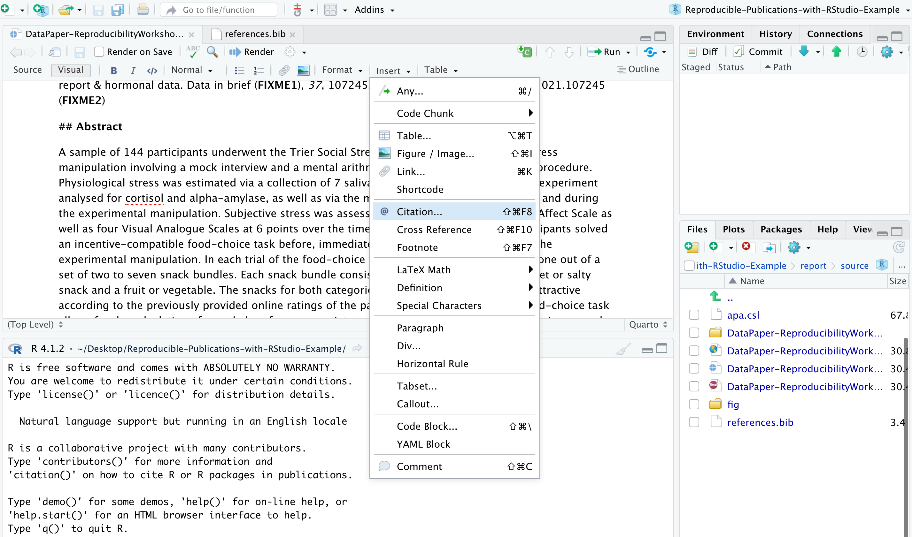
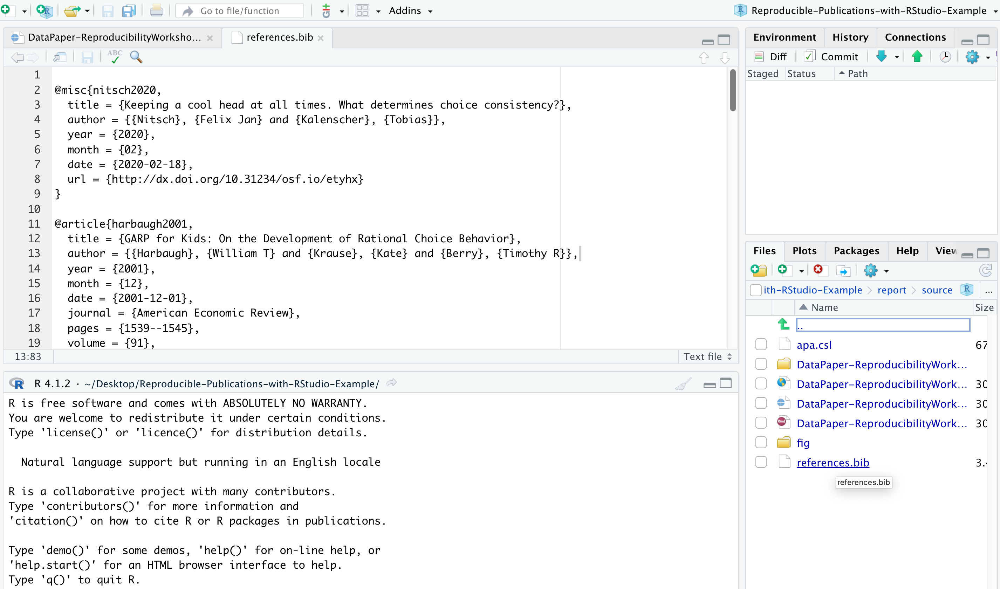
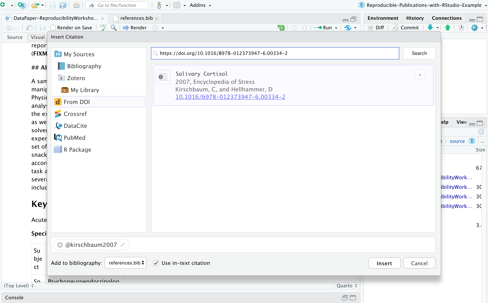
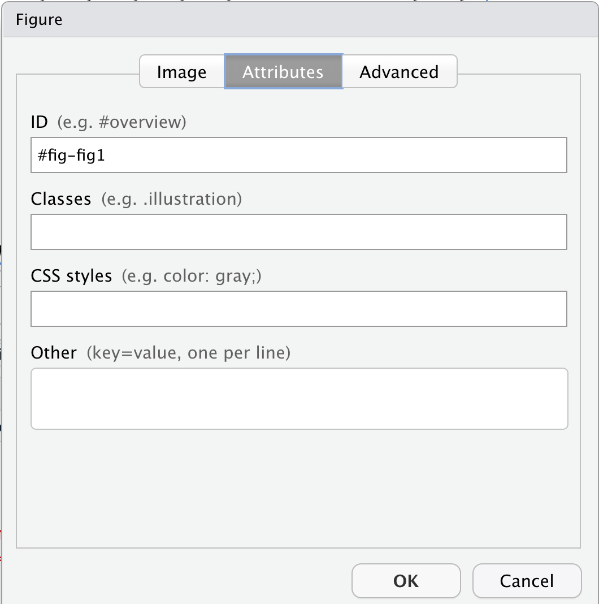

::::::::::::::::::::::::::::::::::::::: objectives

- Inserting citations and listing bibliography in a Quarto Document file.
- Customizing citation styles and the display of references and bibliographies.
- Add cross-referencing, directing your readers through your document.

::::::::::::::::::::::::::::::::::::::::::::::::::

:::::::::::::::::::::::::::::::::::::::: questions

- How can you insert citations into your manuscripts using RStudio's visual editor?
- How can you change citation styles?
- What are the options to display cited and uncited bibliography?
- How can you cross-reference content?

::::::::::::::::::::::::::::::::::::::::::::::::::

## Why Cite?

Correctly citing and attributing publications is key to academic writing. Older versions of RStudio require [Pandoc's citation syntax](https://pandoc.org/MANUAL.html#citation-syntax) to render bibliographies correctly. We won't be covering this approach extensively in this workshop since the new visual editor has made this process much simpler. You can refer to our [previous workshop on R Markdown](https://ucsbcarpentry.github.io/R-markdown/06-citations-bib/index.html) pre-visual editor for more information.

The new visual editor has made citations and cross-referencing much easier by offering different options for referencing various types of sources. Before getting into these different features, let's first learn how you can call the citation window dialog in RStudio and how to navigate these various options.

## Calling Citation Options on RStudio

After placing your cursor where you want to insert the citation, you can either click the `@` icon in the toolbar or select `Insert`, and from the drop-down menu, choose `Citation`. Alternatively, you can use the keyboard shortcut <kbd>⇧⌘ F8</kbd> on Mac or <kbd>Ctrl+Shift+F8</kbd> for Windows.

{alt='Citation Window'}

The citation window will display different options for inserting citations. You can either find items listed in your own sources through your Bibliography folder (you should have one already in your project folder provided by us), your Zotero Library(ies) if you have the reference manager installed on your computer, or even use the lookup feature to search for publications by DOI (Digital Object Identifier), Crossref, DataCite, or PubMed ID as we will explore a bit more shortly.

## Understanding How RStudio Stores and Organizes Citations

Have you noticed that the YAML header contains "bibliography: references.bib". Do you have any idea why? Well, that's because on our paper template, we have some existing citations and a `references.bib` file in our project folder. RStudio automatically adds that to the YAML once you cite the first item in your manuscript. But let's first open the references.bib file (located in report>source on your project folder) and understand how citations are presented there:

{alt='references.bib'}

A file with the BIB file extension is a BibTeX Bibliographical Database file. It's a specially formatted text file that lists references pertaining to a particular source of information. They're normally seen only with the .`bib` file extension but might instead use `.bibitex`. BibTeX files might hold references for things like research papers, articles, books, etc. The file often includes an author's name, year, title, page number, and other related content. Each item can be edited, in case there is any metadata that is incorrect or missing.

Most citation and reference management tools, such as RefWorks, EndNote, Mendeley, and Zotero, as well as some search engines (e.g., Google Scholar), most scientific databases, and our UCSB library catalog, allow us to export citations as [.bib or BibTeX files](https://en.wikipedia.org/wiki/BibTeX). These files are used to describe and process reference lists, mostly in conjunction with LaTeX documents. Each .bib file contains a citation key or ID, preceded by an `@`, that uniquely identifies each item. Citation keys can be customized, as we will learn in a bit, but please keep in mind that your manuscript will render citations correctly only if you have the cited item corresponding to its exact key.

## Inserting Citations

Note that this file contains multiple blocks, starting with a `@` and ending with a curly bracket `{`, each representing a unique citable source. We will now add a new item using the DOI lookup function so you can see how the magic works!

Let's assume you want to include a citation in the first line of the Value of the Data section because you would like to talk about how the salivary cortisol technique has been used in research. So let's click where we want to insert the citation, call the citation function, and look for the following DOI: <https://doi.org/10.1016/B978-012373947-6.00334-2>

{alt='Salviary Cortisol'}

The DOI lookup uses the [persistent identifier](https://perma.cc/KH7N-5Q97), which connects to the DOI resolver service and retrieves the .bibtex file with resource metadata<sup>1</sup>. You should insert the whole DOI address, including the resolver service, the prefix, and the suffix, which is specific to the resourc,e as illustrated below:

{alt='DOI Lookup'}

RStudio will search the [DOI API](https://support.datacite.org/docs/doi-basics) and list the only matching result, and you can insert it. After confirming this is the citation you would like to include, you can modify the key if you would like to simplify it and also choose if you would like to insert it as an in-text citation, meaning you would like to have the last name of the author(s) followed by a page number enclosed in parentheses. i.e., Kirschbaum and Hellhammer (2007), but in this case, we will uncheck that option since we won't include authors in the narrative. Instead, we would like to insert a parenthetical citation, where authors and year will be displayed inside the parentheses, such as (Kirschbaum and Hellhammer 2007). You may insert more than one citation by selecting multiple items.

This item will be automatically listed in your references.bib file and will help you manage your citations more efficiently. Pretty cool, huh? If you want to cite this same item again, you can type `@` and the first letters of the item name, which will be auto-completed by RStudio. You will have to type the key between brackets for parenthetical citations, and for in-text narrative citations, you only need to type in the key.
Note that when you hover over the citation, you will preview the full reference for the cited item that will be listed at the bottom of the manuscript. This feature helps you to identify if you have to edit anything in the .bib file that your citation is calling. Also, all citations will appear at the end of your document in a reference list.

:::::::::::::::::::::::::::::::::::::::  challenge

## Insert a Citation Using the DOI Lookup Function

Following the same process described,
insert a parenthetical citation to the publication "Welcome to the tidyverse"
(<https://doi.org/10.21105/joss.01686>)
where this package is mentioned in the data paper. Look for: `add citation here`

:::::::::::::::  solution

## Solution

```output
[@wickham2019]
render the document and voila!
(Wickham et al., 2019)
```

:::::::::::::::::::::::::

::::::::::::::::::::::::::::::::::::::::::::::::::

Inserting citations using Crossref, DataCite, or PubMed follows a process very similar to the DOI process; however, to search on their APIs, you must input information accordingly. For Crossref, you may use keywords and author information to identify an item (e.g., Cortisol Stress Oken), and RStudio will connect to [Crossref search](https://search.crossref.org/) and provide related results, often not as specific as the DOI search, for cases where you know exactly what you are looking for. DataCite allows searches by persistent identifiers or keywords, while PubMed searches exclusively in biomedical literature indexed in the database. If you have the PMID (PubMed reference number), which the NIH National Library of Medicine uniquely assigns to papers indexed in PubMed, it will save you time.

## Editing Metadata \& Citation Key

Not all citations are in perfect shape when we import them. You may have to adjust them (e.g., include missing metadata and move content to another metadata field). If you need it, we can do so by modifying the .bib file. As we talked about, you can also edit citation keys. By default, most citation keys will have the first author's last name or the first word of the title (if no authors), followed by the year of publication. Consider editing the citation key to simplify the entry and speed up autocomplete. If you choose to do so, you can click on the key in the .bib file and edit it. Please be advised to use this option with caution and to update citations to match the .bib file.

## Changing Citation Styles

You might have noticed that all citations are inserted in a specific style. Can you guess which one? If you answered Chicago, that is correct! By default, RStudio uses a Chicago author-date format for citations and references. To use another style, you will need to specify a CSL (Citation Style Language) file in the CSL metadata field in the YAML.

But how can you identify which CSL you should use? You can find the required formats in the [Zotero Style Repository](https://www.zotero.org/styles), making it easy to search for and download your desired style.

You can download the format you'd like to use and call it out in the YAML. We have pre-saved the APA CSL file in the project folder for you. But if you would like to follow the process or try another style, go to the Zotero Style repo and select [American Psychological Association 7th edition](https://www.zotero.org/styles/apa) or any other style of your choice. It will automatically download the file (e.g., `apa.csl`). Make sure to save it to your project directory in the report/source folder. In the YAML, we have to call the exact name of the file preceded by "csl:".

```output
csl: apa.csl
```

Save and render the document to see how citations and references have changed. This same process could be followed for any citation style required by the university, the journal, or the conference you are planning to submit your manuscript.

## Adding Items to the References without Citing them

All cited items will be listed under the section References, which you created before while practicing headings and subheadings. Items will be placed automatically in alphabetical order for most citation styles. However, there might be cases in which you will be referencing supporting literature that you have not necessarily cited in the document.

By default, the bibliography will only display items that are directly referenced in the document. If you want to include items in the bibliography without actually citing them in the body text, you can define a dummy `nocite` metadata field in the YAML and put the citations there.

```output
nocite: |
  @item1, @item2
```

To demonstrate that, let's include the bibtex `@key` for an item that was not cited in the YAML. Note that this will force all items added in the YAML with this command to be listed in the bibliography.

Let's try!

:::::::::::::::::::::::::::::::::::::::  challenge

## Adding references you have not cited (optional) 

We have used a few packages in our paper that we do not necessarily
cite in the text. However, adding them to the
reference list is a good practice. This practice is recommended for giving proper credit
to package developers and also to let your readers know about the exact
version you have used to produce your paper.

Ideally, we follow this process for all packages we have
installed and used to produce the paper. But for the sake of time,
let's do that process for the package ***BayesFactor***. Since we have
the option to call R packages right from the insert citation, look for
the package and think about how we can include it in the reference list even
without citing it in our paper.

:::::::::::::::  solution

## Solution

You should call the @ it in the YAML, with the `nocite` function:

```output
nocite: |
 @BayesFactor
```

:::::::::::::::::::::::::

::::::::::::::::::::::::::::::::::::::::::::::::::

:::::::::::::::::::::::::::::::::::::::  checklist

## Important Info:

Does the indentation matter? Yes, you have to indent by at least one space, and the citation key should turn green for it to work.  
In case you are including a citation to `nocite` that you have not cited in the document, you have to make sure first that the bib file is in your Bibliography folder.


::::::::::::::::::::::::::::::::::::::::::::::::::

:::::::::::::::::::::::::::::::::::::::  checklist

## Tip:

Depending on the bibliography style, BibTeX converts all characters in the title to lowercase, except the first. If you want to override this, wrap the character(s) you wish to show in upper case in curly braces.

```
title = "Pascal, {C}, {Java}: were they all conceived in {ETH}?" 
```

::::::::::::::::::::::::::::::::::::::::::::::::::

## Adding Cross-referencing

Cross-referencing is a useful way of directing your readers through your document, and it can be accomplished in Quarto. You may create cross-references to figures, tables, equations, sections, code listings, theorems, proofs, and more.

Essentially, every cross-referenceable entity requires a caption (description), the object info, and a label (unique identifier. Let's say we want to cross-reference Figure 1 in the paper. To do so, we will first need to create an ID for it. If we are in the visual mode, we can double-click the image, click the "Attributes" tab, and enter #fig1 as the ID.

{alt='Inserting cross-referencing'} <br>

Alternatively, in the source mode, we can enter that same ID in front of the figure name by typing in {#fig-fig1}

`{#fig-fig1}`

Ok, but how can you call that in another part of the paper? You may enter the key below using the unique identifier, but instead of the hash `#`, it should be preceded by an at `@`:

`@fig-fig1`

If you do not start your label with `fig-`, Quarto will interpret it as a citation and won't render correctly. Click `Render` and see how it displays.

You may follow a similar approach to add cross-references for sections `(#sec-)/(@sec-)`, equations  `(#eq-)/(@eq-)`, tables `(#tbl-)/(@tbl-)`, and other objects (see: [Quarto's Cross  References guide](https://quarto.org/docs/authoring/cross-references.html)).

If you wish to add a cross-reference to a figure that was generated via a code block, you have to provide a label (id) and a caption at the beginning of the figure code block.

```
#| label: fig-id
#| fig-cap: "figure caption here" 
```

And then, enter the @fig-id where you want to note the cross-reference in your paper.

:::::::::::::::::::::::::::::::::::::::  challenge

## Adding cross-reference for code block figures

Your turn! Include a cross-reference to Figure 3.

:::::::::::::::  solution

## Solution:

Make sure you have added a label (id). If you missed that step, now is the time to add `#| label: fig-heartrate`
Call the figure using the assigned id `@fig-heartrate`

:::::::::::::::::::::::::

::::::::::::::::::::::::::::::::::::::::::::::::::

:::::::::::::::::::::::::::::::::::::::: keypoints

- RStudio supports different lookup strategies to make the citation process easier.
- RStudio supports different citation styles.
- The YAML can be adjusted to display uncited items in the reference list.
- Use bookdown to cross-reference content.

::::::::::::::::::::::::::::::::::::::::::::::::::


