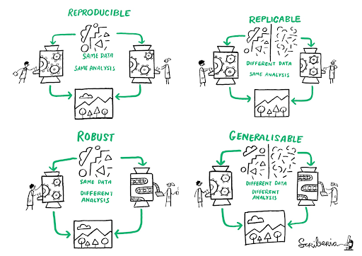

## Warm-up

Let's discuss:
What is reproducible research for you?
Have you ever experienced issues while trying to reproduce someone else's study or even your own research?

Reproducible studies allow other researchers to perform the same processes and analyses to produce an identical result as the first initial researcher. Original researchers have to make available the study’s associated data, documentation, and code pipelines and workflows in a way that is sufficiently self-explanatory and well-documented so that independent investigators can reproduce/recreate the original study under the same conditions, using identical materials and procedures, and ultimately achieve consistent results and render equal outcomes. Original investigators, therefore, must produce rich and detailed documentation for themselves and others. This includes fully specifying both in human-readable and computer-executable ways all steps taken in the study.

## The importance of Reproducibility in Research

>Source: Comic number [1869](https://phdcomics.com/comics.php?f=1689) from [PhD Comics](https://phdcomics.com/) Copyrighted artwork by Jorge Cham.

### Discussion: A scary anecdote

* A group of researchers obtain great results and submit their work to a high-profile journal.
* Reviewers ask for new figures and additional analysis.
* The researchers start working on revisions and generate modified figures, but find inconsistencies with old figures.
* The researchers can’t find some of the data they used to generate the original results, and can’t figure out which parameters they used when running their analyses.
* The manuscript is still languishing in the drawer…

According to the [U.S. National Science Foundation (NSF)](https://www.nsf.gov/sbe/AC_Materials/SBE_Robust_and_Reliable_Research_Report.pdf) subcommittee on replicability in science (2015):

Science should routinely evaluate the reproducibility of findings that enjoy a prominent role in the published literature. To make reproduction possible, efficient, and informative, researchers should sufficiently document the details of the procedures used to collect data, to convert observations into analyzable data, and to perform data analysis.

Reproducibility refers to the ability of a researcher to duplicate the results of a prior study using the same materials as were used by the original investigator. That is, a second researcher might use the same raw data to build the same analysis files and implement the same statistical analysis in an attempt to yield the same results. Reproducibility is a minimum necessary condition for a finding to be considered rigorous, believable and informative.

### Why all the talk about reproducible research?

Many studies claim results that cannot be reproduced. This problem has attracted increased attention in recent years, with supporting evidence that research is often not reproducible. A 2016 survey in Nature revealed that irreproducible experiments are a problem across all domains of science:

>Source: Baker, M. 1,500 scientists lift the lid on reproducibility. Nature 533, 452–454 (2016). [doi.org/10.1038/533452a](https://doi.org/10.1038/533452a)

## Factors behind irreproducible research

>Source: Then a Miracle Occurs. Copyrighted artwork by Sydney Harris Inc. 

* Not enough documentation on how experiment is conducted and data is generated
* Data used to generate original results unavailable
* Software used to generate original results unavailable
* Difficult to recreate software environment (libraries, versions) used to generate original results
* Difficult to rerun the computational steps

### Reproducible, replicable, robust, generalizable

While reproducibility is the minimum requirement and can be solved with “good enough” computational practices, replicability/robustness/generalizability of scientific findings are an even greater concern involving research misconduct, questionable research practices (p-hacking, HARKing, cherry-picking), sloppy methods, and other conscious and unconscious biases.

>Source: This image was created by Scriberia for The Turing Way community DOI: [10.5281/zenodo.3
332807](https://doi.org/10.5281/zenodo.3695300)

If contributing to science and other researchers seems not to be compelling enough, here are 5 selfish reasons to work reproducibly according to [Markowetz (2015)](https://doi.org/10.1186/s13059-015-0850-7):

* Helps to avoid data loss and disaster
* Makes it easier to write papers
* Helps reviewers see it your way
* Enables continuity of your work
* Helps to build your reputation

### When do you need to worry about reproducibility?

Let’s assume I have convinced you that reproducibility and transparency are in your best interest. Then what is the best time to worry about it?

From day one, and throughout the whole research life cycle! Before starting the project, you might have to learn tools like R or Git. If you wait too long while doing the analysis, you might lose a lot of time trying to remember what you did two months ago. When you write the paper, you want your numbers, tables, and figures to be up-to-date. When you co-author a paper, you want to make sure that the analyses presented in a paper with your name on it are sound. When you review a paper, you can’t judge the results if you don’t know how the authors got there.

[Alexander (2022)](https://tellingstorieswithdata.com/) suggests three steps towards better reproducibility:

1) Ensure the entire workflow is documented. This may involve addressing questions such as:
* How was the raw dataset obtained, and is access likely to be persistent and available to others?
* What specific steps are being taken to transform the raw data in the data that were analyzed, and how can this be made available to others?
* What analysis has been done, which codes/scripts were used, and how can this be shared clearly?
* How has the final paper or report been built, and to what extent can others follow that process themselves?

2) Try to accomplish progressively the following requirements:
* Can you run your entire workflow again?
* Can another person run your entire workflow again?
* Can “future-you” run your entire workflow again?
* Can “future-another-person” run your entire workflow again?

3) Include a discussion about the limitations of the dataset, methods, and workflows in the final paper or report.

### Levels of Reproducibility

<figure>

</figure>

<!--{width=50%}-->

A published article is like the top of a pyramid, meaning that a reproducible paper/report rests on multiple levels that each contributes to its reproducibility.

## Advantages of using RStudio for your project

RStudio is an integrated development environment (IDE) for R and other programming languages, such as Python, that provide many tools to support code development. It includes a console syntax-highlighting editor that supports direct code execution, as well as tools for plotting, history, debugging, collaboration, and workspace management. Writing scripts to conduct your analysis is a powerful way to weave the principles of reproducibility throughout the entire research lifecycle, from data gathering to the statistical analysis, presentation, and publication of results. 

### It is free and open-source

Reproducibility becomes more difficult and opaque when results rely on proprietary software. Unless the research code is open-source, reproducing results on different software/hardware configurations is impossible. Rstudio is dedicated to sustainable investment in free and open-source software for data science. 

### It is designed to make it easy to write and reuse code

As soon as you create a new script, the windows/panes within your RStudio session adjust automatically so you can see both your script and the results in your console when you run your syntax. It also offers the ability to call up potential syntax options while you are writing just by using the tab key.

### Makes it convenient to view and interact with the objects stored in your environment

RStudio has a very useful “Environment” window available, which shows all of the objects that you have stored, including data; scalars, vectors, and matrices, model outputs; etc., along with a summary of the information that is stored in those objects.

### Makes it easy to set your working directory and access files on your computer

With RStudio, you can navigate to folders on your computer in the “Files” window, view any files you have in that folder, or go to your working directory. You can also create projects that help with setting your working directory and work with relative paths to external files (such as input data, figures) so it can be also used on other machines. 

### Integrates with collaboration and publishing tools

Another great advantage of using RStudio for your R project is that the platform integrates with the version control system [git](https://git-scm.com/) and code repository service [GitHub](https://github.com). Once you connect RStudio with a repository on GitHub (remote) you can bring its content to your local machine, update it and share changes in a streamlined way. In git jargon, it means it enables you to `push` and `pull` commits to GitHub, allowing more seamless collaboration and more effective version control. RStudio also provides tools to render documents (html, pdf, ...) directly from Rmarkdown and Quarto notebooks, and directly connects with [Rpubs](https://rpubs.com/) and [Quarto Pub](https://quartopub.com/) for easy R project web publishing.

## Quarto advantages for your reproducibility

We will talk more about what Quarto is in the next episode, but in a nutshell, quarto documents enable you to blend your analysis and the story  associated with it by mixing text (using the markdown syntax) and code that is executable. You can render those documents in various formats (html, docx, ...), binding documentation, code, and outputs such as figures. It is a great vector for reproducibility as it makes it easy to update your results according to new information. For example if you find new data, you can re-render the quarto with the new data and the plots and other outputs computed will update accordingly.

> ## Why it is called Quarto?
> 
Developers picked a name that had meaning in the history of publishing and landed on Quarto, which is the format of a book or pamphlet produced from full sheets printed with eight pages of text, four to a side, then folded twice to produce four leaves.
{: .callout}

> ## Why Quarto and not R Markdown?
>
> As noted before, Quarto is the next generation of R Markdown which was the subject of a previous workshop [see Reproducible Publications with RStudio](https://github.com/carpentries-incubator/Reproducible-Publications-with-RStudio); and, the anatomy of `.rmd` and `.qmd` files are very similar. So why move to Quarto? While compatible with Python (and bash, Julia, C, SQL), R Markdown was designed primarily for R users. **Quarto does not require R.** Quarto runs computations into separate pluggable language "engine", which helps make this cross-language functionality easier to support and reduces infrastructure intensity with built-in applications. In addition, because Quarto is designed to be compatible with existing formats, you can render most existing `.Rmd` and Jupyter Notebooks with Quarto without modification. This low-pain process helps the transition to Quarto. 
{: .callout}

## A Note About the Workshop Example
   
Our goal is that by the end of this workshop, you will be able to create a reproducible report using data and code we will provide. Throughout this workshop, we will be using a shorter and adapted version of the data paper:

Nitsch, F. J., Sellitto, M., & Kalenscher, T. (2021). Trier social stress test and food-choice: Behavioral, self-report & hormonal data. *Data in brief*, 37, 107245. [https://doi.org/10.1016/j.dib.2021.107245](https://doi.org/10.1016/j.dib.2021.107245). 

We will also be using a simplified version of the project directory containing data files and scripts published by the authors on Open Science Framework: [https://doi.org/10.17605/OSF.IO/6MVQ7](https://doi.org/10.17605/OSF.IO/6MVQ7).

The adapted paper template and project directory are used exclusively for instruction purposes with permission from the authors.

