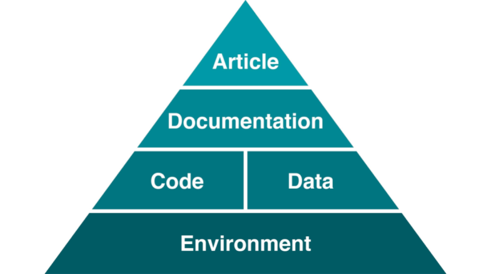

## Warm-up

Let's discuss:
What is reproducible research for you?
Have you ever experienced issues while trying to reproduce someone else's study or even your own research?

Reproducible studies allow other researchers to perform the same processes and analyses to produce an identical result as the first initial researcher. Original researchers have to make available the study’s associated data, documentation, and code pipelines and workflows in a way that is sufficiently self-explanatory and well-documented so that independent investigators can reproduce/recreate the original study under the same conditions, using identical materials and procedures, and ultimately achieve consistent results and render equal outcomes. Original investigators, therefore, must produce rich and detailed documentation for themselves and others. This includes fully specifying both in human-readable and computer-executable ways all steps taken in the study.

## The importance of Reproducibility in Research

>Source: Comic number [1869](https://phdcomics.com/comics.php?f=1689) from [PhD Comics](https://phdcomics.com/) Copyrighted artwork by Jorge Cham.

### Discussion: A scary anecdote

* A group of researchers obtain great results and submit their work to a high-profile journal.
* Reviewers ask for new figures and additional analysis.
* The researchers start working on revisions and generate modified figures, but find inconsistencies with old figures.
* The researchers can’t find some of the data they used to generate the original results, and can’t figure out which parameters they used when running their analyses.
* The manuscript is still languishing in the drawer…

According to the [U.S. National Science Foundation (NSF)](https://www.nsf.gov/sbe/AC_Materials/SBE_Robust_and_Reliable_Research_Report.pdf) subcommittee on replicability in science (2015):

Science should routinely evaluate the reproducibility of findings that enjoy a prominent role in the published literature. To make reproduction possible, efficient, and informative, researchers should sufficiently document the details of the procedures used to collect data, to convert observations into analyzable data, and to perform data analysis.

Reproducibility refers to the ability of a researcher to duplicate the results of a prior study using the same materials as were used by the original investigator. That is, a second researcher might use the same raw data to build the same analysis files and implement the same statistical analysis in an attempt to yield the same results. Reproducibility is a minimum necessary condition for a finding to be considered rigorous, believable and informative.

### Why all the talk about reproducible research?

Many studies claim results that cannot be reproduced. This problem has attracted increased attention in recent years, with supporting evidence that research is often not reproducible. A 2016 survey in Nature revealed that irreproducible experiments are a problem across all domains of science:

>Source: Baker, M. 1,500 scientists lift the lid on reproducibility. Nature 533, 452–454 (2016). [doi.org/10.1038/533452a](https://doi.org/10.1038/533452a)

## Factors behind irreproducible research

>Source: Then a Miracle Occurs. Copyrighted artwork by Sydney Harris Inc. 

* Not enough documentation on how experiment is conducted and data is generated
* Data used to generate original results unavailable
* Software used to generate original results unavailable
* Difficult to recreate software environment (libraries, versions) used to generate original results
* Difficult to rerun the computational steps

### Reproducible, replicable, robust, generalizable

While reproducibility is the minimum requirement and can be solved with “good enough” computational practices, replicability/robustness/generalizability of scientific findings are an even greater concern involving research misconduct, questionable research practices (p-hacking, HARKing, cherry-picking), sloppy methods, and other conscious and unconscious biases.

>Source: This image was created by Scriberia for The Turing Way community DOI: [10.5281/zenodo.3
332807](https://doi.org/10.5281/zenodo.3695300)

If contributing to science and other researchers seems not to be compelling enough, here are 5 selfish reasons to work reproducibly according to [Markowetz (2015)](https://doi.org/10.1186/s13059-015-0850-7):

* Helps to avoid data loss and disaster
* Makes it easier to write papers
* Helps reviewers see it your way
* Enables continuity of your work
* Helps to build your reputation

### When do you need to worry about reproducibility?

Let’s assume that I have convinced you that reproducibility and transparency are in your own best interest. Then what is the best time to worry about it?

From day one, and throughout the whole research life cycle! Before you start the project because you might have to learn tools like R or Git. While you do the analysis because if you wait too long you might lose a lot of time trying to remember what you did two months ago. When you write the paper because you want your numbers, tables, and figures to be up-to-date. When you co-author a paper, because you want to make sure that the analyses presented in a paper with your name on are sound. When you review a paper, because you can’t judge the results if you don’t know how the authors got there.

[Alexander (2022)](https://tellingstorieswithdata.com/) suggests three steps towards better reproducibility:

1) Ensure the entire workflow is documented. This may involve addressing questions such as:
* How was the raw dataset obtained and is access likely to be persistent and available to others?
* What specific steps are being taken to transform the raw data in the data that were analyzed, and how can this be made available to others?
* What analysis has been done, which codes/scripts were used and how clearly can this be shared?
* How has the final paper or report been built and to what extent can others follow that process themselves?

2) Try to accomplish progressively with the following requirements:
* Can you run your entire workflow again?
* Can another person run your entire workflow again?
* Can “future-you” run your entire workflow again?
* Can “future-another-person” run your entire workflow again?

3) Include a discussion about the limitations of the dataset, methods and workflows in the final paper or report.

### Levels of Reproducibility

<figure>

</figure>

<!--{width=50%}-->

A published article is like the top of a pyramid, meaning that a reproducible paper/report rests on multiple levels that each contributes to its reproducibility.

## Advantages of using RStudio for your project

Understanding foundational aspects of RStudio enables a gradual improvement of scientific workflows and therefore, contributes to increasing research reproducibility compliance. RStudio is an integrated development environment (IDE) for R and Python. It includes a console, syntax-highlighting editor that supports direct code execution, as well as tools for plotting, history, debugging, collaboration, and workspace management. It is a powerful tool which supports research by weaving the principles of reproducibility throughout the entire research lifecycle, from data gathering to the statistical analysis, presentation and publication of results. 

RStudio is soon becoming [Posit](https://posit.co/), but that won't change how you interact with the interface and its functionalities. This name change is only a re-branding to better represent the broader focus and larger community that the IDE serves, which is no longer exclusively linked to R.

### It is free and open-source

Reproducibility becomes more difficult and opaque when results rely on proprietary software. Unless research code is open sourced, reproducing results on different software/hardware configurations is impossible. Rstudio is dedicated to sustainable investment in free and open-source software for data science. 

### It is designed to make it easy to write and reuse code

As soon as you create a new script, the windows/panes within your RStudio session adjust automatically so you can see both your script and the results in your console when you run your syntax. It also offers the ability to call up potential syntax options while you are writing just by using the tab key.

### Makes it convenient to view and interact with the objects stored in your environment

RStudio has a very useful “Environment” window available which shows all of the objects that you have stored, including data; scalars, vectors, and matrices; model outputs; etc., along with a summary of the information that is stored in those objects.

### Makes it easy to set your working directory and access files on your computer

With RStudio, you can navigate to folders on your computer in the “Files” window, view any files you have in that folder, and set that folder as the working directory.

### Integrates with collaboration and publishing tools

Another great advantage of using RStudio for your R project is that the platform integrates with [GitHub](https://github.com). Once you connect RStudio with your GitHub account a remote repo becomes the “upstream” remote for your local repo. In essence, it enables you to push and pull commits to GitHub, allowing more seamless collaboration and more effective version control. RStudio also connects with [Rpubs](https://rpubs.com/) and [Quarto Pub](https://quartopub.com/) for easy R project web publishing.  

### Creates documents using Quarto

As seen, reproducibility implies sharing data, code, and workflows to produce the analysis and compute results. While writing scientific reports one may choose RStudio IDE to marry all these pieces together and take advantage of various tools it integrates with. Having a publication while minimizing reproducibility friction can be accomplished with Quarto. [Quarto](https://quarto.org/) is a multi-language, next-generation version of R Markdown from RStudio. It includes new features and capabilities while at the same being able to render most existing Rmd files without any modification. With Quarto you can: 

* Create dynamic content with Rstudio/R, Python, Julia, and Observable.
* Author documents as plain text markdown or Jupyter notebooks.
* Publish high-quality articles, reports, presentations, websites, blogs, and books in HTML, PDF, MS Word, ePub, and more.
* Author with scientific markdown, including equations, citations, crossrefs, figure panels, callouts, advanced layout, and more.

Quarto generates a .qmd file that weaves together content and executable code into a elegantly formatted output which can be published in various formats. It is a convenient tool for reproducible and dynamic reports which will help you:

1. Keep an eye on text (the paper) AND the source code. These computational steps are essential to ensure computational reproducibility.
2. Conduct the entire analysis pipeline in a Quarto document: data (pre-)processing, analysis, outputs, visualization.
3. Apply a formatting syntax that is part of the R ecosystem and supports LaTeX.
4. Combine text written in markdown and source code written in R (and other languages).
5. Easily share documents with colleagues, as supplemental material, or as the paper under review. 
6. Get figures automatically updated if you change the underlying parameters in the code. The error-prone task of exporting figures and uploading the right figure version to another platform is thus not needed anymore.
7. Since it uses a text-based format, you can also use versioning control with Git.
8. If you do not make any changes to the document after creating the output document, you can be sure that the paper was executable at least at the time of submission.
9. Refer to the corresponding code lines in the methodology section making it unnecessary to use pseudocode, high-level textual descriptions, or just too many words to describe the computational analysis.

> ## Why it is called Quarto?
> 
Developers picked a name that had meaning in the history of publishing and landed on Quarto, which is the format of a book or pamphlet produced from full sheets printed with eight pages of text, four to a side, then folded twice to produce four leaves.
{: .callout}

> ## Why Quarto and not R Markdown?
>
> As noted before, Quarto is the next generation of R Markdown which was the subject of a previous workshop [see Reproducible Publications with RStudio](https://github.com/carpentries-incubator/Reproducible-Publications-with-RStudio); and, the anatomy of `.rmd` and `.qmd` files are very similar. So why move to Quarto? While compatible with Python (and bash, Julia, C, SQL), R Markdown was designed primarily for R users. **Quarto does not require R.** Quarto runs computations into separate pluggable language "engine", which helps make this cross language functionality easier to support and reduces infrastrucutre intensivity with built-in applications. In addition, because Quarto is designed to be compatible with existing formats you can render most existing `.Rmd` and Jupyter Notebooks with Quarto without modification. This low-pain process helps the transition to Quarto. 
{: .callout}

## Some Real-world Applications

Finally, three real-world examples that motivated the authors of this lesson to value and use Quarto:

1. You can publish books! [Telling Stories with Data](https://tellingstorieswithdata.com/) is a great example developed in Quarto. Quarto books can be published to a wide variety of destinations including GitHub Pages, Netlify, RStudio Connect, or any other static hosting service or intranet web server. [Learn more](https://quarto.org/docs/books/).

2. One of us wanted to create a short document that included some math formulas. The LaTeX document preparation can be used for this, but it is difficult to use and is overkill for just a few formulas in otherwise plain text. As we will learn, through Pandoc, Quarto lets you use just the best part of LaTeX---math formatting---while letting you write your text in a user-friendly way. The editor will automatically recognize the syntax and treat the equation as math.

3. In a past version of this workshop we struggled with a scientific paper published in a reputable journal.  In trying to recreate the plots the original authors created, we found it difficult and time-consuming to figure out exactly how the authors created their plots.  Out of the many columns in their data, many with similar-sounding names, which did they use?  How did they handle missing data?  Exactly what operations did they perform to compute aggregate values?  How much easier it would have been if they had published the code they used along with their paper. RStudio and Quarto allow you to do this.

> ## A Note About the Workshop Example 
> 
Our goal is that by the end of this workshop you will be able to create a reproducible report. Throughout this workshop, we will be using a shorter and adapted version of the data paper referenced below:

Nitsch, F. J., Sellitto, M., & Kalenscher, T. (2021). Trier social stress test and food-choice: Behavioral, self-report & hormonal data. *Data in brief*, 37, 107245. [https://doi.org/10.1016/j.dib.2021.107245](https://doi.org/10.1016/j.dib.2021.107245)

We will be also using a simplified version of the project directory containing data files and scripts available through Open Science Framework: [https://doi.org/10.17605/OSF.IO/6MVQ7](https://doi.org/10.17605/OSF.IO/6MVQ7).

The paper template and project files are used exclusively for instruction purposes with permission from the authors.
{:.callout}
