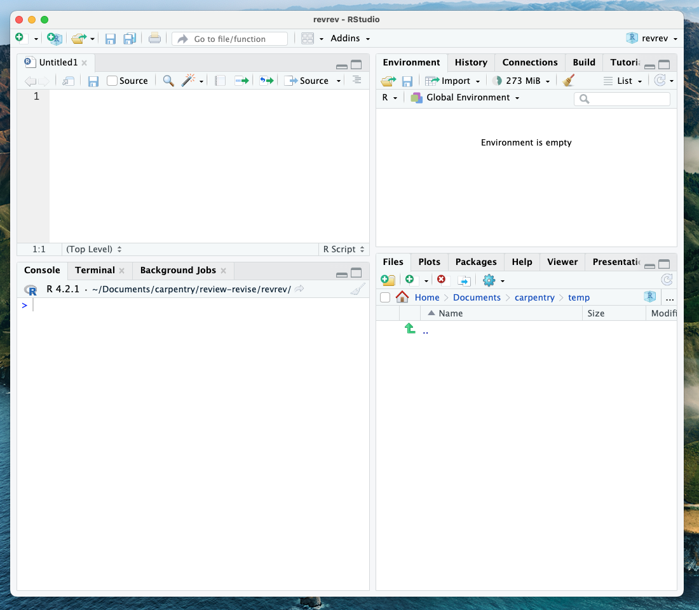

## Getting Around RStudio

Throughout this lesson, we're going to teach you some of the fundamentals of
using Quarto as part of your RStudio workflow. 

We'll be using RStudio: a free, open-source R Integrated Development Environment
(IDE). It provides a built-in editor, works on all platforms
(including on servers), and provides many advantages, such as integration with
version control and project management.

This lesson assumes you already have a basic understanding of R and RStudio but
we will do a brief tour of the IDE, review R projects, and the best practices for
organizing your work, and how to install or check packages you need to follow along.

Now, let's open RStudio. You may access it through the Jupyter Hub instance [https://carpentryworkshop.lsit.ucsb.edu](https://carpentryworkshop.lsit.ucsb.edu). After passing authentication, choose `RStudio`. If you want to follow along using your local RStudio, make sure you use IDE version RStudio v2023.06 or later and that it is running [Quarto version 1.4 or above](https://quarto.org/docs/download/prerelease.html). If you need to check that, for RStudio, choose `Help` and `About RStudio`. For the Quarto version checking, type in `packageVersion("quarto")` on the console. 
  

**Basic layout**

When you first open RStudio, you will be greeted by three panels:

-   The interactive R console/Terminal (entire left)
-   Environment/History/Connections (tabbed in the upper right)
-   Files/Plots/Packages/Help/Viewer (tabbed in the lower right)

 

Once you open files, such as .qmd, .rmd or .R files, an editor panel will also
open in the top left.

 

### R Packages

Packages are the fundamental units of reproducible R code. They include reusable R functions, the documentation that describes how to use them, and sample data. They are collections of R functions, data, and compiled code in a well-defined format. The directory where packages are stored is called the library.
It is possible to add functions to R by writing a package or by obtaining a
package written by someone else. As of this writing, there are over 10,000
Packages are available on CRAN (the comprehensive R archive network). R and RStudio
have functionality for managing packages:

-   You can *install packages* by typing `install.packages("packagename")`, where `packagename` is the package name, in quotes.
-   You can *see what packages* are installed by typing `installed.packages()`
-   You can *update installed packages* by typing `update.packages()`
-   You can *remove a package* with `remove.packages("packagename")`
-   You can *make a package available* for use with `library(packagename)`

Packages can also be viewed, loaded, and detached in the Packages tab of the
lower right panel in RStudio. Clicking on this tab will display all of the installed
packages with a checkbox next to them. If the box next to a package name is
checked, the package is loaded; if it is empty, the package is not loaded.
Click an empty box to load that package and click a checked box to detach that
package.

Packages can be installed and updated from the Package tab with the *Install* and
*Update* buttons at the top of the tab. We have asked you to install a few packages prior to the workshop following the [setup instructions](https://github.com/UCSBCarpentry/Reproducible-Publications-with-RStudio/blob/main/setup.md) using the `install.packages()` command. Let's now make sure you have all of them good to go.

> ## CHALLENGE 1 - Checking for Installed Packages
> Which command would you use to check for packages ready for use?
>> ## SOLUTION
>> To see what packages are installed, use the `installed.packages()` command. This will return a matrix with a row for each package that has been installed. 
> {: .solution}
{: .challenge}

> ## Still missing the packages for this workshop?
> Use the command below:
`install.packages(c("bookdown", "tidyverse", "BayesFactor", "patchwork","usethis"))`
{: .callout}

## Starting and Naming a New Quarto Document

Start a new Quarto document in RStudio by clicking File \> New File \> Quarto Document...

You may name your Quarto document "My-first-qmd".

New Quarto files will have a generic template unless you click the
"Create Empty Document" in the bottom left-hand corner of the dialog box.

We will keep all pre-selected options: HTML as the output, knitr engine and the visual editor. The output might be changed at any time, and we can easily switch between the visual and the source editor. Knitr will be the engine used to execute the R codes and render the document in Rstudio.

If you see this default text, you're good to go: 

### Visual Editor vs. Source Editor

Remember that in the settings, we chose to use the visual editor? RStudio released a new major update to their IDE in January 2020, which includes a new "visual editor" to supplement their original editor (which we will call the source editor) for authoring with markdown syntax. The visual editor follows the WYSIWYG "what you see is what you get" approach similar to Word or Google Docs that lets you choose styling options from the menu (before you had to have either the markdown code memorized or look it up for each of your styling choices). Another major benefit is that the new editor renders the styling in real-time so you can preview your paper before rendering it to your output format.

#### Source Editor

If you toggle the source button, you will display your quarto document in the "source editor" mode. Notice the symbols scattered throughout the text (#, *, <>). Those are examples of markdown syntax, an easy and quick, human-readable markup language for document styling.

> ## CHALLENGE 2 - Formatting with Symbols (optional)
> Certain symbols are used to denote formatting that should happen to the text (after rendering it). Before that, these symbols will show up seemingly "randomly" throughout the text and don't contribute to the narrative in a logical way. In the template qmd document, there are three types of such symbols (`##, **, <>`). Each symbol represents different formatting (think of the text formatting buttons you use in Word). Can you deduce how these symbols format the surrounding text from the surrounding text?  
>> ## SOLUTION
>> `##` is a heading, `**` is to bold enclosed text, and `<>` is for hyperlinks.
>> Don't worry about this too much right now! This is an example of markdown syntax for styling. You won't need it if you stick to the visual editor, but getting at least a basic understanding of markdown syntax is recommended if you plan to work with `.qmd` documents frequently.
> {: .solution}
{: .challenge}

#### Visual Editor

Let's switch back to the visual editor. You'll notice that formatting elements like headings, hyperlinks, and bold have been generated automatically, giving us a preview of how our text will render. However, the visual editor does not run any code automatically. We'll have to do that manually (but we will learn how to do that later on).

We will proceed using the visual editor during this workshop as it is more
user-friendly and allows us to talk about styling without needing to teach the
whole markdown syntax system. However, we highly encourage you to become
familiar with markdown syntax as it
increases your ability to format and style your paper without relying on the
visual editor options.

Note that both the visual and the source editors offer the option to display an outline of your document  which make it easier to navigate long documents. 

> ## Tip: Resources to learn more about Quarto
> If you want to learn more about the source editor, please see
> the [Quarto Guide](https://quarto.org/docs/guide).
{: .callout}

Now we'll get into how our Quarto file & workflow is organized, and then on
to editing and styling!
