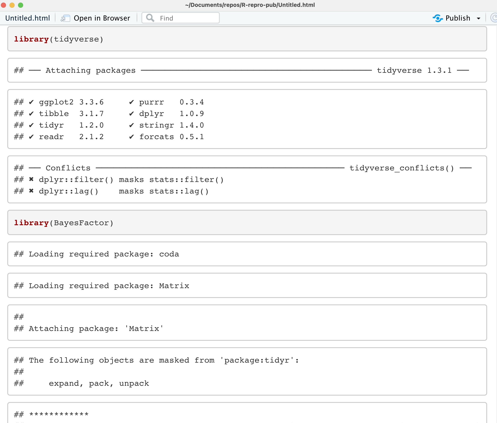
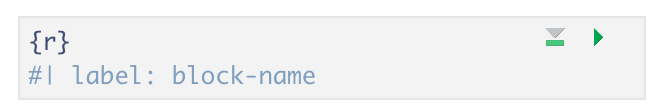
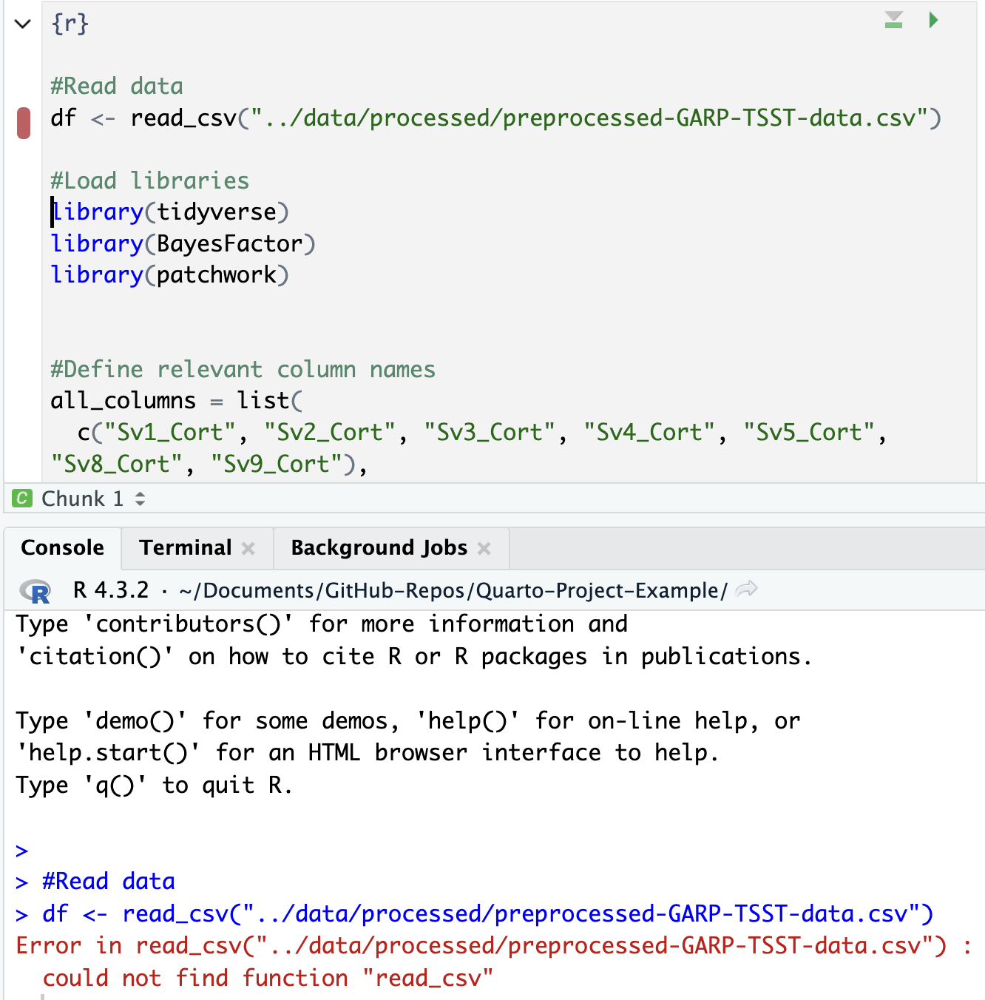

## Rendering Code in Quarto Documents

In the previous episode, we just saw how to run our code in our code chunks to test that it works and to see a preview of the code output that will render in our HTML document, but to *actually* render the final, we need to use the Render button as with. Using the `Render` button with code chunks is a two-step process - first, the code is run (all code chunks will run automatically). Second, (if there are no code errors) the document of choice will render for our whole Quarto document. 

> ## Time to Render!
> Now, let's Render the Quarto file and see how our code output looks on the final HTML page. 
{: .checklist}

Wait... what's all that output in our document? We don't want that in our paper! 

{: .image-with-shadow}

This happens because the output from the running code (messages, results, warnings, etc.) gets added to the Quarto document instead of being printed to the console. Let's see about adjusting the output to make it look better with code chunk rendering options. 

## Code Chunk Options

There are over 50 different code chunk options!!! Obviously, we will not go over all of them, but they fall into several larger categories, including code evaluation, text output, code style, cache options, plot output, and animation. We’ll discuss a few options for code evaluation, text output, and plot output.

Code chunk options in Quarto are added within code chunks and always have the following format:

`#| option: option-text`


### Common code chunk options: 

**include** = (logical) whether to include the chunk output in the output document (defaults to TRUE).  
**eval** = (logical or numeric) TRUE/FALSE to evaluate (or not) or a numeric value like c(1,3) (only evaluate expressions 1 and 3).   
**echo** =  (logical or numeric - following the same rules as above) whether to display source code or not.  
**results** = (logical or character) text output of the code can be hidden (hide or FALSE) or delineated in a certain way (default 'markup').       
**warning** = (logical) whether to display the warnings in the output (default TRUE). FALSE will output warnings to the console only.       
**message** = (logical) whether or not to display messages that appear when running the code (default TRUE).

#### Using Code Chunk Options for Clean Quarto Documents

Ok, let's use some of the options above to improve the look of our Quarto document. Add the following options one by one to see how they change your output (click `Render` after each option you add): 

- echo: false 
- message: false 
- warning: false
- results: false

These options mean the source code will not be printed in the rendered HTML document, messages from the code will not be printed in the rendered HTML document, and warnings will not be printed in the HTML document (but will still output to the console). Plots, figures, or whatever is printed by the code WILL show up in the final html document.  

Now, we are seeing what we would like: a figure without other output to show in our paper. 
 
> ## CHALLENGE 1 - Rendering Codes (Optional)
> Given the following options, How will some hypothetical code render? Try it out with the code we just added to visualize the styling change.
> ~~~
> ```{r}
> #| eval: TRUE
> #| include: FALSE
> ~~~
>> ## SOLUTION
>> The expressions in the code chunk will be evaluated, but the outputted figures/plots will not be included in the rendered document.   
>> When might you want to use this?   
>> If you need to calculate some value or do something on your dataset for a further calculation or plot, the output is not important to include in your paper narrative. 
> {: .solution}
{: .challenge}

> ## Tip:
> Find a complete list of code chunk options on Knitr developer Yihui Xie's [online guide to knitr](https://yihui.org/knitr/options/). 
{: .callout}

### Label Your Code Chunk

Before we get to fixing how our code output looks, let's pause a second and give our code chunk a label. While not required for running your code, it is good practice to give a name to each code chunk because a label is a unique identifier that allows for more advanced options (such as cross-referencing) to work with your qmd files later on:



Some things to keep in mind
- The chunk label syntax is always `#| label: chunk-label` with `chunk-label` replaced with your own text
- The chunk label has to be unique (i.e., you can't use the same name for multiple chunks)

We’ll see in a bit where this code chunk label comes in handy. But, for now, let's go back and give our first code chunk a name:

`#| label: fig-heartrate`

When naming your code chunks that will produce figures or tables, use `fig-` and `tbl-`. We will learn how these will allow for cross-references.

> ## Tip: Don't use spaces, periods, or underscores in code chunk labels
> Avoid spaces, periods `(.)`, and underscores `(_)` in chunk labels and paths. If you need separators, you are recommended to use hyphens `(-)` instead. For example, setup-options is a good label, whereas setup.options and chunk 1 are bad; fig-path = 'figures/mcmc-' is a good path for figure output, and fig-path = 'markov chain/monte carlo' is bad. See more at: [https://yihui.org/knitr/options/](https://yihui.org/knitr/options/)
{: .callout}

### Caption Your Code Chunk Output

The options we just looked at focus on code evaluation and text output. However, we have another set of options that deal with how plot or figure outputs look at act. Many of the options start with `fig`. The one we will use today allows us to add a caption to our figure. Again, this is an optional feature, but if you need (or want) to add captions to your publication, it is straightforward to do in code chunks. 

The caption information also resides at the top of a code chunk using the `#|` syntax as such:

`#| fig-cap: "Figure Caption Here"`

**Don't forget to put the caption within quotes `""`.**

> ## CHALLENGE 2: Adding a caption and cleaning up unwanted content for Figure 2
> Let's add the following caption: "Mean heart rate of stress and control groups at baseline and during intervention." and ensure only the figure and the caption will be displayed in the html document. 
>> ## SOLUTION
>> So, you should end up with the following in your code chunk:
>> ~~~
>> ```{r}
>> #| label: fig-heartrate
>> #| echo: false
>> #| message: false
>> #| warning: false
>> #| results: false 
>> #| fig-cap: "Mean heart rate of stress and control groups at baseline and during intervention."
>> ~~~
>> Set the option `fig-cap` to equal the text in double quotes.
> {: .solution}
{: .challenge}

## More plot/figure options
> Other options that change how a plot or figure appears often use the syntax `fig-xxx` similar to `fig-cap` Some other useful plot/figure code options include (From [Yihui Xie's page](https://yihui.org/knitr/options/#plots) ):
> - `fig-width`, `fig-height`: (both are 7; numeric) Width and height of the plot (in inches), to be used in the graphics device.
> - `out-width`, `out-height`: (NULL; character) Width and height of the plot in the output document, which can be different with its physical fig-width and fig-height, i.e., plots can be scaled in the output document. 
> - `fig-align`: ('default'; character) Alignment of figures in the output document. Possible values are default, left, right, and center. The default is not to make any alignment adjustments.
> - `fig-link`: (NULL; character) A link to be added to the figure.
> - `fig-alt`: (NULL; character) The alternative text to be used in the alt attribute of the  tags of figures in HTML output. By default, the chunk option fig-cap will be used as the alternative text if provided.
{: .callout}


Let's render one more time to see if our figure outputs how we'd like and has a caption.

> ## Time to Render!
> Let's try that again 
{: .checklist}

### Best Practices for Loading Data and Packages 

We can improve organization and rendering speed in our documents by learning how to load data and packages. So far, we've loaded the library `tidyverse` and the data frame `df` we need in the first code chunk. Now, if we want to add another figure (say the hormone analysis code 'hormone_analysis.R`), which uses the same data as our first code generated figure - we would be loading tidyverse and the data for a second time. This is unnecessary because once libraries and data are loaded in a Quarto document, they are available for use in the rest of the code in the following document.

The best practice is to load libraries and data once at the beginning of our document, making it available for all other figures or calculations throughout the document -  allowing us to avoid repetition in our code and saving us rendering time. This also makes it easier for us to keep track of all the libraries and data we need to use in any given document for ourselves and collaborators. If anything needs to be tweaked, we don't need to search through every code chunk in our qmd document to make a change - it's listed right at the top. 


```
# load libraries
library(tidyverse)
library(BayesFactor)
library(patchwork)

# load data
df <- read_csv("../data/processed/preprocessed-GARP-TSST-data.csv")
```
{: .language-r}

> ## Order matters!
>
> What would happen if we loaded the data before we loaded the libraries?
>
> > ## Solution:
> > 
> > We would get an error because we haven't loaded tidyverse which is required to read the CSV yet!
>>
> > 
> > 
> {: .solution}
{: .challenge}


At this point, we could go back through our R scripts and comment out (or delete) the beginning sections where we load the data and libraries (you will see this is already done in most of the scripts in the code folder). You can imagine that the more code chunks you have, the more time taking this step would save. Bonus: This also works to load the data before it is called in the inline code as we will see below. 


## Adding In-line Code

We have already learned how to create, run, and customize code chunks, but what if you only need to make a quick calculation, and adding a code chunk seems a little overkill?

Sometimes, you just need to do a quick calculation to add to your narrative - such as a count of total observations in your data or the mean of one of your variables. In those cases, it may not be worth setting up a code chunk to calculate those values, so Quarto also provides the ability to use inline code.

If that is the case, you can include `r code` directly in the text portion of your document by enclosing it between single backticks. Say you are discussing some of the summary statistics in your manuscript, Quarto makes this possible through HTML/LaTeX inline code, which allows you to calculate simple expressions integrated into your narrative. Inline code lets you insert \`r code`\ into your document to dynamically update portions of your text. In other words, if your data set changes, the code will automatically update the specified calculation. 

This can be helpful when referring to specific variables in your data. For example, you should include numbers that are derived from the data as code, not as numbers. 

Thus, rather than writing “The CSV file contains choice consistency data for 10.000 simulated participants” **(Example 7A)**, replace the static number with a bit of code that, when evaluated, gives you a dynamic number if anything changes on your dataset. Note that there is not an insert option to do this from the menu in the visual editor, so we need to insert inline code manually, for example:

The CSV file contains choice consistency data for \`r nrow(bronars_simulation_data)`\ simulated participants.

When you render, you might get an error. Any idea why? That is because we need to make sure to import the dataset we are referring to before the inline code can work. Let's add the following to our chunk at the beginning of the document where we loaded our other data:

~~~
bronars_simulation_data <- read_csv("../data/raw/bronars_simulation_data.csv")
~~~
{: .language-r}


> ## Time to Render!
> If you update your dataset, this value will match the number of rows. 
{: .checklist}

> ## CHALLENGE 3 - Adding inline code
> Suppose we want to add another inline code to the same paragraph. Look for **(Example 7B)**  to represent the average value for *violation_count* present in the same dataset. Which inline code would we have to add to the following sentence?
> 
> Tip: we will need to use a `dataset$variable` syntax!
> 
>> ## Solution:
>> \`r mean(bronars_simulation_data$violation_count)`\
>> 5.3924
> {: .solution}
{: .challenge}

> ## Important Note:
> Make sure the file you are calling is in the right subdirectory and your working directory is set appropriately.
>
{: .callout}

> ## More on inline codes:
> Quarto will always display the results of the inline code but not the code. Inline expressions do not take knitr options.
>
{: .callout}
