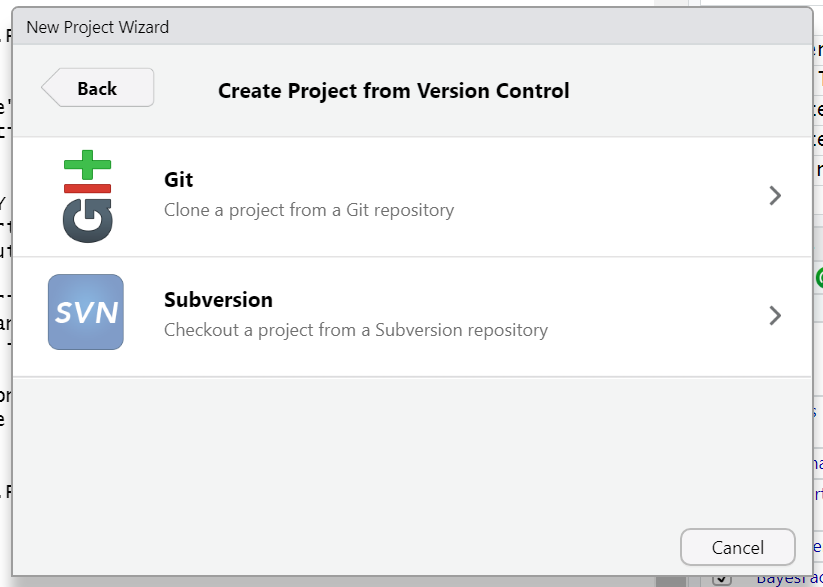
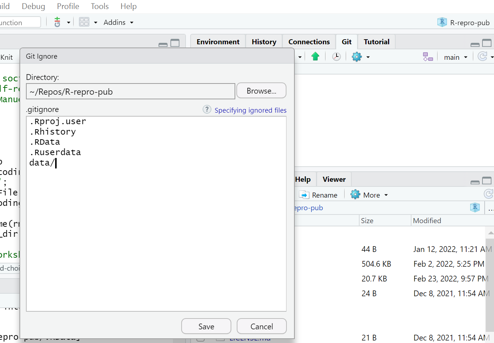

## Working with projects in RStudio

RStudio projects make it straightforward to divide your work into multiple contexts, each with its own working directory, workspace, history, and source documents. There are several options for working with RStudio projects and enabling version control:

1. **New Directory** - start a brand new RStudio project (with the option of version control).
2. **Existing Directory** - add existing work to a project in RStudio (with the option of setting up version control).
3. **Version Control** Continue an existing RStudio project that already uses version control (i.e., download it from GitHub).

{: .image-with-shadow}

When initiating a new project with a new directory, you are presented with a variety of project options, including a generic “New Project” (aka R Project) and  a "Quarto project", as seen in the image below. Regardless of your choice at this step, you can create new Quarto documents within R projects, Quarto projects, or even outside projects at any time. You may also convert an R project to a Quarto project and back at any point as well.

However, there's no need to worry too much about this now because we will be working on an existing project using version control. So let's focus on the basics first, and we'll explore more advanced features of Quarto projects in a later episode.

{: .image-with-shadow}


## Using RStudio projects and Version Control in RStudio

Using version control is a powerful feature to make your research more reproducible and better organized. In order to use versioning while working in RStudio make sure your work is set up as an R Project.  RStudio's versioning features don't work unless your work is part of an R Project. There are three options for starting an R Project, depending on your given scenario.

_Of course if an existing RStudio project is already under version control, then opening the project will be the only thing you need to do!_

Let's see how this setup would work.

---

### Starting a R Project with Version Control 
#### Method #1

To start an R project, you would navigate to `File > new project` rather than just `File > new file`.

{: .image-with-shadow}

After choosing `New Directory`, choose `new project` on the next menu options.

Then, to use version control, make sure to check the "_Create a git repository_" box as highlighted in this screenshot:
{: .image-with-shadow}

*Note when you choose directory name, it will create a new directory in the directory you specified along with an .Rproj file of the same name. Avoid spaces here. underscores "_", dashes "-" or camel case "NewProject" is the recommended way to name this directory/file.

*Optionally, check the box in the bottom left corner, "Open in new session," if you want it to appear in a new RStudio window.

---

### Add versioning to an existing project
#### Method #2

{: .image-with-shadow}

We won't take the time to cover this here, but if you've already started a Quarto project WITHOUT version control, you have the option to add version control retrospectively. You can also add existing R files to a project and set up version control if you've done neither. To see a tutorial of this process, please see [episode 14 "Using Git from RStudio" in Version Control with Git](https://swcarpentry.github.io/git-novice/14-supplemental-rstudio.html).

This is by far the most labor-intensive way to do it, so remember to add version control at the beginning of any new project.

---

### Continue a version-controlled project
#### Method #3

{: .image-with-shadow}
The final option is to continue a version-controlled project. This is the option we will do for our workshop.

First, indicate which version control language you will be using (Subversion is another version control system, though less popular than Git)

{: .image-with-shadow}

When you choose this option, there will be a place to paste a URL from GitHub (or another hosting platform). The name of the repository will automatically populate. Just choose which directory on your computer you wish to save the project to, and you are good to go!

{: .image-with-shadow}


> ## Our turn!
> ### Getting the files for the hands-on part of the workshop: 
> We have a repository already prepared for this workshop at [https://github.com/UCSBCarpentry/Quarto-Project-Example](https://github.com/UCSBCarpentry/Quarto-Project-Example). 
> We are going to use the third option to download this repository from GitHub and work with it hands-on. You will need this repo in your working environment if you would like to follow along through this workshop.
> Let’s take a second to acquaint ourselves with GitHub. [At this link](https://github.com/signup), you may sign into your GitHub account or create one if you have not already.
> {: .source}
{: .prereq}

{: .image-with-shadow}


The two main sections are files and directories and the README, which should contain a narrative description of the project.

We are each going to make a copy of this repository to use for this workshop. To do so, we will do what's called "forking" on GitHub. A Fork is a copy of a repository that you get to experiment with without disrupting the original project.

On Github, in the upper right-hand corner of the repository, click on the button that says "Fork" - see highlighted example below:

{: .image-with-shadow}

If you are a member of any organizations on GitHub, you will be asked whether you want to fork to your account or to an organization. Choose your personal account for this workshop.  GitHub will process it for a few moments, and voila! You have your own copy of the workshop example repository.

Now, click on the green `Code` drop-down and then click on the copy icon next to the repository URL:

{: .image-with-shadow}

Now, let's return to RStudio and make our new project.

Click `File > New Project > Version Control > Git`.

Paste in your repository's Github URL and click the "Create Project" button.

{: .image-with-shadow}

Now, you have cloned a copy of your git repo from Github to your working environment.  

If you're working in the JupyterHub environment or have not yet used Git on your machine, you will need to configure your Git identity with your name and email before you'll be able to commit the changes you make during this workshop.  Substitute your name and email address in the commands below and paste them into the Terminal panel of RStudio.

```
git config --global user.email "you@example.com"
git config --global user.name "Your Name"
```

Woo hoo! We have the project we're working on for this workshop opened in RStudio and set to use version control!

> ## Git not detected on the system path
> 
> If you are using Git for the first time in RStudio, you may be getting a notification that Git isn't set up to work with RStudio.
>
> See the solution below:
> > ## Solution: 
> > {: .image-with-shadow}
> >
> > To set it up, we need to go to Tools > Global Options
> > {: .image-with-shadow}
> >
> > First, make sure "Enable version control interface for RStudio projects" is checked. Next, you must make sure that the Git executable path is correct.
> > For Macs, more than likely, the path will be automatically populated as: `/usr/bin/git`. You may need to change it to:  `/Library/Developer/CommandLineTools/usr/bin/git`
> >
> > Windows users may find that the correct path is also pre-populated, or you may need to manually add it by clicking "browse". Your path will be something like `C:/Program Files/Git/bin/git.exe`. If not, search for where Git for Windows was installed, go into the bin folder, and select the `git.exe` file.
> > 
> > Ok! Now we have that set up. By the way, this is a one-time set up. From now on, RStudio should know where to find git on your device. We should be able to open our project from GitHub in RStudio.
> {: .solution}
{: .callout}

## Using Version Control in RStudio

There are two places we can interact with Git in the RStudio interface.
1. Menu bar (Tools menu) {: .image-with-shadow} <br>
2. Environment/History pane {: .image-with-shadow}

Ok, but what do all the options mean? We won't go through them all, but here are the basics to get started versioning your project.

### Git Workflow

The most simple workflow for version control (working on your computer only)
is referred to as "add" and "commit":

But what do those words even mean?

**Add:** Choose a file or files to take a "snapshot" of. What files do you want to add to your next version?

**Commit:** Take a "snapshot" of a selected version of your project. The snapshot will *only* include the files you "added", typically only files that you've edited since your last commit.

You may have just a few commits in a single work session or many commits.

When you commit, you add a "commit message," a.k .a. a short line of text (recommended 50 characters or less) that describes the changes that were made to the file(s) you added. This helps keep your versions organized and makes it easier to remember what you did or restore your work to exactly the version needed if you make a mistake or want to implement a change.


#### Git Workflow with GitHub

If we are saving our work to a version control hosting cloud platform such as GitHub,
our workflow gets a bit more complex, we add a "pull" and "push" step at the beginning and end of a work session.

`Pull > add > commit > push`

**Pull:** *download* the most recent version of the repository *from* GitHub *to* your local computer.

**Push:** *upload* the most recent version of the repository *to* GitHub *from* your local computer.

Put a pin in pulling and pushing for now. For the time being, as we edit our paper, we will just stick to adding and committing. In the end, we'll see how to use push to GitHub, and you can experiment with pulling later on.

### Tips for working with Git

- Commit frequently; each commit should be a distinct set of edits that you can summarize in 50 characters or less. Don’t add a bunch of unrelated edits to the same commit; it makes it harder to look back through your “snapshots” and find the right one if you need to.

## Your first edit

Now, let's open up the report in this already-drafted repository. You will find it in the `report` directory with the filename: `DataPaper-ReproducibilityWorkshop.qmd`.  Open it up, and we will make an edit to the YAML front matter of this draft report so we can practice using version control.

In the title add "(Carpentry Workshop Version)" and make sure to save it.

{: .image-with-shadow}

Now, in the Environment panel, toggle to the Git tab. You'll see the file that was edited with a checkmark next to it. Click the check mark to "add". Note that if you edited more than one file, you could choose any or all of the documents to "add".

{: .image-with-shadow}

Have you noticed the blue 'M' icon in the Git Tab before you added your commit message and staged your edits? Do you know what it means? That 'M' indicates tracked files that have been modified. However, there are other flags depending on your interactions with project files—such as deletions, renames, or additions. Additionally, files might be ignored and not tracked at all, as illustrated below.


Now, click commit. A dialogue box will pop up. You'll need to add a commit message to proceed. Add something about editing the title. The difference between your files will show in the bottom panel.

{: .image-with-shadow}

Hit commit, and a dialogue box will show a completed commit. Warning: **DO NOT PUSH** anything yet!

Congrats! You made your first commit!

> ## Discussion: (optional) Utilizing .gitignore files
> a `.gitignore` file is used to signal to Git NOT to track versions of specific files. One instance where this is used in a data analysis project is with data files that are too large to be uploaded to GitHub.
>
> Now, there are some caveats to this, so in what situations would it make sense to add data to the .gitignore, and in what situations would it not? What else could you imagine you wouldn't want to track in your research project?
>
> > ## Solution:
> > Why and when would it be a good idea to add data files to the `.gitignore`?
> > - With raw data files - since they will not be modified (remember: raw data = read-only).
> > - With sensitive data - This should absolutely not be pushed to GitHub
> >  
> > Why and when would it not make sense to add data files to the `.gitignore` so they will be available in the Git repository?
> > - pre-processed data files - these are the data files that are edited - processed from the raw data
> > - small data files - may not make much of a difference whether they are tracked or not
> > - the first time you add data files - You can't push data files to GitHub unless they are tracked. So, if you want your data on GitHub but don't want to track it, you must make sure you push once and then add the file to the .gitignore file.
> {: .solution}
{: .challenge}

> ## Challenge 1 (optional): Add the data files/directories to .gitignore
> Add the data (all of the raw data files) to the `.gitignore`.  
> Hint: there are two ways to do this.  
> Hint2: add a forward slash `/` after directories.
>
> > ## Solution:
> > 1) Open the .gitignore file by double-clicking on it in the file view pane; on a new line add `data/`. Save the file, and don't forget to commit it.
> > {: .image-with-shadow}
> > 2) Click on the settings gear in the Git tab of the environment pane. Click on `gitignore`. On a new line, add `data` and click save. Don't forget to commit the `.gitignore` file.
> > {: .image-with-shadow}
> {: .solution}
{: .challenge}
