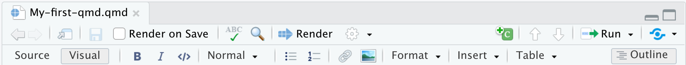

## Formatting Qmd Documents with the Visual Editor

As we mentioned earlier, the visual editor in RStudio makes formatting much more effortless. It provides improved productivity for composing longer-form articles and analyses with Quarto. Markdown documents can be edited in either source or visual mode. To switch into visual mode for a given document, toggle on the visual option at the top-left of the document toolbar (alternatively for windows, the ⌘⇧ F4 keyboard shortcut). This will prompt a formatting bar through which you can apply styling, add links, create tables, and others similar to functions you find in google docs and other document editors. Note that you can switch between source and visual mode at any time (editing location and undo/redo state will be preserved when you switch). Let’s try it! Feel free to follow along or just watch this quick demo. But first, make sure to have your visual editor enabled on your screen. Also, make sure to open your `DataPaper-ReproducibilityWorkshop.qmd` file located at the `report` folder.

If you'd like to learn more about markdown basics and use the source mode to format you documents check [Quarto's markdown basics](https://quarto.org/docs/authoring/markdown-basics.html).

### Editor Toolbar

The editor toolbar includes buttons for the most commonly used formatting commands:

Additional commands are available on the Format, Insert, and Table menus:

> ## Tip: Inserting anything with shortcuts
> You can also use the catch-all ⌘ / shortcut to insert just about anything. Just execute the shortcut then type what you want to insert. For example: `/lis` will prompt listing options.
>
{: .callout}

Let's get some formatting done in our example paper. We will look for some **Examples** and replace with the recommended style so we can all produce a similar output at the end of the workshop.
 

> ## Rendering Documents 
> When you do your first render, the pop-up may be blocked by your browser. You can unblock the pop-up or in the <b>Background Jobs</b> pane,
> find the local host url and copy+paste that into your browser. 
>
{: .keypoints}

### *Applying Emphasis*

At the very top of the document we have a recommended citation for the sample data paper (**Example 1**). We want to emphasize the title of the journal, “Data in brief” in italics. Select the text and click in the I icon and voilà! Remember to delete (Example 1).

### *Adding Links*
In the same citation we have just worked on, let’s now add a link to it by selecting and copying the doi address (**Example 2**). Then, click on the link icon and paste the address in the URL field. Simple right? If you prefer, you can also the drop-down insert menu, or even use shortcuts. By hovering the mouse over the desired icon, you will see which keys you should use. For a complete list of editing shortcuts, [check this link](https://rstudio.github.io/visual-markdown-editing/shortcuts.html). Tip: if you didn’t intend to use a shortcut and want to reverse its effect, just press the backspace key.

### *Adding Headings*

Adding headings to a a Quarto markdown document in Rstudio is as simple as applying links. Let’s say we want the abstract section as a Heading Level 2. We can select the “abstract” then, and under “Normal” on the left-hand side of the menu, we can choose the desired level. Again, all the shortcuts will be listed next to the styling in the menu. Now apply the same heading to keywords and Level 2 to "Value of the Data" (**Example 3**).

### *Creating Tables*

Because creating tables manually in qmd documents could be a little painful for beginners, Rstudio released an add-in functionality for tables back in 2018. The new visual editor, however, have made the process to create qmd tables more similar to other editors we use daily. In our template, we have the specification table with 10 rows and two columns. If we were willing to add that table, we could do that by inserting a table to a selected part of the documents and by specifying the desired number of rows and columns.  Including a caption is optional, but recommended. We can add or delete rows and columns, add a header that will be set bold by default but can be changed, and set the desired alignment. Select the desired text and click on the crossed T icon if you wish to clear formatting.

### *Creating Bullet and Numbered Lists*

Again, similarly to other document editors, Rstudio allows you to turn text into bullet or numbered lists. Let’s apply a bullet list to the paragraphs specifying the "Values of the Data" reported in the data paper (**Example 4**). Assuming we were willing to create a numbered list instead, we could have followed the same process and chosen the other icon. We can also sink or lift the listed items.

### *Adding Images*

You may need to include static images to your manuscripts. For that, you can use the insert image function, click on the painting icon or even use the shortcut that shows right next to the function in the menu. After browsing and upload the desired image you may also specify the caption and the image title, as well as adjust dimensions if needed. Let's insert image for Fig. 1 (**Example 5**).  

### *Adding Formulas*

If you have math formula in your manuscript there are three different ways you may insert one. Let's look for (**Example 6**) for an example. Point and click at the insert menu, use the catch-all `⌘ /` keyboard short and then get to inline math mode, or type the formula content between dollar signs `$`. You will notice that the color and font type will change, as Rstudio identifies the block as an inline equation.

## Keyboard Shortcuts
As you become a more regular Rstudio user, you may also consider using some keyboard shortcuts for all basic editing tasks. Visual mode supports both traditional keyboard shortcuts (e.g. `⌘ B` for bold) as well as markdown shortcuts (using markdown syntax directly). For example, enclose **bold** text in asterisks or type ## and press space to create a second level heading. Here are some of the most commonly used shortcuts for Mac users:

Tip: Windows users should replace in the shortcuts above `⌘` by `ctrl` and `⌥⌘` by `alt (+) ctrl`.

## Other Editing Features
The visual editor allows users to insert images by browsing their location or copying and pasting it to the Qmd document directly. There are also options to add html, line blocks, blockquotes, and footnotes. Up next we will learn more about how to add code chunks. In further episodes we will also learn how to insert citations and create a bibliography.

## Bonus Content: More Styling with Fence Divs (Demonstration Only)

Quarto also allows some cool styling using colons to create *fenced divs*. The advantage of using fenced divs is that you may section styling/layout to pieces of your content more easily, using an unified and syntax, while also protecting and preserving formatting across different types of outputs. Essentially, these will adopt the following structure:

- Start and end with an equal number of colons being minimum of 3 `:::`
- Add curly brackets to indicate the start/end of a class or name, e.g., `{.class}`

We won't have time to cover these extensively, but let's take a look at a few examples. 

### *Adding borders around text*

We can create clusters of content and add a border around the text using a div:

If we type:  

~~~

::: {.border}

Example of some content with a border.

:::

~~~

When we render it, we will get:  

  

### *Dividing content into separate columns*

If we want to separate content into two or more columns that could be accomplished with a similar approach as above.

If we type:  

~~~

:::: {.columns}
::: {.column width="50%"}
Some content in left column
:::
::: {.column width="50%"}
Some Content in right column
:::
::::

~~~

When we render it, we will get:  

  

If you would like to explore more the *Fence Divs* and other cool functionalities check the [Divs and Spans documentation](https://quarto.org/docs/authoring/markdown-basics.html#divs-and-spans).

> ## Time to Render!
> Let's see how your document looks like.
{: .checklist}
