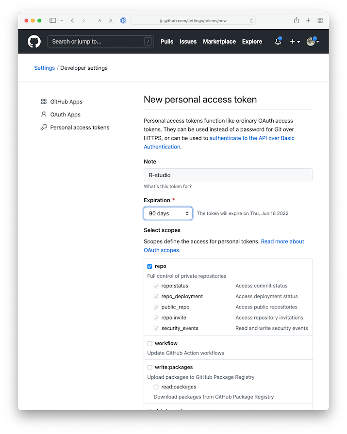
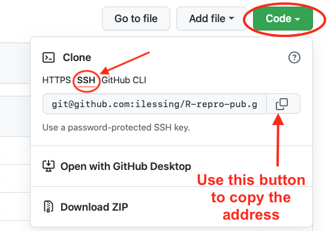
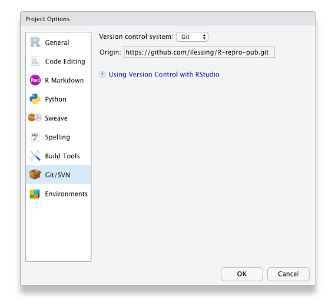

## Synchronizing Your Local changes Your Repository on GitHub

In Episode 3: [ Getting your project set up with Version Control in RStudio](../01-Project-Setup-Organization/03-setup-versioning), we learned about using version control as you write your publication.  In this part of the workshop, we will set up Rstudio to authenticate with GitHub, which is necessary to _push_ your changes to GitHub.

Terminology:  Git _Push_ and _Pull_

Definition: The process of synchronizing your local git repository with your git repository on GitHub (or other Git server).

GitHub requires a more secure method of authentication than a simple Username and Password.  For this workshop, we'll be using a Personal Access Token (PAT) method which you will setup for your account on GitHub.  We will configure RStudio to use your PAT to authenticate with GitHub so you can download and upload your RStudio code edits to GitHub.


### Setting up your GitHub Personal Access Token (PAT)

In your RStudio console enter following command:

`usethis::create_github_token()`

This will open your web browser and, after logging in if necessary, you'll be on GitHub settings page to create a PAT. Most of the options have already been set for us, we only need to update:

- the Note field by describing what is the token for. We recommend a combination describing the computer the PAT will be used on and what it is going to be used for. 

For example: 

> RStudio on MacBookAir for Reproducibility Workshop

- Set expiration to 90 days. Note that GitHub will send you an email when it’s time to renew your token that is about to expire. It is easier to not let the token expire, otherwise you will have to regenerate a new one and do all the setup again.


{: .image-with-shadow}


You can leave all the other options as selected. Click on the green Generate token button at the bottom of the page.

* On the next screen GitHub shows you the new token.  **Be sure to copy it** as you only get one chance to see the token text.
 This is the only time you will be able to see it, so do not close this page before you are done with the setup! Copy your PAT to your clipboard. Return to RStudio and run the following command in the R console:

`gitcreds::gitcreds_set()`

This will prompt you to paste the PAT you just copied from GitHub. Paste your PAT and hit Enter. You you should see a few lines letting you know that the token has been setup.

To check your work you can run the following command in your R console:

`usethis::git_sitrep()`

if the output shows the line `Personal access token for 'https://github.com': '<discovered>'`

then you know you've succeeded in connecting RStudio with GitHub.

Note that if you use several computers/servers, you will have to do those steps again on each machine.


> ## Note: 
>
> If you cloned the repository already the next 2 steps are not necessary, as the "origin" is set as part of the cloning process. 
{: .callout}


## Getting your Repository's URL from GitHub

You can get your repository's address from GitHub by navigating to your repository on GitHub.com and clicking the green "Code" button.  

{: .image-with-shadow}

With that address, you can complete setting the origin URL in the next step. 

## Checking and Setting the "Origin" for the local copy of your repository.

If you forked and cloned the demonstration publication for this workshop, as covered in an earlier episode, then your copy of the repository should already have the "origin" set.  Once the "origin" is set properly, you should be able to push and pull your changes to and from GitHub.  When you clone a repository from GitHub, your local copy of the repository should have GitHub set as the "origin".  

You can check this in Rstudio --> Tools --> Project Options --> Git/SVN

If the "Origin" field is blank, then you'll need to add it from the terminal with a couple of terminal commands like this:
```
git remote add origin <paste your repository address here>
git fetch --set-upstream origin main
```

Be sure **your** GitHub username is part of the URL.

After you've updated the Origin URL from the command line, go back to R Studio --> Tools --> Project Options --> Git/SVN to verify you have the "Origin" field filled in.  It should look like this.

{: .image-with-shadow} 


## Push your local changes up to your repository GitHub.
With authentication set up and your local copy of your repository pointing to GitHub as the "Origin" you should be able to make changes locally and _push_ them up to GitHub.  

Let's try it and see if it works.

> ## Challenge 2: Push to GitHub
> 
> 1. Make a change to one of the files in your project or add a new file.
> 2. In R Studio's Git panel, check the box to Stage the changed file.
> 3. Commit the change to your Git repository.
> 4. Click the green up arrow to _Push_ your repository changes up to GitHub.
> 5. Look on [GitHub.com](https://GitHub.com) to verify your changes are there.
> 
{: .challenge}

### Tips for working with Git

Tips for working with Git

You should _pull_ each time you start working on your project after a hiatus or before each edit if you know a team member is working at the same time.

At the end of your work session (or more frequently if you are working at the same time as team members), “_push_” your commits to the remote repository - this way your local changes get added to your team’s remote repository.

This _pull_, _add_, _commit_, _push_ routine will become second nature. When you sit down to work do a _pull_ and when you're about to get up _push_ to establish a ritual that marks the beginning and end of your work session.

With the ability to synchronize your changes between GitHub and your local repo, the next step is to explore options for publishing your research paper.



