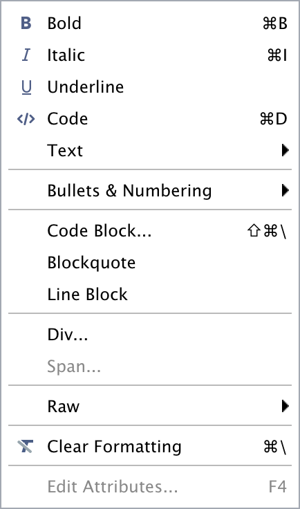
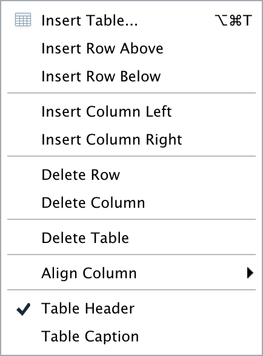
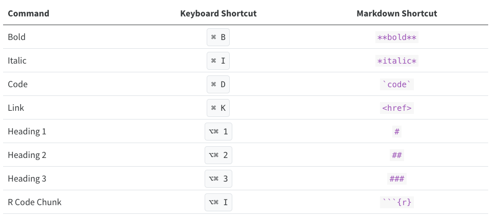

## Formatting Rmd Documents with the Visual Editor

As we briefly mentioned before, the visual editor in RStudio has made RMarkdown formatting much more effortless. It provides improved productivity for composing longer-form articles and analyses with R Markdown. The visual markdown editing is available in RStudio v1.4 or higher. Markdown documents can be edited in either source or visual mode. To switch into visual mode for a given document, toggle on the compass  icon at the top-right of the document toolbar (or alternatively the ⌘⇧ F4 keyboard shortcut). This will prompt a formatting bar through which you can apply styling, add links, create tables, and others similar to functions you find in google docs and other document editors. Note that you can switch between source and visual mode at any time (editing location and undo/redo state will be preserved when you switch). Let’s try it! Feel free to follow along or just watch this quick demo. But first, make sure to have your visual editor enabled on your screen. 

## Editor Toolbar

The editor toolbar includes buttons for the most commonly used formatting commands:

Additional commands are available on the Format, Insert, and Table menus:

<figure>

</figure> 

<figure>

</figure> 

 

 <figure>

</figure> 

  

> ## Tip: Inserting anything with shortcuts
> You can also use the catch-all ⌘ / shortcut to insert just about anything. Just execute the shortcut then type what you want to insert. For example: `/lis` will prompt listing options.
>
{: .callout}

### Applying Emphasis
At the very top of the document, we have a recommended citation for the sample data paper. We want to emphasize the title of the journal, “Data in brief” in italics. Select the text and click in the I icon and voilà!

### Adding Links
In the same citation we have just worked on, let’s now add a link to it by selecting and copying the doi address. Then, click on the link icon and paste the address in the URL field. Simple right? If you prefer, you can also the drop-down insert menu, or even use shortcuts. By hovering the mouse over the desired icon, you will see which keys you should use. For a complete list of editing shortcuts, check this link. Tip: if you didn’t intend to use a shortcut and want to reverse its effect, just press the backspace key.

### Adding Headings
Adding headings to a Rmarkdown document in Rstudio is as simple as applying links. Let’s say we want the abstract section as a Heading Level 2. We can select the “abstract” then, and under “Normal” on the left-hand side of the menu, we can choose the desired level. Again, all the shortcuts will be listed next to the styling in the menu. Now apply the same heading to keywords and Level 1 to “Specifications Table”.

### Creating Tables
Because creating tables manually in Rmd documents could be a little painful for beginners, Rstudio released an add-in functionality for tables back in 2018. The new visual editor made it more similar to other editors we use daily. In our template, we have the specification table with 10 rows and two columns. If we were willing to add that table, we could do that by inserting a table to a selected part of the documents and by specifying the desired number of rows and columns.  Including a caption is optional, but recommended. We can add or delete rows and columns, add a header that will be set bold by default but can be changed, and set the desired alignment. Select the desired text and click on the crossed T icon if you wish to clear formatting.

### Creating Bullet and Numbered Lists
Again, similarly to other document editors, Rstudio allows you to turn text into bullet or numbered lists. Let’s apply a bullet list to the paragraphs specifying the values of the data reported in the data paper. Assuming we were willing to create a numbered list instead, we could have followed the same process and chosen the other icon. We can also sink or lift the listed items.

### Adding Math Formula

### Adding Inline Code 

## Keyboard Shortcuts
As you become a more regular Rstudio user, you may also consider using some keyboard shortcuts for all basic editing tasks. Visual mode supports both traditional keyboard shortcuts (e.g. ⌘ B for bold) as well as markdown shortcuts (using markdown syntax directly). For example, enclose **bold** text in asterisks or type ## and press space to create a second level heading. Here are some of the most commonly used shortcuts:

### Other Editing Features
The visual editor allows users to insert images by browsing their location or copying and pasting it to the rmd document directly. There are also options to add html, line blocks, blockquotes, and footnotes. As we will see shortly we can also add code chunks and comments to rdm documents. In further episodes we will also learn how to insert citations and create a bibliography.
