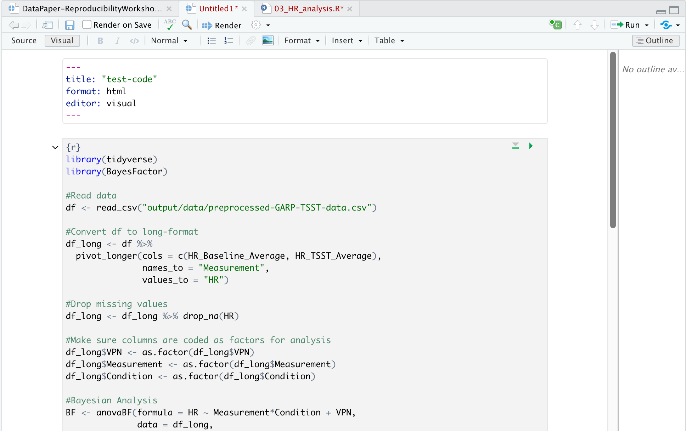

## Utilizing the Code Features of R Markdown

FIXME edit intro paragraph

What if you need to use more code than just a single-line expression such as `mean()` What if you want to add a plot or other code-generated figure that requires several (or more) lines of code? That's where "Code Chunks" come into play. Code Chunks are used in R Markdown documents when more than one line of code is needed to run an analyses or output a plot or figure etc. Code chunks are processed by Knitr and the output is displayed as the document output of our choice. I.e. Knitr runs the lines of code for a plot in a code chunk and outputs the plot in the final document as html. 

## What is Knitr?

But what is Knitr? Knitr is the engine in RStudio which creates the “dynamic” part of R Markdown reports. It’s specifically a package that allows the integration of R code into the html, word, pdf, or LaTex document you have specified as your output for R Markdown. It utilizes Literate Programming to make research more reproducible. There are two main ways to process code with Knitr in R Markdown documents:

1. Inline code
2. Code Chunks

Now, we already learned how to use inline code in the previous episode, so now let’s dive into code chunks which allow us to integrate more substantial portions of code into our narrative. 

## Inserting Code Chunks

Code chunks (Yes that's RStudio's technical name for them) are better when you need to do something more sophisticated with your code than inline code, such as building plots or tables.  They also incorporate syntax which allows modifications to how that code is rendered and styled in your final output. We’ll learn more about that as we walk through the “anatomy” of a code chunk.

### Basic Anatomy of the Code Chunk

You can quickly insert chunks like these into your file with:  
- the keyboard shortcut Ctrl + Alt + I (OS X: Cmd + Option + I)  
- the Add Chunk command in the editor toolbar  
- or by typing the chunk delimiters {r} and ```.  

The most basic (and empty) code chunk looks like so:


Other than our backticks ``` for code chunks that surround the code top and bottom, the only **required** piece is the specified language (r) placed between the curly brackets. This indicates that the language to read the code is R.

> ## Fun fact: Other Programming Languages
> Although we will (mostly) be using R in this workshop, it’s possible to use other programming or markup languages. For example, we have seen that we can use LaTeX code for equations. You can also use python and a handful of other languages, so if R is not your preferred programming, but you like working in the RStudio environment, don’t despair! Other options for languages include: sql, julia, bash, and c, etc. It should be noted however, that some languages (like python) will require installing and loading additional packages. 
{: .callout}

## Add a Code Chunk

Ok, let's add some code! There are already some plots included in our code but as 
static images. This time, we are going to opt to add these plots as code chunks - 
which are also more reproducible and easier to update. This is because, as with our inline code, this assures that if there are any changes to the data, the plots update automatically. This also makes our life easier because when there’s a change we don’t have to re-generate plots, save them as images and then add them back in to our paper. This will potentially help prevent version errors as well! So we’re actually going to go ahead and add a few plots with code chunks.
We’ll start by typing our our starting backticks & r between curly brackets. (in your own workflow you may want to add the ending three backticks as well so you don’t forget after adding your code - it's a common mistake):

Now, let's open our `03_HR_analysis.R` script in our `code` folder. Copy the code and paste it in between the two lines with backticks and `{r}` in our `DataPaper-ReproducibilityWorkshop.rmd` file.



> ## Tip:
> There's actually a button you can use in the RStudio menu to generate the code chunks automatically. Automatic code chunk generation is available for several other languages as well. Also, you can use the keyboard shortcut `ctrl`+`alt`+`I` for Windows and `command`+`option`+`I` for Mac. 
> 
{: .callout}

Now, to check to make sure our code renders, we could click the "knit" button as we have been doing. However, with the code chunks we have other opportunities for rendering. 

1) Knit button - knitting will automatically run the code in all code chunks
 

2) Run from code chunk (green play button on the right top corner)


3) Run menu


4) Keyboard shortcuts: 

**Task**	| **Windows & Linux**	| **macOS**
---       |---                  |---
Create a code chunk | Ctrl + Alt + I | Cmd + Option + I
Run all chunks above |	Ctrl+Alt+P	| Command+Option+P
Run current chunk	| Ctrl+Alt+C	| Command+Option+C
Run current chunk	| Ctrl+Shift+Enter	| Command+Shift+Enter
Run next chunk	| Ctrl+Alt+N	| Command+Option+N
Run all chunks	| Ctrl+Alt+R	| Command+Option+R
Go to next chunk/title	| Ctrl+PgDown	| Command+PgDown
Go to previous chunk/title	| Ctrl+PgUp |	Command+PgUp

> ## Time to Knit!
> Use one of the above options to run your code. 
{: .checklist}


Hmmmm... we got an error while trying to run our code. That's because our code contains a relative path to read in the data file, but now we're running the code from the rmd document which is in a different directory so we will need to update the file path.

Update the file path from: `"output/data/preprocessed-GARP-TSST-data.csv"` to `"../../output/data/preprocessed-GARP-TSST-data.csv"`


> ## Time to Knit!
> Let's try that again 
{: .checklist}

Ooof! That output doesn't look great.. we've got a bit more work to do.


let's see about fixing that with code chunk rendering options. 

## Code Chunk Options, Names and Captions (oh my!)

### Name Your Code Chunk

While not necessary for running your code, it is good practice is to give a name to each code chunk and allows for more advanced options (such as cross-referencing) to work with your rmd files later on:

`{r chunk-name}`

Some things to keep in mind
- The chunk name is the only value other than r in the code chunk options that doesn’t require a tag (i.e. `echo =` )
- The chunk label has to be unique (i.e.you can't use the the same name for multiple chunks)

We’ll see in a bit where this code chunk label comes in handy. But, for now let's go back and give our first code chunk a name:

`{r fig3-heartrate}`

> ## Tip: Don't use spaces, periods or underscores in code chunk labels
>Try to avoid spaces, periods (.), and underscores (_) in chunk labels and paths. If you need separators, you are recommended to use hyphens (-) instead. For example, setup-options is a good label, whereas setup.options and chunk 1 are bad; fig.path = 'figures/mcmc-' is a good path for figure output, and fig.path = 'markov chain/monte carlo' is bad. See more at: [https://yihui.org/knitr/options/](https://yihui.org/knitr/options/)
{: .callout}

### Code Chunk Options

There are over 50 different code chunk options!!! Obviously we will not go over all of them, but they fall into several larger categories including: code evaluation, text output, code style, cache options, plot output and animation. We’ll talk about a few options for code evaluation, text output and plot output specifically.

> ## Tip: Learn more about code chunk options
> Find a complete list of code chunk options on Knitr developer, Yihui Xie's, [online guide to knitr](https://yihui.org/knitr/options/). Or, you can find a brief list of all options on the R Markdown Reference guide on page 3 accesible through the RStudio Interface by navigating to the main menu bar `Help > Cheat Sheets > R Markdown Reference Guide`.
{: .callout}

The chunk name is the only value other than r in the code chunk options that doesn’t require a tag (i.e. the "= VALUE" part of `option = VALUE`). So these chunk options will always require a tag whose syntax looks like:

`{r chunk-label, option = VALUE}`

the option always follows the code chunk label (don't forget to add a `,` after the label either). 


#### Some common options: 

**results** = (logical or character) text output of the code can be hidden (hide or FALSE), or delineated in a certain way (default 'markup').    
**eval** = (logical or numeric) TRUE/FALSE to evaluate (or not) or a numeric value like c(1,3) (only evaluate expressions 1 and 3).    
**echo** =  (logical or numeric - following the same rules as above) whether to display source code or not.     
**warning** = (logical) whether to display the warnings in the output (default TRUE). FALSE will output warnings to the console only.    
**include** = (logical) whether to include the chunk output in the output document (default TRUE).   
**message** = (logical) whether or not to display messages that appear when running the code (default TRUE).
 
 
> ## CHALLENGE 9.1 - Rendering Codes
> How will some hypothetical code render given the following options?
> `{r global-chunk-challenge, eval = TRUE, include = FALSE}`
> 
>> ## SOLUTION
>> The expressions in the code chunk will be evaluated, but the outputed figures/plots will not be included in the knit document.   
>> When might you want to use this?   
>> If you need to calculate some value or do something on your dataset for a further calucation or plot, but the output is not important to be included in your paper narrative. 
> {: .solution}
{: .challenge}

> ## CHALLENGE 9.2 - add options to your code  
> Add the following options to your code:  
> echo = FALSE, message = FALSE, warning = FALSE, results = FALSE  
> 
> What will this do?  
>> ## SOLUTION
>>     
>>
>> These options mean the source code will not be printed in the knit html document, messages from the code will not be printed in the knit html document, and warnings will not be printed in the knit html document (but will still output to the console). Plots, figures or whatever is printed by the code WILL show up in the final html document.  
> {: .solution}
{: .challenge}

### Caption your figure output from code chunks:

Again, this is an optional feature, but if you need (or want) to add captions to your publication, it is straightforward to do in code chunks. 

The caption information also resides between your brackets at the beginning of the chunk: `{r}`

the tag is `fig.cap` followed by a `=` and the captions within quotes `"caption for figure"`

> ## Challenge 9.3: Add a caption to Figure 3
> Let's add a caption to our heartrate figure. Add the caption:
> 
> > "Fig 3: Mean heart rate of stress and control groups at baseline and during intervention."
> 
> > ## Solution
> > so, you should end up with the following in your code chunk:
> > ~~~
> > {r fig3-heartrate, echo = FALSE, message = FALSE, warning = FALSE, results = FALSE, fig.cap = "Fig 3: Mean heart rate of stress and control groups at baseline and during intervention."}
> > ~~~
> > {: .language-r}
> {: .solution}
{: challenge}

Let's knit one more time to see if our figure outputs how we'd like and has a caption.

> ## Time to Knit!
> Let's try that again 
{: .checklist}

Now that we’ve named and adjusted the rendering for our first figure, let’s add another, but instead of copy/pasting an r script into our rmd document we will use a more elegant solution. 


