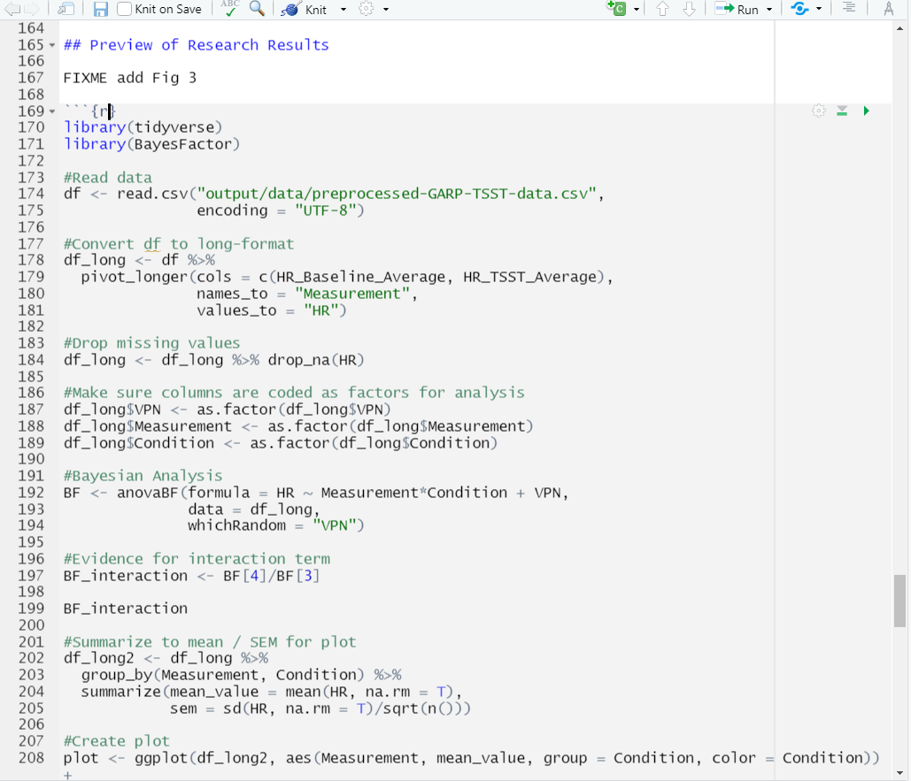

## What is Knitr?

Knitr is the engine in RStudio which creates the “dynamic” part of R markdown reports. It’s specifically a package that allows the integration of R code into the html, word, pdf, or LaTex document you have specified as your output for r markdown. It utilizes Literate Programming to make research more reproducible. There are two main ways to process code with Knitr in R Markdown documents:

1. Inline code
2. Code Chunks

We learned how to use inline code in the previous episode, so let’s now let’s dive into code chunks which allow us to integrate more substantial portions of code into our narrative. 

## Inserting Code Chunks

Code chunks (Yes that's RStudio's technical name for them) are better when you need to do something more sophisticated with your code than inline code, such as building plots or tables.  They also incorporate syntax which allows modifications to how that code is rendered and styled in your final output. We’ll learn more about that as we walk through the “anatomy” of a code chunk.

### Basic Anatomy of the Code Chunk

You can quickly insert chunks like these into your file with:  
- the keyboard shortcut Ctrl + Alt + I (OS X: Cmd + Option + I)  
- the Add Chunk command in the editor toolbar  
- or by typing the chunk delimiters {r} and ```.  

The most basic (and empty) code chunk looks like so:

The most basic code chunk looks like so:


Other than our backticks ``` for code chunks that surround the code top and bottom, the only **required** piece is the specified language (r) placed between the curly brackets. This indicates that the language to read the code is R.

> ## Fun fact: Other Programming Languages
> Although we will (mostly) be using R in this workshop, it’s possible to use other programming or markup languages. For example, we have seen that we can use LaTeX code for equations. You can also use python and a handful of other languages, so if R is not your preferred programming, but you like working in the RStudio environment, don’t despair! Other options for languages include: sql, julia, bash, and c, etc. It should be noted however, that some languages (like python) will require installing and loading additional packages. 
{: .callout}

## Add a Code Chunk

Ok, let's add some code! There are already some plots included in our code but as 
static images. This time, we are going to opt to add these plots as code chunks - 
which are also more reproducible and easier to update. This is because, as with our inline code, this assures that if there are any changes to the data, the plots update automatically. This also makes our life easier because when there’s a change we don’t have to re-generate plots, save them as images and then add them back in to our paper. This will potentially help prevent version errors as well! So we’re actually going to go ahead and add a few plots with code chunks.
We’ll start by typing our our starting backticks & r between curly brackets. (in your own workflow you may want to add the ending three backticks as well so you don’t forget after adding your code - it's a common mistake):


Now, let's open our `03_HR_analysis.R` script in our `code` folder. Copy the code and paste it in between the two lines with backticks and `{r}` in our `DataPaper-ReproducibilityWorkshop.rmd` file.



> ## Tip:
> There's actually a button you can use in the RStudio menu to generate the code chunks automatically. Automatic code chunk generation is available for several other languages as well. Also, you can use the keyboard shortcut `ctrl`+`alt`+`I` for Windows and `command`+`option`+`I` for Mac. 
> 
{: .callout}

Now, to check to make sure our code renders, we could click the "knit" button as we have been doing. However, with the code chunks we have other opportunities for rendering. 

1) Knit button - knitting will automatically run the code in all code chunks
 

2) Run from code chunk (green play button on the right top corner)


3) Run menu


4) Keyboard shortcuts: 

**Task**	| **Windows & Linux**	| **macOS**
---       |---                  |---
Run all chunks above |	Ctrl+Alt+P	| Command+Option+P
Run current chunk	| Ctrl+Alt+C	| Command+Option+C
Run current chunk	| Ctrl+Shift+Enter	| Command+Shift+Enter
Run next chunk	| Ctrl+Alt+N	| Command+Option+N
Run all chunks	| Ctrl+Alt+R	| Command+Option+R
Go to next chunk/title	| Ctrl+PgDown	| Command+PgDown
Go to previous chunk/title	| Ctrl+PgUp |	Command+PgUp

> ## Time to Knit!
> Use one of the above options to run your code. 
{: .checklist}


Hmmmm... we got an error while trying to run our code. That's because our code contains a relative path to read in the data file, but now we're running the code from the rmd document which is in a different directory so we will need to update the file path.

Update the file path from: `"output/data/preprocessed-GARP-TSST-data.csv"` to `"../../output/data/preprocessed-GARP-TSST-data.csv"`


> ## Time to Knit!
> Let's try that again 
{: .checklist}

Ooof! That output doesn't look great.. we've got a bit more work to do.


let's see about fixing that with code chunk rendering options. 

### Code Chunk Options

There are over 50 different code chunk options!!! Obviously we will not go over all of them, but they fall into several larger categories including: code evaluation, text output, code style, cache options, plot output and animation. We’ll talk about a few options for code evaluation, text output and plot output specifically.

> ## Tip: Learn more about code chunk options
> Find a complete list of code chunk options on Knitr developer, Yihui Xie's, [online guide to knitr](https://yihui.org/knitr/options/). Or, you can find a brief list of all options on the R Markdown Reference guide on page 3 accesible through the RStudio Interface by navigating to the main menu bar `Help > Cheat Sheets > R Markdown Reference Guide`.
{: .callout}

Again, The chunk name is the only value other than r in the code chunk options that doesn’t require a tag (i.e. the "= VALUE" part of `option = VALUE`). So these chunk options will always require a tag whose syntax looks like:

`{r chunk-label, option = VALUE}`

the option always follows the code chunk label (don't forget to add a `,` after the label either). 


#### Some common options: 

**eval** = (logical or numeric) TRUE/FALSE to evaluate (or not) or a numeric value like c(1,3) (only evaluate expressions 1 and 3).    
**echo** =  (logical or numeric - following the same rules as above) whether to display source code or not.     
**warning** = (logical) whether to display the warnings in the output (default:TRUE). FALSE will output warnings to the console only    
**include** = (logical) whether to include the chunk output in the output document (default TRUE)   
**message** = (logical) whether or not to display messages that appear when running the code (default TRUE)
 
 
> ## CHALLENGE 9.1 - Rendering Codes
> How will some hypothetical code render given the following options?
> `{r global-chunk-challenge, eval = TRUE, include = FALSE}`
> 
>> ## SOLUTION
>> The expressions in the code chunk will be evaluated, but the outputed figures/plots will not be included in the knit document.   
>> When might you want to use this?   
>> If you need to calculate some value or do something on your dataset for a further calucation or plot, but the output is not important to be included in your paper narrative. 
> {: .solution}
{: .challenge}

> ## CHALLENGE 9.2 - add options to your code  
> Add the following options to your code:  
> echo = FALSE, message = FALSE, warning = FALSE, result = FALSE  
> 
> What will this do?  
>> ## SOLUTION
>>     
>>
>> These options mean the source code will not be printed in the knit html document, messages from the code will not be printed in the knit html document, and warnings will not be printed in the knit html document (but will still output to the console). Plots, figures or whatever is printed by the code WILL show up in the final html document.  
> {: .solution}
{: .challenge}

### Name Your Code Chunk

While not necessary for running your code, it is good practice is to give a name to each code chunk and allows for more advanced options (such as cross-referencing) to work with your rmd files later on:

`{r chunk-name}`

Some things to keep in mind
- The chunk name is the only value other than r in the code chunk options that doesn’t require a tag (i.e. `echo =` )
- The chunk label has to be unique (i.e.you can't use the the same name for multiple chunks)

We’ll see in a bit where this code chunk label comes in handy. But, for now let's go back and give our first code chunk a name:

`{r fig3-heartrate}`

> ## Tip: Don't use spaces, periods or underscores in code chunk labels
>Try to avoid spaces, periods (.), and underscores (_) in chunk labels and paths. If you need separators, you are recommended to use hyphens (-) instead. For example, setup-options is a good label, whereas setup.options and chunk 1 are bad; fig.path = 'figures/mcmc-' is a good path for figure output, and fig.path = 'markov chain/monte carlo' is bad. See more at: [https://yihui.org/knitr/options/](https://yihui.org/knitr/options/)
{: .callout}


### Caption your figure output from code chunks:

Again, this is an optional feature, but if you need (or want) to add captions to your
publication, it is straightforward to do in code chunks. 

The caption information also resides between your brackets at the beginning of the chunk: `{r}`

the tag is `fig.cap` followed by a `=` and the captions within quotes `"caption for figure"`

> ## Challenge 9.3: Add a caption to Figure 3
> Let's add a caption to our heartrate figure. Add the caption:
> 
> > "Fig 3: Mean heart rate of stress and control groups at baseline and during intervention."
> 
> > ## Solution
> > so, you should end up with the following in your code chunk:
> > ~~~
> > {r fig3-heartrate, echo = FALSE, message = FALSE, warning = FALSE, result = FALSE, fig.cap = "Fig 3: Mean heart rate of stress and control groups at baseline and during intervention."}
> > ~~~
> > {: .language-r}
> {: .solution}
{: challenge}

Let's knit one more time to see if our figure outputs how we'd like and has a caption.

> ## Time to Knit!
> Let's try that again 
{: .checklist}

Now that we’ve named and adjusted the rendering for our first figure, let’s add another, but instead of copy/pasting an r script into our rmd document we will use a more elegant solution. 

## Run Code from an external script in a code chunk

Now, we will learn how to call code from an external script instead of copying and pasting code from a code chunk in the rmd document that resides in an r script in a different directory of our project. There are at least several benefits to running code in this modular fashion instead of copy/pasting:
1. Automatic updates: if the code gets updated in the R script, it automatically be updated in the rmd document as well. 
2. Readability: calling code externally only takes several lines of code - versus copy/pasting 50+ lines of code from our scripts.
3. Less fussing with relative paths* - we had to change the code slightly in the first example to update the file path to the data set, with this method we won't have to modify the source code. 

*unfortunately, one cannot eliminate working with relative paths, there is just the question of the greater of two evils.


First, find the FIXME in the rmd document for Fig 4 (ctrl-f "Fig 4"). We need to add the code for the hormone analysis. 

Add your code chunk:


Now, within the chunk add the code:
~~~
source("../../code/02_hormone_analysis.R", local = knitr::knit_global())
plot # To display the plot created by code in 02_hormone_analysis.R
~~~
{: .language-r}

> ## Time to Knit!
> Let's see if our code worked from an external script 
{: .checklist}


Shoot, we got an error and it looks quite familiar... An error reading our files due to file path... That's because the code we are now virtually running within the rmd document contains file paths to read and save the data that are relative to the directory they are located in so throw an error when run here. Don't worry if all this relative path stuff is making your head spin... It's confusing at first... But you can (and need) to get the hang of it to work in R projects. 

So, that almost entirely defeats the purpose of streamlining our plot generation by running an external script because now we have to go back to the hormone analysis R script and change the relative paths to run it here... And then if we wanted to run the R script on it's own it would now have the wrong paths!!! Ugh, what can we do?

Well, there is a solution to this as well! (As with most obstacles you run into with R) That solution is to change the working directory of our rmd document - to do that we will introduce Global knitr options.


> ## Tip: Many ways to run external code
> There are at least 3-4 methods one can use to run external code, which may be useful in different contexts. 
> 1. source()
> 2. sys.source()
> 3. knitr::read_chunk()
> 4. code() *in `{r}` header
>
> The best solution was to use source() but call the final plot in the code chunk - not sure why this is necessary.
> 
> See the following links for more discussion on sourcing exteral scripts:
> - “Source external script” https://bookdown.org/yihui/rmarkdown-cookbook/source-script.html
> - use this option instead so plots display correctly: https://stackoverflow.com/questions/52397430/include-code-from-an-external-r-script-run-in-display-both-code-and-output
> - another helpful page: http://zevross.com/blog/2014/07/09/making-use-of-external-r-code-in-knitr-and-r-markdown/
{: .callout}

## Global Knitr options

Benefits of global knitr options:
1. Set working directory so file paths (for code chunks) can be relative to the root instead of our .Rmd file
Global code chunk options
2. Load libraries and data once instead of in each code chunk


### Set working directory to project directory:

Ok, so let's fix these path issues we get when we try to run externally sourced code. The definition of relative paths is that they are relative to your current document or working directory. So we are having issues with connections trying to read our data files because the R scripts in our code directory (../ to get to the 'root' or .Rproj directory) are in a different location relative to our rmd document (../..) We actually wouldn't have an issue if the rmd document was only one directory level below our root as our code directory is - that would be one way to fix it. However, that may not solve all path issues and we like our directory structure the way it is. There is the option to change our root directory for the rmd document however, and we actually have to methods to do it. One is a setting option in our global knitr settings - similar to what we just did for chunk options. However, the second option is even easier - we click the menu next to the knit button and change `Knit Directory` to `Project Directory`. This will direct RStudio to change the default working directory for the rmd document from the directory where the document is located to the project directory (which is the root directory of our project where the .Rproj file is located). *NOTE this is a bit awkward because it ONLY changes the root directory for the code chunks NOT our narrative portions (think image links), but for all intents and purposes it does what we need. 


https://stackoverflow.com/questions/26994958/error-cannot-open-the-connection-in-executing-knit-html-in-rstudio 

Ok, now that we've done that we'll have to go back and fix the Figure 3 code so it runs properly. That is about all we'll need to do with fussing around with relative paths though - thank goodness! 

> ## Challenge 9.4
> 
> Fix Figure 3 so that the code runs now that we changed the working directory to the project directory instead of the directory where the rmd document lives
> 
> > ## Solution
> > 
> > 1. change the relative path on the line read.csv()
> > 2. delete the code from the code chunk and run the code from the external R script as with Figure 4. 
> {: .solution}
{: .challenge}


> ## Time to Knit!
> Let's make sure all our file paths are correct and our code runs without errors. 
{: .checklist}

Now, we can have some more fun with global options:

### Global Code Chunk Options:

With our plots we set the options for each chunk individually. However, we may end up with quite a few code chunks in our paper and it might be a lot of work to keep track of what options we’re using throughout the paper. We can automate setting options by adding a special code chunk at the beginning of the document. Then, each code chunk we add will refer to those “global” options when it runs.

To set global options that apply to every chunk in your file, we will call `knitr::opts_chunk$set()` in a new code chunk right after our yaml header (name the new code chunk `setup`.

Knitr will treat each option that we add to this call as default settings for all code chunks. However, we will need to set the options for this code chunk in the first place! so we’ll use the options from our first code chunk. In the `()` after the `knitr::opts_chunk$set()` add the options:

`knitr::opts_chunk$set(echo = FALSE, message = FALSE, warning = FALSE, results = FALSE)`

Alright! That takes care of Fig 4 as well as Fig 3. Now we could go back and remove the options we set in the individual code chunks since we’ve set the global options in the document instead (however, if we left them it would render just the same.)

> ## Time to Knit!
> Again, let's make sure our global options look right by knitting.
{: .checklist}

> ## Tip: Overiding global options  
> What if you want most of your code chunks to render with the same options (i.e. echo = FALSE), but you just have one or two chunks that you want to tweak the options on (i.e. display code with echo = TRUE)? Good news! The global options can be overwritten on a case by case basis in each individual code chunk.
{: .callout}

> ## CHALLENGE 9.5 (optional) global & individual code chunk options  
>
> How would appear in our html document if we knit a code chunk with the following options?  
> `{r challenge-5, warning = TRUE, echo = TRUE}`
>
> ...considering the global chunk settings were as listed: 
> `knitr::opts_chunk$set(echo = FALSE, include = FALSE)`  
>> ## SOLUTION  
>> In this case, the global settings are set so neither the code nor the output will display. However, the individual chunk reverses the echo setting so the code will display, and it also indicates that any warnings the code renders should output too. The outputs of the code would still not be displayed (include = FALSE) The hypothetical situation for this configuration may be for debugging while writing the rmd document.   
> {: .solution}  
{: .challenge}

Before we lose track of where we were with editing up our second code chunk, let's finish it up by going back and adding a caption and name:

> ## Challenge 9.6: Add chunk name and caption to Figure 4
>
> Add the caption: `Fig 4: Cortisol and Amylase levels in stress and control groups`
> Add the name: `fig4-hormones`
>
> > ## Solution
> >
> > ~~~
> > {r fig4-hormones, fig.cap = "Fig 4: Cortisol and Amylase levels in stress and control groups" }
> > ~~~
> > {: .language-r}
> {: .solution}
{: .challenge}

### Globally load data and packages

We can actually make our lives easier in one other way too. So far we've loaded the library `tidyverse` and data frame `data1` we need in the first code chunk. Now if we want to replace, say Figure 3 (which we will do next), we would load `tidyverse` and the data for Figure 3, meaning we would be loading tidyverse for a second time unnecessarily. This is because once libraries and data are loaded they are available for the rest of the rmd document.

Instead, we can load libraries and data at the beginning of our document which makes it available for all other figures or calculations and lets us avoid repetition. This also makes it easier for us to keep track of all the libraries and data we need to use in any given document. If anything needs to be tweaked, we don't need to search through every code chunk in our rmd document to make a change. 


```
# load data
df <- read.csv("./output/data/preprocessed-GARP-TSST-data.csv", encoding = "UTF-8")

# load libraries
library(tidyverse)
library(BayesFactor)
library(patchwork)
```

It'll look like the following:


At this point we could go back through our R scripts and comment out (or delete) the beginning sections where we load the data and libraries. That will save some time for the rmd document to render, because the data and libraries will only load once instead of twice. You can imagine that the more code chunks you have the more time taking this step would save. Bonus that this also works to load the data before it is called in inline code as well!

> ## Tip: Yaml chunk options
> We can also tweak some settings in our yaml which changes how code chunks are displayed. We're not going to get into this in the workshop, but many of the same options you set in your global code chunk settings are also configurable in the yaml. 
{: .callout}

> ## Time to Commit!
> Make sure to commit your changes to GitHub. Add your changed files and commit with the following message: "Added Code Chunks"
{: .checklist}
