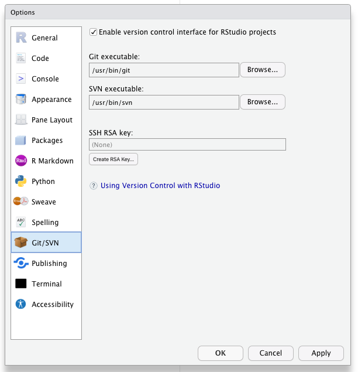
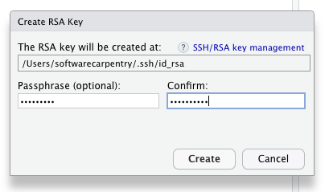
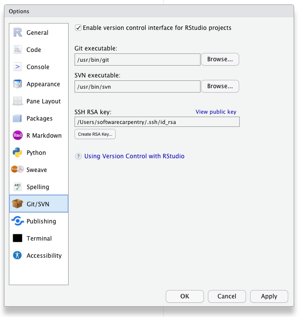
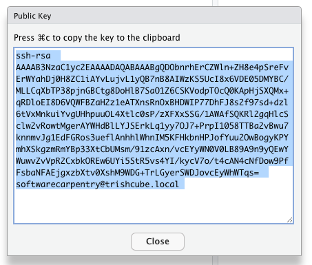
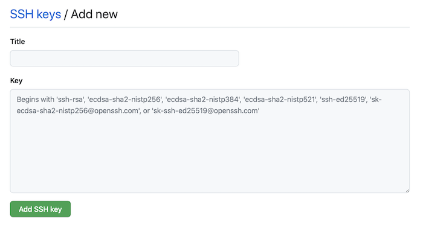

In [episode 4](../04-good-project/) we learned about using version control as you write your publication.  In this part of the workshop we'll setup Rstudio to authenticate with Github which is necessary to _push_ your changes to Github.

Terminology:  Git _Push_ and _Pull_

Definition: The process of syncronizing your local git repository with your git repository on Github (or other Git server).

Github used to allow simple Username & Password authentication but now Github requires a more secure method of authentication.  For this workshop we'll be using the SSH Key method.  If you've used SSH authentication before with some other program or service you can likely use your existing keys.  If you do not yet have a pair of SSH keys you can create them using RStudio.


1. Check for your local SSH keys.  Tools --> Global Options --> Git/SVN.  
1. If your "SSH RSA key" field is blank then you do not yet have SSH Keys and you should generate keys by clicking the "create RSA key" button.   
Set your passphrase and don't forget it.  Store your passphrase in your password manager. 
 


Click "View Public Key" in RStudio --> Tools --> Global Options --> Git/SVN and copy the public key cypher text.




Now that you have a public key you need to add it to your account on Github.

1. Login to your Github account with your web browser. [https://github.com](https://github.com)
1. If you have not yet added your Public SSH key to your Github account in "[Setting --> SSH and GPG keys](https://github.com/settings/keys)" do so.  <br><br>

Click the "New SSH Key" button in Github 

then paste it into the form.


Now you can authenticate with Github using your SSH keys.  If you want to test this you can do so on the command line with:
```
ssh -T git@github.com
```

## Checking and Setting the "Origin" for your repository.

If you forked and cloned the demonstration publication for this workshop as covered in an earlier episode then your copy of the repository should already have the "origin" set.  Once the "origin" is set you should be able to push and pull your changes to and from Github.  When you clone a repository from Github your local copy of the repository should have Github set as the "origin". 

You can check this in Rstudio --> Tools --> Project Options --> Git/SVN

 

If the "Origin" field is blank then you'll need to add it from the command line interface.
You can get the address of your repository from Github by navigating to your repository on Github.com and clicking the green "Code" button.


With that address you can complete the command 

```
git remote add origin <paste your repository address here>
```

It should looks something like this:


1. push your local repository up to git.



