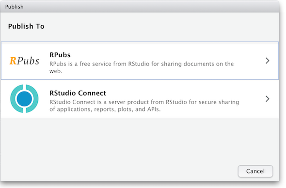
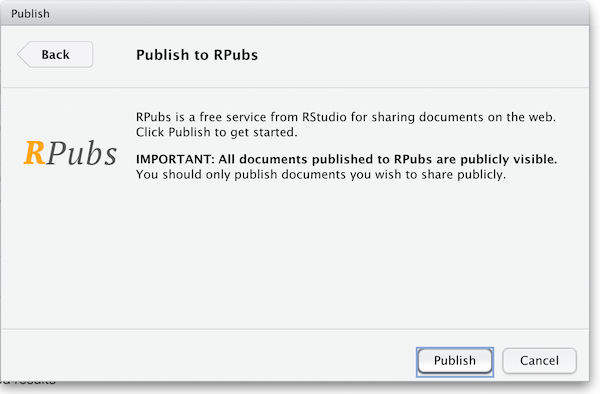

--- 
title: "Publishing your project"
teaching: 10
exercises: 0
questions:
- "What are the options for you to publish your project?"
- "What free and open publishing resources are available?"
- "What aspects should guide your choice?"

objectives:
- "Identify different ways you can publish your project."
- "Overview of some free and open resources available."
- "Learn which factors should guide your decision-making process."

keypoints:
- "You may choose to share and publish your data project before publishing its associated manuscript."
- "Sharing the code, data and documentation is necessary to allow for inspection and research reproducibility."
---

## What is Next?

Once you have completed your rmd manuscript following all the best practices for reproducibility, including organizing your project files what is next? 
The answer depends on your plans to move forward. Let's explore some scenarios:
 
### If you plan to share your insights with your community right away

#### Publishing with Rpubs 

- The easiest way would be to use [Rpubs](https://rpubs.com/) which is a publishing integrated with Rstudio. Rpubs is a bare-bones web hosting service created for the sole purpose of hosting R Markdown documents.  It provides no other services--- no support for search, collaboration, persistent identifers, or versioning.  But, it is the simplest and most direct way of getting your R Markdown document published on the web directly from RStudio.  For a more full-featured hosting service consider GitHub and GitHub Pages, described later.

Notice the "Publish" button in the upper right corner of your _Knit_ output.  Click this to publish to Rpubs.  This is where you'll need an Rpubs account as mentioned in [setup](/setup.html) 
for this workshop.  

Click the publish button 

and you'll be presented with the following panels:

(The other option in the dialog box, RStudio Connect, is a standalone publishing platform for teams to share content.  It requires purchase to host and use.)

The first time you publish, RStudio will likely ask if you want to install some needed packages; say yes.  RStudio will then open up a web browser to allow you sign in to rpubs.com.

At the end of the publish process your paper will be live on the internet 
with a URL similar to: `https://rpubs.com/yourname/678624`

RStudio also saves an HTML version of your *knit* document to your local file system.  Look for it in the *results*
directory in the same directory as the R-markdown file in your R-Studio project directory.  
This html document is self-contained and highly portable.  Images are encoded directly into the HTML so you can easily move it to any web hosting you have available.

#### Publishing as website on GitHub

Another, better, but slightly more involved option for publishing an R Markdown document on the web is to use GitHub and GitHub Pages.  It is out of the scope of this lesson to use GitHub, but briefly, GitHub is a widely-used version control and collaboration system.  RStudio has built-in support for GitHub: in the upper right panel of your RStudio window, look for the Git tab, which allows you to sync your R Markdown project with a remote repository stored on [github.com](https://github.com).  To enable publishing to GitHub Pages, go to the Settings page of your repository on GitHub and select a branch ("branch" is a repository term) to publish.  Name your main R Markdown file `index.Rmd`, and render it to HTML as `index.html`.  With GitHub Pages enabled on your repository, the HTML file in your repository at https://github.com/myusername/myrepo/index.html will appear on the web as https://myusername.github.io/.

#### Other document types

When you create a new R-markdown file in R Studio you are presented with a choice of Output Formats:

For the purposes of this workshop we're using HTML as the output format but other types are available.  You can render your R Markdown as a document, a presentation or a *Shiny* app.  With the default installation of R-Studio HTML output is most likely to work.  Other formats may require additional R packages and/or code libraries be installed on your computer.  R Studio also has a templating system to help with creating R Markdown files with common elements, YAML metadata and rendering instructions.  This can be very helpful for example if you want to create a weekly or monthly report documenting an ongoing experiment, study or other changing data.

 
### If you are willing to publish your manuscript through a peer-reviewed journal
- Most journals now request the underlying data, code and documentation to be shared along with the manuscript, so in that case you will have that handy. Whenever possible, give preference to *open-access* journals with data sharing recommendations to foster open science, transparency and research reproducibility. The [TOP Factor](https://topfactor.org/journals) allows you to search by journal title and/or discipline and will rank journals compliance with those principles. 
- If your chosen journal does not require nor recommend a particular process for making your project data available (some will dictate what, where and how project data should be uploaded), you may still consider depositing your project files in a reliable data repository and cross-reference paper and project data, ideally with a formal citation containing a [Persistent Identifier](https://www.library.ucsb.edu/sites/default/files/dls_n4_pids_navy.pdf)(e.g., DOI, ARK, handle, Pur) to avoid link rot. 
- In terms of data repositories, there are many options available, and they can be disciplinary, instituional or generalist (e.g., Zenodo, Figshare). For a compreheensive list of options available please refer to the [Registry of Research Data Repositories]([https://www.re3data.org/). At UCSB Library we support [Dryad](https://datadryad.org/stash). If Dryad is not suitable for your needs, [Research Data Services](https://www.library.ucsb.edu/research-data-services) can assist you finding a more optimal solution for archiving your project data.   
