```{r, include=FALSE}
source("../bin/chunk-options.R")
# change fig path below in ""
knitr_fig_path("05-")
```


## Using R projects and Version Control in RStudio

It's a two step process to work on a project in RStudio with version control. First step is to make sure your work is set up as an R Project. Secondly, and optionally, when you set up your project you can have the option to add versioning (or continue from an existing version-controlled project). 

## Starting an R Project

There are several options for working with R projects in RStudio. If you aren't already working in an R Project, you can create a new one. There are three options here:
1. **New Directory** - start a brand new R project .
2. **Existing Directory** - add exisiting work to a R project.
3. **Version Control** Continue an existing R project that already uses version control (i.e. download from GitHub)

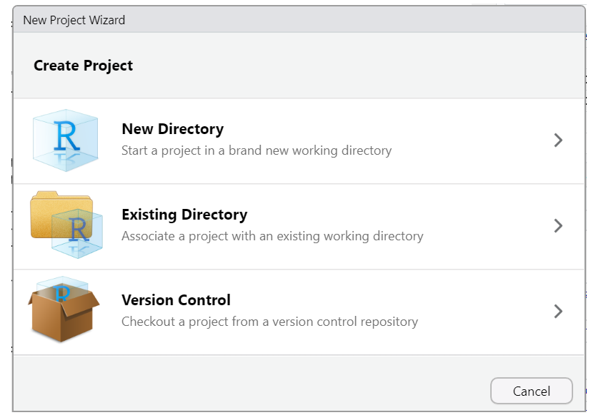

The third option would be a project already under version control but options 1 and 2 will also give you the opportunity to use or add versioning to the project. Let's see how that would work. 

### Starting a R Project with Version Control

To start an R project, you would navigate to `File > new project` rather than just `File > new file`. 

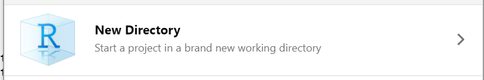

After choosing `New Directory` chose `new project` on the next menu options. 

Then, to use version control, make sure to check the box as highlighted:
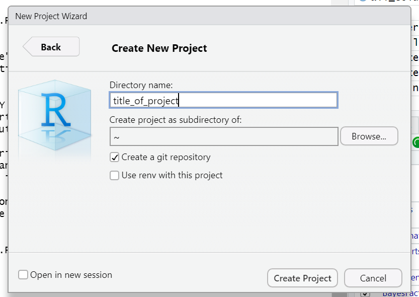

*Note when you choose directory name, it will create a new directory in the directory you specified along with an .Rproj file of the same name. Avoid spaces here. underscores "_", dashes "-" or camel case "NewProject" is the recommended way to name this directory/file.

*Optionally, check the box in the bottom left corner "Open in new session" if you want it to appear in a new RStudio window. 

### Add versioning to an existing project

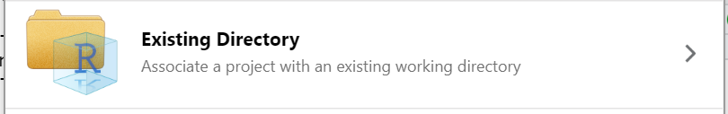

We won't take the time to cover this here, but if you've already started an R project WITHOUT version control, you have the option to add version control retrospectively. You can also add existing R files to a project and version control if you've done neither. To see a tutorial of this process,  please see [episode 14 "Using Git from RStudio" in Version Control with Git](https://swcarpentry.github.io/git-novice/14-supplemental-rstudio/index.html).

This is by far the most labor intensive way to do it, so remember to add version control at the beginning of any new project (even if you get lazy and don't end up using it).

### Continue a version-controlled project

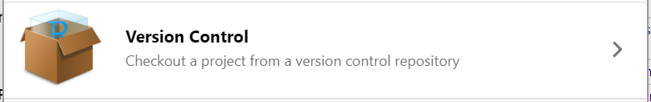
The final option is to continue a version controlled project. This is the option we will do for our workshop.

First, indicate which version control language you will be using (Subversion is another less popular language than Git)

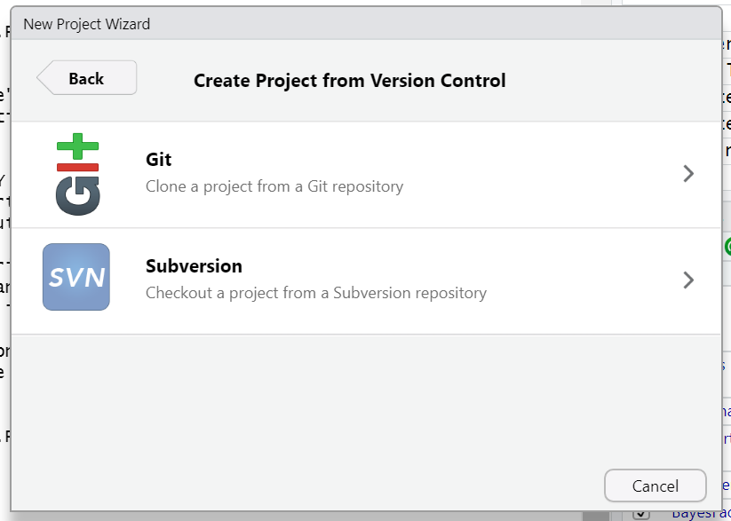

When you choose this option there will be a place to paste the url of the GitHub (or other hosting platform) url. The name of the repository will automatically populate. Just choose which directory on your computer you wish to save the project directory and your good to go!

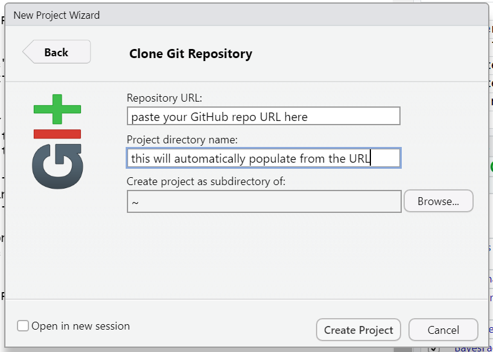

## Our turn!

We have a repository already prepared for this workshop at [https://github.com/UCSBCarpentry/R-repro-pub](https://github.com/UCSBCarpentry/R-repro-pub) We are going to use the third option to download a repository from GitHub to work hands on. 

Let’s take a second to acquaint ourselves with GitHub.

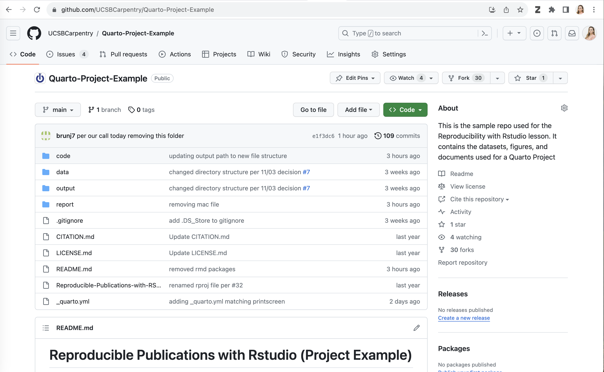

The two main sections are files and directories and the README which should contain a narrative description of the project. 

We are each going to make a copy of this repository to use for this workshop. To do so: 

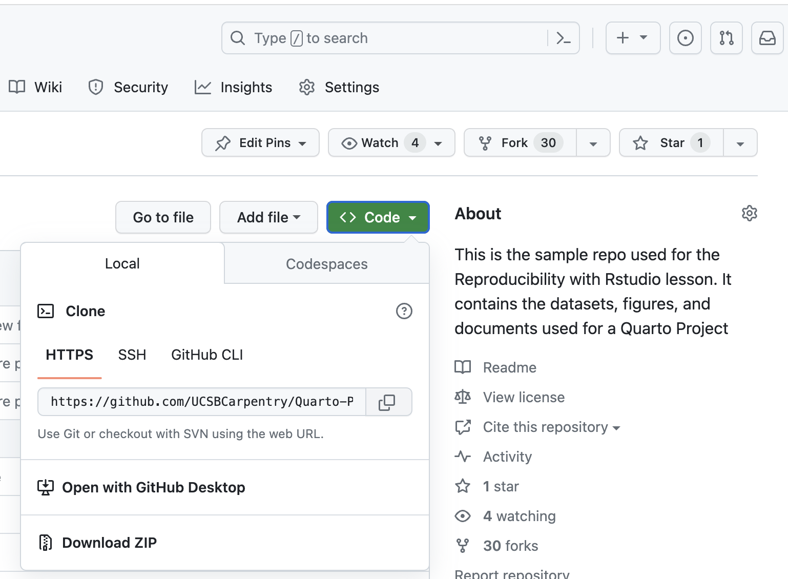

Then, in the upper right corner, click the + button next to your profile picture. Choose `import repository`.

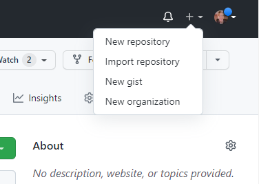

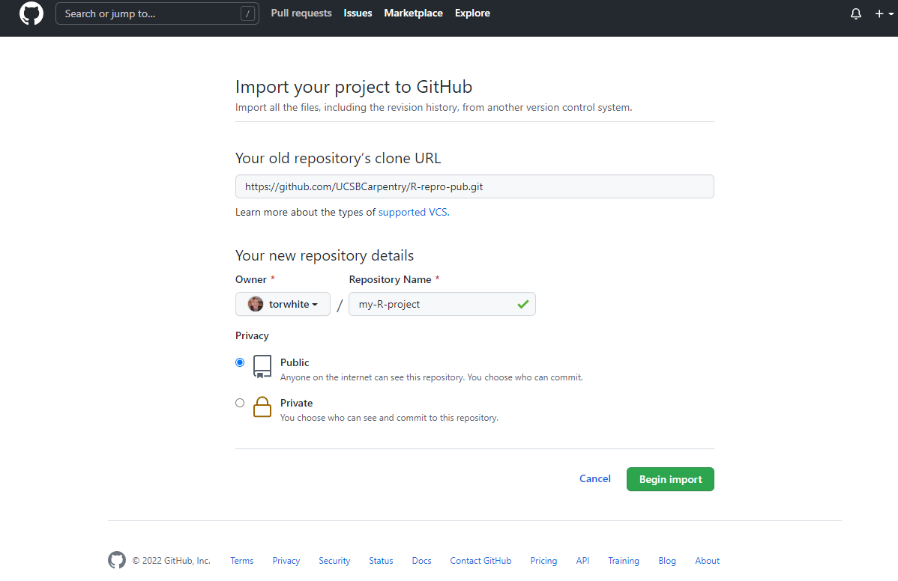

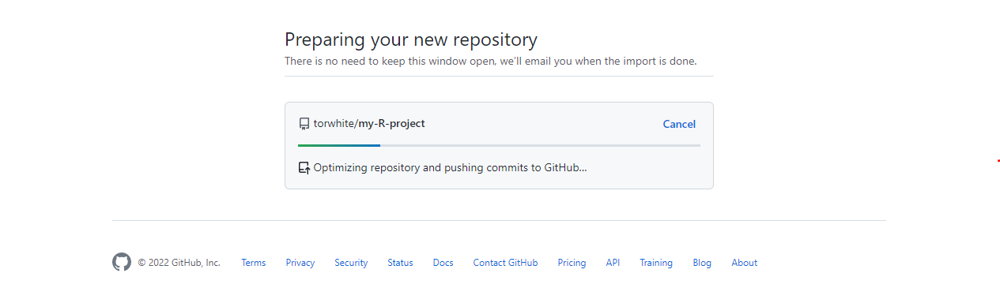

Again, click the green code button, click the copy button next to the url, and let's head back to RStudio. 

Click File>New Project > Verison Control > Git . Now paste in your url and choose "Desktop" as your directory. 

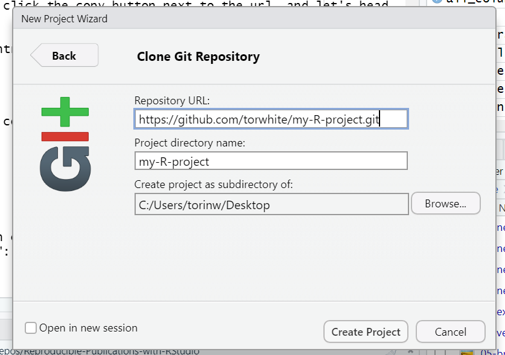


Woo hoo! We have the project we're working on for this workshop opened in RStudio and set to use version control!


Now, let's dive in to how to use version control. 

## Using Version Control in RStudio

There are two places we can interact with Git in the RStudio interface.
1. Menu bar 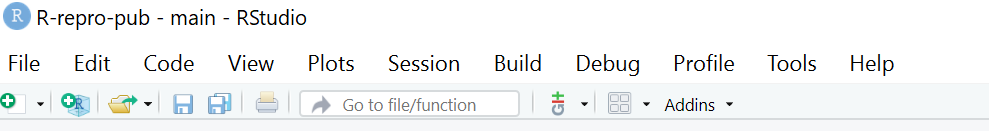
2. Environment/History pane 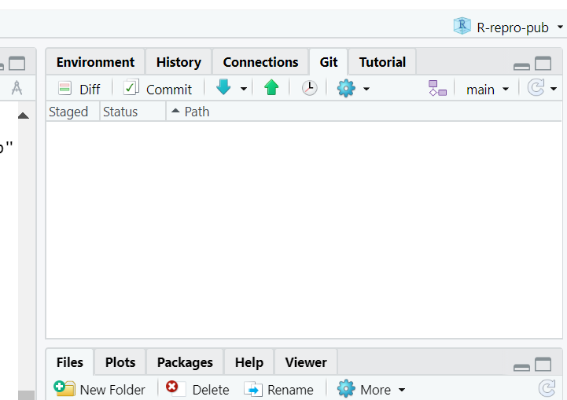

Ok, but what do all the options mean? We won't go through them all, but here are the basics to get started versioning your project.

### Git workflow

The most simple workflow for version control (working on your computer only)
is referred to as "add" and "commit": 

But what do those words even mean?

**add:** choose a file or files to take a "snapshot" of. Aka what files do you want to add to your next version save?

**Commit:** Taking a "snapshot" of a selected version of your project. The snapshot will *only* include the files you "added", typically only files that you've edited since your last commit. 

You may have a few to many commits in a single work session. 

If we are saving our work to a version control hosting cloud platform such as GitHub, 
our workflow gets a bit more complex, we add a "pull" and "push" step at the beginning and end of a work session. 

`Pull > add > commit > push`


**Pull:** *download* the most recent version of the repository *from* GitHub  
 
**Push:** *upload* the most recent version of the repository *to* GitHub

Put a pin in pulling and pushing for now. For the time being as we edit our paper we will just stick to adding and commiting. At the end we'll see how to use push to GitHub, and you can experiment with pulling later on. 

### Tips for working with Git

- You should pull each time you start working on your project after a hiatus, or before each edit if you know a team member is working at the same time. 
- Commit frequently, each commit should be a distinct set of edits which you can summarize in 50 characters or less. Don’t add a bunch of unrelated edits to the same commit, it makes it harder to look back through your “snapshots” and find the right one if you need to. 
- At the end of your work session (or more frequently if you are working at the same time as team members), “push” your commits to the remote repository - this is the only way your local changes get added to your team’s remote repository.

This pull, add, commit, push routine will become second nature. Pulling at the beginning and pushing at the end of your work session becomes a sort of ritual that marks the beginning and end of your work session. 


> ## Tip: add files that don’t need to be tracked to the .gitignore
> Such as data files, outputs, references (you want to save those, but you 
> aren’t actively making changes to them so we don’t need to “track” them through 
> version control. Mostly scripts and rmd files need tracking
{: .callout}

> ## Challenge: (optional) Add the following files to the .gitignore 
>
{: .challenge}

## Your first edit

The first edit we will make is to the yaml file of our `DataPaper-ReproducibilityWorkshop.rmd' file so we can practice this process.

In the title add "(Carpentry Workshop Version)" and make sure to save. 

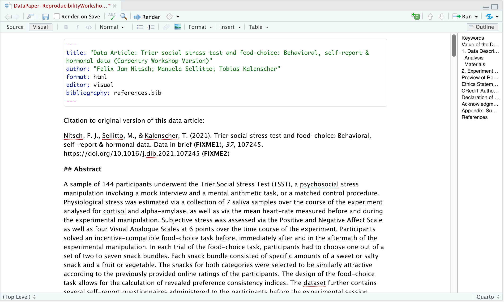

Now, in the Environment panel, toggle to the Git tab. You'll see the file that was edited with a check mark next to it. Click the check mark to "add" . Note that if you edited more than one file you could choose any or all of the documents to "add". 

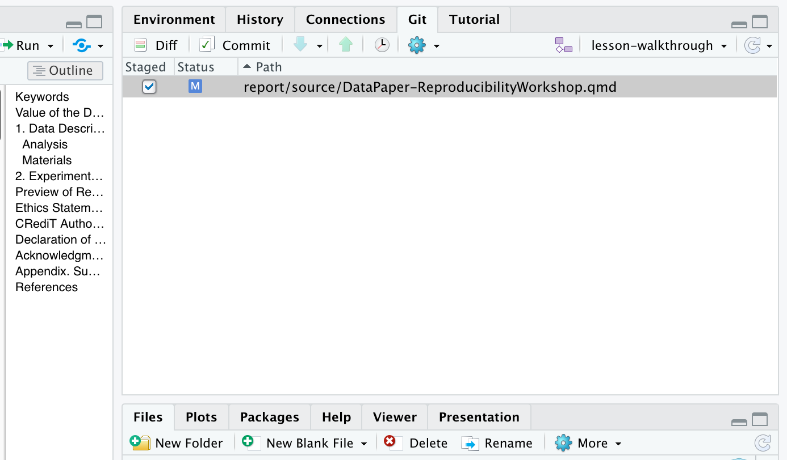

Now, click commit. A dialogue box will pop up. You'll need to add a commit message to proceed. Add something about editing the title. The difference between your files will show in the bottom panel. 

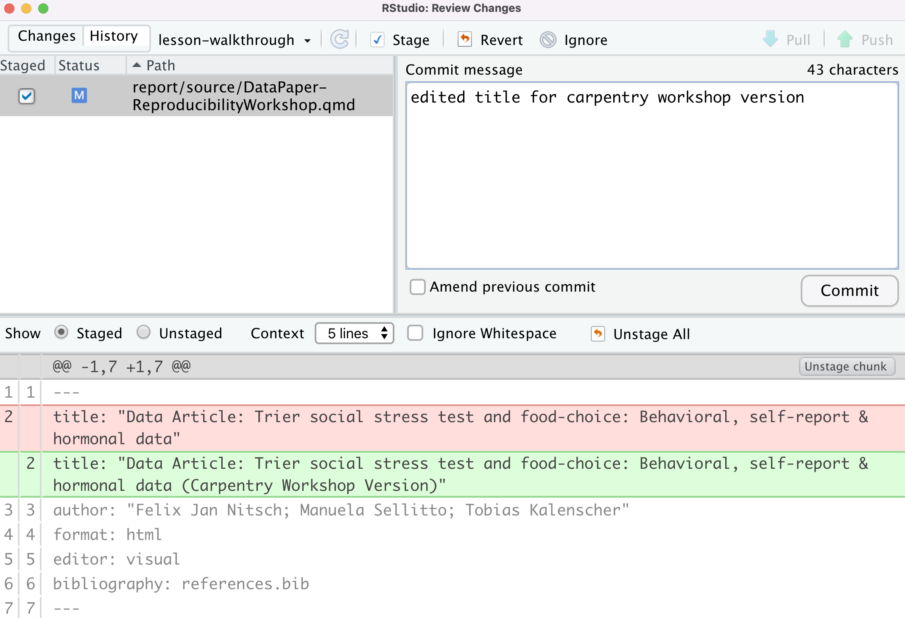

Hit commit and a dialogue box will show a completed commit.

You made your first commit!


