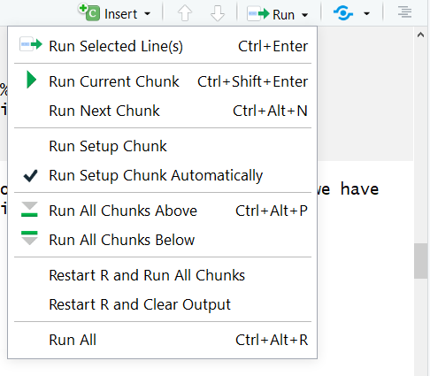

```{r, include=FALSE}
source("../bin/chunk-options.R")
knitr_fig_path("06-")
```

## What is Knitr?

Knitr is the engine in RStudio which creates the “dynamic” part of R markdown reports. It’s specifically a package that allows the integration of R code into the html, word, pdf, or LaTex document you have specified as your output for r markdown. It utilizes Literate Programming to make research more reproducible. There are two main ways to process code with Knitr in R Markdown documents:

1. Inline code
2. Code Chunks

We learned how to use inline code in the previous episode, so let’s now let’s dive into code chunks which allow us to integrate more substantial portions of code into our narrative. 

## Inserting Code Chunks

Code chunks (Yes that's RStudio's technical name for them) are better when you need to do something more sophisticated with your code than inline code, such as building plots or tables.  They also incorporate syntax which allows modifications to how that code is rendered and styled in your final output. We’ll learn more about that as we walk through the “anatomy” of a code chunk.

### Basic Anatomy of the Code Chunk

You can quickly insert chunks like these into your file with:  
- the keyboard shortcut Ctrl + Alt + I (OS X: Cmd + Option + I)  
- the Add Chunk command in the editor toolbar  
- or by typing the chunk delimiters {r} and ```.  

The most basic (and empty) code chunk looks like so:

The most basic code chunk looks like so:


Other than our backticks ``` for code chunks that surround the code top and bottom, the only **required** piece is the specified language (r) placed between the curly brackets. This indicates that the language to read the code is R.

> ## Fun fact: Other Programming Languages
> Although we will (mostly) be using R in this workshop, it’s possible to use other programming or markup languages. For example, we have seen that we can use LaTeX code for equations. You can also use python and a handful of other languages, so if R is not your preferred programming, but you like working in the RStudio environment, don’t despair! Other options for languages include: sql, julia, bash, and c, etc. It should be noted however, that some languages (like python) will require installing and loading additional packages. 
{: .callout}

## Add a Code Chunk

Ok, let's add some code! There are already some plots included in our code but as 
static images. This time, we are going to opt to add these plots as code chunks - 
which are also more reproducible and easier to update. This is because, as with our inline code, this assures that if there are any changes to the data, the plots update automatically. This also makes our life easier because when there’s a change we don’t have to re-generate plots, save them as images and then add them back in to our paper. This will potentially help prevent version errors as well! So we’re actually going to go ahead and add a few plots with code chunks.
We’ll start by typing our our starting backticks & r between curly brackets. (in your own workflow you may want to add the ending three backticks as well so you don’t forget after adding your code - it's a common mistake):


Now, let's open our `03_HR_analysis.R` script in our `code` folder. Copy the code ( you don't need to copy the last line though -- ggsave just saves a pdf version of the plot and we don't need that -- and paste it in between the two lines with backticks.

FIXME add image of HR_analysis code 

> ## Tip:
> There's actually a button you can use in the RStudio menu to generate the code chunks automatically. Automatic code chunk generation is available for several other languages as well. Also, you can use the keyboard shortcut `ctrl`+`alt`+`I` for Windows and `command`+`option`+`I` for Mac. 
> 
{: .callout}

Now, to check to make sure our code renders, we could click the "knit" button as we have been doing. However, with the code chunks we have other opportunities for rendering. 

1) Knit button - knitting will automatically run the code in all code chunks
FIXME  

2) Run from Rmd file (green play button on the right top corner)

FIXME add image of HR_analysis code (previous)

3) Run menu



4) Keyboard shortcuts: 

**Task**	| **Windows & Linux**	| **macOS**
---       |---                  |---
Run all chunks above |	Ctrl+Alt+P	| Command+Option+P
Run current chunk	| Ctrl+Alt+C	| Command+Option+C
Run current chunk	| Ctrl+Shift+Enter	| Command+Shift+Enter
Run next chunk	| Ctrl+Alt+N	| Command+Option+N
Run all chunks	| Ctrl+Alt+R	| Command+Option+R
Go to next chunk/title	| Ctrl+PgDown	| Command+PgDown
Go to previous chunk/title	| Ctrl+PgUp |	Command+PgUp

> ## Time to Knit!
> Use one of the above options to run your code. 
{: .checklist}

Hmmmm... we got an error while trying to run our code. That's because our code has a relative path to read in the data file, but now we're running the code from another document in a different directory so we will need to update the file path

Update the file path from: `"output/data/preprocessed-GARP-TSST-data.csv"` to `"../../output/data/preprocessed-GARP-TSST-data.csv"`

FIXME add image updated file path 

> ## Time to Knit!
> Let's try that again 
{: .checklist}

Ooof! That output doesn't look great.. we've got a bit more work to do.

FIXME add image of output echo=TRUE 

let's see about fixing that with code chunk rendering options. 

### Code Chunk Options

There are over 50 different code chunk options!!! Obviously we will not go over all of them, but they fall into several larger categories including: code evaluation, text output, code style, cache options, plot output and animation. We’ll talk about a few options for code evaluation, text output and plot output specifically.

Again, The chunk name is the only value other than r in the code chunk options that doesn’t require a tag (i.e. the "= VALUE" part of `option = VALUE`). So these chunk options will always require a tag whose syntax looks like:

`{r chunk-label, option = VALUE}`

the option always follows the code chunk label (don't forget to add a `,` after the label either). 


#### Some common options: 

**eval** = (logical or numeric) TRUE/FALSE to evaluate (or not) or a numeric value like c(1,3) (only evaluate expressions 1 and 3).    
**echo** =  (logical or numeric - following the same rules as above) whether to display source code or not.     
**warning** = (logical) whether to display the warnings in the output (default:TRUE). FALSE will output warnings to the console only    
**include** = (logical) whether to include the chunk output in the output document (default TRUE)   
**message** = (logical) whether or not to display messages that appear when running the code (default TRUE)
 
 
> ## CHALLENGE 9.2 - Rendering Codes
> How will some hypothetical code render given the following options?
> `{r global-chunk-challenge, eval = TRUE, include = FALSE}`
> 
>> ## SOLUTION
>> The expressions in the code chunk will be evaluated, but the outputed figures/plots will not be included in the knit document.   
>> When might you want to use this?   
>> If you need to calculate some value or do something on your dataset for a further calucation or plot, but the output is not important to be included in your paper narrative. 
> {: .solution}
{: .challenge}

> ## CHALLENGE 9.3 - add options to your code  
> Add the following options to your code:  
> echo = FALSE, message = FALSE, warning = FALSE  
> 
> What will this do?  
>> ## SOLUTION
>>     
>>
>> These options mean the source code will not be printed in the knit html document, messages from the code will not be printed in the knit html document, and warnings will not be printed in the knit html document (but will still output to the console). Plots, figures or whatever is printed by the code WILL show up in the final html document.  
> {: .solution}
{: .challenge}

### Name Your Code Chunk

While not necessary for running your code, it is better practice is to give a name to each code chunk and allows for more advanced options to work with your rmd files later on:

`{r chunk-name}`

Some things to keep in mind
- The chunk name is the only value other than r in the code chunk options that doesn’t require a tag (i.e. echo=FALSE)
- The chunk label has to be unique (i.e.you can't use the the same name for multiple chunks)

We’ll see in a bit where this code chunk label comes in handy. But, for now let's go back and give our first code chunk a name:

`{r fig-1}`

> ## Tip: Don't use spaces, periods or underscores in code chunk labels
>Try to avoid spaces, periods (.), and underscores (_) in chunk labels and paths. If you need separators, you are recommended to use hyphens (-) instead. For example, setup-options is a good label, whereas setup.options and chunk 1 are bad; fig.path = 'figures/mcmc-' is a good path for figure output, and fig.path = 'markov chain/monte carlo' is bad. See more at: https://yihui.org/knitr/options/
{: .callout}


### Caption your figure output from code chunks:

FIXME add


ADD Now Go back and add code chunk name, options, and caption to your code
Now that we’ve named and adjusted the rendering for our first plot, let’s try another, but instead of copy/pasting we will use a more elegant solution

## Run Code from an external script in a code chunk

“Source external script” https://bookdown.org/yihui/rmarkdown-cookbook/source-script.html

Problem here is that the file path is still wrong as it was with the first script, but if we’re pulling an external script we don’t want to have to go into that script and change the file path. However… we are going to let this error sit for a second while we learn about Global knitr options and a neat trick that will resolve this issue and make other settings in our paper more automated.

use this option instead so plots display correctly: https://stackoverflow.com/questions/52397430/include-code-from-an-external-r-script-run-in-display-both-code-and-output


## Global Knitr options

Benefits of global knitr options:
1) Global code chunk options
---2) Set working directory so filepaths can be relative to the root instead of our .Rmd file--- FIXME REMOVE
3) Load libraries and data once instead of in each code chunk

To set global options that apply to every chunk in your file, call we will call `knitr::opts_chunk$set()` in a new code chunk right after our yaml header (name the new code chunk `setup`.

Add to your file (with backticks):

`{r setup, echo = FALSE}
knitr::opts_chunk$set()`

### Set working directory to root:

FIXME REMOVE 

https://stackoverflow.com/questions/26994958/error-cannot-open-the-connection-in-executing-knit-html-in-rstudio 

### Global Code Chunk Options:

With our plots we set the options s for each chunk individually. However, we may end up with quite a few code chunks in our paper and it might be a lot of work to keep track of what options we’re using throughout the paper. We can automate setting options by adding a special code chunk at the beginning of the document. Then, each code chunk we add will refer to those “global” options when it runs.

Knitr will treat each option that add to this call as a global default. However, we will need to set the options for this code chunk in the first place! so we’ll use `echo = FALSE`. Then in the `()` after the `knitr::opts_chunk$set()` add the three options we used for our first code chunk.

`knitr::opts_chunk$set(echo = FALSE, message = FALSE, warning = FALSE)`

Alright! Now let’s go back and remove the options we set in the individual code chunks & since we’ve set the global options in the document instead.

> ## Tip: Overiding global options  
> What if you want most of your code chunks to render with the same options (i.e. echo = FALSE), but you just have one or two chunks that you want to tweak the options on (i.e. display code with echo = TRUE)? Good news! The global options can be overwritten on a case by case basis in each individual code chunk.
{: .callout}

> ## Time to Knit!
> Again, let's make sure our global options look right by knitting.
{: .checklist}

### Globally load data and packages

We can actually make our lives easier in one other way too. So far we've loaded the library `tidyverse` and data frame `data1` we need in the first code chunk. Now if we want to replace, say Figure 3 (which we will do next), we would load `tidyverse` and the data for Figure 3, meaning we would be loading tidyverse for a second time unnecessarily. This is because once libraries and data are loaded they are available for the rest of the rmd document.

Instead, we can load libraries and data at the beginning of our document which makes it available for all other figures or calculations and lets us avoid repetition. This also makes it easier for us to keep track of all the libraries and data we need to use in any given document. If anything needs to be tweaked, we don't need to search through every code chunk in our rmd document to make a change. 

FIXME finish editing from here on:

------------------------------------
FIXME change the following for this lesson:

```
#load libraries
#tidyverse for plots
library(tidyverse)

#load data
#data for figure 1
data1 <- read_csv("../data/figure-1-data.csv", col_types="fi")
#data for table 1
table1 <- read_csv("../data/table.csv")
```
It'll look like the following:


> ## Time to Knit!
> Make sure our code runs for Figure 1 now that we moved it around.
{: .checklist}

> ## Tip: Yaml chunk options
> We can also tweak some settings in our yaml which changes how code chunks are displayed. We're not going to get into this in the workshop, but many of the same options you set in your global code chunk settings are also configurable in the yaml. 
{: .callout}

> ## CHALLENGE 9.5 (optional) global & individual code chunk options  
>
> How would appear in our html document if we knit a code chunk with the following options?  
> `{r challenge-5, warning = TRUE, echo = TRUE}`
>
> ...considering the global chunk settings were as listed: 
> `knitr::opts_chunk$set(echo = FALSE, include = FALSE)`  
>> ## SOLUTION  
>> In this case, the global settings are set so neither the code nor the output will display. However, the individual chunk reverses the echo setting so the code will display, and it also indicates that any warnings the code renders should output too. The outputs of the code would still not be displayed (include = FALSE) The hypothetical situation for this configuration may be for debugging while writing the rmd document.   
> {: .solution}  
{: .challenge}
