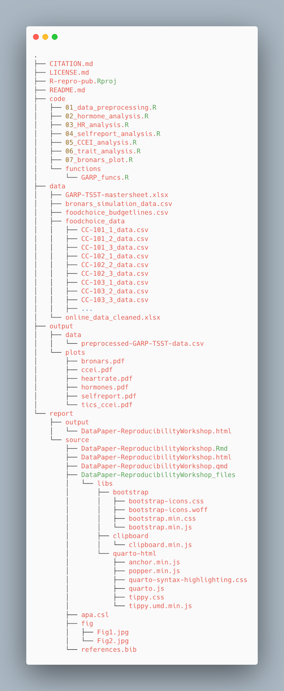

## Managing Research Projects

The ability to integrate code and narratives is a major advantage of Quarto and the RStudio 
environment, especially considering the scientific process is naturally 
incremental, and many projects start life as random notes, some code, then a 
manuscript, and eventually, everything ends up a bit mixed together. To 
complicate things further, we often work with other collaborators, lab 
members, graduate students, and faculty from the same or different institutions, 
which makes it that much more difficult to keep projects organized. When you 
throw data into the mix (sometimes huge amounts of it!), it’s integral to use 
best practices to maintain the integrity of your analysis and to be able to 
publish high-quality and reproducible research. Quarto is a powerful 
tool that can’t be fully utilized unless your project documents, scripts and 
other files are well-organized. So, let’s take a look at RStudio’s features for
managing projects and discuss some of the best practices when working with data 
and collaborators. 

## Research Project Stress Points

We often have organizational or logistical stress points in our research that 
may become breaking points, especially when it comes to working with 
collaborators, returning to a project after a hiatus, or dealing with data and 
scripts. Let’s discuss three of those common stress points:

- **File/folder disorganization**
  - You cannot find your files on your computer (or your cloud storage)
  - Multiple versions of files with names such as "finaldraft_4.txt"
  - Path issues when trying to run code 
  - Reviewers or colleagues cannot re-run your code/analyses
- **Storage and sharing issues**
  - Files are only saved to your computer and are vulnerable (or have already 
  succumbed to computer/hard drive failure
  - When working with collaborators, they (or you) don’t share the files needed
  - Files are shared via email attachments
  - Difficult to know if you have the latest version of documents
- **Losing track of project status**
  - You cannot remember where you are in a project after being away for an 
  extended period (or what you worked on the previous day...no judgment)
  - You aren’t sure what you should be working on next
  - You have various to-do notes spread across your office or home 
  (or never write them down in the first place)

> ## Discussion
> To what extent do these stress points affect your research projects? Are there
> additional issues that you’ve encountered that slow down or derail your work 
> due to issues with project management?
{: .challenge}

> ## Discussion: Antidotes
> What are some practices you implement to keep your project materials organized?
{: .challenge}

### Antidotes

A good project layout will ultimately make your life easier:
- It will help ensure the integrity of your data
- It makes it simpler to share your code with someone else (a lab mate, 
collaborator, advisor, etc.)
- It allows you to upload your code with your manuscript submission easily
- It makes picking the project back up after a break easier.
- It makes your research reproducible!

We’ll discuss three aspects of project management and then implement those 
practices for the remainder of this workshop in the RStudio environment.

1. File/Folder Organization
2. Storage & Sharing
3. Using Version Control

Then, we’ll get started on our project!

## Project File/Folder Organization
### Important principles:  

Although there is no “best” way to lay out a project, there are some general 
principles to adhere to that will make project management easier:  

#### **Practice good file-organization**  

[Good Enough Practices for Scientific Computing](http://swcarpentry.github.io/good-enough-practices-in-scientific-computing/) gives the following recommendations for project organization:  
1. Put each project in its own directory named after the project.
2. Put text documents associated with the project in the doc directory.
3. Put raw data and metadata in the data directory and files generated during cleanup and analysis in a results directory.
4. Put the source for the project’s scripts and programs in the src directory, and programs brought in from elsewhere or compiled locally in the bin directory.
5. Name all files to reflect their content or function.
6. Additionally, we'd recommend including README, LICENSE, and CITATION files! 

For the project we’re working on today, we used the following setup for folders and files:



> ## Challenge 1: Take a few minutes to look through the workshop project files
> 
> Please take some time to look through the project files. Either the screenshot above or you may browse the files on GitHub at <[https://github.com/UCSBCarpentry/Quarto-Project-Example](https://github.com/UCSBCarpentry/Quarto-Project-Example)>. What do each of the directories (folders) contain? What is their purpose? 
> 
> See the solution drop-down for an explanation of each directory's contents.
>
> > ## Solution:
> > 
> > - **code:** contains the scripts that generate the plots and analysis (found in `output/`)  
> >    - **/functions:** contains custom functions written for the data pre-processing  
> >- **data:** This folder contains the raw and cleaned data files  
> >    - **/processed:** contains a CSV file produced by the `data_preprocessing.R` script.
> >    - **/raw:** contains the individual data files from food choice trials  
> > - **output:** contains all plots generated by the plot scripts in the code folder  
> > - **report:** all files needed for the publication of the research project, including:  
> > 	            - .qmd file for the paper and additional files needed for rendering the paper  
> >               - images created specifically (not through the analysis scripts) for the paper
> > - **CITATION.md:** directions to cite the project.
> > - **LICENSE.md:** instructions on reusing the project or any components. 
> > - **README.md:** a detailed project description with all collaborators listed.
> > - **Reproducible-Publications-with-RStudio-Example.Rproj:** the R project file that lives in the root directory and is used by R-Studio to keep track of the project.
>> - **_quarto.yml:** the quarto project configuration file that allows users to specify various settings and options for their Quarto projects. We will learn more about it when we cover more advanced topics.
> >
> {: .solution}
{: .challenge}

#### **Practice good file-naming**  

The three principles of file naming are: 

1. Machine-readable  
- Friendly for searching (using regular expressions/globbing)  
    - No spaces, unsupported punctuation, accented characters, or case-sensitive file names  
- Friendly for computing  
  - Deliberate use of delimiters (i.e., for splitting file names)  
    - `data-analyses-fig1.R` with `-` used consistently as a separator   
  
2. Human-readable  
- Name contains a brief description of the content  
- Borrow from clean URL practices:  
  - "slug," i.e., the part of a URL that is human-readable     
    - i.e. `data-analyses-fig1.R`   
  
3. Plays nice with default ordering   
  - Use chronological or logical order:  
    - **chronological**: filename starts with a date.   
      - i.e. `2022-01-01_data_analyses.R`  
      - Use [ISO 8601 date standard](https://en.wikipedia.org/wiki/ISO_8601)  
    - **logical**: filename starts with a number or keyword/number combo.   
      - i.e. `CC-101_1_data.csv` 
      - i.e. `CC-101_2_data.csv`
   
Adapted from [https://datacarpentry.org/rr-organization1/01-file-naming/index.html](https://datacarpentry.org/rr-organization1/01-file-naming/index.html). For more tips on file naming, check: [The Dos and Don'ts of File Naming](https://www.library.ucsb.edu/sites/default/files/dls-n01-2021-filenaming.pdf).

> ## Challenge 2: File name syntax
> 
> Given the filename `CC-101_1_data.csv` and `2022-01-01_data_analyses.R`, why does it make sense to use both `-` and `_` as delimiters/separators?
> 
> > ## Solution:
> > In `CC-101_1_data.csv`, the `-` is used as part of the keyword shared between several files. the `_` separates it from the trial number and description. If one were to split the filename on the `_`, the keyword would be maintained, and the trial number would be separated out. 
> > In the `2022-01-01_data_analyses.R`, the dash character `-` is used for a date delimiter between year, month, and day. The underscore character `_` is used between the words. This allows us to split on underscore `_`, which would preserve the date (separate from other file info).
> > 
> > It's good to strategize on the best way to name files to anticipate future uses of the information contained within the filename.
> {: .solution}
{: .challenge}

#### **Use relative paths**  
This goes hand-in-hand with keeping your project within one “root” directory. If you use complete paths to, say, read your data to RStudio and then share your code with a collaborator, they won’t be able to run it because the complete path you used is unique to your system, and they will receive an error that the file is not found. That is why one should always use relative paths to link to other files in the project, i.e., “Where is my data file in relation to the script I’m reading the data into?”. The practice of using relative paths is made easier by having a directory set up and keeping all project files within one root project folder. 

Assuming your R script is in a `code` directory and your data file is in a `data` directory, then an example of a relative path to read your data would be:

```
df <- read.csv("../data/foodchoice_budgetlines.csv")
```

Whereas a complete path might look like:

Windows: 

```
df <- read.csv("C:/Users/wilma/Desktop/project23/data/foodchoice_budgetlines.csv")
```

If the example were on a Mac or Linux computer, you would have `home` instead of `C:`   


In the complete path example, you can see that the code is not going to be portable. If someone other than Wilma Flintstone wanted to run the R script, they would have to alter the path to match their system.

> ## Challenge 3: Relative Paths
> 
> What would be the relative path needed to refer to the file `bronars_simulation_data.csv` (located in the raw directory) from `R-repro-pub.Rproj` (root directory). And what about the inversed relative path?
>
> > ## Solution:
> >
> > `R-repro-pub.Rproj` to `bronars_simulation_data.csv`
> > "data/raw/bronars_simulation_data.csv"
> >
> > `bronars_simulation_data.csv`to `R-repro-pub.Rproj`
> > "../.."
> > ".." directs back to the directory that contains the directory of the file of interest.
> >
> {: .solution}
{: .challenge}

> ## Tip: Level up your relative paths
> We just discussed how relative paths are a better practice when coding because we can guarantee our code will work on somebody else's system. However, relative paths can still be quite confusing to deal with, especially when you have many sub-directories in your project. One way to make things a bit easier on ourselves is to make sure the part that's *relative* to what we're referencing is always the same. 
> This is where using the `RStudio Project` can help. When you create a Project in RStudio, in the background, RStudio will automatically create a “root” folder and set it as your working directory in R. Since in R relative paths are relative to your working directory, this will ease referring to external input or output files (data, images, plots, ...) in a consistent manner across your project by always having your relative paths relative to the top level folder and help to encapsulate your work within this folder. So with an Rproject setup, the relative path in the previous example will now be:

```
df <- read.csv("data/foodchoice_budgetlines.csv")
```

In the end, this means you can move this folder around on your machine or to another machine, and all the paths will still be valid.

{: .callout}

#### **Treat data as read-only**  
This is probably the most important goal of setting up a project. Data is typically time-consuming and/or expensive to collect. Working with them interactively (e.g., in Excel or R) and where they can be modified means you are never sure of where the data came from or how it has been modified since collection. Therefore, treating your data as "read-only" is a good idea. However, in many cases, your data will be “dirty”: it will need significant preprocessing to get into a format R (or any other programming language) will find useful. Storing these cleaning scripts in a separate folder (e.g., code) and creating a second data folder to hold the "cleaned" data sets can prevent confusion between the two sets. You should have separate folders for each: raw data, code, and output data/analyses. You wouldn’t mix your clean laundry with your dirty laundry, right?  

#### **Treat generated output as disposable**
Anything generated by your scripts should be treated as disposable: it should all be able to be regenerated from your scripts (and the raw data).
There are lots of different ways to manage this output. Having an output folder with different sub-directories for each separate analysis makes it easier later. Since many analyses are exploratory and aren’t used in the final project, some of the analyses get shared between projects.  

#### **Include a README file**
For more information about the README file and a customizable template, check this [handout](https://www.library.ucsb.edu/sites/default/files/dls-n03-2021-readme-navy.pdf). Make sure to include citation and license information both for your data [see creative commons license]([https://creativecommons.org/licenses/) and software ([see license types on Github](https://docs.github.com/en/repositories/managing-your-repositorys-settings-and-features/customizing-your-repository/licensing-a-repository)). This information will be critical for others to reuse and correctly attribute your work. You may also consider adding a separate citation and license file to your project folder. 

Again, there are no hard and fast rules here, but remember, keeping your raw data files separate is important to ensure they don’t get overwritten after you use a script to clean your data. It’s also very helpful to keep the different files generated by your analysis organized in a folder.

*what’s this `.Rproj` file? We’ll explain in a bit.


## Storage and Sharing

### Backup your work

Having a solid backup plan in case of emergencies (say, your hard drive on your computer fails) is essential. The general guideline for backups is to adhere to the [3-2-1 principle](https://www.uschamber.com/co/run/technology/3-2-1-backup-rule), which dictates that you should have 3 copies on 2 different media, with 1 copy offsite. Your decision on backups will be based on your own personal tolerance, but we recommend, at minimum, avoiding only having a copy of your project on your personal, work computer, or lab computer at all costs. 

At the very least, you should back up your project in cloud storage (either provided by your university or paid for yourself). Common cloud storage platforms include Google Drive, Box, OneDrive, Dropbox, etc. Backing up a project on a local device to cloud storage allows you to meet two of the 3-2-1 criteria (2 different media and 1 offsite). If you're working with at least one collaborator, and they also keep an up-to-date copy of the project on their computer, you're set!

### Version Control hosting services 

If your research project involves code, the best way to make sure you have your work backed up AND keep track of your code is to use a version control hosting service such as GitHub. Note that out-of-the-box Git and, thus, GitHub are not optimized to handle large files, and therefore, we do not recommend using these tools to version data beyond maybe small data sets in a text-based format such as CSV files.

The main three version control hosting services are GitHub, GitLab, and BitBucket. To see a comparison of the available options, see this comparison on [LinkedIn](https://www.linkedin.com/pulse/demystifying-git-vs-github-atlassian-bitbucket-gitlab-pawan-verma?trk=read_related_article-card_title.)  

We will proceed using GitHub because it is the most used version control platform to date. 

## Using Version Control

Okay, let’s talk about implementing version control in your project through RStudio! But first… let's quickly clarify the difference between Git and GitHub. We already said that GitHub is the version control hosting platform. Git is the version control system and does not **have** to be used with GitHub. You can use Git and then host your code on Bitbucket, for example, or save it to your Google Drive. In fact, you can use Git on your local system only and never save it to a cloud storage platform. However, version control hosting platforms such as GitHub enhance the benefits of version control and offer incredible collaboration features. The difference between the two can be a bit confusing because they are so often used together, but the more you use them, the more it will make sense. Soon enough, you'll be wondering how you even completed a code project without version control.

There are actually many ways to use Git; you could use it on GitHub only (though that suffers from a lack of options and is a bit clunky), there is a Desktop interface, and many serious programmers use it on the command line. HOWEVER, RStudio has Git controls built in, so we'll use it all in one place!

## Project Environments in R

Environments are a rather advanced topic in programming, but we will introduce some capabilities for projects in R that increase the reproducibility of your code. Essentially, a project environment allows us to save (or take a snapshot) of our R version and dependencies - aka what packages/package versions are required to run our code without error. This can be important when collaborating with others, and you may be unsure whether you are working with the same R and package versions. Another common issue is if you try to run very old code from a previous project - the older the code, the more likely errors will crop up, or the code will no longer run as it used to. To take advantage of project environments, we will use a package called `renv`, the successor of `packrat`, which used to be the de facto package in R for managing environments. 

However, as noted in this [RStudio article on renv](https://rstudio.github.io/renv/articles/renv.html), using `renv` does not automatically make your project reproducible, nor is it bullet-proof. Sometimes, other factors come into play that may alter the results of your code despite using `renv`, such as operating systems,  compilers, etc. Many use 'containers' such as Docker or Kubernetes to go one step further in assuring reproducibility. However, that is beyond the scope of this workshop.

Later on this workshop we will cover dependencies and how one can implement project environments with `renv` to increase reproducibility with R projects.

Before we use Git and environments in the RStudio project, we must be working on an R Project, so let's talk about how R Projects work in RStudio.

### Working in RStudio & Quarto Projects

#### RStudio Project

As mentioned earlier, one of the most powerful and useful aspects of RStudio is its project management functionality. We’ll be using an RStudio project today to complement our Quarto document and bundle all the files needed for our paper into one self-contained, reproducible bundle. An `.Rproj` file helps keep your R scripts, data, and other files together - just navigate through your file system to get to your project directory and double-click on the .Rproj file. The added benefit is that the .RProj file will automatically open RStudio and start your R session in the same directory as the `.Rproj` file and remember exactly where you left off. The .RProj file offers a powerful way to stay organized on their own, but it also unlocks the additional benefit of being able to use Git within RStudio. 

#### Quarto Projects

Perhaps, confusing, but we have an additional "type" of project in the RStudio ecosystem called a Quarto project. Thankfully, we don't necessarily have to pick between using RStudio and Quarto projects because a Quarto project is just an RStudio project - with some additional capabilities. That addition is enhanced project and style controls in the form of a YAML file called `_quarto.yml`. To keep things simple, if you are going to use Quarto documents, use Quarto Projects; if you aren't, stick to an R project. And no worries, you can always add a `_quarto.yml` file if you have just an RStudio Project which can retroactively turn your project into a Quarto project. We will see how to create a Quarto project further in this workshop. 

> ## Challenge 4: R Project in “root” folder
> `.Rproj` files must be at the top level of the root directory of your project folder/directory. What is the root directory again? Tip: Look back at the relative paths intro.  
{: .challenge}
