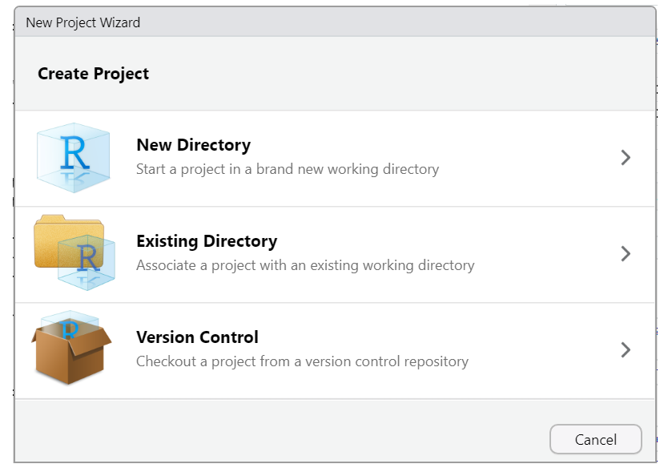
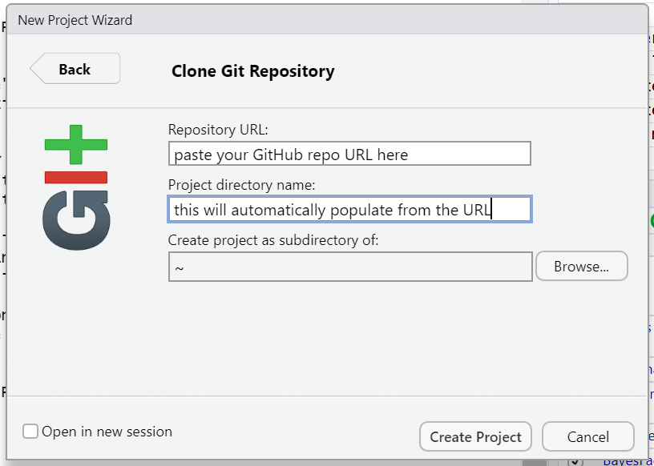
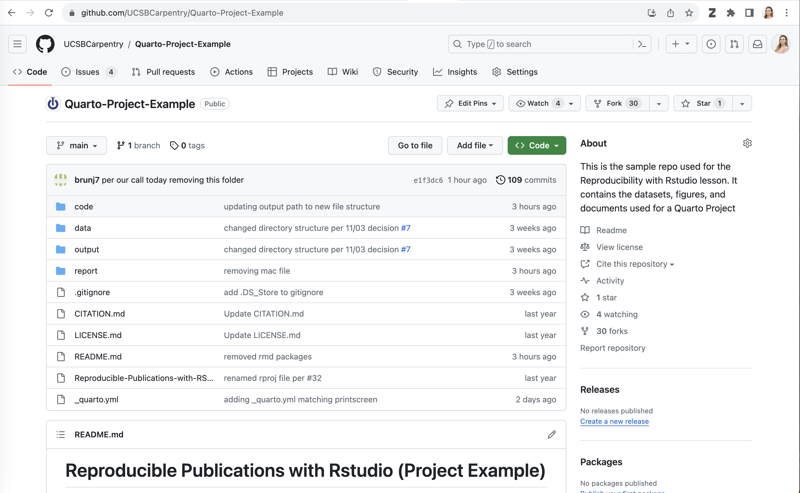
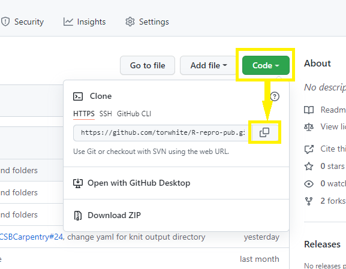

## Using RStudio projects and Version Control in RStudio

Using version control is a powerful feature to make your research more reproducible and better organized. In order to use versioning while working in RStudio the first step is to make sure your work is set up as an R Project, because you may not use the versioning features in RStudio without one. There are three options for doing this depending on your given scenario.

## Three Methods of Setting up an RStudio Project with version control

There are several options for working with RStudio projects and enabling version control. If you aren't already working in an R Project, you can create a new one. There are three options here:

1. **New Directory** - start a brand new RStudio project (with the option of version control).
2. **Existing Directory** - add existing work to a RStudio project (with the option of setting up version control).
3. **Version Control** Continue an existing RStudio project that already uses version control (i.e. download it from GitHub).



<br>

_Of course if an existing RStudio project is already under version control, then opening the project will be the only thing you need to do!_


Let's see how this setup would work.

---

### Starting a R Project with Version Control 
#### Method #1

To start an R project, you would navigate to `File > new project` rather than just `File > new file`.


After choosing `New Directory` chose `new project` on the next menu options.

Then, to use version control, make sure to check the "_Create a git repository_" box as highlighted in this screen shot:


*Note when you choose directory name, it will create a new directory in the directory you specified along with an .Rproj file of the same name. Avoid spaces here. underscores "_", dashes "-" or camel case "NewProject" is the recommended way to name this directory/file.

*Optionally, check the box in the bottom left corner "Open in new session" if you want it to appear in a new RStudio window.

---

### Add versioning to an existing project
#### Method #2


We won't take the time to cover this here, but if you've already started a Quarto project WITHOUT version control, you have the option to add version control retrospectively. You can also add existing R files to a project and setup version control if you've done neither. To see a tutorial of this process,  please see [episode 14 "Using Git from RStudio" in Version Control with Git](https://swcarpentry.github.io/git-novice/14-supplemental-rstudio/index.html).

This is by far the most labor intensive way to do it, so remember to add version control at the beginning of any new project.

---

### Continue a version-controlled project
#### Method #3


The final option is to continue a version controlled project. This is the option we will do for our workshop.

First, indicate which version control language you will be using (Subversion is another version control system, though less popular than Git)


When you choose this option there will be a place to paste the url of the GitHub (or other hosting platform) url. The name of the repository will automatically populate. Just choose which directory on your computer you wish to save the project directory and your good to go!




> ## Our turn!
>
> We have a repository already prepared for this workshop at [https://github.com/UCSBCarpentry/Quarto-Project-Example](https://github.com/UCSBCarpentry/Quarto-Project-Example). 
> We are going to use the third option to download this repository from GitHub and work with it hands on. You will need this repo in your working environment if you would like to follow along through this workshop.
> Let’s take a second to acquaint ourselves with GitHub. [At this link](https://github.com/signup), you may sign into your GitHub account or create one if you have not already.
> {: .source}
{: .prereq}




The two main sections are files and directories and the README which should contain a narrative description of the project.

We are each going to make a copy of this repository to use for this workshop. To do so we will do what's called "forking" on GitHub. A Fork is a copy of a repository that you get to experiment with without disrupting the original project.

On Github in the upper right hand corner of the repository, click on the button that says "Fork" - see highlighted example below:


If you are a member of any organizations on GitHub, you will be asked whether you want to fork to your account or to an organization. Choose your personal account for this workshop.  GitHub will process for a few moments and voila! You have your own copy of the workshop example repository.

Now, click on the green `Code` drop-down and then click on the copy icon next to the repository url:



Now, let's return to RStudio:

Click `File > New Project > Version Control > Git`.

So back to the url you copied from GitHub. Navigate again to `File > New Project > Version Control > Git`. Paste in your url and click the "Create Project" button.


Now you have cloned a copy of your git repo from Github to your working environment.  

If you're working in the JupyterHub environment you will need to configure Git with your name and email before you'll be able to commit the changes you make during this workshop.  Substitute your name and email address in the commands below and paste them into the Terminal panel of RStudio.

```
git config --global user.email "you@example.com"
git config --global user.name "Your Name"
```


Woo hoo! We have the project we're working on for this workshop opened in RStudio and set to use version control!

> ## Git not detected on system path
> 
> If you are using Git for the first time in RStudio at this point you may be getting a notification that Git isn't set up to work with RStudio.
>
> See the solution below:
> > ## Solution: 
> > 
> >
> > To set it up we need to go to Tools > Global Options
> > 
> >
> > First, make sure "Enable version control interface for RStudio projects" is checked. Next, you must make sure that the Git executable path is correct.
> > For macs, more than likely the path will have automatically populated. In all likelihood that path is `/usr/bin/git`. Windows users may find that the correct path is also pre-populated, but it is likely that you may need to manually add it by clicking "browse". More than likely your path will be something like `C:/Program Files/Git/bin/git.exe`. If not, search for where Git for Windows was installed (Git) go into the bin folder and select the 'git.exe` file.
> > 
> > Ok! Now that we set that up (by the way, this is a one time set up -it will work now for all future projects in RStudio on your device), we should be able to open our project from GitHub in RStudio.
> {: .solution}
{: .callout}
