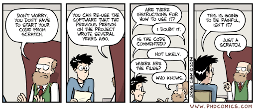
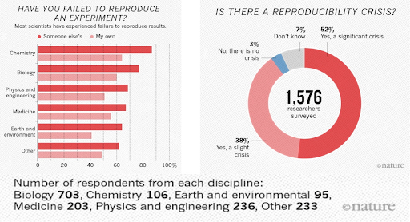
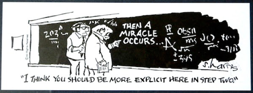
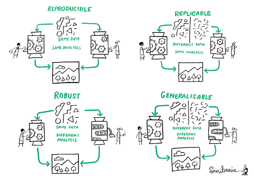
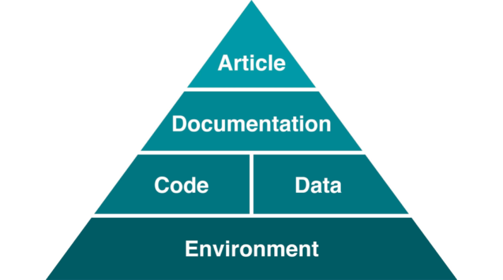

## Warm-up

Let's get into breakout rooms and discuss:
What is reproducible research for you?
Have you ever experienced issues while trying to reproduce someone else's study or even your own research?

Reproducible studies allow other researchers to perform the same processes and analyses to produce an identical result as the first initial researcher. Original researchers have to make available the study’s associated data, documentation, and code pipelines and workflows in a way that is sufficiently self-explanatory and well-documented so that independent investigators can reproduce/recreate the original study under the same conditions, using identical materials and procedures, and ultimately achieve consistent results and render equal outcomes. Original investigators, therefore, must produce rich and detailed documentation for themselves and others. This includes fully specifying both in human-readable and computer-executable ways all steps taken in the study.

## The importance of Reproducibility in Research

>Source: Comic number [1869](https://phdcomics.com/comics.php?f=1689) from [PhD Comics](https://phdcomics.com/) Copyrighted artwork by Jorge Cham.

### Discussion: A scary anecdote

* A group of researchers obtain great results and submit their work to a high-profile journal.
* Reviewers ask for new figures and additional analysis.
* The researchers start working on revisions and generate modified figures, but find inconsistencies with old figures.
* The researchers can’t find some of the data they used to generate the original results, and can’t figure out which parameters they used when running their analyses.
* The manuscript is still languishing in the drawer…

According to the [U.S. National Science Foundation (NSF)](https://www.nsf.gov/sbe/AC_Materials/SBE_Robust_and_Reliable_Research_Report.pdf)subcommittee on replicability in science (2015):

Science should routinely evaluate the reproducibility of findings that enjoy a prominent role in the published literature. To make reproduction possible, efficient, and informative, researchers should sufficiently document the details of the procedures used to collect data, to convert observations into analyzable data, and to perform data analysis.

Reproducibility refers to the ability of a researcher to duplicate the results of a prior study using the same materials as were used by the original investigator. That is, a second researcher might use the same raw data to build the same analysis files and implement the same statistical analysis in an attempt to yield the same results. Reproducibility is a minimum necessary condition for a finding to be considered rigorous, believable and informative.

### Why all the talk about reproducible research?

A 2016 survey in Nature revealed that irreproducible experiments are a problem across all domains of science:

>Source: Baker, M. 1,500 scientists lift the lid on reproducibility. Nature 533, 452–454 (2016). [doi.org/10.1038/533452a](https://doi.org/10.1038/533452a)

## Factors behind irreproducible research

>Source: Then a Miracle Occurs. Copyrighted artwork by Sydney Harris Inc. 

* Not enough documentation on how experiment is conducted and data is generated
* Data used to generate original results unavailable
* Software used to generate original results unavailable
* Difficult to recreate software environment (libraries, versions) used to generate original results
* Difficult to rerun the computational steps

### Reproducible, replicable, robust, generalizable

While reproducibility is the minimum requirement and can be solved with “good enough” computational practices, replicability/robustness/generalizability of scientific findings are an even greater concern involving research misconduct, questionable research practices (p-hacking, HARKing, cherry-picking), sloppy methods, and other conscious and unconscious biases.

>Source: This image was created by Scriberia for The Turing Way community DOI: [10.5281/zenodo.3
332807](https://doi.org/10.5281/zenodo.3695300)

If contributing to science and other researchers seems not to be compelling enough, here are 5 selfish reasons to work reproducibly according to Markowetz (2015):

* Helps to avoid data loss and disaster
* Makes it easier to write papers
* Helps reviewers see it your way
* Enables continuity of your work
* Helps to build your reputation

### When do you need to worry about reproducibility?

Let’s assume that I have convinced you that reproducibility and transparency are in your own best interest. Then what is the best time to worry about it?

From day one, and throughout the whole research life cycle! Before you start the project because you might have to learn tools like R or Git. While you do the analysis because if you wait too long you might lose a lot of time trying to remember what you did two months ago. When you write the paper because you want your numbers, tables, and figures to be up-to-date. When you co-author a paper, because you want to make sure that the analyses presented in a paper with your name on are sound. When you review a paper, because you can’t judge the results if you don’t know how the authors got there.

### Levels of Reproducibility

<figure>

</figure>

<!--{width=50%}-->

A published article is like the top of a pyramid, meaning that a reproducible paper/report rests on multiple levels that each contributes to its reproducibility.

## Advantages of using RStudio for your project

RStudio is an integrated development environment (IDE) for R. It includes a console, syntax-highlighting editor that supports direct code execution, as well as tools for plotting, history, debugging, collaboration, and workspace management.

### Creates documents using R Markdown

R Markdown is a variant of Markdown, a system for writing simple, readable text that is easily converted to html which allows you to write using an easy-to-read, easy-to-write plain text format.

R Markdown belongs to the field of literate programming which is about weaving text and source code into a single document to make it easy to create reproducible web-based reports. Markdown is a simple formatting syntax for authoring HTML, PDF, and MS Word documents and much, much more. R Markdown provides the flexibility of Markdown with the implementation of R input and output. For more details on using R Markdown check [http://rmarkdown.rstudio.com](http://rmarkdown.rstudio.com).

The idea of literate programming shines some light on this dark area of science. This is an idea from Donald Knuth where you combine your text with your code output to create a document. This is a blend of your literature (text), and your programming (code), to create something that you can read from top to bottom. Imagine your paper - the introduction, methods, results, discussion, and conclusion, and all the bits of code that make each section. With R Markdown, you can see all the pieces of your data analysis altogether.

You can include both text and code to execute. It is a convenient tool for reproducible and dynamic reports with R! With R Markdown, you are able to:

1. Keep an eye on text (the paper) AND the source code. These computational steps are essential to ensure computational reproducibility.
2. Conduct the entire analysis pipeline in an R Markdown document: data (pre-)processing, analysis, outputs, visualization.
3. Apply a formatting syntax that is part of the R ecosystem and supports LaTeX.
4. Combine text written in Markdown and source code written in R (and other languages).
5. Easily share R Markdown documents with colleagues, as supplemental material, or as the paper under review. Thanks to the package knitr, others can execute the document with a single click and receive, for example, HTML or PDF renderings.
6. Get figures automatically updated if you change the underlying parameters in the code. The error-prone task of exporting figures and uploading the right figure version to another platform is thus not needed anymore.
7. Since Markdown is a text-based format, you can also use versioning control with Git.
8. If you do not make any changes to the document after creating the output document, you can be sure that the paper was executable at least at the time of submission.
9. Refer to the corresponding code lines in the methodology section making it unnecessary to use pseudocode, high-level textual descriptions, or just too many words to describe the computational analysis.
10. Use packages such as rticles to use templates from publishers and create submission-ready documents.

### Integrates with Collaboration and Publishing Tools

Another great advantage of using Rstudio for your R project is that the platform integrates with [GitHub](https://github.com). Once you connect RStudio with your GitHub account a remote repo becomes the “upstream” remote for your local repo. In essence, it enables you push and pull commits to GitHub allowing more seamless collaboration and more effective version control. RStudio also connects with [Rpubs](https://rpubs.com/) for easy R project web publishing.  

## Some Real-world Applications

Finally, three real-world examples that motivated the authors of this lesson to value and use R Markdown:

1. Greg Janee quickly put together a simple but compelling R Markdown document describing his [survey results](https://gjanee.github.io/name-survey/).  The ease with which he created his plots is a testament to the power of R as a data analysis environment, but the ease with which he was able to publish a page on the web is a testament to R Markdown and Github as a publishing environment. Notice that he did *not* have to: create plots in a tool and then export the plots as images; write any HTML; embed plot images in HTML; or create a site under Wordpress or other web hosting service.  Instead, he directly published his R code as he wrote it, and using GitHub, made it appear on the web with a button click.

2. One of us wanted to create a short document that included some math formulas. The LaTeX document preparation can be used for this, but it is difficult to use and is overkill for just a few formulas in otherwise plain text. R Markdown lets you use just the best part of LaTeX---math formatting---while letting you write your text in a user-friendly way.

3. In this lesson we will be constructing a scientific paper that is based on an actual *Nature* publication and attendant survey and data.  In trying to recreate the plots the original authors created, we found it difficult and time-consuming to figure out exactly how the authors created their plots.  Out of the many columns in their data, many with similar-sounding names, which did they use?  How did they handle missing data?  Exactly what operations did they perform to compute aggregate values?  How much easier it would have been if they had published the code they used along with their paper. R Markdown allows you to do this.

Our goal is that by the end of this workshop you will be able to create a reproducible report. This template is a short and adapted version of the data paper referenced below:

Nitsch, F. J., Sellitto, M., & Kalenscher, T. (2021). Trier social stress test and food-choice: Behavioral, self-report & hormonal data. *Data in brief*, 37, 107245. [https://doi.org/10.1016/j.dib.2021.107245](https://doi.org/10.1016/j.dib.2021.107245)

This template is used exclusively for instruction purposes with permission from the authors.
