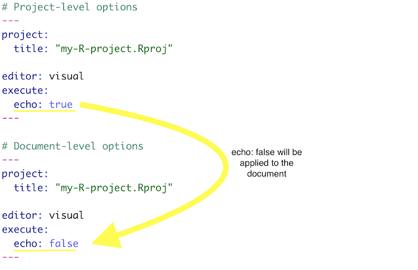
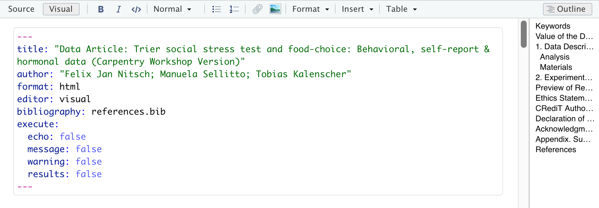
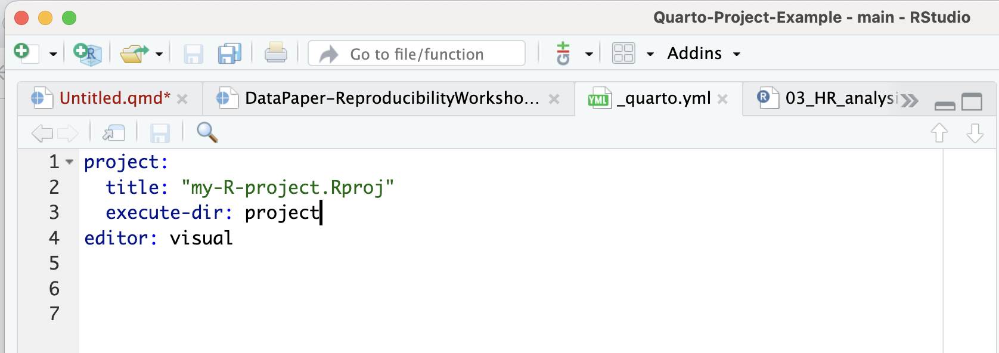

## Reproducible Methods for Coding in Quarto

Now that we've learned the core benefit of using Quarto documents - the integration of code with text - let's learn some next-level methods of working with code in Quarto. We'll cover how to use virtual environments with renv, how to add Global Knitr options to the yaml, run external R scripts from within the Quarto document, set the working directory for the Quarto document, and load packages and data globally. Whew! that's a lot! Let's dig in.


## Global Quarto Options

We've seen that we have pretty fine-tuned control of how our code output looks in our document using code chunk options. Now, let's take those controls to the next level by learning how to apply them "globally" over our whole document or even all the documents in your project.

What are some of the features of global knitr options? There are many, but we'll cover several of the most relevant and useful ones here:
1. Set global options for code chunks, so we don't have to repeat them in each chunk
2. Set a working directory so file paths (for code chunks) are easier to work with
3. Load libraries and data once at the beginning of the document instead of in each code chunk (more concise and less rendering time)

### Project level vs. Document level settings

With Quarto, we have the functionality and flexibility of being able to define *project* level global settings in addition to *document* level settings. This means that the settings we choose will be applied to either one specific Quarto document or *all* Quarto documents within our R project. 

How do we use document-level settings? How do we edit project-level settings? That's where the YAML comes in at the top of our documents and/or the `_quarto.yml` file that lives in our project root directory. 

At the top of our .Qmd document, we see the YAML:


Opening the `_quarto.yml` file in our project root, we see the following default settings:


### Project and Document settings Hierarchy

Similar to CSS, Quarto uses a cascading style of options. Starting from the project-level `_quarto.yml` document, Quarto gathers all specified options ending with the document-level options. All are combined and applied to the specific Quarto document. If there are any options that differ between the documents, the more specific option wins - i.e., the document-level option will be applied. 



## Document level setting 

### Global Code Chunk Options:


There is an option to set options for the entire Quarto document rather than have to specify in each code chunk. This is helpful when you consistently want to use the same options and when you have many code chunks within a document. Additionally, adding global code options will allow you and collaborators to have a better idea of how you've configured your document. 

In Quarto, the way to configure global code chunk options is in the YAML header.

In the YAML header of our document, we can set global options with `execute`. 

~~~
...
execute: 
      echo: false
~~~


Additional options can be further nested under execute. 

Let's see how it looks in our paper to add the options from our first code chunk: 




> ## Tip: Overriding Global Options  
> What if you want most of your code chunks to render with the same options (i.e., echo: false), but you just have one or two chunks that you want to tweak the options on (i.e., display code with echo: true)? Good news! The global options can be overwritten on a case-by-case basis in each individual code chunk. Test this by adding `#| echo: true` to your code chunk in your document and rendering. Did you override the global settings successfully?
{: .callout}


> ## CHALLENGE 1 (optional) global & individual code chunk options  
>
> How would it appear in our HTML document if we render a code chunk with the following options?  
> ```
> {r} 
> #| warning: true
> #| echo: true
> ...
> ```
>
> ...considering the global chunk settings were as listed: 
> ```
> ~~~
> execute:
>      echo: false
>      include: false
> ~~~
> ``` 
>> ## SOLUTION  
>> In this case, the global settings are set, so neither the code nor the output will display. However, the individual chunk reverses the echo setting so the code will display, and it also indicates that any warnings the code renders should output, too. The outputs of the code would still not be displayed (include: false). The hypothetical situation for this configuration may be for debugging while writing the qmd document.   
> {: .solution}  
{: .challenge}

 
## Project level settings

### Set working directory to project directory:

Ok, so you know how we had to change the file path in the code chunk we copied into our document so that the relative path was correct for reading the data? This happened because, in Quarto documents, the working directory is wherever the qmd document is located, but our code is located in a different folder. This means they have different relative paths to locate and read the data we want to work with. We can simplify things by designating the working directory for our document relative to the root project directory instead. This lets all files work relative to the project root instead of each other, standardizing the relative paths. Note that this is mainly important for code chunks - text portions of Quarto documents are not affected. This will clarify some of our confusion with relative paths across our R project. 


So one should learn how to accomplish that by changing the working directory at the project level YAML settings. So we'll navigate to our _quarto.yml document in our root project directory and open it. 

We'll add the following settings to the yml file:
~~~
...
project: 
  execute-dir: project
...
~~~

So the yml file should now look something like this:




Now, we would change the relative path in our code chunk back to what it was before, but let's hold tight. We're going to introduce another way to run code! But first, let's see how to globally load data and packages.

> ## Note: Changing the working directory only applies to code
> Setting the working directory to the project directory we just did adjust the working directory for all code in the Quarto document (code chunks and inline code), but NOT for any markdown text elements (images and hyperlinks).
{: .callout}

> ## Tip: Yaml code chunk options
> We can also tweak some code chunk settings at the project level in the `_quarto.yml` file which changes how code chunks are displayed for the entire project. We're not going to get into this in the workshop, but many of the same options you set in your global code chunk settings are also configurable in the `_quarto.yml` YAML. 
{: .callout}

## Code improvements

### Globally load data and packages

We can improve organization and rendering speed in our documents by learning how to load data and packages. So far, we've loaded the library `tidyverse` and the data frame `df` we need in the first code chunk. Now, if we want to add another figure (say the hormone analysis code '02_hormone_analysis.r`), which uses the same data as our first figure - we would be loading tidyverse and the data for a second time. This is unnecessary because once libraries and data are loaded in a Quarto document, they are available for use in the rest of the code in the following document.

The best practice is to load libraries and data once at the beginning of our document, making it available for all other figures or calculations throughout the document -  allowing us to avoid repetition in our code and saving us rendering time. This also makes it easier for us to keep track of all the libraries and data we need to use in any given document for ourselves and collaborators. If anything needs to be tweaked, we don't need to search through every code chunk in our qmd document to make a change - it's listed right at the top. 


```
# load libraries
library(tidyverse)
library(BayesFactor)
library(patchwork)

# load data
df <- read_csv("../data/processed/preprocessed-GARP-TSST-data.csv")
```
{: .language-r}

> ## Challenge 2: Order matters (optional)
>
> What would happen if we loaded the data before we loaded the libraries?
> Try it out!
>
> > ## Solution:
> > 
> > We would get an error because we haven't loaded tidyverse yet!
> > 
> {: .solution}
{: .challenge}

At this point, we could go back through our R scripts and comment out (or delete) the beginning sections where we load the data and libraries (you will see this is already done in most of the scripts in the code folder). You can imagine that the more code chunks you have, the more time taking this step would save. Bonus: This also works to load the data before it is called in the inline code!


## Run Code from an external script in a code chunk

Let's learn another technique for adding code-generated plots and figures to our document. This time around, let's see how to run code in a code chunk from an external R script instead of somewhat awkwardly copying and pasting the code from an R script to a code chunk in our `.qmd`.

There are at least a few benefits to running code in this modular fashion instead of copy/pasting:
1. Automatic updates: if the code gets updated in the R script, it will automatically be updated in the Quarto document as well. We won't need to copy/paste code updates, which would make it easy to end up with discrepancies between our `.r` scripts and our `.qmd` paper.

2. Readability: calling code externally only takes several lines of code - versus copy/pasting 50+ lines of code from our scripts.

3. Less fussing with relative paths* - we had to change the code slightly in the first example to update the file path to the data set, which introduces variations and inconsistencies. With this method, we won't have to modify the source code. 

*unfortunately, you will never be free of relative paths, but you can make it a bit easier on yourself.

Again, let's test this out in our generic Quarto document. After our first figure, add a new code chunk:


We're just going to test out the same figure again so we can verify this new method works. So, in the heart rate analysis code chunk, delete the existing code and add the following instead:

~~~
# run the code from 03_HR_analysis.R in the code directory
source("code/03_HR_analysis.R", local = knitr::knit_global())
# display the plot created by code in 03_HR_analysis.R
plot 
~~~
{: .language-r}


### Add the code to our Quarto document

First, find `Example 8` in the Quarto document for Fig 3 (ctrl-f "Example 8"). 

Add the following code where `Example 8` is located under "Preview of Research Results".

~~~
# run the code from 03_HR_analysis.R in the code directory
source("code/03_HR_analysis.R", local = knitr::knit_global())
# display the plot created by code in 03_HR_analysis.R
plot 
~~~
{: .language-r}

It should look like this:


**Attention:** DON'T forget to add a chunk name and caption for Figure 3 (we can use the same name and caption as before). Remember, we don't need to add options since we defined them globally.

> ## Time to Run!
> Let's see if our code worked when generated from an external script 
{: .checklist}

> ## Time to Render!
> If the code ran without error, let's render the whole document again and take a look.
{: .checklist}

Our plot should look exactly the same as the first copy-pasted one. 


Success! You'll notice that the global code chunk options were also applied to this code chunk.*. 

* Note: As of November 2023, Quarto has not implemented global options for `results`. This will need to be added to each code chunk if needed until further notice.

> ## Tip: Many ways to run external code
> There are at least 3-4 methods one can use to run external code; the best choice may depend on the context or your personal preference. There's no method that's a clear winner because there's an awkward quirk or another to each of them, but better than copy/pasting code from elsewhere in your project (in our humble opinion):
>
> 1. source()   -- [see more at bookdown.org](https://bookdown.org/yihui/rmarkdown-cookbook/source-script.html)
> 2. sys.source()   -- [see more at bookdown.org](https://bookdown.org/yihui/rmarkdown-cookbook/source-script.html)
> 3. knitr::read_chunk()  -- [see more at stackoverflow](https://stackoverflow.com/a/52398016)
>
{: .callout}

> ## Challenge 3: Your turn! Create Figure 4 with the external code
> 
> First, find `Example 9` in the qmd document for Fig 4 (ctrl-f "Example 9"). We need to add the code for the hormone analysis.
>
> Make sure to give the code chunk a name: `fig4-hormones` and a caption: `"Fig 4: Cortisol and Amylase levels in stress and control groups"`
>
> > ## Solution:
> > ~~~
> > {r fig4-hormones, fig.cap = "Fig 4: Cortisol and Amylase levels in stress and control groups" }
> > # run the code from 02_hormone_analysis.R in the code directory
> > source("code/02_hormone_analysis.R", local = knitr::knit_global())
> > # Display the plot created by code in 02_hormone_analysis.R
> > plot 
> > ~~~
> > {: .language-r}
> {: .solution}
{: .challenge}
