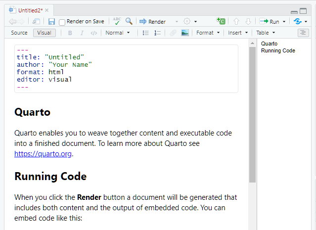
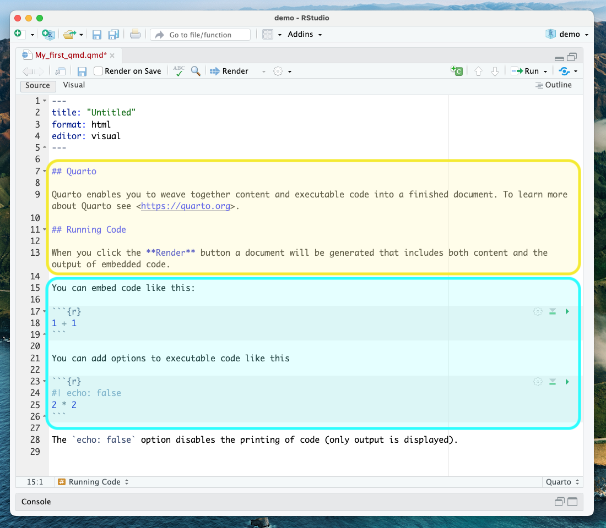

### Creates documents using Quarto

As seen, reproducibility implies sharing data, code, and workflows to produce the analysis and compute results. While writing scientific reports, one may choose RStudio IDE to marry all these pieces together and take advantage of the various tools it integrates with. Having a publication while minimizing reproducibility friction can be accomplished with Quarto. [Quarto](https://quarto.org/) is a multi-language, next-generation version of R Markdown from Posit. It includes new features and capabilities while being able to render most existing Rmd files without any modification. With Quarto, you can: 

* Create dynamic content with Rstudio/R, Python, Julia, and Observable.
* Author documents as plain text markdown or Jupyter notebooks.
* Publish high-quality articles, reports, presentations, websites, blogs, and books in HTML, PDF, MS Word, ePub, and more.
* Author with scientific markdown, including equations, citations, crossrefs, figure panels, callouts, advanced layout, and more.

Quarto generates a .qmd file that weaves together content and executable code into an elegantly formatted output, which can be published in various formats. It is a convenient tool for reproducible and dynamic reports which will help you:

1. Keep an eye on the text (the paper) AND the source code. These computational steps are essential to ensure computational reproducibility.
2. Conduct the entire analysis pipeline in a Quarto document: data (pre-)processing, analysis, outputs, and visualization.
3. Apply a formatting syntax that is part of the R ecosystem and supports LaTeX.
4. Combine markdown text and source code in R (and other languages).
5. Easily share documents with colleagues as supplemental material or as the paper under review. 
6. Get figures automatically updated if you change the underlying parameters in the code. The error-prone task of exporting figures and uploading the right figure version to another platform is thus not needed anymore.
7. Since it uses a text-based format, you can also use versioning control with Git.
8. If you do not make any changes to the document after creating the output document, you can be sure that the paper is executable, at least at the time of submission.
9. Refer to the corresponding code lines in the methodology section, making it unnecessary to use pseudocode, high-level textual descriptions, or just too many words to describe the computational analysis.

## Some Real-world Applications

Finally, three real-world examples that motivated the authors of this lesson to value and use Quarto:

1. You can publish books! [Telling Stories with Data](https://tellingstorieswithdata.com/) is a great example developed in Quarto. Quarto books can be published to a wide variety of destinations, including GitHub Pages, Netlify, RStudio Connect, or any other static hosting service or intranet web server. [Learn more](https://quarto.org/docs/books/).

2. Imagine you want to create a short document that includes some math formulas. The LaTeX document preparation can be used for this, but it can be difficult and overkill for just a few formulas in otherwise plain text. As we will learn, through Pandoc, Quarto lets you use just the best part of LaTeX---math formatting---while letting you write your text in a user-friendly way. The editor will automatically recognize the syntax and treat the equation as math.

3. In a past version of this workshop, we struggled with a scientific paper published in a reputable journal.  In trying to recreate the original authors' plots, we found it difficult and time-consuming to figure out exactly how the authors created their plots.  Out of the many columns in their data, many have similar-sounding names. Which did they use?  How did they handle missing data?  Exactly what operations did they perform to compute aggregate values?  How much easier it would have been if they had published the code they used along with their paper. RStudio and Quarto allow you to do this.

## Anatomy of a Quarto Document

The key to our reproducible workflow is using Quarto files in RStudio rather than basic scripts to dynamically render both code and paper narrative. So let’s do a quick anatomy lesson on the components of a Quarto file (YAML header, Quarto formatted, R code blocks; also known as "code chunks") and how to render them into our final formatted document.
There are four distinct steps in the Quarto workflow:
1. create a **YAML header** (optional)  
2. write Quarto-formatted **text**   
3. add R **code blocks** for embedded analysis  
4. render the document with the selected engine **(Knitr in this example)**  

Let’s dig into those more:

### 1. YAML header:
#### What is YAML anyway?
YAML, pronounced "Yeah-mul" stands for "YAML Ain't Markup Language". YAML is a human-readable [data-serialization](https://en.wikipedia.org/wiki/Serialization) language which, as its name suggests, is not a markup language. YAML has no executable commands, though it is compatible with all programming languages and virtually any application that stores or transmits data. YAML itself is made up of bits of many languages, including Perl, MIME, C, & HTML. YAML is also a superset of JSON. When used as a stand-alone file, the file ending is .yml or .yaml.
 

Quarto default YAML header includes the following metadata surrounded by three dashes `---`:
* title  
* author  
* format 
* editor

The format is selected in the wizard for starting a new document. You are able to pick from pdf, html, and word document. Basically, this allows you to export your qmd file as a file type of your choice. There are [other options for output format](https://bookdown.org/yihui/rmarkdown/output-formats.html), and even more can be added by installing certain packages, but these are the three default options.   
 

We’ll see other formatting options for YAML later on, including adding bibliography information, customizing our output, and changing the default settings for executing your code. Below is an example of how our YAML file will look at the end of this workshop. 

~~~
---
title: "Data Article: Trier social stress test and food-choice: Behavioral, self-report & hormonal data (Carpentry Workshop Version)"
author: "Felix Jan Nitsch; Manuela Sellitto; Tobias Kalenscher"
format: html
editor: visual
bibliography: references.bib
execute:
  echo: true
  ...
---
~~~

### 2. Formatted text:
This one is simple, it's literally just text narrative formatted by using markdown (more on markdown syntax later). Markdown-formatted text is one of the benefits added above and beyond the capabilities of a regular r script. Any text section will have the default white background in the qmd document. As you might know, in a regular R file, # starts a comment. In Quarto, plain text is just plain narrative text that appears in the document. In R scripts, plain text wants to be code. In Quarto, you will need to enclose your code in special characters. Any symbols you do see that aren’t regular grammar components are for formatting, such as `##`, `** **`, and `< >`.

> ## Tip: Bonus! You can use a variety of languages to format text and images in Quarto:
- Quarto
- HTML
- LaTeX
- CSS
{: .callout}

### 3. Code Blocks:
Code blocks appear highlighted in gray throughout the qmd document. They are surrounded by three tick marks on either side (\`\`\`) **in source mode** with the starting three tick marks followed by curly brackets `{}`with some other code inside. The tick marks indicate the start of a code section, and the bits found between the curly brackets `{}`indicate how R should read and display the code (more on this in the Knitr syntax episodes). These are the sections where you add R code, such as summary statistics, analysis, tables, and plots. If you’ve already written an R script, you can copy and paste your code between the few lines of required formatting to embed & run whichever piece you want at that particular spot in the document.

> ## Tip: Bonus! You may code with many different languages in RStudio:  
> - R  
> - Python  
> - Bash  
> - SQL  
>
> A complete list of compatible languages can be found at: [https://rmarkdown.rstudio.com/lesson-5.html](https://rmarkdown.rstudio.com/lesson-5.html)  
{: .callout}

Let's take a look at the Quarto document template we have just created to see how formatted text and code are represented.

 

> ## A note about coding approaches in RStudio: 
> When writing code in Rstudio, there are different workflows you can use, including writing code directly in the console, using a separate R script, or writing your code in a .qmd file. The best approach depends on your specific needs and preferences:
> 
> - *Writing code directly in the console* is useful when you want to execute code immediately to see the effect of a statement making a quick change or calculation. However, keeping track of your written code can be challenging, especially if it takes multiple lines. Additionally, if you need to run the same code multiple times, you'll have to rewrite it each time, which can be inconvenient if you plan to reuse it.
> - *Using a separate R script* is a more organized way to write and save code, and you can easily reuse it later or share it with others. You can easily edit and rerun the script if you need to modify the code. However, running code in a script requires more steps than running code in the console, and it can be more challenging to modify code interactively.
> - *Using a .qmd file* combines the advantages of both the console and R script. A .qmd file allows you to write. R code and text in the same document make organizing and documenting your work easier. Additionally, you can run the code directly in the paper, which makes it easier to modify and rerun code interactively.
>
> We will use the third approach for most of this workshop since we focus on creating a reproducible paper.
{: .callout}

### 4. Rendering your Qmd document:
Simply put, rendering is the process of converting a document into a file format or a medium that is paginated or has the concept of pages. Clicking the render button will compile the code, check for errors, and output the type of file indicated in your yaml header. You may select the option "Render on Save" to see a preview of your document every time you save edits. Attention: your qmd document may not run and render as your indicated output if there are any errors in the document, so it also functions somewhat as a code checker.
 

#### Try it yourself!
We’re going to pause here and see what the Quarto document does when it’s rendered. We'll just use the generic template, but when we're working on our own project, rendering periodically while we're editing allows us to catch any mistakes early. We'll continue rendering our qmd throughout the lesson to see what happens when we add our markdown and knitr syntax and to make sure we aren't making any errors.

This is a little preview of what's to come in the later episodes:
Click the "render" button.

Before you can render your document, you'll need to give it a file name and choose what folder you want to save it to. Choose `my_first_qmd.qmd` as your file name and save it to an easily accessible directory in your file system.

Your document should render like this:  

  

> ## Warning: Enable Pop-ups!
> If using the Jupyter Hub RStudio setup, you may not see your preview until you enable pop-ups since the web browser of your choice may block pop-ups by default.
{: .callout}

> ## CHALLENGE 1 - Rendering the document in another format
> Suppose you want this .qmd document to render as a Word document. What options would you have?
>
>> ## Solution:
>> You may change the output format in the YAML to `docx`. 
>> Note that to preview Word documents, you need to have MS Word, Libre or Open Office installed on your machine. 
>> Alternatively, you may enter the following command in the terminal:
>> `quarto render my_first_qmd.qmd --to docx
> {: .solution}
{: .challenge}

> ## Note about PDFs 
> In order to create PDFs you will need to install a recent distribution of LaTeX. We recommend the use of TinyTeX, which you can install with the following command: `quarto install tool tinytex`. 
{: .callout}
