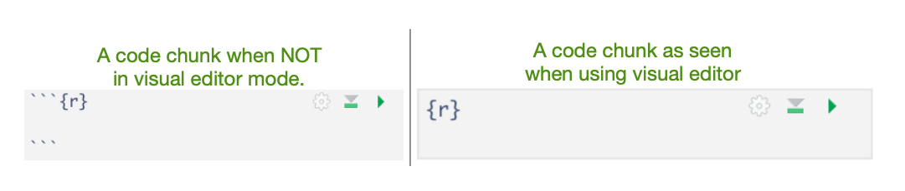
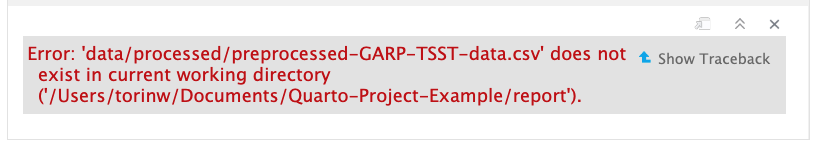

## Introduction to Code in Quarto & Knitr Engine

We've learned about the text-formatting options for Quarto in RStudio. Now, let's dive into the code portion of Quarto documents. As we've seen so far, Quarto flips the "code first" default of R scripts, prioritizing code over text. Instead of using comments to add text, Quarto Documents uses a "text-first" default and requires the use of special syntax to add code. In Quarto documents, the syntax to signal the switch to code is called "code chunks" in RStudio (referred to as "code cells" in other environments). Code chunks are interpreted by Knitr. But first, what is Knitr? 

## What is Knitr?

Knitr is the engine in RStudio, which creates the “dynamic” part of Quarto reports. More specifically, it's a package that allows the integration of R code into the HTML, word, PDF, or LaTeX document you have specified as your output for Quarto. It utilizes Literate Programming to make research more reproducible. 

## How it works?

First, code chunks are sent to a preceding stage of processing by Knitr, which runs the code, generates any plots or figures, and then "knits" the code output and text together. Next, Quarto outputs the "knitted" text and renders code into an HTML document (or another document type indicated in your configuration file). 

There are two ways to add code to Quarto documents:

1. Code Chunks
2. Inline Code (as we will see in the next episode)

First, we're going to talk about code chunks for including substantial portions of code into our narrative, such as generating figures and plots. A plethora of options become available to us when using code chunks, so this tends to be the more complex part of Quarto documents. 

## Using Code Chunks

Code chunks (also called "code blocks" or "code cells") are the preferred option when you need to write more than a line or two of code, such as building plots or tables. More than just a vehicle to run code, they also allow modifications to how code is rendered and styled in your final output. We’ll learn more about that as we walk through the “anatomy” of a code chunk.

### Creating a Code Chunk

Okay, let's get to some code! Some plots have already been included in our paper but as static images. Now, we will add some additional plots generated straight from R code - which are also more reproducible and easier to update than static images. Using code to generate images directly assures us that if there are any changes to the data or code the plots will update automatically. We also don't have to generate the new plots, save them as images, and then add them back into our paper. Not only is this a time-saver, but it also helps prevent versioning errors! 

Navigate to the end of the paper where it says **"Example 8"**. This is where we will add our first code chunk.

Let's start a new code chunk by typing our starting backticks & r between curly brackets or using the buttons in the editor toolbar.  

{: .image-with-shadow}  


> ## Tip: Four ways to insert code chunks
> - the Add Chunk button in the editor toolbar  (looks like a green square with a C)
> - the Insert > Code Chunk menu option in the editor toolbar
> - by typing the code chunk delimiters {r} and \`\`\`. *If you are in "editor" mode, you will need to remember to end the code chunk with ending backticks as well \`\`\`.  
> - the keyboard shortcut 
>       - Ctrl + Alt + I (Windows)
>       - Cmd + Option + I (Mac) 
{: .callout}

### Basic Anatomy of a Code Chunk

The most basic (empty) code chunk looks like this:

{: .image-with-shadow}

Can you tell the subtle differences between the visual and source modes in RStudio? That's right - the backticks ```. As seen in this image, the only **required** syntax for a code chunk are the backticks preceding and ending (seen only in source mode) and the specified language (in our case, 'r') placed between the curly brackets. 

Unless indicated otherwise, we will continue working in **visual mode**.

> ## Fun fact: Other Programming Languages
> Although we will (mostly) be using R in this workshop, it’s possible to use other programming or markup languages. For example, we have seen that we can use LaTeX code for equations. You can also use Python and a handful of other languages, so if R is not your preferred programming but you like working in the RStudio environment, don’t despair! Other options include SQL, Julia, bash, c, etc. It should be noted, however, that some languages (like Python) will require installing and loading additional packages. 
{: .callout}


## Adding our Code Example to a Code Chunk

Now, let's add our first code by copying and pasting the code found below into our empty code chunk (also found in the `code` folder as `HR_analysis.R`. 

~~~  
library(tidyverse)
library(BayesFactor)

#Read data
df <- read_csv("data/processed/preprocessed-GARP-TSST-data.csv")

#Convert df to long-format
df_long <- df %>%
  pivot_longer(cols = c(HR_Baseline_Average, HR_TSST_Average),
               names_to = "Measurement",
               values_to = "HR")

#Drop missing values
df_long <- df_long %>% drop_na(HR)

#Make sure columns are coded as factors for analysis
df_long$VPN <- as.factor(df_long$VPN)
df_long$Measurement <- as.factor(df_long$Measurement)
df_long$Condition <- as.factor(df_long$Condition)

#Bayesian Analysis
BF <- anovaBF(formula = HR ~ Measurement*Condition + VPN,
              data = df_long,
              whichRandom = "VPN")

#Evidence for interaction term
BF_interaction <- BF[4]/BF[3]

BF_interaction

#Summarize to mean / SEM for plot
df_long2 <- df_long %>%
  group_by(Measurement, Condition) %>%
  summarize(mean_value = mean(HR, na.rm = T),
            sem = sd(HR, na.rm = T)/sqrt(n()))

#Create plot
plot <- ggplot(df_long2, aes(Measurement, mean_value, group = Condition, color = Condition)) +
  geom_pointrange(aes(ymin=mean_value-sem, ymax= mean_value+sem)) +
  geom_line() +
  theme_classic() +
  scale_x_discrete(labels = c("Baseline",
                              "TSST-G/Control")) +
  ylab("Mean Heartrate (BPM)") +
  scale_colour_grey(start = 0.5, end = 0.2) +
  theme(legend.position = "top")  

#Print and save plots  
plot
ggsave("output/heartrate.pdf", plot, width = 4, height = 3)
~~~
{: .language-r}  


## Running the Code in a Code Chunk 

With code chunks, we have other options for running and debugging code that don't require us to wait for the entire file to render. This is particularly useful as we add more code to the document, and the render time increases. Let's explore our options:

### 1) Run from code chunk 

See the green play button on the top right corner? This allows us to run code from that specific code chunk.

{: .image-with-shadow}

### 2) Run menu
In the editor menu, there is an icon that says Run with an arrow pointing left. This menu provides more options for running code chunks, including the current chunk, the next chunk, all chunks, etc. 

{: .image-with-shadow}

### 3) Keyboard shortcuts: 
Of course, there are shortcuts to all of the actions found in the Run menu (that is, if you can remember them all).

**Task**	| **Windows & Linux**	| **macOS**
---       |---                  |---
Create a code chunk | Ctrl + Alt + I | Cmd + Option + I
Run all chunks above |	Ctrl+Alt+P	| Command+Option+P
Run current chunk	| Ctrl+Alt+C	| Command+Option+C
Run current chunk	| Ctrl+Shift+Enter	| Command+Shift+Enter
Run next chunk	| Ctrl+Alt+N	| Command+Option+N
Run all chunks	| Ctrl+Alt+R	| Command+Option+R
Go to next chunk/title	| Ctrl+PgDown	| Command+PgDown
Go to previous chunk/title	| Ctrl+PgUp |	Command+PgUp

Run your first code chunk with one of the three options given above. 

Well, shoot! We're getting an error:

~~~
Error: 'data/processed/preprocessed-GARP-TSST-data.csv' does not exist in the current working directory ('/Users/rcurty-local/Documents/GitHub-Repos/Quarto-Project-Example/report').
~~~
{: .error}

{: .image-with-shadow}

If we go to the bottom of the code chunk or check the console, we'll see more details on the error:

{: .image-with-shadow}

This is a path error. But why are we seeing this error? Unfortunately, a slight discrepancy exists between the behavior of regular R scripts run in R projects and Quarto projects. R scripts will always use the project's root folder as the working directory, while Quarto documents use the folder where the qmd file is located as the working directory. If you were learning on your own, you may have been majorly confused by this minute difference. No worries, we'll see how to change the default working directory globally in the next episode. 

### Dealing with Relative Path Errors

For now, we can fix this error by adding the correct relative path:

```
df <- read_csv("../data/processed/preprocessed-GARP-TSST-data.csv")
```
Instead of:
```
df <- read_csv("data/processed/preprocessed-GARP-TSST-data.csv")
```

Run the code again to make sure it works properly. 

Did it work? Look under the code chunk. If all goes well, you should see a plot preview beneath the code chunk. 

{: .image-with-shadow}

> ## Stay Tuned - Better Method for Relative Path Issues
> In a few episodes - "Advanced Code Chunk Options" we'll introduce a technique that will eliminate this issue we encountered with relative paths. Then we'll build on that further by learning a better way to run code from R scripts in code chunks! You may be tempted to sneak a peek - but don't worry we'll get there soon!
{: .callout}
