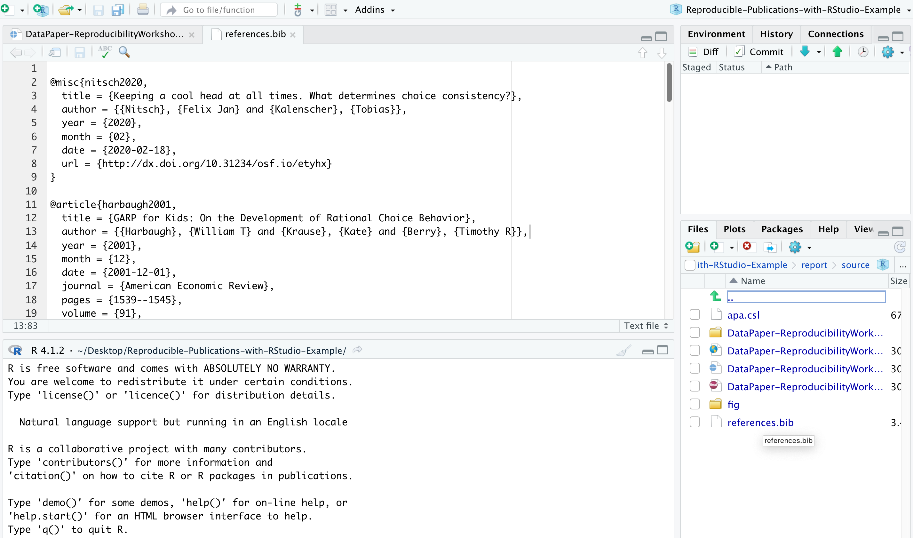
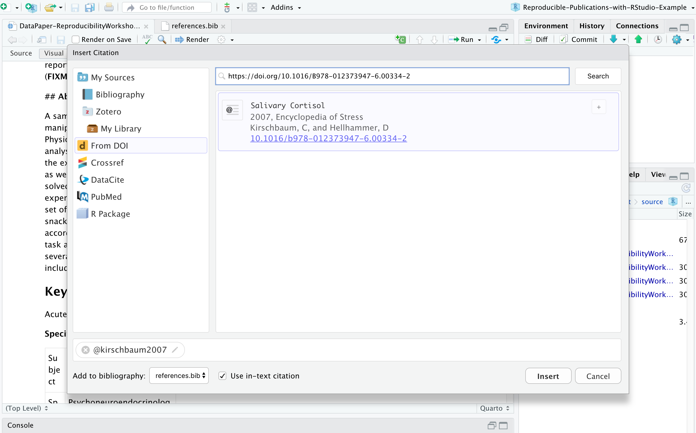
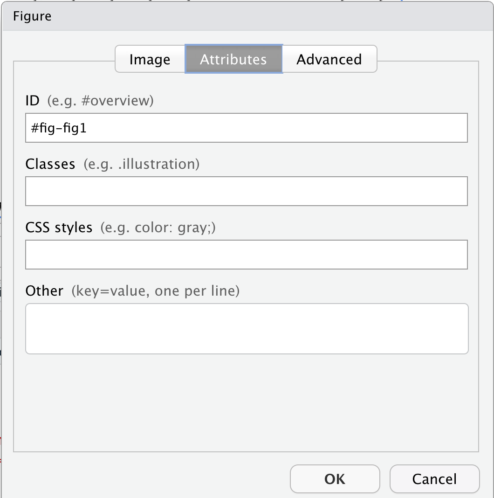

## Why citing?

Correctly citing and attributing publications is key to academic writing. Older versions of RStudio require [Pandoc's](https://pandoc.org/MANUAL.html#citation-syntax) citation syntax to render bibliographies correctly. We won’t be covering this approach extensively in this workshop, since the new visual editor has made this process much more simple. You can refer to our [previous workshop on R Markdown](https://ucsbcarpentry.github.io/R-markdown/06-citations-bib/index.html) pre-visual editor for more information.  

The new visual editor has made citations and cross-referencing much easier, by offering different options for referencing various types of sources. Before getting into these different features, let’s first learn how you can call the citation window dialog on Rstudio and how to navigate these different options.  

## Calling Citation Options on Rstudio  

After placing your cursor where you want to insert the citation you can either click the `@` icon in the toolbar, or select `Insert`, and from the drop down menu choose `Citation`. Alternatively you can use the keyboard shortcut <kbd>⇧⌘ F8</kbd> on Mac, or <kbd>Ctrl+Shift+F8</kbd> for Windows.  


The citation window will display different options for inserting citations, You can either find items listed in your own sources through your Bibliography folder (you should have one already in your project folder provided by us), your Zotero Library(ies) if you have the reference manager installed in your computer, or even use the lookup feature to search for publications by DOI (Digital Object Identifier), Crossref, DataCite, or PubMed ID as we will explore a bit more shortly.


## Understanding How Rstudio Stores and Organizes Citations  

Have you noticed that the YAML header contains “bibliography: references.bib”. Any idea why? Well, that’s because on our paper template we have some existing citations, and a references.bib file in our project folder. Rstudio adds that automatically to the YAML once you cite the first item to your manuscript. But let’s first open the references.bib file (located in report>source on your project folder) and understand how citations are presented there:  



A file with the BIB file extension is a BibTeX Bibliographical Database file. It's a specially formatted text file that lists references pertaining to a particular source of information. They're normally seen only with the .BIB file extension but might instead use .BIBTEX. BibTeX files might hold references for things like research papers, articles, books, etc. Included within the file is often an author name, year, title, page number, and other related content. Each item can be edited, in case there is any metadata incorrect or missing.  

Most citation and reference management tools such as Refworks, Endnote, Mendeley and Zotero, as well as some search engines (e.g. Google Scholar), most scientific databases, and our UCSB library catalog allow us to export citations as .bib [BibteX](https://en.wikipedia.org/wiki/BibTeX) files. These files are used to describe and process lists of references, mostly in conjunction with LaTeX documents. Each .bib file has a citation key or ID preceded by an `@`, which uniquely identifies each item. Citation keys can be customized as we will learn in a bit, but be advised that your manuscript will render citations correctly only if you have the cited item corresponding to its exact key.  

## Inserting Citations  

Note that we have different blocks in this file starting with a `@` and ending with a curly bracket `{`, each one representing a unique citable source. We will be adding now a new item using the DOI lookup function so that you can see how the magic works!  

Let’s assume you want to include a citation in the first line of the Value of the Data section, because you would like to provide some reference of how the salivary cortisol technique has been used in research. So let’s click where we want to insert the citation, call the citation function and lookup for the following DOI: [https://doi.org/10.1016/B978-012373947-6.00334-2](https://doi.org/10.1016/B978-012373947-6.00334-2)  



The DOI lookup uses the [persistent identifier](https://www.library.ucsb.edu/sites/default/files/dls_n4_pids_navy.pdf) which connects to the DOI resolver service and retrieves the .bibtex file with resource metadata<sup>1</sup>. You should insert the whole DOI address, including the resolver service, the prefix and the suffix which is specific to the resource as illustrated below:  


Rstudio will search the [DOI](https://support.datacite.org/docs/doi-basics) API and list the only matching result and you can insert it. After confirming this is the citation you would like to include, you can modify the key, if you would like to simplify it, and also choose if you would like to insert it as a in-text citation, meaning you would like to have the last name of the author(s) followed by a page number enclosed in parentheses. i.e., Kirschbaum and Hellhammer (2007), but in this case, we will uncheck that option since we won’t include authors as part of the narrative. Instead we would like to insert a parenthetical citation, where authors and year will be displayed inside the parentheses such as (Kirschbaum and Hellhammer 2007). You may insert more than one citation by selecting multiple items.  

This item will be automatically listed in your references.bib file and will help you manage your citations more efficiently. Pretty cool, huh? If you want to cite this same item again you can type `@` and the first letters of the item name which will be auto-completed by Rstudio. For parenthetical citations you will have to type the key between brackets and for in-text narrative citations, you only need to type in the key.
Note that when you hover over the citation, you will preview the full reference for the cited item that will be listed at the bottom of the manuscript. This feature helps you to identify if you have to edit anything in the .bib file your citation is calling. Also, note that all citations will be included at the end of your document under a reference list.

> ## Challenge 1 - Insert a Citation Using the DOI Lookup Function
>
> Following the same process described,
> insert a parenthetical citation to the publication “Welcome to the tidyverse”
> ([https://doi.org/10.21105/joss.01686](https://doi.org/10.21105/joss.01686))
> where there is a mention to this package in the data paper. Look for: `add citation here`
>
> > ## Solution
> > ```
> > [@wickham2019]
> > render the document and voiala!
> > (Wickham et al., 2019)
> > ```
> > {: .output}
> >
> {: .solution}
{: .challenge}

Inserting citations using Crossref, DataCite or PubMed follows a very similar process to the DOI process, however; to search on their APIs you will need to input information accordingly. For Crossref, you may use keywords and author information to identify an item (e.g., Cortisol Stress Oken) and Rstudio will connect to [Crossref search](https://search.crossref.org/) and provide related results, often not as specific as the DOI search, for cases you know exactly what you are looking for. DataCite allows searches by persistent identifiers or keywords, while PubMed searches exclusively in biomedical literature indexed in the database. If you have the PMID (PubMed reference number), which is uniquely assigned by the NIH National Library of Medicine to papers indexed in PubMed, similarly to the DOI search, it will save you time.  

## Editing Metadata & Citation Key  

Not all citations are in perfect shape when we import them. You may have to adjust them (e.g., include missing metadata, move content to another metadata field). If needed, we can do so by modifying the .bib file. As briefly mentioned, you can also edit citation keys. By default, most citation keys will have the first author last name or the first word of the title (if no authors), followed by the year of publication. You may consider editing the citation key in case you want to simplify the entry and speed up the autocomplete option. If you choose to do so, you can simply click on the key in the .bib file and edit it. Please be advised to use this option with caution, and to update citations to match the .bib file. 

## Changing Citation Styles

You might have noticed that all citations are inserted in a specific style. Can you guess which one? If you answered Chicago, that is correct! By default, Rstudio uses a Chicago author-date format for citations and references. To use another style, you will need to specify a CSL (Citation Style Language) file in the csl metadata field in the YAML.

But how can you identify which CSL you should use? You can find required formats on the [Zotero Style Repository](https://www.zotero.org/styles), which makes it easy to search for and download your desired style.

Download the format you wish to use and call it out in the YAML. We have pre-saved the APA CSL file in the project folder for you. But if you would like to follow the process or try another style, go to the Zotero Style repo and select [American Psychological Association 7th edition](https://www.zotero.org/styles/apa) or any other style of your choice. You will notice that it will automatically download the file (e.g. `apa.csl`). Make sure to save it to your project directory in report/source folder. In the YAML we have to call the exact name of the file preceded by “csl:”

```
csl: apa.csl
```
{: .output}  

Save and render the document to see how citations and references have changed. This same process could be followed for any citation style required by the university, the journal or conference you are planning to submit your manuscript to.  

> ## Challenge 2 - Changing the Citation Style
>
> How can you go back to using Chicago Style?
>
> > ## Solution:
> >
> > You can either delete the csl information as it is set as the default, or call it in the YAML:
> >
> > ```
> > csl: chicago.csl
> > ```
> > {: .output}
> >
> {: .solution}
{: .challenge}

## Adding Items to the References without Citing them

All cited items will be listed under the section References which you created before while practicing headings and subheadings. Items will be placed automatically in alphabetical order for most citation styles. However, there might be cases that you will be referencing supporting literature which you have not necessarily cited in the document.  

By default, the bibliography will only display items that are directly referenced in the document. If you want to include items in the bibliography without actually citing them in the body text, you can define a dummy nocite metadata field in the YAML and put the citations there.

```
nocite: |
  @item1, @item2
```
{: .output}  

To demonstrate that let's include the bibtex `@key` for an item that was not cited in the YAML. Note that this will force all items added in the YAML with this command to be listed in the bibliography.  

Let’s try!

> ## Challenge 3 (optional): Adding references you have not cited
>
> We have used a few packages in our paper that we do not necessarily
> cite in text. However, it is a good practice to add them to the
> reference list. This practice is recommended for giving proper credit
> to package developers and also to inform your readers about the exact
> version you have used to produce your paper.
>
> Ideally we would follow this process for all packages we have
> installed and used to produce the paper. But for the sake of time,
> let's do that process for the package ***BayesFactor***. Since we have
> the option to call R packages right from the insert citation, look for
> the package and think how we can include it to the refrence list even
> without citing it on our paper.
>
> > ## Solution
> >
> > You should call the \@ it in the YAML, with the nocite function:
> >
> > ```         
> > nocite: |
> >  @BayesFactor
> > ```
> >
> > {: .output}
> >
> > {: .solution} {: .challenge}

> ## Important Info:
> Does the indentation matter? Yes, you have to indent at least one space and the citation key should turn green to work.  
> In case you are including a citation to `nocite` that you have not cited in the document, you have to make sure first that the bib file is in your Bibliography folder.
{: .checklist} 

> ## Tip:
>> Depending on the bibliography style, BibTeX converts all characters in the title to lowercase, except for the first character. If you want to override this, wrap the character(s) you wish to show in upper case, in curly braces.
>> ```
>> title = "Pascal, {C}, {Java}: were they all conceived in {ETH}?" 
>> ``` 
{: .checklist} 

## Adding Cross-referencing

Cross-referencing is a useful way of directing your readers through your document, and it can be accomplished in Quarto. You may create cross-references to figures, tables, equations, sections, code listings, theorems, proofs, and more. 

Essentially, every cross-referenceable entity requires a caption (description), the object info, and a label (unique identifier. Let's say we want to cross-reference Figure 1 in the paper. To do so, we will need to first create an id for it. If we are in the visual mode, we can double click the image, click the "Attributes" tab, and enter #fig1 as the ID.

 <br>


Alternatively, in the source mode, we can enter that same ID in front of the figure name, by typing in {#fig-fig1}

`{#fig-fig1}`


Ok, but how can you call that in another part of the paper? You may enter the key below using the unique identifier, but instead of the hash `#` it should be preceeded by an at `@`:

`@fig-fig1`

If you do not start you label with `fig-`, Quarto will interpret it as a citation and won't render correctly. Click `Render` and see how it displays. 

You may follow a similar approach to add cross-references for sections `(#sec-)/(@sec-)`, equations  `(#eq-)/(@eq-)` and tables `(#tbl-)/(@tbl-)`. For more information on how to cross-reference different types of objects, visit [Quarto - Cross References](https://quarto.org/docs/authoring/cross-references.html). 

If you wish to add a cross-reference to a figure that was generated via code block, you have to provide a label (id) and a caption at the beggining of the figure code block.

`
#| label: fig-id
#| fig-cap: "figure caption here" 
`
And then, enter the @fig-id where you want to note the cross-referece in your paper. 

> ## Challenge 4: Adding cross-reference for code block figures
> Your turn! Include a cross-reference to Figure 3. In a previous lesson we added a caption for figure 3: `fig-cap = "Fig 3: Mean heart rate of stress and control groups at baseline and during intervention.`. How we would have to tweek that a bit to make the cross-referencing render correctly?
>
> > ## Solution:
> > 1) Add a label (id) e.g. `#| label: fig-fig3`
> > 2) Make sure the caption is correctly represented `#| fig-cap: "Fig 3: Mean heart rate of stress and control groups at baseline and during intervention"`
> > 3) Call the figure using the assigned id `@fig-fig3`
> > 4) Render it to check how it looks like. 
> > **FIXME: Add screenshot**
> >
> > {: .output}
> >
> {: .solution}
{: .challenge}