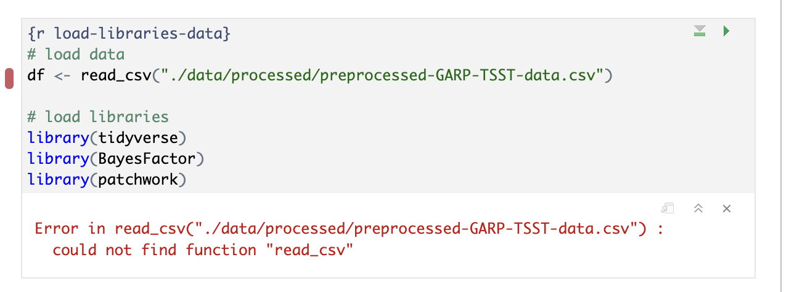

### Globally Load Data and Packages

We can improve organization and rendering speed in our documents by learning how to load data and packages. So far, we've loaded the library `tidyverse` and the data frame `df` we need in the first code chunk. Now, if we want to add another figure (say the hormone analysis code '02_hormone_analysis.r`), which uses the same data as our first figure - we would be loading tidyverse and the data for a second time. This is unnecessary because once libraries and data are loaded in a Quarto document, they are available for use in the rest of the code in the following document.

The best practice is to load libraries and data once at the beginning of our document, making it available for all other figures or calculations throughout the document -  allowing us to avoid repetition in our code and saving us rendering time. This also makes it easier for us to keep track of all the libraries and data we need to use in any given document for ourselves and collaborators. If anything needs to be tweaked, we don't need to search through every code chunk in our qmd document to make a change - it's listed right at the top. 


```
# load libraries
library(tidyverse)
library(BayesFactor)
library(patchwork)

# load data
df <- read_csv("../data/processed/preprocessed-GARP-TSST-data.csv")
```
{: .language-r}

> ## Challenge 2: Order matters (optional)
>
> What would happen if we loaded the data before we loaded the libraries?
> Try it out!
>
> > ## Solution:
> > 
> > We would get an error because we haven't loaded tidyverse yet!
> > 
> {: .solution}
{: .challenge}

At this point, we could go back through our R scripts and comment out (or delete) the beginning sections where we load the data and libraries (you will see this is already done in most of the scripts in the code folder). You can imagine that the more code chunks you have, the more time taking this step would save. Bonus: This also works to load the data before it is called in the inline code!


## Run Code from an External Script in a Code Chunk

Let's learn another technique for adding code-generated plots and figures to our document. This time around, let's see how to run code in a code chunk from an external R script instead of somewhat awkwardly copying and pasting the code from an R script to a code chunk in our `.qmd`.

There are at least a few benefits to running code in this modular fashion instead of copy/pasting:
1. Automatic updates: if the code gets updated in the R script, it will automatically be updated in the Quarto document as well. We won't need to copy/paste code updates, which would make it easy to end up with discrepancies between our `.r` scripts and our `.qmd` paper.

2. Readability: calling code externally only takes several lines of code - versus copy/pasting 50+ lines of code from our scripts.

3. Less fussing with relative paths* - we had to change the code slightly in the first example to update the file path to the data set, which introduces variations and inconsistencies. With this method, we won't have to modify the source code. 

*unfortunately, you will never be free of relative paths, but you can make it a bit easier on yourself.

Again, let's test this out in our generic Quarto document. After our first figure, add a new code chunk:


We're just going to test out the same figure again so we can verify this new method works. So, in the heart rate analysis code chunk, delete the existing code and add the following instead:

~~~
# run the code from 03_HR_analysis.R in the code directory
source("code/03_HR_analysis.R", local = knitr::knit_global())
# display the plot created by code in 03_HR_analysis.R
plot 
~~~
{: .language-r}


### Add the code to our Quarto document

First, find `Example 8` in the Quarto document for Fig 3 (ctrl-f "Example 8"). 

Add the following code where `Example 8` is located under "Preview of Research Results".

~~~
# run the code from 03_HR_analysis.R in the code directory
source("code/03_HR_analysis.R", local = knitr::knit_global())
# display the plot created by code in 03_HR_analysis.R
plot 
~~~
{: .language-r}

It should look like this:


**Attention:** DON'T forget to add a chunk name and caption for Figure 3 (we can use the same name and caption as before). Remember, we don't need to add options since we defined them globally.

> ## Time to Run!
> Let's see if our code worked when generated from an external script 
{: .checklist}

> ## Time to Render!
> If the code ran without error, let's render the whole document again and take a look.
{: .checklist}

Our plot should look exactly the same as the first copy-pasted one. 

Success! You'll notice that the global code chunk options were also applied to this code chunk.*. 

* Note: As of November 2023, Quarto has not implemented global options for `results`. This will need to be added to each code chunk if needed until further notice.

> ## Tip: Many ways to run external code
> There are at least 3-4 methods one can use to run external code; the best choice may depend on the context or your personal preference. There's no method that's a clear winner because there's an awkward quirk or another to each of them, but better than copy/pasting code from elsewhere in your project (in our humble opinion):
>
> 1. source()   -- [see more at bookdown.org](https://bookdown.org/yihui/rmarkdown-cookbook/source-script.html)
> 2. sys.source()   -- [see more at bookdown.org](https://bookdown.org/yihui/rmarkdown-cookbook/source-script.html)
> 3. knitr::read_chunk()  -- [see more at stackoverflow](https://stackoverflow.com/a/52398016)
>
{: .callout}

> ## Challenge 3: Your turn! Create Figure 4 with the external code
> 
> First, find `Example 9` in the qmd document for Fig 4 (ctrl-f "Example 9"). We need to add the code for the hormone analysis.
>
> Make sure to give the code chunk a name: `fig4-hormones` and a caption: `"Fig 4: Cortisol and Amylase levels in stress and control groups"`
>
> > ## Solution:
> > ~~~
> > {r fig4-hormones, fig.cap = "Fig 4: Cortisol and Amylase levels in stress and control groups" }
> > # run the code from 02_hormone_analysis.R in the code directory
> > source("code/02_hormone_analysis.R", local = knitr::knit_global())
> > # Display the plot created by code in 02_hormone_analysis.R
> > plot 
> > ~~~
> > {: .language-r}
> {: .solution}
{: .challenge}


> ## Tip: YAML code chunk options
> We can also tweak some code chunk settings at the project level in the `_quarto.yml` file which changes how code chunks are displayed for the entire project. We're not going to get into this in the workshop, but many of the same options you set in your global code chunk settings are also configurable in the `_quarto.yml` YAML. 
{: .callout}
