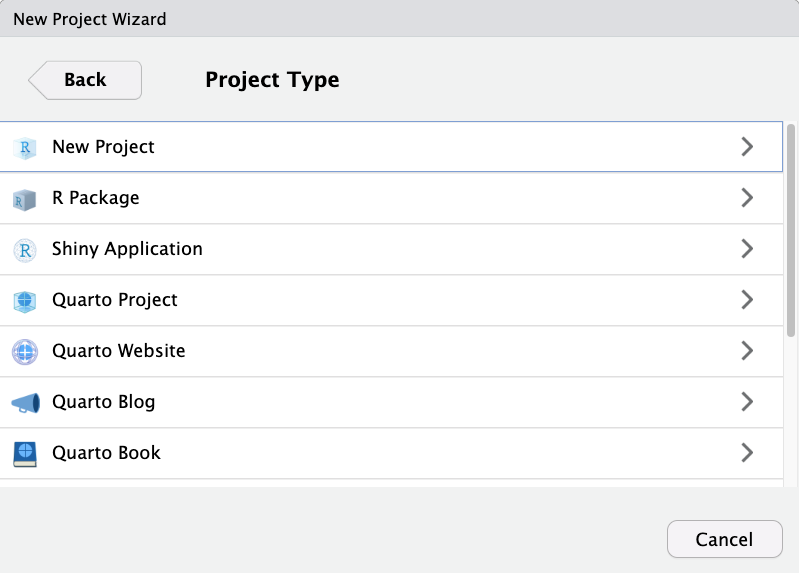

## Quarto Projects

You may remember (or not, that's ok!) that when we saw how to create a new Project back in episode 4 we were presented with this long list of project options: 

{: .image-with-shadow}

We told you not to worry too much as most of these options are just variations of a regular old R Project (including a Quarto Project!) Regardless of your choice at this step, you can create new Quarto documents within R projects, Quarto projects, or even outside projects at any time. You may also convert an R project to a Quarto project and back at any point as well. 

You may, therefore, be a bit confused about the distinction between a Quarto Project and a regular R Project. To put it simply, a Quarto project is an R Project which contains a “_quarto.yml” file. This file dictates shared YAML configuration across documents in a Quarto project. This ensures that any document rendered within the project directory automatically inherits the metadata defined at the project level allowing capabilities such as defining a style for the whole project or redirecting outputs to a specified sub-directory. The Quarto Website, Blog and Book are simply Quarto Projects with a pre-defined “_quarto.yml” file  defining some basic style settings characteristic of those mediums (and even then a Quarto Blog could be easily converted to a Quarto Website for example). 

> ## Check it out yourself
> Open up a project with one of the Quarto Project options (Blog, Book, Website) and another project with the other option. Compare the .yml files and guess at what the settings might dictate for the Quarto documents in the project.
{: .challenge}

##
FIXME Add an example of how to use "_quarto.yml" to change style options in our paper.

## Set Working Directory in Quarto Documents 

Okay, remember how we changed the file path in the code chunk we copied into our document to correct the relative path for reading the data? This happened because, in Quarto documents, the working directory is wherever the qmd document is located, but our code is located in a different folder. This means they have different relative paths to locate and read the data we want to work with. We can simplify things by designating the working directory for our document relative to the root project directory instead. This lets all files work relative to the project root instead of each other, standardizing the relative paths. Note that this is mainly important for code chunks - text portions of Quarto documents are not affected. This will clarify some of our confusion with relative paths across our R project. 

So, one should learn how to accomplish that by changing the working directory at the project level YAML settings. So we'll navigate to our _quarto.yml document in our root project directory and open it. 

We'll add the following settings to the yml file:
~~~
...
  execute-dir: project
...
~~~

So the yml file should now look something like this:

Yay! Congratulations on mastering a smoother approach to handling path problems when working with Quarto documents!

## Run Code from an External Script in a Code Chunk

Let's learn another technique for adding code-generated plots and figures to our document. This time around, let's see how to run code in a code chunk from an external R script instead of somewhat awkwardly copying and pasting the code from an R script to a code chunk in our `.qmd`.

There are at least a few benefits to running code in this modular fashion instead of copy/pasting:
1. Automatic updates: if the code gets updated in the R script, it will automatically be updated in the Quarto document as well. We won't need to copy/paste code updates, which would make it easy to end up with discrepancies between our `.r` scripts and our `.qmd` paper.

2. Readability: calling code externally only takes several lines of code - versus copy/pasting 50+ lines of code from our scripts.

3. Less fussing with relative paths* - we had to change the code slightly in the first example to update the file path to the data set, which introduces variations and inconsistencies. With this method, we won't have to modify the source code. 

*unfortunately, you will never be free of relative paths, but you can make it a bit easier on yourself.

Again, let's test this out in our generic Quarto document. After our first figure, add a new code chunk:

We're just going to test out the same figure again so we can verify this new method works.

### Add the code to our Quarto document

In the heart rate analysis code chunk, let's delete the existing code that we copy-pasted. 

~~~
# run the code from HR_analysis.R in the code directory
source("code/HR_analysis.R")
# display the plot created by code in HR_analysis.R
plot 
~~~
{: .language-r}

It should look like this:

**Attention:** DON'T forget to add a chunk name and caption for Figure 3 (we can use the same name and caption as before). Remember, we don't need to add options since we defined them globally.

> ## Time to Run!
> Let's see if our code worked when generated from an external script 
{: .checklist}

> ## Time to Render!
> If the code ran without error, let's render the whole document again and take a look.
{: .checklist}

Our plot should look exactly the same as the first copy-pasted one. 

Success! You'll notice that the global code chunk options were also applied to this code chunk.*. 

* Note: As of November 2023, Quarto has not implemented global options for `results`. This will need to be added to each code chunk if needed until further notice.

> ## Tip: Many ways to run external code
> There are at least 3-4 methods one can use to run external code; the best choice may depend on the context or your personal preference. There's no method that's a clear winner because there's an awkward quirk or another to each of them, but better than copy/pasting code from elsewhere in your project (in our humble opinion):
>
> 1. source()   -- [see more at bookdown.org](https://bookdown.org/yihui/rmarkdown-cookbook/source-script.html)
> 2. sys.source()   -- [see more at bookdown.org](https://bookdown.org/yihui/rmarkdown-cookbook/source-script.html)
> 3. knitr::read_chunk()  -- [see more at stackoverflow](https://stackoverflow.com/a/52398016)
>
{: .callout}

> ## Challenge 1: Your turn! Create Figure 3 with the external code
> 
> First, find `Example 9` in the qmd document for Fig 3 (ctrl-f "Example 9"). We need to add the code for the hormone analysis.
>
> Make sure to give the code chunk a name: `fig-hormones` and a caption: `"Fig 3: Cortisol and Amylase levels in stress and control groups"`
>
> > ## Solution:
> > ~~~
> > {r}
> > #|fig-hormones
> > #|fig.cap = "Fig 3: Cortisol and Amylase levels in stress and control groups"
> > # run the code from hormone_analysis.R in the code directory
> > source("code/hormone_analysis.R")
> > # Display the plot created by code in hormone_analysis.R
> > plot 
> > ~~~
> > {: .language-r}
> {: .solution}
{: .challenge}

