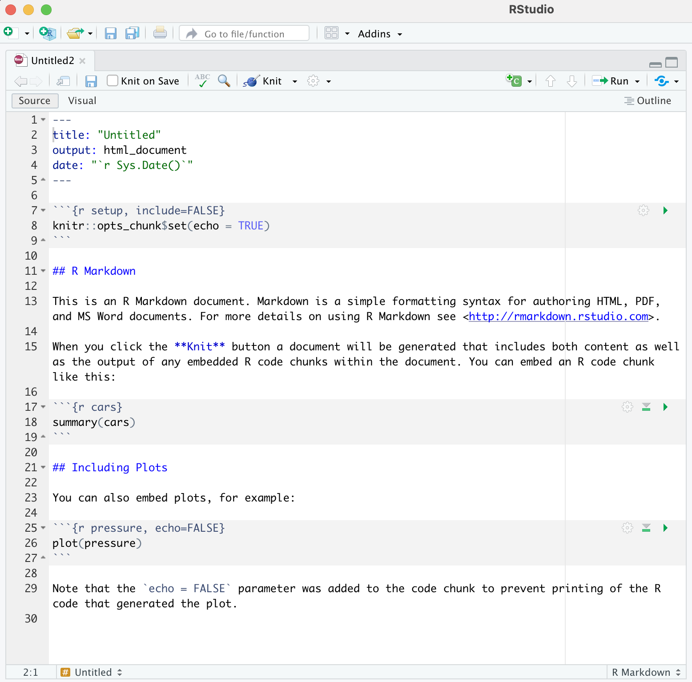

## Getting Around RStudio

Throughout this lesson, we're going to teach you some of the fundamentals of 
using R Markdown as part of your RStudio workflow.

We'll be using RStudio: a free, open source R Integrated Development Environment 
(IDE). It provides a built in editor, works on all platforms 
(including on servers) and provides many advantages such as integration with 
version control and project management.

This lesson assumes you already have a basic understanding of R and RStudio but 
we will do a brief tour of the IDE, review R projects and the best practices for 
organizing your work, and how to install packages you may want to use to work 
with R Markdown.

**Basic layout**

When you first open RStudio, you will be greeted by three panels:

-   The interactive R console/Terminal (entire left)
-   Environment/History/Connections (tabbed in upper right)
-   Files/Plots/Packages/Help/Viewer (tabbed in lower right)


Once you open files, such as .Rmd files or .R files, an editor panel will also 
open in the top left.


### R Packages

It is possible to add functions to R by writing a package, or by obtaining a 
package written by someone else. As of this writing, there are over 10,000 
packages available on CRAN (the comprehensive R archive network). R and RStudio 
have functionality for managing packages:

-   You can see what packages are installed by typing `installed.packages()`
-   You can install packages by typing `install.packages("packagename")`, where `packagename` is the package name, in quotes.
-   You can update installed packages by typing `update.packages()`
-   You can remove a package with `remove.packages("packagename")`
-   You can make a package available for use with `library(packagename)`

Packages can also be viewed, loaded, and detached in the Packages tab of the 
lower right panel in RStudio. Clicking on this tab will display all of installed 
packages with a checkbox next to them. If the box next to a package name is 
checked, the package is loaded and if it is empty, the package is not loaded. 
Click an empty box to load that package and click a checked box to detach that 
package.

Packages can be installed and updated from the Package tab with the Install and 
Update buttons at the top of the tab.

> ## CHALLENGE 2.1 - Installing Packages
>
> Install the following packages: `bookdown`, `tidyverse`, `knitr`, `rticles`,`BayesFactor`, `patchwork` , `rprojroot`    
>> ## SOLUTION 
>> We can use the `install.packages()` command to install the required packages:
>> ~~~ 
>> install.packages("bookdown")
>> install.packages("tidyverse") 
>> install.packages("knitr") 
>> install.packages("rticles")  
>> install.packages("BayesFactor") 
>> install.packages("patchwork") 
>> install.packages("rprojroot") 
>> ~~~
>> An alternate solution, to install multiple packages with a single 
>> `install.packages()` command is: 
>> ~~~
>> install.packages(c("bookdown", "tidyverse", "knitr", "rticles", "BayesFactor", "patchwork", "rprojroot"))
>> ~~~
> {: .solution} 
{: .challenge}

## Starting a R Markdown File

Start a new R Markdown document in RStudio by clicking File \> New File \> R Markdown...


If this is the first time you have ever opened an R Markdown file a dialog box 
will open up to tell you what packages need to be installed. You shouldn't see the dialog box if you installed these packages before the workshop.


Click "Yes". The packages will take a few seconds (to a few minutes) to install.
You should see that each package was installed successfully in the dialog box.

Once the package installs have completed, a dialog box will pop up and ask you 
to name the file and add an author name (may already know what your name is) The default output is HTML and as the wizard indicates, it is the best way to start and in your final version or later versions you have the option of changing to pdf or word document (among many other output formats! We'll see this later).

### Naming your new R Markdown Document


New R Markdown files will have a generic template unless you click the 
"Create Empty Document" in the bottom left-hand corner of the dialog box.

If you see this default text you're good to go: 

### Visual Editor vs. Source Editor

RStudio released a new major update to their IDE in January 2020, which includes a new "visual editor" for R Markdown to supplement their original editor (which we will call the source editor) for authoring with R Markdown syntax. The new visual editor is friendlier with a graphical user interface similar to Word or Google docs that lets you choose styling options from the menu (before you had to either have the R Markdown code memorized or look it up for each of your styling choices). Another major benefit is that the new editor renders the R Markdown styling in real time so you can preview your paper before rendering to your output format.

#### Source Editor

The image below displays the default R Markdown template in the "source editor" mode. Notice the symbols scattered throughout the text (#, *, <>). Those are examples of R Markdown syntax, which is a flavor of Markdown syntax, an easy and quick, human-readable markup language for document styling. 
  
  


> ## CHALLENGE 2.2 - Formatting with Symbols (optional)
> In Rmd certain symbols are used to denote formatting that should happen to the text (after we "knit" or render). Before we knit, these symbols will show up seemingly "randomly" throughout the text and don't contribute to the narrative in a logical way. In the template Rmd document, there are three types of such symbols (##, **, <>) . Each symbol represents a different kind of formatting (think of your text formatting buttons you use in Word). Can you deduce from the surrounding text how these symbols format the surrounding text?  
> ```
> ## R Markdown
>
> This is an R Markdown document. Markdown is a simple formatting syntax for authoring HTML, PDF, and MS Word documents. For more details on using R Markdown see <http://rmarkdown.rstudio.com>.
>
> When you click the **Knit** button a document will be generated that includes both content as well as the output of any embedded R code chunks within the document. You can embed an R code chunk like this:
> ```
>> ## SOLUTION
>> `##` is a heading, `**` is to bold enclosed text, and `<>` is for hyperlinks. 
>> Don't worry about this too much right now! This is an example of R Markdown syntax for styling, you won't need it if you stick to the visual editor, but it is recommended to get at least a basic understanding of R Markdown syntax if you plan to work with `.rmd` documents frequently.
> {: .solution}
{: .challenge}

#### Switch to the visual editor

The new visual editor is accessible through a small button on the far right side of the script/document pane in RStudio. The icon is a protractor, but from further away it just looks like a squiggly "A". See the image below to find the visual editor button, it isn't the most obvious!

  
#### Visual Editor

We've already touched on the visual editor and it's useful features, but now that we've switched to the visual editor take another look at your document and see what's changed.
You'll notice that formatting elements like headings, hyperlinks and bold have been generated automatically, giving us a preview of how our text will render. However, the visual editor does not run any code automatically, we'll have to do that manually (but we will learn how to do that later on).

  

We will proceed using the visual editor during this workshop as it is more 
user-friendly and allows us to talk about styling without needing to teach the 
whole R Markdown syntax system. However, we highly encourage you to become 
familiar with markdown syntax (specifically the R Markdown flavor) as it 
increases your abilities to format and style your paper without relying on the 
visual editor options.


> ## Tip: Resources to learn R Markdown  
> if you want to learn how to use the source editor (as we call it) please see 
> the the [Pandoc Markdown Documentation](https://pandoc.org/MANUAL.html#philosophy).
> You will need to know Markdown formatting (specifically R-flavored Markdown).       
{: .callout}


Now we'll get into how our R Markdown file & workflow is organized and then on 
to editing and styling!
