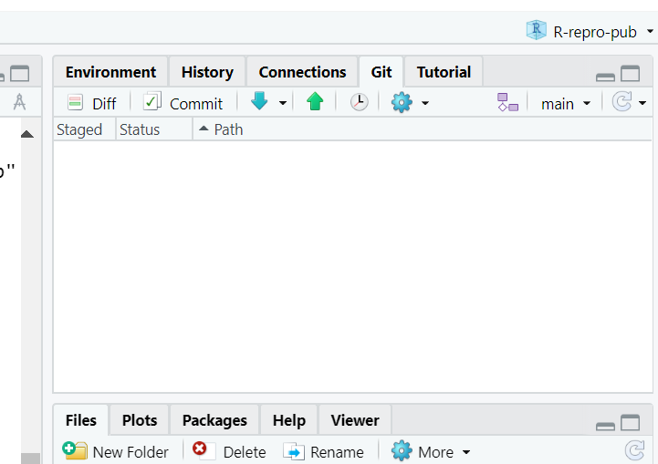
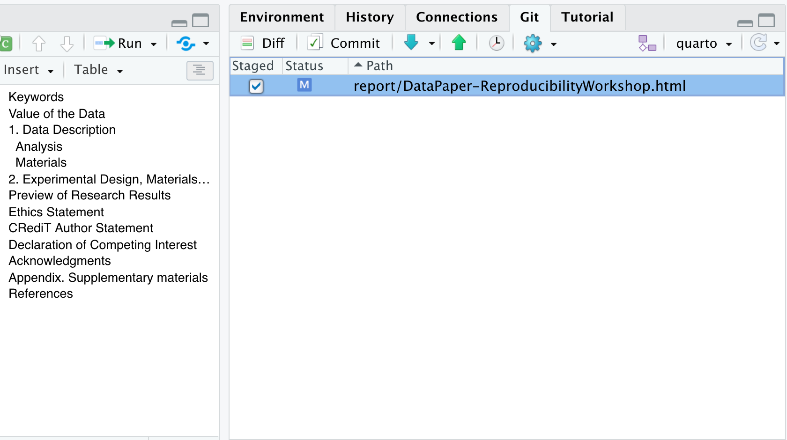
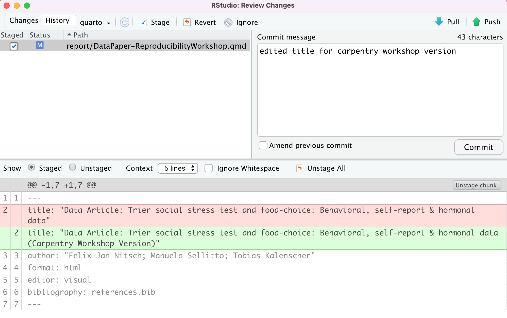

## Using Version Control in RStudio

There are two places we can interact with Git in the RStudio interface.
1. Menu bar (Tools menu) {: .image-with-shadow}  
2. Environment/History pane {: .image-with-shadow}

Ok, but what do all the options mean? We won't go through them all, but here are the basics to get started versioning your project.

### Git Workflow

The most simple workflow for version control (working on your computer only)
is referred to as "add" and "commit":

But what do those words even mean?

**Add:** Choose a file or files to take a "snapshot" of. What files do you want to add to your next version?

**Commit:** Take a "snapshot" of a selected version of your project. The snapshot will *only* include the files you "added", typically only files that you've edited since your last commit.

You may have just a few commits in a single work session or many commits.

When you commit, you add a "commit message," a.k .a. a short line of text (recommended 50 characters or less) that describes the changes that were made to the file(s) you added. This helps keep your versions organized and makes it easier to remember what you did or restore your work to exactly the version needed if you make a mistake or want to implement a change.

#### Git Workflow with GitHub

If we are saving our work to a version control hosting cloud platform such as GitHub,
our workflow gets a bit more complex, we add a "pull" and "push" step at the beginning and end of a work session.

`Pull > add > commit > push`

**Pull:** *download* the most recent version of the repository *from* GitHub *to* your local computer.

**Push:** *upload* the most recent version of the repository *to* GitHub *from* your local computer.

Put a pin in pulling and pushing for now. For the time being, as we edit our paper, we will just stick to adding and committing. In the end, we'll see how to use push to GitHub, and you can experiment with pulling later on.

### Tips for working with Git

- Commit frequently; each commit should be a distinct set of edits that you can summarize in 50 characters or less. Don’t add a bunch of unrelated edits to the same commit; it makes it harder to look back through your “snapshots” and find the right one if you need to.

## Committing your edits

Now, that we have performed a few edits to the qmd paper example, in the Environment panel, toggle to the Git tab. You'll see the file that was edited with a checkmark next to it. Click the check mark to "add". Note that if you edited more than one file, you could choose any or all of the documents to "add".

{: .image-with-shadow}

Have you noticed the blue 'M' icon in the Git Tab before you added your commit message and staged your edits? Do you know what it means? That 'M' indicates tracked files that have been modified. However, there are other flags depending on your interactions with project files—such as deletions, renames, or additions. Additionally, files might be ignored and not tracked at all, as illustrated below.

Now, click commit. A dialogue box will pop up. You'll need to add a commit message to proceed. Add something about "editing the paper during the workshop". The difference between your files will show in the bottom panel.

{: .image-with-shadow}

Hit commit, and a dialogue box will show a completed commit. Warning: **DO NOT PUSH** anything yet!

Congrats! You made your first commit! 

> ##Note: Commit frequency
> 
> Typically, we would not wait that long to commit changes and we would prefer to break them down and have more specific messages to track changes more effectively. But we had to keep it simple for this workshop. 
{: .callout}

> ## Discussion: (optional) Utilizing .gitignore files
> a `.gitignore` file is used to signal to Git NOT to track versions of specific files. One instance where this is used in a data analysis project is with data files that are too large to be uploaded to GitHub.
>
> Now, there are some caveats to this, so in what situations would it make sense to add data to the .gitignore, and in what situations would it not? What else could you imagine you wouldn't want to track in your research project?
>
> > ## Solution:
> > Why and when would it be a good idea to add data files to the `.gitignore`?
> > - With raw data files - since they will not be modified (remember: raw data = read-only).
> > - With sensitive data - This should absolutely not be pushed to GitHub
> >  
> > Why and when would it not make sense to add data files to the `.gitignore` so they will be available in the Git repository?
> > - pre-processed data files - these are the data files that are edited - processed from the raw data
> > - small data files - may not make much of a difference whether they are tracked or not
> > - the first time you add data files - You can't push data files to GitHub unless they are tracked. So, if you want your data on GitHub but don't want to track it, you must make sure you push once and then add the file to the .gitignore file.
> {: .solution}
{: .challenge}

> ## Challenge 1 (optional): Add the data files/directories to .gitignore
> Add the data (all of the raw data files) to the `.gitignore`.  
> Hint: there are two ways to do this.  
> Hint2: add a forward slash `/` after directories.
>
> > ## Solution:
> > 1) Open the .gitignore file by double-clicking on it in the file view pane; on a new line add `data/`. Save the file, and don't forget to commit it.
> > {: .image-with-shadow}
> > 2) Click on the settings gear in the Git tab of the environment pane. Click on `gitignore`. On a new line, add `data` and click save. Don't forget to commit the `.gitignore` file.
> > {: .image-with-shadow}
> {: .solution}
{: .challenge}
