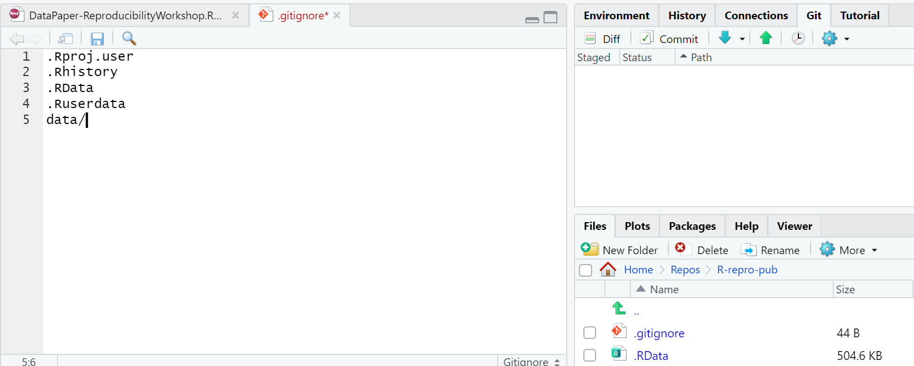
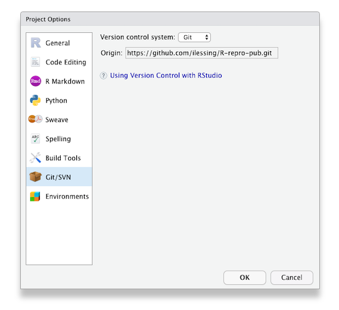

**This needs attention! Content moved from ep. 5 from the previous workshop version.**

Now, let's dive in to how to use version control.

## Using Version Control in RStudio

There are two places we can interact with Git in the RStudio interface.
1. Menu bar  <br>
2. Environment/History pane 

Ok, but what do all the options mean? We won't go through them all, but here are the basics to get started versioning your project.

### Git Workflow

The most simple workflow for version control (working on your computer only)
is referred to as "add" and "commit":

But what do those words even mean?

**add:** choose a file or files to take a "snapshot" of. Aka what files do you want to add to your next version?

**Commit:** Taking a "snapshot" of a selected version of your project. The snapshot will *only* include the files you "added", typically only files that you've edited since your last commit.

You may have a few to many commits in a single work session.

When you commit, you add a "commit message" aka a short line of text (recommended 50 characters or less) that describes the changes that were made to the file(s) you added. This helps keep your versions organized and makes it easier to go back to remember what you did or to restore your work to exactly the version needed if you make a mistake or want to implement a change.


#### Git Workflow with GitHub

If we are saving our work to a version control hosting cloud platform such as GitHub,
our workflow gets a bit more complex, we add a "pull" and "push" step at the beginning and end of a work session.

`Pull > add > commit > push`

**Pull:** *download* the most recent version of the repository *from* GitHub *to* your local computer.

**Push:** *upload* the most recent version of the repository *to* GitHub *from* your local computer.

Put a pin in pulling and pushing for now. For the time being as we edit our paper we will just stick to adding and commiting. At the end we'll see how to use push to GitHub, and you can experiment with pulling later on.

### Tips for working with Git

- You should pull each time you start working on your project after a hiatus, or before each edit if you know a team member is working at the same time.
- Commit frequently, each commit should be a distinct set of edits which you can summarize in 50 characters or less. Don’t add a bunch of unrelated edits to the same commit, it makes it harder to look back through your “snapshots” and find the right one if you need to.
- At the end of your work session (or more frequently if you are working at the same time as team members), “push” your commits to the remote repository - this is the only way your local changes get added to your team’s remote repository.

This pull, add, commit, push routine will become second nature. Pulling at the beginning and pushing at the end of your work session becomes a sort of ritual that marks the beginning and end of your work session.

## Your first edit

Now, let's open up the report in this repository that's already been drafted. You will find it in the `report` directory with filename: `DataPaper-ReproducibilityWorkshop.qmd`.  Open it up and we will make an edit to the yaml front matter of this draft report so we can practice using version control.

In the title add "(Carpentry Workshop Version)" and make sure to save it.


Now, in the Environment panel, toggle to the Git tab. You'll see the file that was edited with a check mark next to it. Click the check mark to "add" . Note that if you edited more than one file you could choose any or all of the documents to "add".


Now, click commit. A dialogue box will pop up. You'll need to add a commit message to proceed. Add something about editing the title. The difference between your files will show in the bottom panel.


Hit commit and a dialogue box will show a completed commit. Warning: **DO NOT PUSH** anything yet!

You made your first commit!

> ## Discussion: (optional) Utilizing .gitignore files
> a `.gitignore` file is used to signal to Git to NOT track versions of specific files. One instance where this is used in a data analysis project is with data files that are too large to be uploaded to GitHub.
>
> Now, there are some caveats to this, so in what situations would it make sense to add data to the .gitignore and what situations would it not? What else could you imagine you wouldn't want to track in your research project?
>
> > ## Solution:
> > Why and when would it be a good idea to add data files to the `.gitignore`?
> > - With raw data files - since they will not be modified (remember: raw data = read only).
> > - With sensitive data - This should absolutely not be pushed to GitHub
> >  
> > Why and when would it not make sense to add data files to the `.gitignore` so they will be available in the Git repository.
> > - pre-processed data files - these are the data files that are edited - processed from the raw data
> > - small data files - may not make much of a difference whether they are tracked or not
> > - the first time you add data files - You can't push data files to GitHub unless they are tracked. So if you want your data on GitHub, but don't want to track it, you must make sure you push once and then add the file to the .gitignore file.
> {: .solution}
{: .challenge}

> ## Challenge: (optional) Add the data files/directories to .gitignore
> Add the data (all of the raw data files) to the `.gitignore`.  
> Hint: there are two ways to do this.  
> Hint2: add a forward slash `/` after directories.
>
> > ## Solution:
> > 1) open the .gitignore file by double-clicking on it in the file view pane, on a new line add `data/`. Save the file and don't forget to commit it.
> > 
> > 2) Click on the settings gear in the Git tab of the environment pane. Click on `gitignore`. On a new line add `data` and click save. Don't forget to commit the `.gitignore` file.
> > 
> {: .solution}
{: .challenge}

**Need to check for flow**


In [episode 5](../05-setup-versioning/) we learned about using version control as you write your publication.  In this part of the workshop we'll setup Rstudio to authenticate with Github which is necessary to _push_ your changes to Github.

Terminology:  Git _Push_ and _Pull_

Definition: The process of syncronizing your local git repository with your git repository on Github (or other Git server).

Github used to allow simple Username & Password authentication but now Github requires a more secure method of authentication.  For this workshop we'll be using the Personal Access Token method.  The Personal Access Token (PAT) must be created for your account on github.  You'll use the PAT to authenticate instead of your Github account password.

1. Login to your Github account with your web browser. [https://github.com](https://github.com)
1. On Github.com go to your account setting -> Developer Settings -> Personal access tokens or this link: [https://github.com/settings/tokens](https://github.com/settings/tokens)
1. Any tokens you have created in the past will be listed there and you can click "Generate new token" button.  Set an expiration date for your new token and a scope.  For this workshop the "Repo" scope should be sufficient.  Then Generate your new Token with the button at the bottom of the page.


* On the next screen github shows you the new token.  **Be sure to copy it** as you only get one chance to see the token text.

> ## Note: 
>
> If you cloned the repository from Github in Episode 5 the next 2 steps are not necessary as the "origin" is set as part of the cloning process. 
{: .callout}


## Getting your repository's URL from Github
You can get the address of your repository from Github by navigating to your repository on Github.com and clicking the green "Code" button.  


With that address you can complete setting the origin URL in the next step. 

## Checking and Setting the "Origin" for the local copy of your repository.

If you forked and cloned the demonstration publication for this workshop as covered in an earlier episode then your copy of the repository should already have the "origin" set.  Once the "origin" is set properly you should be able to push and pull your changes to and from Github.  When you clone a repository from Github your local copy of the repository should have Github set as the "origin".  

You can check this in Rstudio --> Tools --> Project Options --> Git/SVN

If the "Origin" field is blank then you'll need to add it from the terminal with a couple of terminal commands like this:
```
git remote add origin <paste your repository address here>
git fetch --set-upstream origin main
```

Be sure **your** Github username is part of the URL.

After you've updated the Origin URL from the command line go back to R Studio --> Tools --> Project Options --> Git/SVN to verify you have the "Origin" field filled in.  It should look like this.

 


## Push your local changes up to your repository Github.
With authentication set up and your local copy of your repository pointing to Github as the "Origin" you should be able to make changes locally and _push_ them up to Github.  

When you are prompted enter your Github username and then paste in your Personal Access Token (PAT) when prompted for your github password.


 Let's try it and see if it works.

> ## Challenge: Push to Github
> 
> 1. Make a change to one of the files in your project or add a new file.
> 2. In R Studio's Git panel check the box to Stage the changed file.
> 3. Commit the change to your Git repository.
> 4. Click the green up arrow to _Push_ you repository changes up to Github.
> 5. Look on [Github.com](https://github.com) to verify your changes are there.
> 
{: .challenge}

With the ability to synchronize your changes between Github and your local the next step is explore options for publishing your research paper.



