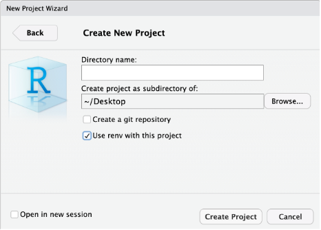

## Avoiding the Dependency Hell

Assume you have followed all the recommended practices to create reproducible projects. You chose RStudio/R, a free and open-source software; you have used relative paths, and produced clean and clear code; your project directory and data files follow name conventions and are well-organized and beautifully documented. Is that all? Well, almost, but not quite. 

Imagine investing significant time and effort into completing sophisticated data analysis, only to face a frustrating situation. When R gets upgraded, and new package versions are released, everything suddenly comes crashing down. How can you ensure that the packages you rely on for your project remain on the same version consistently, even in the future? 

One common reproducibility issue in research relates to software dependencies. "Dependency hell" is a coloquial term used to describe a situation in software development where the complex web of dependencies between different software components becomes difficult to manage or resolve. It typically occurs when multiple software libraries or packages have conflicting or incompatible requirements regarding the versions of other libraries or packages they rely on.

If you can only install one version of the shared software or library, you may have to find newer or older versions of the other software packages. But doing so can create more problems because those new versions might not work with other software you have installed, causing problems for your code to break and your publications not to render things correctly.  

Let's say you're working on a data analysis project and have two R packages you're using: "package X" and "package Y."

`"package X" version 1.0.0 depends on "package Z" version 2.0.0.
"package Y" version 1.5.0 depends on "package Z" version 1.0.0.`

You start your project by installing the latest versions of both packages. At this point, everything works fine, and you can proceed with your analysis using both packages. However, a few months later, you must reproduce your analysis and reinstall the packages. Unknown to you, "package Z" has been updated since your last installation, and the new version is incompatible with the older version that "package Y" depends on. When you try to run your analysis, you encounter errors or unexpected behavior because "package Y" is no longer compatible with the updated version of "package Z." This mismatch in dependencies can result in reproducibility issues, making it challenging to replicate your previous results.

Therefore, you should ask yourself:
* What are the versions of the packages used for my project?
* Will my project be usable on other systems or in the future?
* How to deal with projects requiring different versions of a package?


## Enhancing reproducibility with renv

To mitigate dependency issues, it's important to maintain a record of the package versions used in your analysis and create a reproducible environment, and that's where the renv package comes in!

Renv enables you to maintain the specific versions of packages your project depends on, ensuring their stability and compatibility throughout its lifecycle by freezing package versions, and protecting your project from unexpected issues or incompatibilities that may arise from updates. In other words, it allows you to create isolated project-specific environments that capture specific versions of packages, ensuring that the same versions are used every time you reproduce your work. This makes it easy for a downstream user to run an R project in the same environment in which it was originally developed. In sum, there are three main advantages of using renv: 

* Isolation: Each project gets its own library of R packages. In this way, you can upgrade and change package versions in one project without worrying about your other projects.

* Portability: You can more easily share and collaborate on projects while ensuring all are sharing the same common base, by sharing a lockfile (renv.lock) which captures the state of your R packages.

* Reproducibility: You can restore your R library exactly as specified in the renv.lock file. 


## How does renv work?

Let's first understand how the R system typically handles packages you install to use in your project.
A package is a collection of functions, data, and compiled code in a well-defined format, while libraries are the location where packages live. You may have multiple projects with different dependencies when using R, but calling packages from the same library. By default, we have two libraries, System and User:


The problem with this approach is that, most likely, you will be handling multiple projects in different points in time and with unique dependencies. Every time you start a fresh project and use the `install.packages()` function in R, you will be grabbing the latest version of a given package available in CRAN or another repository and re-installing it, replacing the package in your environment, and potentially causing issues when you re-run your code and render your Quarto documents using earlier versions of that same package.

Renv creates a local project library for each project encapsulating dependencies so you can easily re-run results for each project using the original versions of packages.   


## Using renv

### Starting a new project

Now that you know about renv we always recommend you always set it up when starting a new project. There are different ways to accomplish that. 

1) When creating a new project using the new project wizard, make sure to select the option `Use renv with this project`:



2) If you missed the step described above but suddenly realized you would rather not continue without renv, don't worry. You may also enable renv by clicking Tools>Project Options...>Environments and selecting to use renv for this project: 


3) Another alternative is to install the renv package, then load it and run the `renv::init()` command in the console pane:

```
install.packages("renv")
library(renv)
renv::init()
```

This creates the initial `renv.lock` file. The renv.lock is a JavaScript Object Notation (JSON) file generated in the project directory, which records the precise versions of each package that was installed, along with other metadata such as package sources and checksums. The example below helps us to understand the anatomy of a renv.lock file:


This process will also create a `.Rprofile`, which is used to activate renv for new R sessions, and an renv folder containing the files specified below:


What if you need to update packages for your project? Then, whenever you start using a new package (or otherwise change your project's dependencies), run `renv::snapshot()` to update the lockfile.  Finally, if you are using git and start using renv, you will notice that renv creates several files and directories in addition to `renv.lock`. When done, you should commit the files to your project's git repository.


### Restoring an existing project using renv

Every time you open a project for which renv has been set up, renv automatically runs and checks that the package versions you have installed on your computer match those of the project.  If they match, there is nothing to do (perhaps that was the case for you today).  But if there are any mismatches (as might have happened to you today), renv will print a warning resembling the following:

```
* Project '~/Desktop/myproject' loaded. [renv 0.16.0]
* The project library is out of sync with the lockfile.
* Use `renv::restore()` to install packages recorded in the lockfile.
```

If this happens, simply run `renv::restore()` from the console pane to download and install the package versions needed to match the project's requirements.  For example, if the project uses tidyverse 1.3.2 and you have an older version tidyverse 1.3.1 installed on your computer, renv will upgrade your RStudio installation to tidyverse 1.3.2.  (This works conversely as well: if the project uses an older version of a package you have installed, renv will attempt to download and install the older version for you.  Don't worry about losing the newer version.  renv ensures that all versions of all packages remain installed on your computer, available for use by projects as needed).


In sum, in order to collaborate using renv, one should:

* Initialize renv using `renv::init( )`
* Share project sources (data and code), and include `renv.lock`, `.Rprofile`, and `renv/activate.R` to ensure that collaborators download and install the right version of renv when starting the project.
* When a collaborator opens the project, renv will automatically bootstrap and download the appropriate version of renv.
* If updates are made save them with `renv::snapshot( )`
* After that, collaborators can use `renv::restore( )` to restore the project library on their machine.
