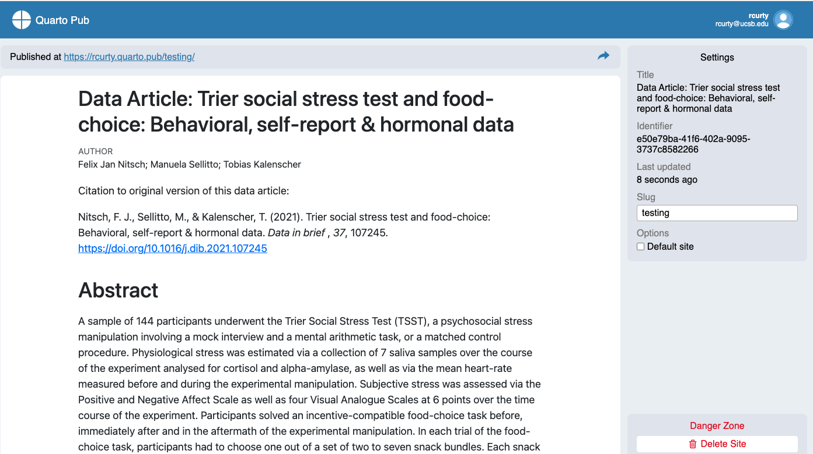
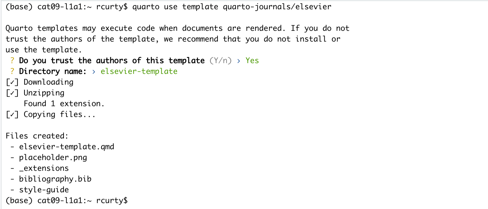

## What is Next?

Once you have completed your Quarto manuscript following all the best practices for reproducibility, including organizing your project files, what is next?  The answer depends on your plans to move forward.  Let's explore some scenarios:

### If you plan to share your insights with your community right away

#### Publishing with Rpubs

- The easiest way would be to use [Rpubs](https://rpubs.com/), which is integrated with Rstudio. Rpubs is a bare-bones, free web hosting service.  It provides no other services--- no support for search, collaboration, persistent identifiers, or versioning.  But, it is the simplest and most direct way of getting your R Markdown (and now Quarto) document published on the web directly from RStudio.  For a more full-featured hosting service, consider GitHub and GitHub Pages, which will be described later.

Notice the circular blue "Publish" button in the upper right corner of your _Render_ output.  Click this to publish to Rpubs.  This is where you'll need a Rpubs account, as mentioned in [setup](/setup.html)
for this workshop.  

Click the blue publish button:

Wait for the installation to be completed. If a little menu pops up, select "Publish Document..." and you'll be presented with the following panels:

(The other option in the dialog box, RStudio Connect, is a standalone publishing platform for teams to share content.  It requires a purchase to host and use.)

The first time you publish, RStudio will likely ask if you want to install some needed packages; say yes.  RStudio will then open up a web browser to allow you to sign in to rpubs.com.

At the end of the publishing process, your paper will be live on the internet
with a URL similar to: `https://rpubs.com/yourname/678624`

RStudio also saves an HTML version of your *knit* document to your local file system.  Look for it in the same directory as the Quarto file in your R-Studio project directory.  This html document is self-contained and highly portable.  Images are encoded directly into the HTML so you can easily move it to any web hosting you have available.

#### Publishing with Quarto Pub

[Quarto Pub](https://quartopub.com/) is a free publishing service ideal for publishing blogs, course or project websites, books, presentations, and personal hobby sites developed in Quarto. All documents and sites published to Quarto Pub are publicly visible, so be mindful you should only publish content you wish to share publicly. Also, there is a limit of 100 MB per publication and a soft limit of 10 GB per month.

There are two approaches to publish content to Quarto Pub:

1. Use the `quarto publish` command to publish content rendered on your local machine 

or 

2. If you are using GitHub, you can use a GitHub Action to render your project automatically and publish the resulting content whenever your code changes.

As we are getting started, we will briefly cover only the first approach. To explore the second option, check [Quarto Pub's documentation](https://quarto.org/docs/publishing/quarto-pub.html).

##### Publish Command

1. From the directory where your project is located, execute the quarto publish command for Quarto Pub, type:

`quarto publish quarto-pub your-document.qmd`

In our case, that would be `quarto publish quarto-pub DataPaper-ReproducibilityWorkshop.qmd`. But wait, first, we have to ensure we are using the right path to call the document, which is in the report folder. So, we can type in the terminal `cd report` before proceeding.

2. As it is our first time publishing in Quarto Pub, the command above will prompt you to authenticate. We will need to confirm the authorization and create a Quarto Pub account to first. 

3. Then, you will be offered the option to change the document type if you'd like. After the confirmation, there will be some action on the terminal to render the document, which will be published in Quarto Pub.

  

If there is time, we encourage you to try it yourself.

#### Publishing as website on GitHub

Another better but slightly more involved option for publishing a Quarto document on the web is to use GitHub and GitHub Pages.  We have already seen how RStudio has built-in support for pushing your RStudio project to GitHub.  To enable publishing to GitHub Pages, the website publication companion to GitHub, go to your repository's Settings page on GitHub and select a branch ("branch" is a repository term) to publish.  Name your main Quarto file `index.qmd`, and render it to HTML as `index.html`.  With GitHub Pages enabled on your repository, the HTML file in your repository at https://github.com/myusername/myrepo/index.html will appear on the web as https://myusername.github.io/.

#### Other document types

When you create a new Quarto file in R Studio recall that you are presented with a choice of Output Formats:

For the purposes of this workshop, we've been using HTML as the output format, but other types are available.  You can render your Quarto as a document, a presentation or a *Shiny* app.  With the default installation of RStudio HTML output is most likely to work.  Other formats may require additional R packages and/or code libraries be installed on your computer.  RStudio also has a templating system to help with creating Quarto files with common elements, YAML metadata and rendering instructions.  This can be very helpful, for example, if you want to create a weekly or monthly report documenting an ongoing experiment, study, or other changing data.

### If you are willing to publish your manuscript through a peer-reviewed journal
- Most journals now request the underlying data, code, and documentation to be shared along with the manuscript, so in that case, you will have that handy. Whenever possible, give preference to *open-access* journals with data sharing recommendations to foster open science, transparency, and research reproducibility. The [TOP Factor](https://topfactor.org/journals) allows you to search by journal title and/or discipline and will rank journals' compliance with those principles.
- If your chosen journal does not require nor recommend a particular process for making your project data available (some will dictate what, where and how project data should be uploaded), you may still consider depositing your project files in a reliable data repository and cross-reference paper and project data, ideally with a formal citation containing a [Persistent Identifier](https://www.library.ucsb.edu/sites/default/files/dls_n4_pids_navy.pdf)(e.g., DOI, ARK, handle, Purl) to avoid link rot.
- In terms of data repositories, there are many options available, and they can be disciplinary, institutional, or generalist (e.g., Zenodo, Figshare). For a comprehensive list of options available, please refer to the [Registry of Research Data Repositories]([https://www.re3data.org/). 

## Creating Pre-formatted Papers (Optional)

We have learned how to start a new document on RStudio and will learn good practices for project organization next. But let’s say you are writing a paper having a journal in mind. Writing it in your style and then formatting it before submission will duplicate your work, right? The good news is that RStudio and Quarto can give us a hand with that. 

Quarto offers some journal formats and made them available within the quarto-journals GitHub organization, including:

- Association of Computing Machinery	
- American Chemical Society	
- Biophysical journal	
- Elsevier Journals
- American Statistical Association Journals
- Journal of Statistical Software
- Public Library of Science

This list is expected to grow rapidly with new contributions submitted to the [Quarto Journal Templates Repository](https://github.com/quarto-journals). You may also create your own templates following [these guidelines](https://quarto.org/docs/journals/templates.html).  

Journal templates require features of Quarto version 1.2, so we must ensure we have the right version.  You can check your Quarto version in the Terminal with the command: `quarto --version`.  We should be good with that for this workshop, but if you are using a lab computer later on, you may need to update Quarto.  See: [pre-release versions of Quarto](https://quarto.org/docs/download/prerelease.html)

Quarto uses a template command that can be called in the terminal to create an article in any of these formats. Suppose you want to use the Elsevier template. In Rstudio, in the terminal (if not showing, select `Tools > Terminal > New`), type `quarto use template quarto-journals/elsevier`. Then, follow the steps below:

- 1) Trust the authors: `? Do you trust the authors of this template (Y/n) › Yes`
- 2) Give a name to the directory ` ? Directory name: › elsevier-template`

This will install the extension and create an example qmd file and bibliography with all required files that you can use as a starting place for your article:

  

Locate the directory where you have saved the template. You can make a copy of `elsevier-template.qmd` document or rename it as start writing your paper following the journal's formatting requirements.

It is beyond the scope of this workshop to cover journal templates more extensively, but if you want to explore further how to apply templates, apply styling and even create your own templates, check the [Quarto Journals GitHub page](https://github.com/quarto-journals/article-format-template). 

> ## Tip
> Before proceeding, always check if the template of interest meets the most updated guidelines in the journal website, since these templates are maintained by the Quarto community, not the journal editors.
{: .callout}
