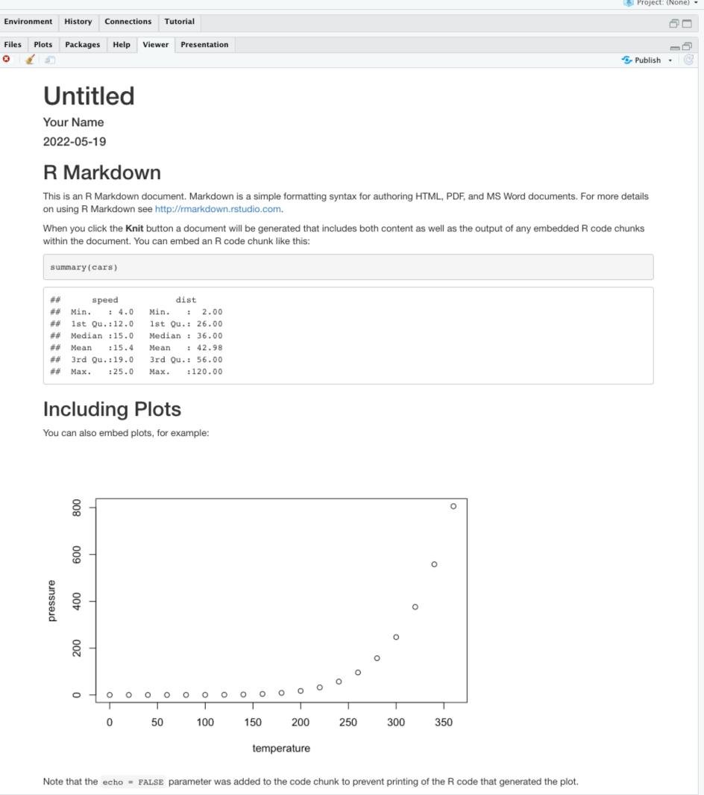
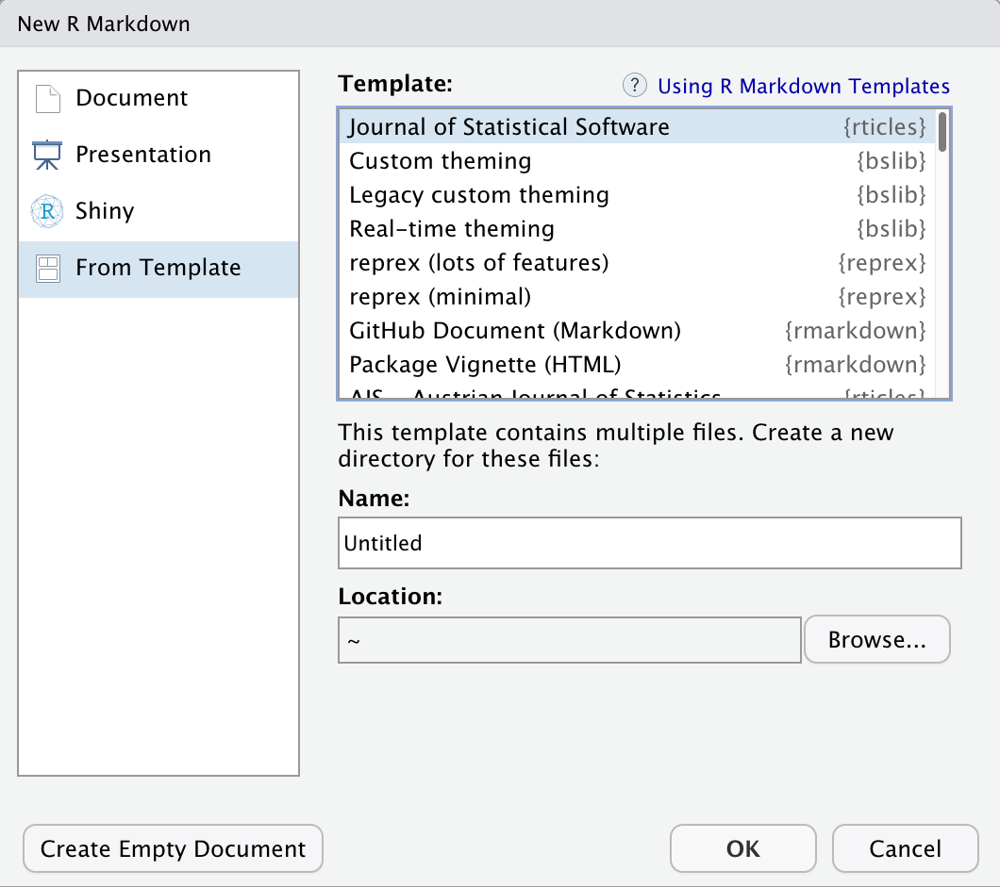

## Anatomy of an Quarto Document
The key to our reproducible workflow is using Quarto files in RStudio rather than basic scripts to dynamically render both code and paper narrative. So let’s do a quick anatomy lesson on the components of an Quarto file (YAML header, Quarto formatted, R code chunks) and how to render them into our final formatted document.
There are four distinct steps in the Quarto workflow:
1. create a **YAML header** (optional)  
2. write Quarto-formatted **text**   
3. add R **code chunks** for embedded analysis  
4. render the document with the selected engine **(Knitr in this example)**  
 

Let’s dig in to those more:

### 1. YAML header:
#### What is YAML anyway?
YAML, pronounced "Yeah-mul" stands for "YAML Ain't Markup Language". YAML is a human-readable [data-serialization](https://en.wikipedia.org/wiki/Serialization) language which, as its name suggests, is not a markup language. YAML has no executable commands though it is compatible with all programming languages and virtually any application that deals with storing or transmiting data. YAML itself is made up of bits of many languages including Perl, MIME, C, & HTML. YAML is also a superset of JSON. When used as a stand-alone file the file ending is .yml or .yaml.
 

Quarto default YAML header includes the following metadata surrounded by three dashes `---`:
* title  
* author  
* date  
* output  

The first three are self-explanatory, but what's the output? We saw this in the wizard for starting a new document, by default you are able to pick from pdf, html, and word document. Basically, this allows you to export your qmd file as a file type of your choice. There are [other options for output](https://bookdown.org/yihui/rmarkdown/output-formats.html) and even more can be added by installing certain packages, but these are the three default options.   
 

We’ll see other formatting options for YAML later on including how to add bibliography information, customize our output, and change the default settings of the knit function. Below is an example of how our YAML file will look at the end of this workshop. **FIXME - replace the YAML**

~~~
---
---
title: "Data Article: Trier social stress test and food-choice: Behavioral, self-report & hormonal data"
author: "Felix Jan Nitsch; Manuela Sellitto; Tobias Kalenscher"
date: "June, 25 2021"
output:
  html_document:
    df_print: paged
bibliography: references.bib
knit: (function(rmdFile, encoding) {
      out_dir <- '../output';
      rmarkdown::render(rmdFile,
                        encoding=encoding,
                        output_file=file.path(dirname(rmdFile),
                        out_dir,
                        'DataPaper-ReproducibilityWorkshop.html'))})
---
---
~~~

### 2. Formatted text:
This one is simple, it's literally just text narrative formatted by using markdown (more on markdown syntax later). Markdown-formatted text is one of the benefits added above and beyond the capabilities of a regular r script. Any text section will have the default white background in the qmd document. As you might know, in a regular R file, # starts a comment. In Quarto, plain text is just plain narrative text that appears in the document. In R scripts, plain text wants to be code. In Quarto, you will need to enclose your code in special characters. Any symbols you do see that aren’t regular grammar components are for formatting, such as ##, ** **, and < >.

> ## Tip: Bonus! You can use a variety of languages to format text and images in Quarto:
- Quarto
- HTML
- LaTeX
- CSS
{: .callout}

### 3. Code Chunks:
R code chunks appear highlighted in gray throughout the qmd document. They are surrounded by three tick marks on either side (\`\`\`) **in source mode** with the starting three tick marks followed by curly brackets `{}`with some other code inside. The tick marks indicate the start of a code section and the bits found between the curly brackets `{}`indicate how R should read and display the code (more on this in the Knitr syntax episodes). These are the sections you add R code such as summary statistics, analysis, tables and plots. If you’ve already written an R script you can copy and paste your code between the few lines of required formatting to embed & run whichever piece you want at that particular spot in the document.

> ## Tip: Bonus! You may code with many different languages in RStudio:  
> - R  
> - Python  
> - Bash  
> - SQL  
>
> A complete list of compatible languages can be found at: [https://rmarkdown.rstudio.com/lesson-5.html](https://rmarkdown.rstudio.com/lesson-5.html)  
{: .callout}

Let's take a look at the Quarto document template we have just created to see how formatted text and code are represented.

 

### 4. Rendering your Qmd document:
Simply put, rendering is the process of converting a document into a file format or a medium that is paginated or has the concept of pages. Clicking the render button will compile the code, check for errors, and finally, output the type of file indicated in your yaml header. You may select the option "Render on Save" to see a preview of your document every time you save edits. Attention: your qmd document may not run and render as your indicated output if there are any errors in the document so it also functions somewhat as a code checker.
 

#### Try it yourself
We’re going to pause here and see what the Quarto document does when it’s rendered. We'll just use the generic template, but when we're working on our own project, knitting periodically while we're editing allows us to catch errors early. We'll continue rendering our qmd throughout the lesson to see what happens when we add our markdown and knitr syntax and to make sure we aren't making any errors.

This is a little preview of what's to come in the later episodes:
Click the "render" button.

Before you can render your document, you'll need to give it a file name and choose what folder you want to save it to. Choose `my_first_qmd.qmd` as your file name and save it to an easily accessible directory in your file system.

This is how our html document will render after clicking the knit button and choosing a file name:
 **FIXME - REPLACE**

> ## CHALLENGE 3.1 - Rendering the document in another format
> Suppose you want this .qmd document to render as a word document. What options would you have?
>
>> ## Solution:
>> 1) You may change the output format in the YAML to `word_document`, or
>> 2) Select "Knit > "Knit to Word" on the menu.
> {: .solution}
{: .challenge}

## Finding and Applying Existing Templates **FIXME -UPDATE**

We have learned how to start a new document on RStudio and we will learn good practices for project organization next. But, let’s say you are writing a paper and you already know which journal you are submitting it to? Writing it in your own style and then formatting prior to submission is time-consuming, right? The good news is that RStudio makes our lives easier. Through a package called “rticles” you can access a number of existing journals’ templates that will let you easily and quickly format and prepare your paper draft for peer review. Even if the journal you submit to does not have a template, it may be good to review several of the templates to get an idea of formatting options available to you in R Markdown..

Let’s take a look at that! On RStudio, load the `rticles` package by using the function `library(rticles)` (remember we've already installed the package earlier!). Once you’ve loaded the package, use the plus icon at the upper-left side of your screen to create a new document or proceed with File > New File > R Markdown. This will prompt the window for creating a new R Markdown document as we saw earlier.

Clicking on `“From Template”` will prompt a couple of dozen templates listed as {rticles}. Let’s choose the Biometrics Journal template and then, OK.

Note that along with the skeleton of the paper you will see a message on top indicating additional packages you may need to install for that particular template.

> ## Tip: Create your own template
> Please remember that for this workshop we are producing a report in html and not tied to a particular journal template. You may choose other output formats such as word or pdf. Creating templates and adding other templates is beyond the scope of this workshop, but that is also possible. If you submit to the same journal frequently or use the same formatting for many of your publications, it may be worth creating your own template to save time. To learn more about how you can create templates in RStudio:
> - [Using R Markdown Templates](https://bookdown.org/yihui/rmarkdown/document-templates.html) on the right-hand side check the [rticles package documentation](https://cran.r-project.org/web/packages/rticles/rticles.pdf)
> - [How to contribute to a new article template?](https://pkgs.rstudio.com/rticles/PULL_REQUEST_TEMPLATE.html)
{: .callout}

> ## Challenge: Find a template (optional): **FIXME - REPLACE**
>
> Find the template for the Bioinformatics Journal, what does the template look like? What sections does it contain?
>
{: .challenge}

> ## Discussion: What may be the pros and cons of using an existing template? (optional)
>
>> ## Solution:
>>
>> Pros:
>> - Formatting papers according to journals' guidelines can be very cumbersome and time-consuming. So, using a template for a specific journal will save you time!
>>
>> Cons:
>> - If, along the way, you change your mind about the journal you were planning to submit to, there is no easy conversion to another template. Overwritting will cause problems.
>> - There are only a few journal titles available.
>>
>>  Tips:
>> - Always check if the template meets the most updated guidelines in the journal website. Since the rticles package is maintained by a community, we advise you check their (GitHub page][https://github.com/rstudio/rticles) for more details.
>> - Did not find a particular template? You can recommend one to the community or become a contributor!
> {: .solution}
{: .challenge}
