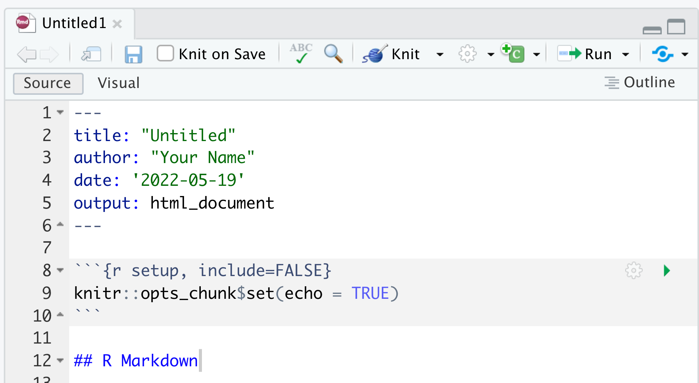
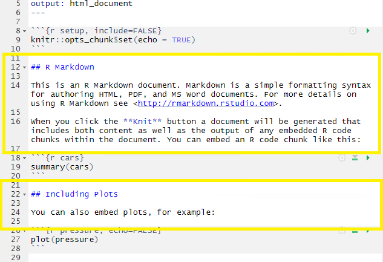
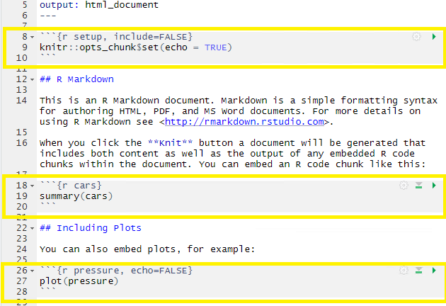
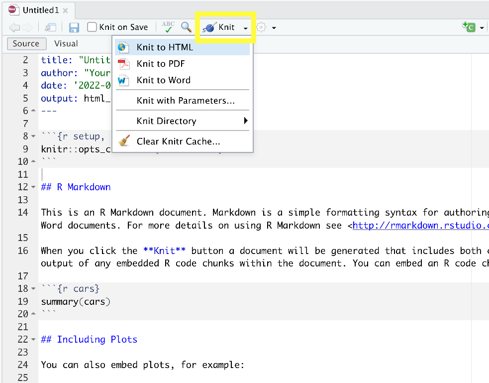
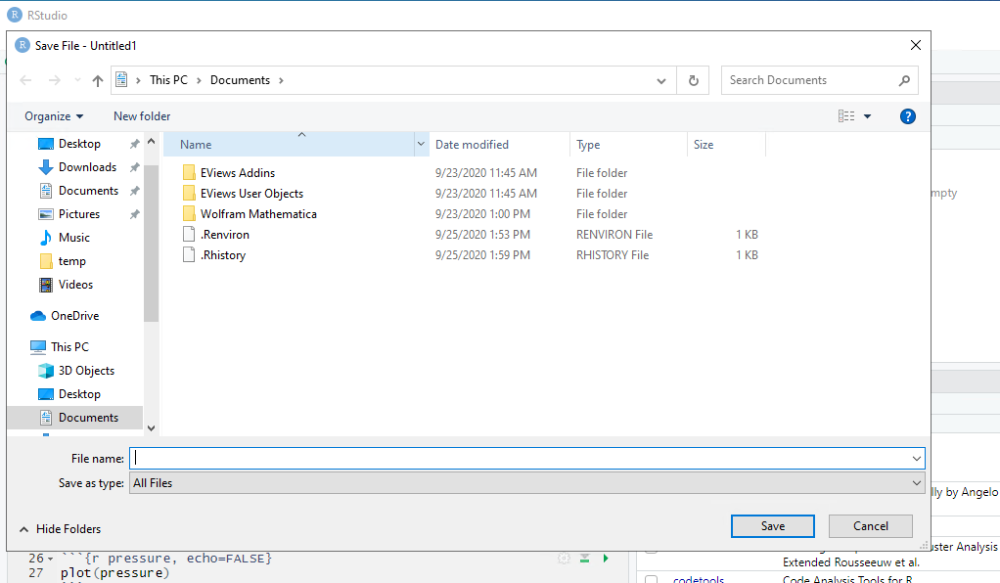
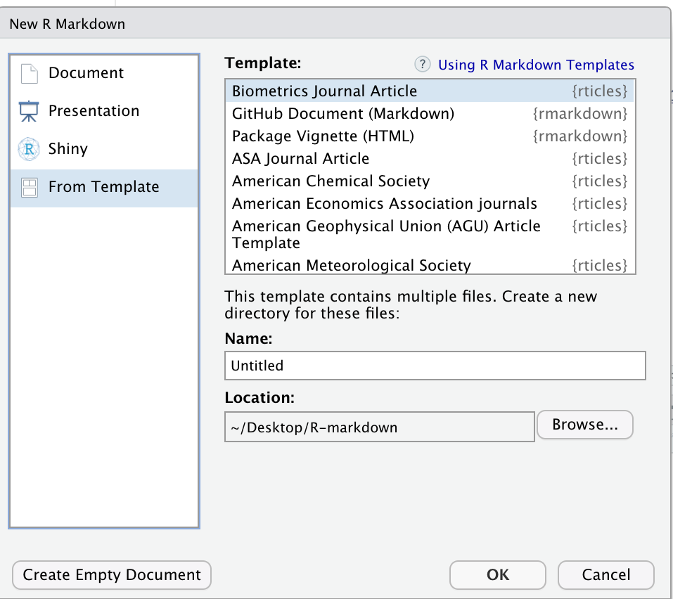

## Anatomy of an Rmarkdown File

The key to our reproducible workflow is using R Markdown files in RStudio rather than basic scripts to dynamically “knit” both code and paper narrative. So let’s do a quick anatomy lesson on the components of an R Markdown file (YAML header, R Markdown formatted, R code chunks) and how to render them into our final formatted document.
There are four distinct steps in the R Markdown workflow:
1. create a **YAML header** (optional)  
2. write R Markdown-formatted **text**   
3. add R **code chunks** for embedded analysis  
4. render the document with **Knitr**  
<br>


Let’s dig in to those more:

### 1. YAML header: 
#### What is YAML anyway? 
YAML, pronounced "Yeah-mul" stands for "YAML Ain't Markup Language". YAML is a human-readable [data-serialization](https://en.wikipedia.org/wiki/Serialization) language which, as its name suggests, is not a markup language. YAML has no executable commands though it is compatible with all programming languages and virtually any application that deals with storing or transmiting data. YAML itself is made up of bits of many languages including Perl, MIME, C, & HTML. YAML is also a superset of JSON. When used as a stand-alone file the file ending is .yml or .yaml. 
<br>

R Markdown's default YAML header includes the following metadata surrounded by three dashes `---`:
* title  
* author  
* date  
* output  



The first three are self-explanatory, but what's the output? We saw this in the wizard for starting a new document, by default you are able to pick from pdf, html, and word document. Basically, this allows you to export your rmd file as a file type of your choice. There are [other options for output](https://bookdown.org/yihui/rmarkdown/output-formats.html) and even more can be added by installing certain packages, but these are the three default options.   
<br>

We’ll see other formatting options for YAML later on including how to add bibliography information, customize our output, and change the default settings of the knit function. Below is an example of how our YAML file will look at the end of this workshop.

~~~
#FIXME make sure this matches final paper version
---
title: "Data Article: Trier social stress test and food-choice: Behavioral, self-report & hormonal data"
author: "Felix Jan Nitsch; Manuela Sellitto; Tobias Kalenscher"
date: "June, 25 2021"
output:
  html_document:
    df_print: paged
bibliography: references.bib
---
~~~

### 2. Formatted text: 
This one is simple, it's literally just text narrative formatted by using markdown (more on markdown syntax later). Markdown-formatted text is one of the benefits added above and beyond the capabilities of a regular r script. Any text section will have the default white background in the rmd document. As you might know, in a regular R file, # starts a comment. In R markdown, plain text is just plain narrative text that appears in the document. In R scripts, plain text wants to be code. In R Markdown, you will need to enclose your code in special characters. Any symbols you do see that aren’t regular grammar components are for formatting, such as ##, ** **, and < >.

Bonus: you can use a variety of languages to format text and images in R Markdown: 
R Markdown
HTML
LaTeX




> ## CHALLENGE 2.3 - Formatting with Symbols (optional)
> In Rmd certain symbols are used to denote formatting that should happen to the text (after we "knit" or render). Before we knit, these symbols will show up seemingly "randomly" throughout the text and don't contribute to the narrative in a logical way. In the generic Rmd document, there are three types of such symbols (##, **, <>) . Each symbol represents a different kind of formatting (think of your text formatting buttons you use in Word). Can you deduce from the surrounding text how these symbols format the surrounding text?  
> ```
> ## R Markdown
>
> This is an R Markdown document. Markdown is a simple formatting syntax for authoring HTML, PDF, and MS Word documents. For more details on using R Markdown see <http://rmarkdown.rstudio.com>.
>
> When you click the **Knit** button a document will be generated that includes both content as well as the >output of any embedded R code chunks within the document. You can embed an R code chunk like this:
> ```
>> ## SOLUTION
>> `##` is a heading, `**` is to bold enclosed text, and `<>` is for hyperlinks. 
>> Don't worry about this too much right now! This is an example of R Markdown syntax for styling, we'll dive into this next.
> {: .solution}
{: .challenge}

### 3. Code Chunks: 
R code chunks appear highlighted in gray throughout the rmd document. They are surrounded by three tick marks on either side (\`\`\`) with the starting three tick marks followed by curly brackets `{}`with some other code inside. The tick marks indicate the start of a code section and the bits found between the curly brackets `{}`indicate how R should read and display the code (more on this in the Knitr syntax episodes). These are the sections you add R code such as summary statistics, analysis, tables and plots. If you’ve already written an R script you can copy and paste your code between the few lines of required formatting to embed & run whichever piece you want at that particular spot in the document.

Bonus: You can use code from a number of different languages:
R
Python
Bash
SQL
We’ll see more later, but a complete list of compatible languages can be found at: https://rmarkdown.rstudio.com/lesson-5.html 




### 4. Rendering your Rmd document:
This is called "knitting"" and the button looks like a spool of yarn with a knitting needle. Clicking the knit button will compile the code, check for errors, and finally, output the type of file indicated in your yaml header. One nice thing about the knit button is that it saves the .Rmd document each time you run it. Your rmd document may not run and render as your indicated output if there are any errors in the document so it also functions somewhat as a code checker.
<br>

#### Try it yourself
We’re going to pause here and see what the R Markdown does when it’s rendered. We'll just use the generic template, but when we're working on our own project, knitting periodically while we're editing allows us to catch errors early. We'll continue rendering our rmd throughout the lesson to see what happens when we add our markdown and knitr syntax and to make sure we aren't making any errors.

This is a little preview of what's to come in the Knitr syntax episodes later on.
Click the "knit" button



Before you can render your document, you'll need to give it a file name and choose what folder you want to save it to. Choose `rmd-workshop-paper.rmd` as your file name and save the file to your `code` sub-folder. 



This is how our hmtl document will render after clicking the knit button and choosing a file name:


> ## CHALLENGE 2.4 - echo=TRUE Function (optional)
> Can you deduce what the echo=TRUE option stands for?  
>> ## Solution
>> The echo=TRUE piece is knitr syntax that sets a global default for the whole paper. This piece of code specifically, `echo=TRUE`, tells the rmd document to display the R code that generates the plots & analysis when the rmd document is rendered by hitting the "knit" button. 
>> Don't worry too much about this now, we'll learn more about this syntax in the Knitr Syntax episodes.
> {: .solution}
{: .challenge}

## Finding and Applying Existing Templates

We have learned how to start a new document on RStudio and we will learn good practices for project organization next. But, let’s say you are writing a paper and you already know which journal you are submitting it to? Writing it in your own style and then formatting prior to submission is time-consuming, right? The good news is that RStudio makes our lives easier. Through a package called “rticles” you can access a number of existing journals’ templates that will let you easily and quickly format and prepare your paper draft for peer review. Even if the journal you submit to does not have a template, it may be good to review several of the templates to get an idea of formatting options available to you in R Markdown.. 

Let’s take a look at that! On RStudio, load the `rticles` package by Once you’ve loaded the package is completed, use the plus icon at the upper-left side of your screen to create a new document or proceed with File>New File>R Markdown. This will prompt the window for creating a new R Markdown document as we saw earlier.

Clicking on `“From Template”` will prompt a couple of dozen templates listed as {rticles}. Let’s choose the Biometrics Journal template and then, OK. 



Note that along with the skeleton of the paper you will see a message on top indicating additional packages you may need to install for that particular template.

> ## Tip:  
> Please remember that for this workshop we are producing a report in html and not tied to a particular journal template. You may choose other output formats such as word or pdf. Creating templates and adding other templates is beyond the scope of this workshop, but that is also possible. If you submit to the same journal frequently or use the same formatting for many of your publications, it may be worth creating your own template to save time. To learn more about how you can create templates in RStudio:
> - [Using R Markdown Templates](https://bookdown.org/yihui/rmarkdown/document-templates.html) on the right-hand side check the [rticles package documentation](https://cran.r-project.org/web/packages/rticles/rticles.pdf)]
> - [How to contribute to a new article template?](https://pkgs.rstudio.com/rticles/PULL_REQUEST_TEMPLATE.html)
{: .callout}


FIXME:

> ## Challenge: Find a template (optional):
> 
> Find the template for ______ Journal, what does the template look like? What sections does it contain?
> 
{: .challenge}

> ## Discussion: What are the pros and cons of using a template? (optional) 
>
>> ## Solution: 
>>
>> Pros:
>> Save time by automatically importing your journal’s formatting requirements
>>
>> Cons: 
>> What if you need to submit to more than one journal?
>> Is the template accurate (up to date?)
>> Small number of journal templates available (contribute to the `rticles` package!)
> {: .solution}
{: .challenge}
