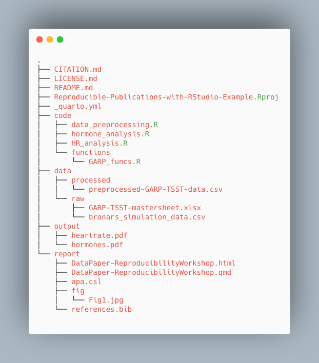

## Managing Research Projects in R
Now that we’ve learned some of the basics of authoring in RStudio with 
R Markdown documents, let’s take a step back and talk about research project 
management as a whole. 

The ability to integrate code and narratives is a major advantage of the RStudio 
environment, especially considering the scientific process is naturally 
incremental, and many projects start life as random notes, some code, then a 
manuscript, and eventually everything ends up a bit mixed together. To 
complicate things further, we are often working with other collaborators, lab 
members, graduate students, faculty from the same or different institutions, 
which makes it that much more difficult to keep projects organized. When you 
throw data into the mix (sometimes huge amounts of it!), it’s integral to use 
best practices to maintain the integrity of your analysis and to be able to 
publish high quality and reproducible research. Using R Markdown is a powerful 
tool, but it can’t be fully utilized unless your project documents, scripts and 
other files are well-organized. So let’s take a look at RStudio’s features to 
manage projects and discuss some of the best practices when working with data 
and collaborators. 

## Research Project Stress Points
We often have organizational or logistical stress points in our research that 
may become breaking points, especially when it comes to working with 
collaborators, returning to a project after a hiatus, or dealing with data and 
scripts. Let’s discuss three of those common stress points:

- **File/folder disorganization**
  - You cannot find your files on your computer (or your cloud storage)
  - Multiple versions of files with names such as "finaldraft_4.txt"
  - Path issues when trying to run code 
  - Reviewers or colleagues cannot re-run your code/analyses
- **Storage and sharing issues**
  - Files are only saved to your computer and are vulnerable (or have already 
  succumbed to computer/hard drive failure
  - When working with collaborators, they (or you) don’t share the files needed
  - Files are shared via email attachments
  - Difficult to know if you have the latest version of documents
- **Losing track of project status**
  - You cannot remember where you are in a project after being away for an 
  extended period (or what you worked on the previous day...no judgement)
  - You aren’t sure what you should be working on next
  - You have various to-do notes spread across your office or home 
  (or never write them down in the first place)

> ## Discussion
> To what extent do these stress points affect your research projects? Are there
> additional issues that you’ve encountered that slow down or derail your work 
> due to issues with project management?
{: .challenge}

> ## Discussion: Antidotes
> What are some practices you implement to keep your project materials organized?
{: .challenge}

### Antidotes

A good project layout will ultimately make your life easier:
- It will help ensure the integrity of your data
- It makes it simpler to share your code with someone else (a lab-mate, 
collaborator, advisor etc.)
- It allows you to easily upload your code with your manuscript submission
- It makes it easier to pick the project back up after a break.
- It makes your research reproducible!

We’ll discuss three aspects of project management and then implement those 
practices for the remainder of this workshop in the RStudio environment.

1. File/Folder Organization
2. Storage & Sharing
3. Using Version Control

Then, we’ll get started on our project!

## Project File/Folder Organization
### Important principles:  

Although there is no “best” way to lay out a project, there are some general 
principles to adhere to that will make project management easier:  

#### **Practice good file-organization**  

[Good Enough Practices for Scientific Computing](http://swcarpentry.github.io/good-enough-practices-in-scientific-computing/) gives the following recommendations for project organization:  
1. Put each project in its own directory, which is named after the project.
2. Put text documents associated with the project in the doc directory.
3. Put raw data and metadata in the data directory, and files generated during cleanup and analysis in a results directory.
4. Put source for the project’s scripts and programs in the src directory, and programs brought in from elsewhere or compiled locally in the bin directory.
5. Name all files to reflect their content or function.
6. Additionally, we'd recommend to include README, LICENSE, and CITATION files! 

For our project we’re working in today, we used the following setup for folders and files:



> ## Exercise: Take a few minutes to look through the workshop project files
> 
> Please take some time to look through the project files. Either the screenshot above, or you may browse the files on GitHub at <https://github.com/UCSBCarpentry/R-repro-pub>. What do each of the directories (folders) contain? What is their purpose? 
> 
> See the solution drop-down for an explanation of each directory's contents.
>
> > ## Solution:
> > 
> > - **code:** contains the scripts that generate the plots and analysis (found in `output/plots`)  
> >    - **/functions:** contains custom functions written for the data pre-processing  
> >- **data:** this folder contains the raw and cleaned data files  
> >    - **/foodchoice_data:** contains the individual data files from food choice trials  
> > - **output:** contains processed/transformed data and all plots generated  
> >	- **/data:** contains the output data file after applying custom pre-processing function  
> >	- **/plots:** contains pdfs of the plots generated from the plot scripts in the code folder  
> > - **report:** all files needed for the publication of the research project  
> > 	- **/source:** .Rmd file for the paper and additional files needed for rendering the paper  
> >      - **/fig:** contains the images created specifically (not through the analysis scripts) for the paper  
> >	- **/output:** contains the final output of the Rmd paper  
> > - **R-repro-pub.Rproj:** the R project file that lives in the root directory.  
> > - **README.md:** a detailed project description with all collaborators listed.
> > - **CITATION.md:** directions to cite the project.
> > - **LICENSE.md:** instructions on how the project or any components can be reused. 
> >
> {: .solution}
{: .challenge}

#### **Practice good file-naming**  

The three principles of file-naming are: 

1. Machine-readable  
- Friendly for searching (using regular expressions/globbing)  
    - No spaces, unsupported punctuation, accented characters, or case-sensitive file names  
- Friendly for computing  
  - Deliberate use of delimiters (i.e. for splitting file names)  
    - `data-analyses-fig1.R` with `-` used consistently as a separator   
  
2. Human-readable  
- Name contains brief description of content  
- Borrow from clean URL practices:  
  - "slug" i.e. the part of a url that is human readable     
    - i.e. `data-analyses-fig1.R`   
  
3. Plays nice with default ordering   
  - Use chronological or logical order:  
    - **chronological**: filename starts with date.   
      - i.e. `2022-01-01_data_analyses.R`  
      - Use [ISO 8601 date standard](https://en.wikipedia.org/wiki/ISO_8601)  
    - **logical**: filename starts with a number or keyword/number combo.   
      - i.e. `01_data_preprocessing.R` *see code directory*  
      - i.e. `CC-101_1_data.csv` *see data directory*  
   
Adapted from [https://datacarpentry.org/rr-organization1/01-file-naming/index.html](https://datacarpentry.org/rr-organization1/01-file-naming/index.html). For more tips on file naming, check: [The Dos and Don'ts of File Naming](https://www.library.ucsb.edu/sites/default/files/dls-n01-2021-filenaming.pdf).

> ## Challenge: File name syntax
> 
> Given the filename `CC-101_1_data.csv` and `2022-01-01_data_analyses.R`, why does it make sense to use both `-` and `_` as delimiters/separators?
> 
> > ## Solution:
> > In `CC-101_1_data.csv`, the `-` is used as part of the keyword that is shared between a number of files. the `_` separates it from the trial number and description. If one were to split the filename on the `_`, the keyword would be maintained and the trial number would be separated out. 
> > In the `2022-01-01_data_analyses.R`, `-` is used for a delimiter for the date, between year month and day. `_` is used between the rest. This allows us to split on `_` which would preserve the date (separate from other file info).
> > 
> > It's good to strategize on the best way to name files to anticipate future uses of the information contained within the filename.
> {: .solution}
{: .challenge}

#### **Use relative paths**  
This goes hand-in-hand with keeping your project within one “root” directory. If you use complete paths to say, read in your data to RStudio and then share your code with a collaborator, they won’t be able to run it because the complete path you used is unique to your system and they will receive an error that the file is not found. That is why one should always use relative paths to link to other files in the project. I.e. “where is my data file in relation to the script I’m reading the data into?” The practice of using relative paths is made easier by having a logical directory set up and keeping all project files within one root project folder. 

Assuming your R script is in a `code` directory and your data file is in a `data` directory then 
 an example of a relative path to read your data would be:
```
df <- read.csv("../data/foodchoice_budgetlines.csv", encoding = "UTF-8")
```

whereas a complete path might look like:

```
df <- read.csv("C:/users/flintstone/wilma/Desktop/project23/data/foodchoice_budgetlines.csv", encoding = "UTF-8")
```

In the complete path example you can see that the code is not going to be portable.  If someone other than Wilma Flintstone wanted to run the r script they would have to alter the path to match their system.

> ## Challenge: relative path
> 
> What would be the relative path needed to refer to the `bronars.pdf` plot (located in the plots directory) from `R-repro-pub.Rproj` (located in the root directory). What is the inversed relative path?
>
> > ## Solution:
> >
> > `R-repro-pub.Rproj` to `bronars.pdf`
> > "output/plot/bronars.pdf"
> >
> > `bronars.pdf`to `R-repro-pub.Rproj`
> > "../.."
> > ".." directs back to the directory that contains the directory of the file of interest.
> >
> {: .solution}
{: .challenge}

#### **Treat data as read only**  
This is probably the most important goal of setting up a project. Data is typically time consuming and/or expensive to collect. Working with them interactively (e.g., in Excel or R) where they can be modified means you are never sure of where the data came from, or how it has been modified since collection. It is therefore a good idea to treat your data as “read-only”. However, in many cases your data will be “dirty”: it will need significant preprocessing to get into a format R (or any other programming language) will find useful. Storing these scripts in a separate folder, and creating a second “read-only” data folder to hold the “cleaned” data sets can prevent confusion between the two sets. You should have separate folders for each: raw data, code, and output data/analyses. You wouldn’t mix your clean laundry with your dirty laundry, right?  

#### **Treat generated output as disposable**
Anything generated by your scripts should be treated as disposable: it should all be able to be regenerated from your scripts.
There are lots of different ways to manage this output. Having an output folder with different sub-directories for each separate analysis makes it easier later. Since many analyses are exploratory and don’t end up being used in the final project, and some of the analyses get shared between projects.  

#### **Include a README file**

For more information about the README file and a customizable template, check this [handout](https://www.library.ucsb.edu/sites/default/files/dls-n03-2021-readme-navy.pdf). Make sure to include citation and license information both for your data [see creative commons license]([https://creativecommons.org/licenses/) and software ([see license types on Github](https://docs.github.com/en/repositories/managing-your-repositorys-settings-and-features/customizing-your-repository/licensing-a-repository)). This information will be critical for others to reuse and correctly attribute your work. You may also consider adding a separate citation and license file to your project folder. 

Again, there are no hard and fast rules here, but remember, it is important at least to keep your raw data files separate and to make sure they don’t get overridden after you use a script to clean your data. It’s also very helpful to keep the different files generated by your analysis organized in a folder.

*what’s this .Rproj file? We’ll explain in a bit.


## Storage and Sharing

### Backup your work

Having a solid backup plan in case of emergencies (say your hard drive on your computer fails) is essential. The general guideline for back ups is to adhere to the [3-2-1 principal](https://www.uschamber.com/co/run/technology/3-2-1-backup-rule) which dictates that you should have 3 copies, on 2 different media, with 1 copy offsite. Your decision on backups will be based on your own personal tolerance but we recommend at minimum to avoid only having a copy of your project on your personal, work computer or a lab computer at all costs. 

At the very least, you should backup your project into cloud storage (either provided by your university or paid for yourself). Common cloud storage platforms include Google drive, Box, OneDrive, Dropbox, etc. Backing up a project on a local device to cloud storage allows you to meet two of the 3-2-1 criteria (2 different media and 1 offsite). If you're working with at least one collaborator and they also keep an up-to-date copy of the project on their computer, you're set!

### Version Control hosting services 

If your research project involves code, the best way to make sure you have your work backed up AND keep track of your code and data is to use a version control hosting service such as GitHub - though we'd recommend using version control for any large projects. 

The main three version control hosting services are GitHub, GitLab, and BitBucket, to see a comparison of the available options, see this comparison on [LinkedIn](https://www.linkedin.com/pulse/demystifying-git-vs-github-atlassian-bitbucket-gitlab-pawan-verma?trk=read_related_article-card_title.)  

We will proceed using GitHub because it is the most used version control platform to date. 

## Using Version Control

Ok, now let’s talk about implementing version control in your project through RStudio! But first… let's quickly clarify the difference between Git and GitHub. We already said that GitHub is the version control hosting platform. Git is the version control system and does not **have** to be used with GitHub. You can use Git and then host your code on Bitbucket for example, or save to your Google drive. In fact, you can use Git on your local system only and never save it to a cloud storage platform. However, version control hosting platforms such as GitHub enhance the benefits of version control and offer incredible collaboration features. The difference between the two can be a bit confusing because they are so often used together, but the more you use them the more it will make sense. Soon enough you'll be wondering how you even completed a code project without version control.

There are actually many ways to use Git, you could use it on GitHub only (though that suffers from lack of options and is a bit clunky), there is a Desktop interface, many serious programmers use it on command line. HOWEVER, RStudio has Git controls built in so we'll use it there - all in one place!

Before we use Git in RStudio project, we must have an R Projects file (.RProj) so let's talk about how R Projects works in RStudio.

Who has used R Projects before?


### Working in R Projects

One of the most powerful and useful aspects of RStudio is its project management functionality. We’ll be using an R project today to complement our R Markdown document and bundle all the files needed for our paper into one self-contained, reproducible bundle. An `.Rproj` file helps keep your R scripts, data and other files together - just navigate through your file system to get to your project directory and double click on the .Rproj file. The added benefit is that the .RProj file will automatically open RStudio and start your R session in the same directory as the `.Rproj` file and remember exactly where you left off. .RProj files are powerful ways to stay organized on their own, but they also unlock the additional benefit of being able to use Git within RStudio. 

> ## Tip: R Project in “root” folder
> `.Rproj` files must be in the root directory of your project folder/directory. What is the root directory again (look back at the relative paths intro)?  
{: .callout}


