::::::::::::::::::::::::::::::::::::::: objectives

- Copy an existing project on GitHub to make contributions
- Open a project with Git versioning in RStudio

::::::::::::::::::::::::::::::::::::::::::::::::::

:::::::::::::::::::::::::::::::::::::::: questions

- How do I start or continue a project with Git versioning?
- What are the features in the RStudio Interface for working with Git?

::::::::::::::::::::::::::::::::::::::::::::::::::

## Working with projects in RStudio

RStudio projects make it straightforward to divide your work into multiple contexts, each with its own working directory, workspace, history, and source documents. There are several options for working with RStudio projects and enabling version control:

1. **New Directory** - start a brand new RStudio project (with the option of version control).
2. **Existing Directory** - add existing work to a project in RStudio (with the option of setting up version control).
3. **Version Control** Continue an existing RStudio project that already uses version control (i.e., download it from GitHub).

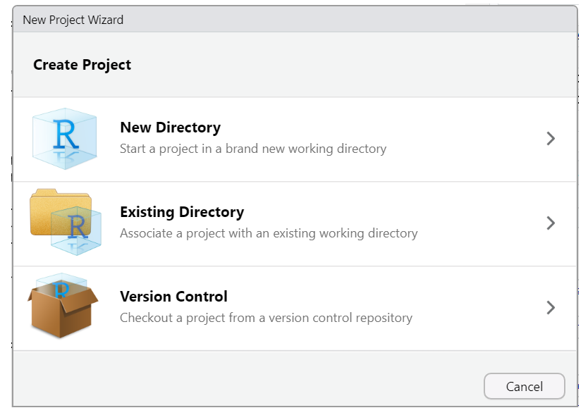{alt='new r project options' .image-with-shadow}

When initiating a new project with a new directory, you are presented with a variety of project options, including a generic "New Project" (aka R Project) and  a "Quarto project", as seen in the image below. Regardless of your choice at this step, you can create new Quarto documents within R projects, Quarto projects, or even outside projects at any time. You may also convert an R project to a Quarto project and back at any time.

However, you don't need to worry about this too much now, since we'll be working on an existing project using version control. So let's focus on the basics first, and we'll explore more advanced features of Quarto projects in a later episode.

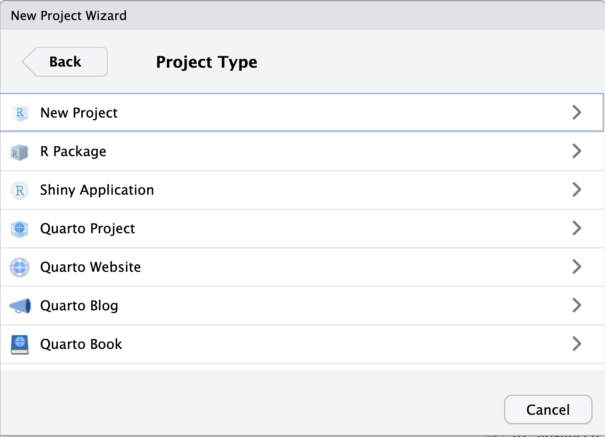{alt='quarto projects' .image-with-shadow}

## Using RStudio projects and Version Control in RStudio

Using version control is a powerful feature to make your research more reproducible and better organized. In order to use versioning while working in RStudio, make sure your work is set up as an R Project. RStudio's versioning features don't work unless your work is part of an R Project. There are three options for starting an R Project, depending on your given scenario.

*Of course, if an existing RStudio project is already under version control, then opening the project will be the only thing you need to do!*

Let's see how this setup would work.

***

### Starting a R Project with Version Control

#### Method #1

To start an R project, you would navigate to `File > new project` rather than just `File > new file`.

{alt='New directory' .image-with-shadow}

After choosing `New Directory`, choose `new project` on the next menu options.

Then, to use version control, make sure to check the "*Create a git repository*" box as highlighted in this screenshot:
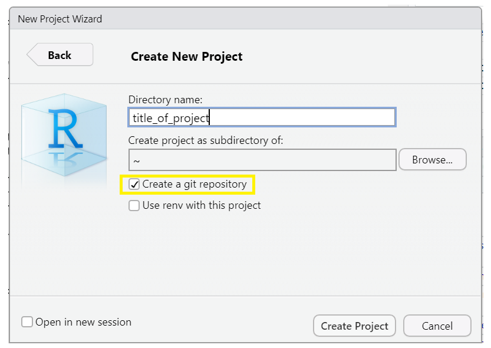{alt='new project w/ version control' .image-with-shadow}

\*Note when you choose directory name, it will create a new directory in the directory you specified along with an .Rproj file of the same name. Avoid spaces here. Underscores "\_", dashes "-" or camel case "NewProject" are recommended to name this directory/file.

\*Optionally, check the box in the bottom left corner, "Open in new session," if you want it to appear in a new RStudio window.

***

### Add versioning to an existing project

#### Method #2

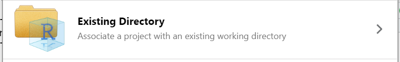{alt='existing project' .image-with-shadow}

We won't take the time to cover this here, but if you've already started a Quarto project WITHOUT version control, you can add it retrospectively. You can also add existing R files to a project and set up version control if you've done neither. To see a tutorial of this process, please see [episode 14 "Using Git from RStudio" in Version Control with Git](https://swcarpentry.github.io/git-novice/14-supplemental-rstudio.html).

This is by far the most labor-intensive way to do it, so remember to add version control at the beginning of any new project.

***

### Continue a version-controlled project

#### Method #3

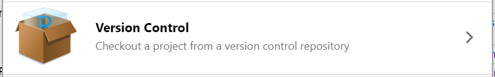{alt='version controlled' .image-with-shadow}
The final option is to continue a version-controlled project. This is the option we will do for our workshop.

First, indicate which version control language you will be using (Subversion is another version control system, though less popular than Git)

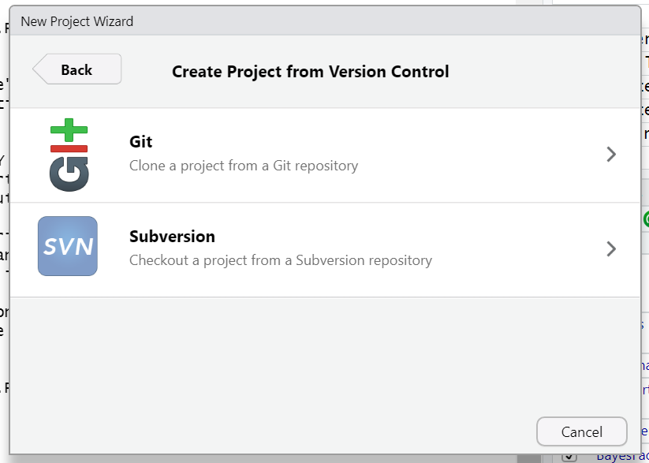{alt='Git or Subversion' .image-with-shadow}

When you choose this option, there will be a field to paste a GitHub URL (or another hosting platform). The repository name will automatically populate. Choose the directory on your computer where you want to save the project, and you are good to go!

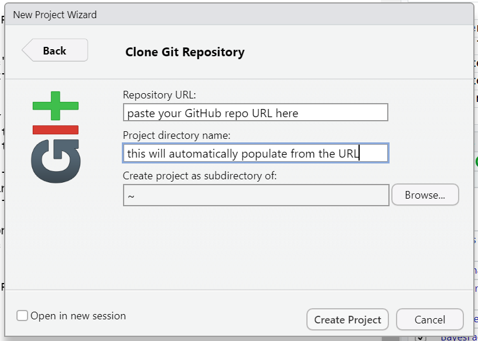{alt='continue project from GitHub' .image-with-shadow}

::::::::::::::::::::::::::::::::::::::::::  prereq

## Our turn!

### Getting the files for the hands-on part of the workshop:

We have a repository already prepared for this workshop at <https://github.com/UCSBCarpentry/Quarto-Project-Example>.
We are going to use the third option to download this repository from GitHub and work with it hands-on. You will need this repo in your working environment if you would like to follow along through this workshop.
Let's take a second to acquaint ourselves with GitHub. [At this link](https://github.com/signup), you may sign into your GitHub account or create one if you have not already.

::::::::::::::::::::::::::::::::::::::::::::::::::

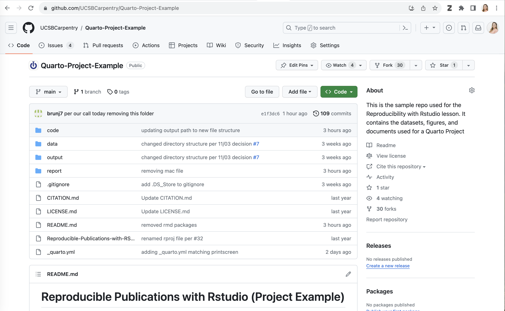{alt='GitHub' .image-with-shadow}

The two main sections are files and directories, and the README, which should contain a narrative description of the project.

We are each going to make a copy of this repository to use for this workshop. To do so, we will do what's called "forking" on GitHub. A Fork is a copy of a repository that you get to experiment with without disrupting the original project.

On GitHub, in the upper right-hand corner of the repository, click on the button that says "Fork" - see highlighted example below:

{alt='fork on GitHub' .image-with-shadow}

If you are a member of any organizations on GitHub, you will be asked whether you want to fork to your account or to an organization. Choose your personal account for this workshop.  GitHub will process it for a few moments, and voila! You have your own copy of the workshop example repository.

Now, click on the green `Code` drop-down and then click on the copy icon next to the repository URL:

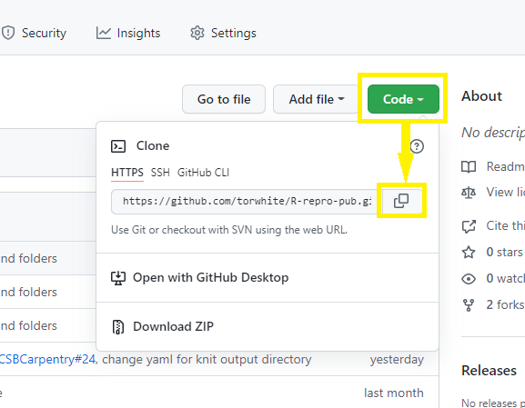{alt='copy GitHub repository url' .image-with-shadow}

Now, let's return to RStudio and make our new project.

Click `File > New Project > Version Control > Git`.

Paste in your repository's GitHub URL and click the "Create Project" button.

{alt='start my R project' .image-with-shadow}

Now, you have cloned a copy of your git repo from GitHub to your working environment.

If you're working in the JupyterHub environment or have not yet used Git on your machine, you will need to configure your Git identity with your name and email before you can commit the changes you make during this workshop.  You can just replace your name and email address in the commands below and paste them into the Terminal panel of RStudio.

```
git config --global user.email "you@example.com"
git config --global user.name "Your Name"
```

Woo hoo! We have the project we're working on for this workshop open in RStudio and set to use version control!

:::::::::::::::::::::::::::::::::::::::::  callout

## Git not detected on the system path

If you are using Git for the first time in RStudio, you may be getting a notification that Git isn't set up to work with RStudio.

See the solution below:

:::::::::::::::  solution

## Solution:

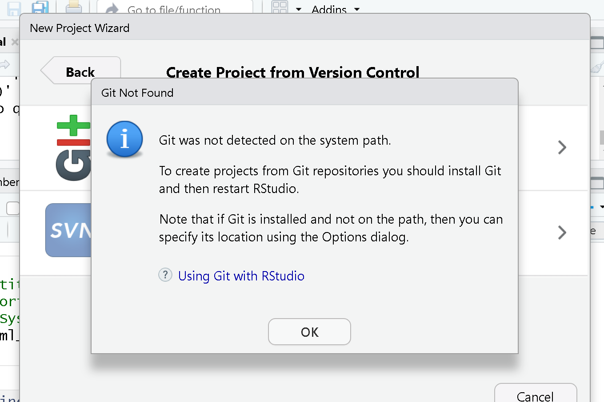{alt='Git not detected on system path' .image-with-shadow}

To set it up, we need to go to Tools > Global Options
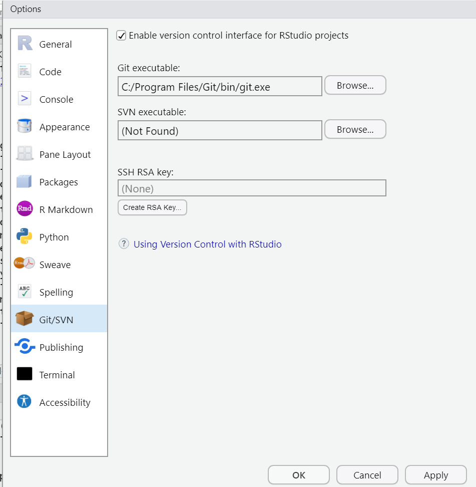{alt='Global Options Git/SVN setup' .image-with-shadow}

First, make sure "Enable version control interface for RStudio projects" is checked. Next, you must make sure that the Git executable path is correct.
For Macs, more than likely, the path will be automatically populated as: `/usr/bin/git`. You may need to change it to:  `/Library/Developer/CommandLineTools/usr/bin/git`

Windows users may find that the correct path is also pre-populated, or you may need to manually add it by clicking "browse". Your path will be something like `C:/Program Files/Git/bin/git.exe`. If not, search for where Git for Windows was installed, then open the bin folder and select the `git.exe` file.

Ok! Now we have that set up. By the way, this is a one-time setup. From now on, RStudio should know where to find git on your device. We should be able to open our project from GitHub in RStudio.

In Episodes 11 and 12 of Module 3, we’ll explore the Git workflow and discover how it can help us track changes and collaborate more effectively on projects.

:::::::::::::::::::::::::


:::::::::::::::::::::::::::::::::::::::: keypoints

- R Studio has Git version control functionality built in.
- *Forking* a GitHub repository makes a copy of the repository into your personal account on GitHub.
- You can *clone* a git repository from GitHub to your local disk using RStudio.
- For this workshop, each learner will work with their own *fork* (local copy) of the "[R-Repro-pub](https://github.com/UCSBCarpentry/R-repro-pub)" repository.

::::::::::::::::::::::::::::::::::::::::::::::::::


