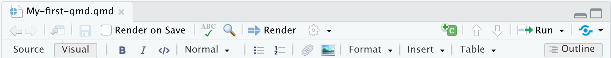
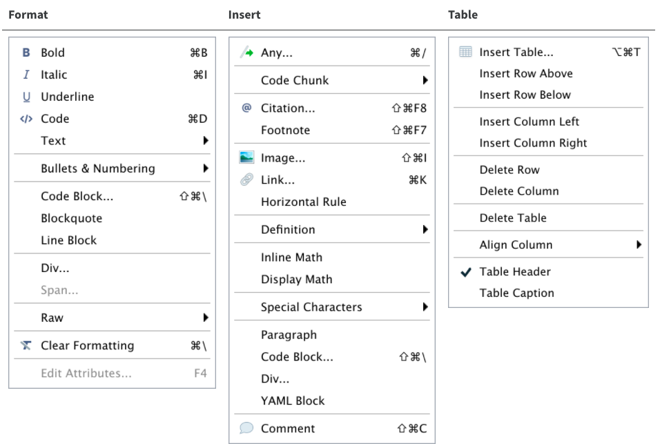
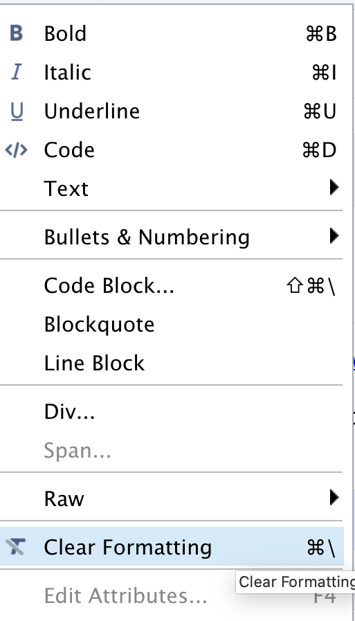
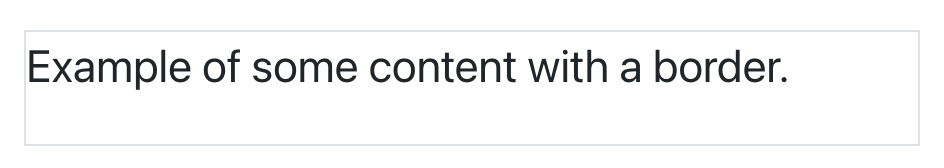
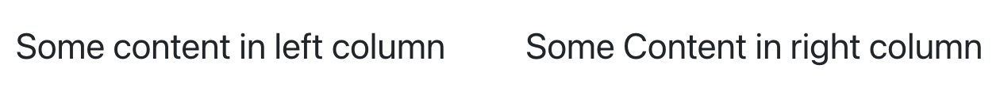

::::::::::::::::::::::::::::::::::::::: objectives

- Learn how to enable the visual editor.
- Get familiar with editing basic functionalities and options.
- Apply formatting and styling using the visual editor.

::::::::::::::::::::::::::::::::::::::::::::::::::

:::::::::::::::::::::::::::::::::::::::: questions

- What is the Visual Editor in RStudio?
- Which features does the Visual Editor have?
- How can I can apply styling and formatting to Qmd documents in RStudio more easily?
- How to add inline code?

::::::::::::::::::::::::::::::::::::::::::::::::::

## Formatting Qmd Documents with the Visual Editor

As we mentioned earlier, the visual editor in RStudio makes formatting much more effortless. It provides improved productivity for composing longer-form articles and analyses with Quarto. Markdown documents can be edited in either source or visual mode. To switch to visual mode for a given document, toggle the visual option at the top-left of the document toolbar (alternatively, on Windows, use the ⌘⇧ F4 keyboard shortcut). This will prompt a formatting bar through which you can apply styling, add links, create tables, and perform other similar functions you find in Google Docs and other document editors. Note that you can switch between source and visual mode at any time (editing location and undo/redo state will be preserved when you switch). Let's try it! Feel free to follow along or watch this quick demo. But first, make sure your visual editor is enabled on your screen. Also, make sure to open your `DataPaper-ReproducibilityWorkshop.qmd` file located at the `report` folder.

If you'd like to learn more about markdown basics and use the source mode to format your documents, check [Quarto's markdown basics](https://quarto.org/docs/authoring/markdown-basics.html).


### Editor Toolbar

The editor toolbar includes buttons for the most commonly used formatting commands:

{alt='Fig. 6.1 - Toolbar'}

Additional commands are available on the Format, Insert, and Table menus:

{alt='Fig. 6.2 - Menu'}

:::::::::::::::::::::::::::::::::::::::::  callout

## Tip: Inserting anything with shortcuts

You can also use the catch-all ⌘ / shortcut to insert just about anything. Just execute the shortcut, then type what you want to insert. For example: `/lis` will prompt listing options.

::::::::::::::::::::::::::::::::::::::::::::::::::

Let's get some formatting done in our example paper. We will look for some **Examples** and replace them with the recommended style so we can all produce a similar output at the end of the workshop.
<br>

:::::::::::::::::::::::::::::::::::::::  keypoints

## Rendering Documents

When you do your first render, the pop-up may be blocked by your browser. You can unblock the pop-up, then in the <b>Background Jobs</b> pane, find the local host URL and copy and paste it into your browser.

::::::::::::::::::::::::::::::::::::::::::::::::::

### *Applying Emphasis*

At the very top of the document, we have a recommended citation for the sample data paper (**Example 1**). We want to emphasize the journal title, "Data in brief" in italics. Select the text, click the italic icon (*I*), and voilà! Remember to delete (Example 1).

### *Adding Links*

In the same citation we have just worked on, let's now add a link to it by selecting and copying the DOI address (**Example 2**). Then click the link icon and paste the address into the URL field. Simple right? If you prefer, you can also use the drop-down insert menu or even use shortcuts. By hovering the mouse over the desired icon, you will see which keys you should use, also found in this [markdown shortcuts list](https://RStudio.github.io/visual-markdown-editing/shortcuts.html). To revert a shortcut, use the backspace key.

### *Adding Headings*

Adding headings to a Quarto markdown document in RStudio is as simple as applying links. Let's say we want the abstract section as a Heading Level 2. We can select the "abstract" then, and under "Normal" on the left-hand side of the menu, we can choose the desired level. Again, all the shortcuts will be listed next to the styling in the menu. Now apply the same heading to keywords and Level 2 to "Value of the Data" (**Example 3**).

### *Creating Tables*

Because creating tables manually in QMD documents can be a little painful for beginners, RStudio released table add-in functionality back in 2018. The new visual editor, however, has made the process of creating QMD tables more similar to other editors we use daily. In our template, we have the specification table with 10 rows and two columns. If we were willing to add that table, we could do so by inserting a table into a selected part of the document and specifying the desired number of rows and columns.  Including a caption is optional, but recommended. We can add or delete rows and columns, add a header that is set in bold by default but can be changed, and set the desired alignment. Select the desired text, then click the crossed T icon to clear formatting.

{alt='Clear Formatting Option'}

### *Creating Bullet and Numbered Lists*

As with other document editors, RStudio lets you turn text into bullet or numbered lists. Let's apply a bullet list to the paragraphs specifying the "Values of the Data" reported in the data paper (**Example 4**). Assuming we were willing to create a numbered list instead, we could have followed the same process and chosen the other icon. We can also sink or lift the listed items.

### *Adding Images*

You may need to include static images in your manuscripts. For that, you can use the insert image function, click on the painting icon, or even use the shortcut that shows right next to the function in the menu. After browsing and uploading the desired image, you can also specify the caption and image title, and adjust the dimensions if needed. Let's insert an image for Fig. 1 (**Example 5**).

### *Adding Formulas*

If you have a math formula in your manuscript, there are three different ways you may insert it. Let's look at (**Example 6**) for an example. Point and click at the insert menu, use the catch-all `⌘ /` keyboard shortcut, and then get to inline math mode, or type the formula content between dollar signs `$`. You will notice that the color and font type will change, as RStudio identifies the block as an inline equation.

## Keyboard Shortcuts

As you become a more regular RStudio user, consider using some keyboard shortcuts for all basic editing tasks. Visual mode supports both traditional keyboard shortcuts (e.g. `⌘ B` for bold) as well as markdown shortcuts (using markdown syntax directly). For example, enclose **bold** text in asterisks or type ## and press space to create a second-level heading. Here are some of the most commonly used shortcuts for Mac users:

{alt='Fig. 6.3 - Shortcuts'}

Tip: Windows users should replace in the shortcuts above `⌘` by `ctrl` and `⌥⌘` by `alt (+) ctrl`.

## Other Editing Features

The visual editor allows users to insert images by browsing for them or by copying and pasting them directly into the QMD document. There are also options to add HTML, line blocks, blockquotes, and footnotes. Up next, we will learn more about how to add code chunks. In further episodes, we will also learn how to insert citations and create a bibliography.

## Bonus Content: More Styling with Fence Divs (Demonstration Only)

Quarto also allows some cool styling using colons to create *fenced divs*. The advantage of using fenced divs is that you can section styling/layout into pieces of your content more easily, using a unified syntax, while also protecting and preserving formatting across different types of outputs. Essentially, these will adopt the following structure:

- Start and end with an equal number of colons, being a minimum of 3 `:::`
- Add curly brackets to indicate the start/end of a class or name, e.g., `{.class}`

We won't have time to cover these extensively, but let's take a look at a few examples.

### *Adding borders around text*

We can create clusters of content and add a border around the text using a div:

If we type: <br>

```

::: {.border}

Example of some content with a border.

:::

```

When we render it, we will get: <br>

{alt='Text with borders rendered'} <br>

### *Dividing content into separate columns*

If we want to separate content into two or more columns, we can accomplish this with a similar approach to the one above.

If we type: <br>

```

:::: {.columns}
::: {.column width="50%"}
Some content in the left column
:::
::: {.column width="50%"}
Some Content in the right column
:::
::::

```

When we render it, we will get: <br>

{alt='Two columns rendered'} <br>

If you would like to explore more of the *Fence Divs* and other cool functionalities, check the [Divs and Spans documentation](https://quarto.org/docs/authoring/markdown-basics.html#divs-and-spans).

:::::::::::::::::::::::::::::::::::::::  checklist

## Time to Render!

Let's see what your document looks like.


::::::::::::::::::::::::::::::::::::::::::::::::::

:::::::::::::::::::::::::::::::::::::::: keypoints

- The visual editor has made formatting much easier.
- You can apply Qmd styling without prior Quarto knowledge.
- You can include inline code in narratives for basic calculations and dynamic information.

::::::::::::::::::::::::::::::::::::::::::::::::::


