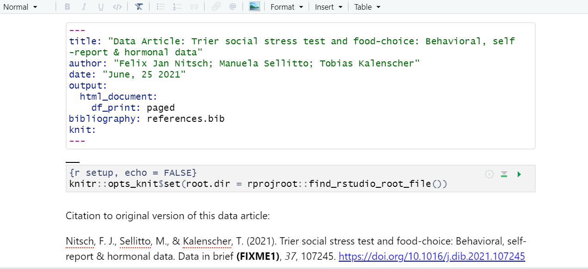
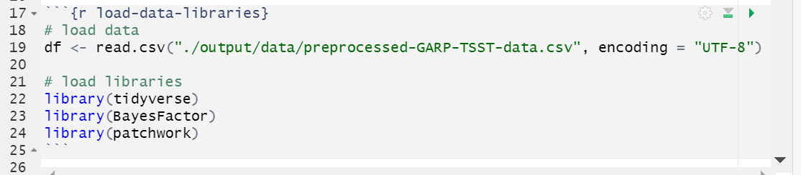

## Run Code from an external script in a code chunk

Let's add another figure generated from code. This time around let's see how to run code in a code chunk from an external R script instead of unelegantly copying and pasting the code from a R script to a code chunk in our `.rmd`.

There are at least a few benefits to running code in this modular fashion instead of copy/pasting:
1. Automatic updates: if the code gets updated in the R script, it automatically be updated in the rmd document as well. 
2. Readability: calling code externally only takes several lines of code - versus copy/pasting 50+ lines of code from our scripts.
3. Less fussing with relative paths* - we had to change the code slightly in the first example to update the file path to the data set, with this method we won't have to modify the source code. 

*unfortunately you will never be free of relative paths, but you can make it a bit easier on yourself.

First, find the FIXME in the rmd document for Fig 4 (ctrl-f "Fig 4"). We need to add the code for the hormone analysis. 

Add your code chunk:


Now, within the chunk add the code:
~~~
# run the code from 02_hormone_analysis.R in the code directory
source("../../code/02_hormone_analysis.R", local = knitr::knit_global())
# display the plot created by code in 02_hormone_analysis.R
plot 
~~~

{: .language-r}

> ## Time to Knit!
> Let's see if our code worked from an external script 
{: .checklist}


Shoot, we got an error and it looks familiar... another file path error. That's because the code we are calling from within the rmd document contains file paths to read and save the data that are relative to the `code` directory where the `02_hormone_analysis.R` resides so the paths aren't correct when run from the `.rmd` file. Yesh! All sorts of relative path chaos.

What do we do now? We could go into the `02_hormone_analysis.R` file and change the relative paths to work with the `.rmd` file, but then they won't run correctly on their own. Also, this wouldn't accomplish our goal of streamlining our plot generation by running an external script. Ugh, what can we do???

Well, there is a solution to this as well! (As with most every obstacle you run into with R). That solution is to change the working directory of our rmd document - to do that we will first introduce Global knitr options.


> ## Tip: Many ways to run external code
> There are at least 3-4 methods one can use to run external code, the best choice may just depend on the context or on your personal preference. All are a bit awkward because of relative paths, but better than copy/pasting code from elsewhere in your project (in our humble opinion):
>
> 1. source()   -- [see more at bookdown.org](https://bookdown.org/yihui/rmarkdown-cookbook/source-script.html)
> 2. sys.source()   -- [see more at bookdown.org](https://bookdown.org/yihui/rmarkdown-cookbook/source-script.html)
> 3. knitr::read_chunk()  -- [see more at stackoverflow](https://stackoverflow.com/a/52398016)
> 4. code() *in `{r}` header [see more at stackoverflow](https://stackoverflow.com/a/52400206)
>
> - another helpful page: http://zevross.com/blog/2014/07/09/making-use-of-external-r-code-in-knitr-and-r-markdown/
{: .callout}

## Global Knitr options

Benefits of global knitr options:
1. Set working directory so file paths (for code chunks) can be relative to the root instead of our .Rmd file
2. Code chunk options that can be applied consistently for the whole document
3. Load libraries and data once at the beginning of the doucment instead of in each code chunk (more concise and less rendering time)


### Set working directory to project directory:

Ok, so let's fix these path issues we get when we try to run externally sourced code. The definition of relative paths is that they are relative to your current document or working directory. So we are having issues with connections trying to read our data files because the R scripts in our code directory (../ to get to the 'root' or .Rproj directory) are in a different location relative to our rmd document (../..).  What we want to do is direct RStudio to change the default working directory for the rmd document from the directory where the document is located to the project directory (which is the root directory of our project where the .Rproj file is located). We actually have several methods to do it. 

The first option is easy - we click the menu next to the knit button and change `Knit Directory` to `Project Directory`.  *NOTE this is a bit awkward because it ONLY changes the root directory for the code chunks NOT our narrative portions (think image links and inline code). 


The second option requires a bit of code, but will overall be more reproducible (because it's not dependent on your personal RStudio IDE settings)
This is a setting option in our global knitr settings:

We will now navigate back up to the top of our `.rmd` document, right after the yaml. Here, we will add a new code chunk with the label `setup` and the options `echo = FALSE` (we don't need this code printed out in our final document!). Then, we'll add the following line of code:

~~~
knitr::opts_knit$set(root.dir = rprojroot::find_rstudio_root_file())
~~~
*notice this code uses one of our pre-installed packages `rprojroot`



Finally, let's adjust the path in the source() function after our working directory change. 

`source("../../code/02_hormone_analysis.R)` to `source("code/02_hormone_analysis.R")`

Looks neater already!

Ok, now that we've done that we'll have to go back and fix the Figure 3 code and the inline code we added earlier so it runs properly since the working directory has changed. 

> ## Challenge 9.4
> 
> Fix the relative path in the Figure 3 code so that the chunk will run properly. Hint: We changed the working directory from the directory where the `rmd` document lives `report/source` to the project directory, aka the 'root directory'
> 
> > ## Solution
> > There are two options:
> > 1. change the relative path on the line read.csv() from `../../output/` to `output/`
> > 2. delete the code from the code chunk and run the code from the external R script as with Figure 4. 
> {: .solution}
{: .challenge}

> ## Challenge 9.5
> 
> Fix the relative path in the inline code so that the chunk will run properly. Hint: We changed the working directory from the directory where the `rmd` document lives `report/source` to the project directory, aka the 'root directory'.
> 
> > ## Solution
> > 
> > Change the relative path for the inline code in the section of the paper that describes the bronars simulation data
> > from `r bronars_data <- read.csv("../../data/bronars_simulation_data.csv")` to `r bronars_data <- read.csv("data/bronars_simulation_data.csv")`
> {: .solution}
{: .challenge}

> ## Note: setting the knit directory globally with opts_knit$set
> Setting the knit directory to the project directory with the setup code chunk as we just did adjusts the working directory for all code in the R Markdown document (code chunks and inline code), but NOT for any markdown text elements (images and hyperlinks).
{: .callout}

> ## Time to Knit!
> Let's make sure all our file paths are correct and our code runs without errors. 
{: .checklist}

Now, we can have some more fun with global options:

### Global Code Chunk Options:

With our plots we set the options for each chunk individually. However, we may end up with quite a few code chunks in our paper and it might be a lot of work to keep track of what options we’re using throughout the paper. We can automate setting options by adding a special code chunk at the beginning of the document. Then, each code chunk we add will refer to those “global” options when it runs.

To set global options that apply to every chunk in your file, we will call `knitr::opts_chunk$set()` in a new code chunk right after our yaml header (name the new code chunk `setup`.

Knitr will treat each option that we add to this call as default settings for all code chunks. However, we will need to set the options for this code chunk in the first place! so we’ll use the options from our first code chunk. In the `()` after the `knitr::opts_chunk$set()` add the options:

`knitr::opts_chunk$set(echo = FALSE, message = FALSE, warning = FALSE, results = FALSE)`

Alright! That takes care of Fig 4 as well as Fig 3. Now we could go back and remove the options we set in the individual code chunks since we’ve set the global options in the document instead (however, if we left them it would render just the same.)

> ## Time to Knit!
> Again, let's make sure our global options look right by knitting.
{: .checklist}

> ## Tip: Overiding global options  
> What if you want most of your code chunks to render with the same options (i.e. echo = FALSE), but you just have one or two chunks that you want to tweak the options on (i.e. display code with echo = TRUE)? Good news! The global options can be overwritten on a case by case basis in each individual code chunk.
{: .callout}

> ## CHALLENGE 9.5 (optional) global & individual code chunk options  
>
> How would appear in our html document if we knit a code chunk with the following options?  
> `{r challenge-5, warning = TRUE, echo = TRUE}`
>
> ...considering the global chunk settings were as listed: 
> `knitr::opts_chunk$set(echo = FALSE, include = FALSE)`  
>> ## SOLUTION  
>> In this case, the global settings are set so neither the code nor the output will display. However, the individual chunk reverses the echo setting so the code will display, and it also indicates that any warnings the code renders should output too. The outputs of the code would still not be displayed (include = FALSE) The hypothetical situation for this configuration may be for debugging while writing the rmd document.   
> {: .solution}  
{: .challenge}

Before we lose track of where we were with editing up our second code chunk, let's finish it up by going back and adding a caption and name:

> ## Challenge 9.6: Add chunk name and caption to Figure 4
>
> Add the caption: `Fig 4: Cortisol and Amylase levels in stress and control groups`
> Add the name: `fig4-hormones`
>
> > ## Solution
> >
> > ~~~
> > {r fig4-hormones, fig.cap = "Fig 4: Cortisol and Amylase levels in stress and control groups" }
> > ~~~
> > {: .language-r}
> {: .solution}
{: .challenge}

### Globally load data and packages

We can actually make our lives easier in one other way too. So far we've loaded the library `tidyverse` and data frame `data1` we need in the first code chunk. Now if we want to replace, say Figure 3 (which we will do next), we would load `tidyverse` and the data for Figure 3, meaning we would be loading tidyverse for a second time unnecessarily. This is because once libraries and data are loaded they are available for the rest of the rmd document.

Instead, we can load libraries and data at the beginning of our document which makes it available for all other figures or calculations and lets us avoid repetition. This also makes it easier for us to keep track of all the libraries and data we need to use in any given document. If anything needs to be tweaked, we don't need to search through every code chunk in our rmd document to make a change. 


```
# load data
df <- read.csv("./output/data/preprocessed-GARP-TSST-data.csv", encoding = "UTF-8")

# load libraries
library(tidyverse)
library(BayesFactor)
library(patchwork)
```

It'll look like the following:


At this point we could go back through our R scripts and comment out (or delete) the beginning sections where we load the data and libraries. That will save some time for the rmd document to render, because the data and libraries will only load once instead of twice. You can imagine that the more code chunks you have the more time taking this step would save. Bonus that this also works to load the data before it is called in inline code as well!

## Inline Code

What if you only need to make a quick calculation and adding a code chunk seems a little overkill?

You can also include `r code` directly in your the text portion of your document. Say you are discussing some of the summary statistics in your manuscript, R Markdown makes this possible through HTML/LaTeX inline code which allows you to calculate simple expressions integrated to your narrative. Inline code enables you to insert `r code` into your document to dynamically updated portions of your text. In other words, if your data set changes for any reason the code will automatically update the calculation specified. 

This can be helpful when referring to specific variables on your data. For example, you should include numbers that are derived from the data as code not as numbers. Thus, rather than writing “The CSV file contains choice consistency data for 10.000 simulated participants” (**FIXME8**), replace the static number with a bit of code that, when evaluated, gives you a dynamic number if anything changes on your dataset. Please note that this insertion is not included in the visual editor, so we need to do write an expression, for example:

The CSV file contains choice consistency data for ``r nrow(bronars_simulation_data.csv)`` simulated participants.

When you knit you might get an error. Any idea why? That is because we need to make sure to import the dataset we are referring to and call it in R Markdown before the inline code can work. Let's follow this process by including:

``r bronars_simulation_data <- read.csv("../../data/bronars_simulation_data.csv")``

Time to Knit! If you update your dataset this value will match the number of rows. 

> ## CHALLENGE 6.1 - Adding inline code
> Suppose we would like to add some information to the sentence we have just adjusted in our manuscript. We would like to include the average for the variable *violation_count* present in the same dataset. Which inline code we would have to add to following sentence?
> 
> The CSV file contains choice consistency data for ` `r nrow(bronars_simulation_data.csv)` ` simulated participants, that have been used to determine the power of our food-choice task design to detect choice consistency violations, which averaged ` `enter inline code here` `. 
> What inline code would you enter? What number would replace the inline code?
> 
> Tip: we will need to use a `dataset$variable` syntax!
> 
>> ## Solution:
>> ` `r mean(bronars_simulation_data$violation_count)` `
>> 5.3924
> {: .solution}
{: .challenge}


> ## Important Note:
> Make sure the file you are calling is in the right subdirectory and your working directory is set appropriately.
>
{: .callout}


> ## More on inline codes:
> R Markdown will always display the results of inline code, but not the code. Inline expressions do not take knitr options.
>
{: .callout}

> ## Tip: Yaml chunk options
> We can also tweak some settings in our yaml which changes how code chunks are displayed. We're not going to get into this in the workshop, but many of the same options you set in your global code chunk settings are also configurable in the yaml. 
{: .callout}

## Adjust rendered html output directory

Ok, we'll adjust _one_ thing in the yaml. You know how we said it's good practice to have code and output from the code in separate directories? Well, the html file that renders from our `.rmd` file outputs to the same `report/source` directory. So that violates our standards. It might not be the end of the world, but let's see how to change the directory that R Markdown documents output to after knitting. 

This is unfortunately more difficult that one would like, but we can use the following code in the yaml to create a custom function that changes the output directory for the `.rmd` file.
The code for our documet is as follows:

~~~
knit: (function(rmdFile, encoding) { 
      out_dir <- '../output';
      rmarkdown::render(rmdFile,
                        encoding=encoding, 
                        output_file=file.path(dirname(rmdFile), 
                        out_dir, 
                        'DataPaper-ReproducibilityWorkshop.html'))})
~~~

Simply copy and paste it in to the yaml. 