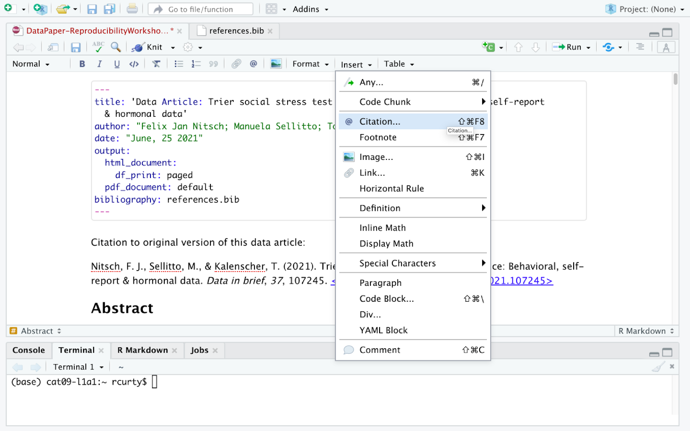
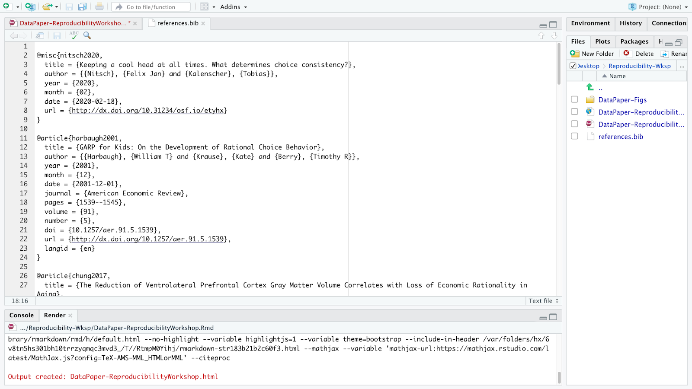
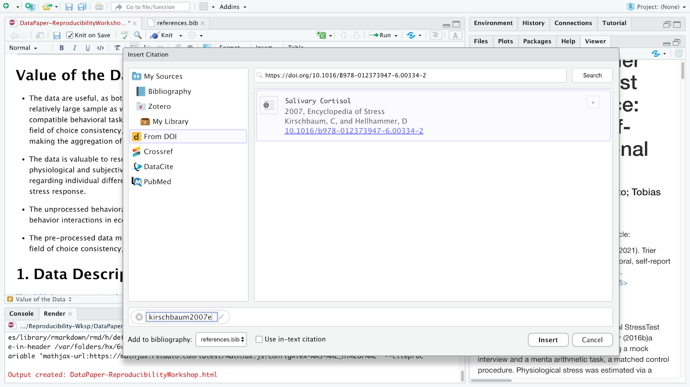
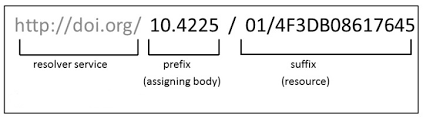

## Why citing?

Correctly citing and attributing publications is key to academic writing. Older versions of RStudio require [Pandoc's]("https://pandoc.org/MANUAL.html#citation-syntax") citation syntax to render bibliographies correctly. We won’t be covering this approach extensively in this workshop, since the new visual editor has made this process much more simple. You can refer to our [previous workshop on R Markdown]("https://ucsbcarpentry.github.io/R-markdown/06-citations-bib/index.html") pre-visual editor for more information.  

The new visual editor in RStudio 1.4 has made citations and cross-referencing much easier, by offering different options for referencing various types of sources. Before getting into these different features, let’s first learn how you can call the citation window dialog on Rstudio and how to navigate these different options.  

## Calling Citation Options on Rstudio  

After placing your cursor where you want to insert the citation you can either click the `@` icon in the toolbar, or select `Insert`, and from the drop down menu choose `Citation`. Alternatively you can use the keyboard shortcut <kbd>⇧⌘ F8</kbd> on Mac, or <kbd>Ctrl+Shift+F8</kbd> for Windows.  



The citation window will display different options for inserting citations, You can either find items listed in your own sources through your Bibliography folder (you should have one already in your project folder provided by us), your Zotero Library(ies) if you have the reference manager installed in your computer, or even use the lookup feature to search for publications by DOI (Digital Object Identifier), Crossref, DataCite, or PubMed ID.  


## Understanding How Rstudio Stores and Organizes Citations  

Have you noticed that the YAML header contains “bibliography: references.bib”. Any idea why? Well, that’s because on our paper template we have some existing citations, and a references.bib file in our project folder. Rstudio adds that automatically to the YAML once you cite the first item to your manuscript. But let’s first open the references.bib file and understand how citations are presented there:  



A file with the BIB file extension is a BibTeX Bibliographical Database file. It's a specially formatted text file that lists references pertaining to a particular source of information. They're normally seen only with the .BIB file extension but might instead use .BIBTEX. BibTeX files might hold references for things like research papers, articles, books, etc. Included within the file is often an author name, year, title, page number, and other related content. Each item can be edited, in case there is any metadata incorrect or missing.  

Most citation and reference management tools such as Refworks, Endnote, Mendeley and Zotero, as well as some search engines (e.g. Google Scholar), most scientific databases, and our UCSB library catalog allow us to export citations as .bib ([BibteX]("https://en.wikipedia.org/wiki/BibTeX")) files. These files are used to describe and process lists of references, mostly in conjunction with LaTeX documents. Each .bib file has a citation key or ID preceded by an `@`, which uniquely identifies each item. Citation keys can be customized as we will learn in a bit, but be advised that your manuscript will render citations correctly only if you have the cited item corresponding to its exact key.  

## Inserting Citations  

Note that we have different blocks in this file starting with a `@` and ending with a curly bracket `{`, each one representing a unique citable source. We will be adding now a new item using the DOI lookup function so that you can see how the magic works!  

Let’s assume you want to include a citation in the first line of the Value of the Data section, because you would like to provide some reference of how the salivary cortisol technique has been used in research. So let’s click where we want to insert the citation, call the citation function and lookup for the following DOI: [https://doi.org/10.1016/B978-012373947-6.00334-2]("https://doi.org/10.1016/B978-012373947-6.00334-2")  



The DOI lookup uses the [persistent identifier]("https://www.library.ucsb.edu/sites/default/files/dls_n4_pids_navy.pdf") which connects to the DOI resolver service and retrieves the .bibtex file with resource metadata<sup>1</sup>. You should insert the whole DOI address, including the resolver service, the prefix and the suffix which is specific to the resource as illustrated below:  



Rstudio will search the DOI API and list the only matching result and you can insert it. After confirming this is the citation you would like to include, you can modify the key, if you would like to simplify it, and also choose if you would like to insert it as a in-text citation, meaning you would like to have the last name of the author(s) followed by a page number enclosed in parentheses. i.e., Kirschbaum and Hellhammer (2007), but in this case, we will uncheck that option since we won’t include authors as part of the narrative. Instead we would like to insert a parenthetical citation, where authors and year will be displayed inside the parentheses such as (Kirschbaum and Hellhammer 2007). You may insert more than one citation by selecting multiple items.  

This item will be automatically listed in your Bibliography folder, and if you want to cite this same item again you can type `@` and the first letters of the item name which will be auto-completed by Rstudio. For parenthetical citations you will have to type the key between brackets and for in-text narrative citations, you only need to type in the key.
Note that when you hover over the citation, you will preview the full reference for the cited item that will be listed at the bottom of the manuscript. This feature helps you to identify if you have to edit anything in the .bib file your citation is calling. Also, note that all citations will be included at the end of your document under a reference list.

> ## Challenge 8.1 - Insert a Citation Using the DOI Lookup Function
>
> Following the same process described,
> insert a parenthetical citation to the publication “Welcome to the tidyverse”
> ([https://doi.org/10.21105/joss.01686]("https://doi.org/10.21105/joss.01686"))
> where there is a mention to this package in the data paper.
>
> > ## Solution
> > ```
> > [@wickham2019]
> > (Wickham et al., 2019)
> > ```
> > {: .output}
> >
> {: .solution}
{: .challenge}

Inserting citations using Crossref, DataCite or PubMed follows a very similar process to the DOI process, however; to search on their APIs you will need to input information accordingly. For Crossref, you may use keywords and author information to identify an item (e.g., Cortisol Stress Oken) and Rstudio will connect to [Crossref search]("https://search.crossref.org/") and provide related results, often not as specific as the DOI search, for cases you know exactly what you are looking for. DataCite allows searches by persistent identifiers or keywords, while PubMed searches exclusively in biomedical literature indexed in the database. If you have the PMID (PubMed reference number), which is uniquely assigned by the NIH National Library of Medicine to papers indexed in PubMed, similarly to the DOI search, it will save you time.  

## Editing Metadata & Citation Key  

When hovering over this citation example we have just created, you will notice that the Encyclopedia title is missing. This can happen more often than one would like, but there is a way to workaround and to fix that. The easiest way to fix it is to open the reference.bib, locate the item and add the information. In this case, we will treat this item as a part of a book, and include the information below:  

```
booktitle = {Encyclopedia of Stress},
```
{: .output}

When you save the reference.bib file and hover over it you will see that the reference was fixed. Note that the order of presentation of the fields is irrelevant, if included after the citation key and before the closing curly bracket and that the information will be displayed according to the document type.  

We have briefly mentioned that you can also edit the citation key. By default, most citation keys will have the first author last name or the first word of the title (if no authors) followed by the year of publication. You may consider editing the citation key in case you want to simplify the entry and speed up the autocomplete option. If you choose to do so, you can simply click on the key and edit it. That change will be automatically changed in the reference.bib file. Please be advised to use this option with caution, since shortening these keys might make it confusing to identify the correct item you want to cite.  

## Changing Citation Styles

You might have noticed that all citations are inserted in a specific style. Can you guess which one? If you answered Chicago that is correct! By default, Rstudio via Pandoc will use a Chicago author-date format for citations and references. To use another style, you will need to specify a CSL (Citation Style Language) file in the csl metadata field in the YAML.

But how can you identify which CSL you should use? You can find required formats on the [Zotero Style Repository]("https://www.zotero.org/styles"), which makes it easy to search for and download your desired style.

Download the format you wish to use and call it out in the YAML. Let’s try it together! Go to the Zotero Style repo and select [American Psychological Association 7th edition]("https://www.zotero.org/styles/apa"). Make sure to save it to the project folder. In the YAML we have to call the exact name of the file preceded by “csl:”

```
csl: apa.csl
```
{: .output}  

Save and knit the document to see how citations and references have changed. This same process could be followed for any citation style required by the university, the journal or conference you are planning to submit your manuscript to.  

> ## Challenge 8.2 - Changing the Citation Style
>
> How can you go back to using Chicago Style?
>
> > ## Solution
> >
> > You can either delete the csl information as it is set as the default, or call it in the YAML:
> >
> > ```
> > csl: chicago.csl
> > ```
> > {: .output}
> >
> {: .solution}
{: .challenge}

## Adding Items to the References without Citing them

All cited items will be listed under the section References which you created before while practicing headings and subheadings. Items will be placed automatically in alphabetical order for most citation styles. However, there might be cases that you will be referencing supporting literature which you have not necessarily cited in the document.  

By default, the bibliography will only display items that are directly referenced in the document. If you want to include items in the bibliography without actually citing them in the body text, you can define a dummy nocite metadata field in the YAML and put the citations there.

```
nocite: |
  @item1, @item2
```
{: .output}  

To demonstrate that I will add a new bibtex from my Google Scholar Library and specify the `@key` in the YAML. Note that this will force all items added in the YAML to be displayed in the bibliography.  

Let’s try!

> ## Challenge 8.3 - Adding references you have not cited
>
> Find and remove the existing in-text citation to `@peirce2007`, but list it out in the reference section.
>
> > ## Solution
> >
> > You can either delete the csl information as it is set as the default, or call it in the YAML:
> >
> > ```
> > nocite: |
> >  @peirce2007
> > ```
> > {: .output}
> >
> {: .solution}
{: .challenge}


Question: Does the indentation matter? Yes, you have to indent at least one space and the citation key should turn green to work.  

Reminder: In case you are including a citation to `nocite` that you have not cited in the document, you have to make sure first that the bib file is in your Bibliography folder.  

## Cross-referencing

Cross-referencing is a useful way of directing readers through your document, and can be automatically done within RStudio. In order to add cross-references, you will need:  

- A bookdown output format: Cross-referencing is not provided directly within the base R markdown package, but is provided as an extension in bookdown. To do so, we must use an output format from bookdown (e.g., html_document2, pdf_document2, and word_document2, etc.) in the YAML output field.  
- A caption to your figure (or table): Figures without a caption will be included directly as images and will therefore not be a numbered figure.  
- A labeled code chunk: This provides the identifier for referencing the figure generated by the chunk.  

After these conditions are met, we can make cross-references within the text using the syntax `@ref(type:label)`, where label is the chunk label and type is the environment being referenced (e.g. tab, fig, or eqn).  

We've already installed bookdown in our setup steps at the beginning of the workshop, but we need to make sure to load the bookdown library.  

*Add* into your load-data-libraries code chunk:  

```
#load bookdown for cross-referencing
library(bookdown)
```
{: .language-r}

We also need to change the output in the YAML to a bookdown specification so, change the output yaml in the yaml to the following (the rest stays the same.):

```
...
ouput:
  bookdown::html_document2:
...
```
{: .output}

Now to add cross referencing:  

This is the syntax for a cross-reference link:  

```
@ref(type:label)
```
{: .language-r}

the `@ref` will always remain the same. We will edit type and label type options:  

- tab : for tables
- fig : for figures
- eqn : for equations
label is replaced with the chunk label of the code chunk figure/table/equation you want to link to.  

Let's try this out on our paper:  

Find or search for the note: (See Table 1).  
To add a cross reference link we will replace the "Table 1" text with:  

```
\@ref(tab:table-1)
 ```
 {: .language-r}

We will replace type with tab and label with table-1.  

> ## CHALLENGE 8.4: Add a Cross Reference to Figure 2
>
> Search for or find in the text: "(See Figure 2)" and make this into a cross reference link.
>
> > ## Solution
> >
> > ```
> > \@ref(fig:fig-2)
> > ```
> >  {: .language-r}
> > *Note*: adding crossing-referencing re-names the figures, so should take the figure numbering out.
> {: .solution}
{: .challenge}


## Citation

 <sup>1</sup>For more information on DOIs please see: [https://support.datacite.org/docs/doi-basics]("For more information on DOIs please see: https://support.datacite.org/docs/doi-basics")
 
> ## Time to Commit!
> Make sure to commit your changes to GitHub. Add your changed files and commit with the following message: "Added Bibliography"
{: .checklist}
