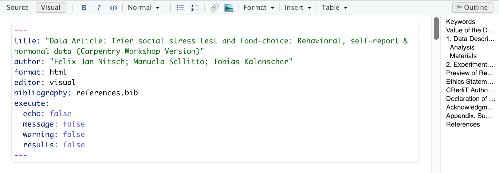
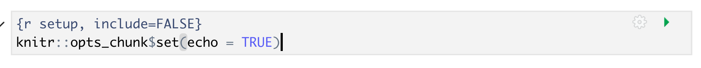
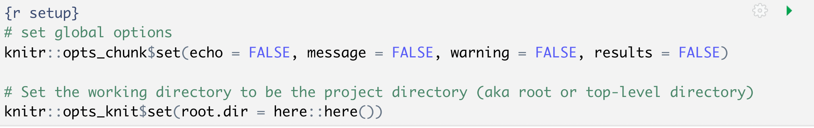

## Reproducible Methods for Coding in Quarto

Now that we've learned the core benefit of using Quarto documents - the integration of code with text - let's learn some next level methods of working with code in Quarto. We'll cover how to add Global Knitr options to the yaml, run external R scripts from within the Quarto document, setting the working and output directories for the Quarto document and loading packages and data globally. Whew! that's a lot! Let's dig in.

### Global Code Chunk Options:

There is an option to globally set options for the entire Quarto document rather than have to specify in each code chunk. This is helpful when you consistently want to use the same options and when you have many code chunks within a document. Additionally, adding global code options will allow you and collaborators to have a better idea of how you've configured your document. 

In Quarto, the way to configure global code chunk options is in the yaml. We haven't done much with the yaml up until this point, but now we'll be working with it a bit. 

In the yaml of our document we can set global options with `execute`. 

```
~~~
...
execute: 
      echo: false
~~~
```

Additional options can be further nested under execute. 

Let's see how it looks in our paper to add the options from our first code chunk: 



> ## Tip: R Markdown global options syntax works in Quarto
> If you've previously used R markdown and have old documents or don't want to learn a new workflow quite yet, Quarto is backwards compatible with R Markdown, so you may also use the old `chunk$set` syntax as below:
> 
>
{: .callout}


> ## Tip: Overiding global options  
> What if you want most of your code chunks to render with the same options (i.e. echo: false), but you just have one or two chunks that you want to tweak the options on (i.e. display code with echo: true)? Good news! The global options can be overwritten on a case by case basis in each individual code chunk. Test this by adding `#| echo: true` to your code chunk in your document and knitting. Did you override the global settings successfully?
{: .callout}


> ## CHALLENGE 7.4 (optional) global & individual code chunk options  
>
> How would appear in our html document if we knit a code chunk with the following options?  
> `{r challenge-5, warning: true, echo: true}`
>
> ...considering the global chunk settings were as listed: 
> ```
> ~~~
> execute:
>      echo: false
>      include: false
> ~~~
> ``` 
>> ## SOLUTION  
>> In this case, the global settings are set so neither the code nor the output will display. However, the individual chunk reverses the echo setting so the code will display, and it also indicates that any warnings the code renders should output too. The outputs of the code would still not be displayed (include: false) The hypothetical situation for this configuration may be for debugging while writing the qmd document.   
> {: .solution}  
{: .challenge}

## More Global Quarto Options

We already know about one of the benefits of global knitr options - using code chunk options that can be applied consistently for the whole document as we saw in the previous episode. 

What are some of the additional features of global knitr options? There are many, but we'll cover several more:
1. Set working directory so file paths (for code chunks) can be relative to the root instead of our .Qmd file

3. Load libraries and data once at the beginning of the document instead of in each code chunk (more concise and less rendering time)

### Project level vs Document level settings

With Quarto we gain the additional functionality of being able to define *project* level global settings in addition to *document* level settings. This means that the settings we choose will be applied to *all* Quarto documents within our R project. 

We already saw how to adjust document level settings by adding some code to the document yaml at the top of the Qmd file. How do we edit project level settings? That's where the `_quarto.yml` file that lives in our project root directory comes in. 

Opening the `_quarto.yml` file in our project root we see the following default settings:


#### Project-level or document-level? What's best?

We have the option of adding the execution global code chunk settings we added to our paper to the global documents. This is optional however, and since we have only one Quarto document we'll refrain. The change we *must* make in project-level settings that is listed above is setting the working directory and output directory. It simply doesn't work when added in the document-level yaml. Additionally, we'll see how to load libraries and data one time for all the code chunks within one of our Quarto documents. This cannot be added to project-level settings. Why? because this isn't done in the yaml metadata - it's done within a code chunk at the beginning of a document. Confused? It may take a bit to learn the best ways to configure your documents, but don't worry, we'll walk you through the basics.   


### Set working directory to project directory:

Ok, so you know how we had to change the path in the code chunk we copied into our document so that the relative path was correct for reading in data? This happened because in Quarto documents, the working directory is wherever the qmd document is located but our code is located in a different folder. This means they have different relative paths to locate and read the data we want to work with. We can simplify things by designating the working directory for our document relative to the root project directory instead. What this does is let all files work relative to the project root instead of each other, standardizing the relative paths. Note that this is mainly important for code chunks - text portions of Quarto documents are not affected. This will clear up some of our confusion with relative paths across our whole R project. 


> ## Note: R Markdown method for setting working directory also works in Quarto
>
> Again, all R Markdown syntax is backward compatible with Quarto so it is possible to use the "old" method to set the working directory. This would be the workaround to set the working directory if you don't wish to use the Quarto project `_quarto.yml` file. 
>  
> To simplify it further, one can use the `here` package available in RStudio. 
>
>This is a setting option in  global knitr settings. The following code would be used in a code chunk at the top of your Quarto document:
>
> ~~~
> knitr::opts_knit$set(root.dir = here::here())
> ~~~
> 

Now, we would change the relative path in our code chunk back to what it was before, but let's hold tight. We're going to introduce another way to run code! But first, let's see how to globally load data and packages.

> ## Note: Changing the working directory only applies to code
> Setting the working directory to the project directory we just did adjusts the working directory for all code in the Quarto document (code chunks and inline code), but NOT for any markdown text elements (images and hyperlinks).
{: .callout}

Now, we can have some more fun with global options.

### Globally load data and packages

We can improve organization and rendering speed in our documents by learning how to globally load data and packages. So far we've loaded the library `tidyverse` and the data frame `df` we need in the first code chunk. Now if we want to add another figure (say the hormone analysis code '02_hormone_analysis.r`), which uses the same data as our first figure - we would be loading tidyverse and the data for a second time. This is unnecessary because once libraries and data are loaded in a Quarto document they are available for use in the rest of the code in the document following.

Best practice is to load libraries and data once at the beginning of our document making it available for all other figures or calculations throughout the document -  allowing us to avoid repetition in our code and saving us rendering time. This also makes it easier for us to keep track of all the libraries and data we need to use in any given document for ourselves and collaborators. If anything needs to be tweaked, we don't need to search through every code chunk in our qmd document to make a change - it's listed right at the top. 


```
# load libraries
library(tidyverse)
library(BayesFactor)
library(patchwork)

# load data
df <- read_csv("./output/data/preprocessed-GARP-TSST-data.csv")
```
{: .language-r}

> ## Challenge 8.2: Order matters (optional)
>
> What would happen if we loaded the data before we loaded the libraries?
> Try it out!
>
> > ## Solution:
> > 
> > We would get an error because we haven't loaded tidyverse yet!
> > 
> {: .solution}
{: .challenge}

At this point we could go back through our R scripts and comment out (or delete) the beginning sections where we load the data and libraries (you will see this is already done in most of the scripts in the code folder). You can imagine that the more code chunks you have the more time taking this step would save. Bonus that this also works to load the data before it is called in inline code as well!


## Run Code from an external script in a code chunk

Let's learn another technique for adding code-generated plots and figures into our document. This time around let's see how to run code in a code chunk from an external R script instead of somewhat awkwardly copying and pasting the code from a R script to a code chunk in our `.qmd`.

There are at least a few benefits to running code in this modular fashion instead of copy/pasting:
1. Automatic updates: if the code gets updated in the R script, it will automatically be updated in the Quarto document as well. We won't need to copy/paste code updates, which would make it easy to end up with discrepancies between our `.r` scripts and our `.qmd` paper.

2. Readability: calling code externally only takes several lines of code - versus copy/pasting 50+ lines of code from our scripts.

3. Less fussing with relative paths* - we had to change the code slightly in the first example to update the file path to the data set, which introduces variations and inconsistencies. With this method we won't have to modify the source code. 

*unfortunately you will never be free of relative paths, but you can make it a bit easier on yourself.

Again, let's test this out in our generic Quarto document. After our first figure add a new code chunk:


We're just going to test out the same figure again so we can verify this new method works. So, add the following code to your new chunk:

~~~
# run the code from 03_HR_analysis.R in the code directory
source("code/03_HR_analysis.R", local = knitr::knit_global())
# display the plot created by code in 03_HR_analysis.R
plot 
~~~
{: .language-r}

> ## Time to Knit!
> Let's see if our code worked when generated from an external script 
{: .checklist}

Our plot should look exactly the same as the first copy-pasted one. 


Success! And you'll notice that the global code chunk options were applied to this second code chunk as well. 


Now that we've tested this code, let's add it to our actual paper: 

### Add the code to our Quarto document

First, find `FIXME 9` in the Quarto document for Fig 3 (ctrl-f "FIXME 9"). 

Add the same code from our generic document where `FIXME 9` is located under "Previw of Research Results".

~~~
# run the code from 03_HR_analysis.R in the code directory
source("code/03_HR_analysis.R", local = knitr::knit_global())
# display the plot created by code in 03_HR_analysis.R
plot 
~~~
{: .language-r}

It should look like this:


ADD chunk name and caption for Figure 3 (can use the same as the copy/pasted code chunk we just tested). Remember we don't need to add options since we defined them globally.

> ## Time to Run!
> Let's see if our code worked when generated from an external script 
{: .checklist}


> ## Tip: Many ways to run external code
> There are at least 3-4 methods one can use to run external code, the best choice may just depend on the context or on your personal preference. All are a bit awkward because of relative paths, but better than copy/pasting code from elsewhere in your project (in our humble opinion):
>
> 1. source()   -- [see more at bookdown.org](https://bookdown.org/yihui/rmarkdown-cookbook/source-script.html)
> 2. sys.source()   -- [see more at bookdown.org](https://bookdown.org/yihui/rmarkdown-cookbook/source-script.html)
> 3. knitr::read_chunk()  -- [see more at stackoverflow](https://stackoverflow.com/a/52398016)
> 4. code() *in `{r}` header [see more at stackoverflow](https://stackoverflow.com/a/52400206)
>
> - another helpful page: http://zevross.com/blog/2014/07/09/making-use-of-external-r-code-in-knitr-and-r-markdown/
{: .callout}

> ##  8.3: Your turn! Create Figure 4 with the external code
> 
> First, find `FIXME 10` in the qmd document for Fig 4 (ctrl-f "FIXME 10"). We need to add the code for the hormone analysis.
>
> Make sure to give the code chunk a name: `fig4-hormones` and a caption: `"Fig 4: Cortisol and Amylase levels in stress and control groups"`
>
> > ## Solution:
> > ~~~
> > {r fig4-hormones, fig.cap = "Fig 4: Cortisol and Amylase levels in stress and control groups" }
> > # run the code from 02_hormone_analysis.R in the code directory
> > source("code/02_hormone_analysis.R", local = knitr::knit_global())
> > # display the plot created by code in 02_hormone_analysis.R
> > plot 
> > ~~~
> > {: .language-r}
> {: .solution}
{: .challenge}


> ## Tip: Yaml chunk options
> We can also tweak some settings in our yaml which changes how code chunks are displayed. We're not going to get into this in the workshop, but many of the same options you set in your global code chunk settings are also configurable in the yaml. 
{: .callout}

