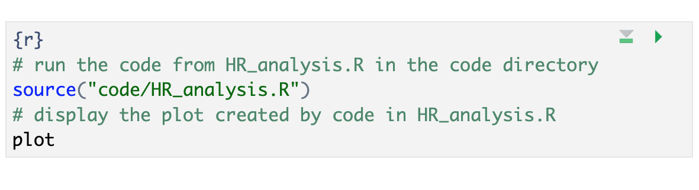

## Reproducible Methods for Coding in Quarto

Now that we've learned the core benefit of using Quarto documents - the integration of code with text - let's learn some more reproducible methods of working with code in Quarto. We'll cover how to run external R scripts from within the Quarto document, additional Global Knitr options, including setting the working directory for the Quarto document and loading packages and data globally, as well as how to use inline code and change the knit directory for Quarto documents. Whew! that's a lot! Let's dig in.

## Run Code from an external script in a code chunk

Let's learn another technique for adding code-generated plots and figures into our document. This time around let's see how to run code in a code chunk from an external R script instead of somewhat awkwardly copying and pasting the code from a R script to a code chunk in our `.qmd`.

There are at least a few benefits to running code in this modular fashion instead of copy/pasting:
1. Automatic updates: if the code gets updated in the R script, it will automatically be updated in the Quarto document as well. We won't need to copy/paste code updates, which would make it easy to end up with discrepancies between our `.r` scripts and our `.qmd` paper.

2. Readability: calling code externally only takes several lines of code - versus copy/pasting 50+ lines of code from our scripts.

3. Less fussing with relative paths* - we had to change the code slightly in the first example to update the file path to the data set, which introduces variations and inconsistencies. With this method we won't have to modify the source code. 

*unfortunately you will never be free of relative paths, but you can make it a bit easier on yourself.

Again, let's test this out in our generic Quarto document. After our first figure add a new code chunk:


We're just going to test out the same figure again so we can verify this new method works. So, add the following code to your new chunk:

~~~
# run the code from 03_HR_analysis.R in the code directory
source("code/03_HR_analysis.R", local = knitr::knit_global())
# display the plot created by code in 03_HR_analysis.R
plot 
~~~
{: .language-r}

> ## Time to Knit!
> Let's see if our code worked when generated from an external script 
{: .checklist}

Our plot should look exactly the same as the first copy-pasted one. 


Success! And you'll notice that the global code chunk options were applied to this second code chunk as well. 


Now that we've tested this code, let's add it to our actual paper: 

### Add the code to our Quarto document

First, find `FIXME 9` in the Quarto document for Fig 3 (ctrl-f "FIXME 9"). 

Add the same code from our generic document where `FIXME 9` is located under "Previw of Research Results".

~~~
# run the code from 03_HR_analysis.R in the code directory
source("code/03_HR_analysis.R", local = knitr::knit_global())
# display the plot created by code in 03_HR_analysis.R
plot 
~~~
{: .language-r}

It should look like this:



ADD chunk name and caption for Figure 3 (can use the same as the copy/pasted code chunk we just tested). Remember we don't need to add options since we defined them globally.

> ## Time to Run!
> Let's see if our code worked when generated from an external script 
{: .checklist}


Shoot, we got an error! It's a file connection error - i.e. RStudio cannot find the R script file we are trying to run code from. This is  because the `.qmd` document for the paper we are trying to write is located in the `report/source` directory, and our relative file path only gives directions from the root folder. So, we need to amend our relative file path. Before, the new default .qmd document we created to test was located in the root directory of the project by default (i.e. the directory where the .rproj file is located). However, we decided to implement a better directory sturcture by creating a separate directory for the publication we're writing. 

The logical fix for this would be to adjust the relative file path to read the external script, from `code/03_HR_analysis.R` to `../../code/03_HR_analysis.R`. But hmmm... that doesn't work either (try it for yourself!)

> ## Challenge 8.1 Relative Path Madness
> change the relative path for the externally sourced code from `code/03_HR_analysis.R` to `../../code/03_HR_analysis.R`
>
> What was going on here? Why did we get an error when running the code this time?
> 
> > ## Solution:
> > The issue is that the code we are calling from within the qmd document contains file paths to read and save the data that are relative to the code directory where the `03_HR_analysis.R` script resides so the paths aren’t correct when run from the .qmd file. Yesh! 
> {: .solution}
{: .challenge}


Thankfully, there is a solution for this! (As with most every obstacle you run into with R). What we will do is use a handy feature for Quarto which allows us to change the working directory of our Quarto document. This means whenever using relative paths in our project they can always* be relative to the root directory, allowing us to standardize our relative file path and allieviate this file connection error. To do this we will learn additional global Knitr options.

*almost always

## More Global Knitr Options

We already know about one of the benefits of global knitr options - using code chunk options that can be applied consistently for the whole document as we saw in the previous episode. 

What are some of the additional features of global knitr options? There are many, but we'll cover two more:
1. Set working directory so file paths (for code chunks) can be relative to the root instead of our .Qmd file

2. Load libraries and data once at the beginning of the document instead of in each code chunk (more concise and less rendering time)


### Set working directory to project directory:

Ok, so let's get back to fixing those path issues we get when we try to run externally sourced code. The definition of relative paths is that they are relative to your current document or working directory. So we are having issues with connections trying to read our data files because the R scripts in our code directory (../ to get to the 'root' or .Rproj directory) are in a different location relative to our qmd document (../..).  What we want to do is direct RStudio to change the default working directory for the qmd document from the directory where the document is located to the project directory (which is the root directory of our project where the .Rproj file is located). We actually have several methods to do it. 

### Option #1: Change the working directory through the RStudio IDE

The first option is a simple one - we click the menu next to the knit button and change `Knit Directory` to `Project Directory`.  
 

Now, what might be the issue with changing the working directory through the IDE? Think about your project collaborators. -- Yes, if another colleague pulls this project down from GitHub and starts working on it, but doesn't have the same RStudio IDE settings as you, this paper won't knit. Rather than telling your colleague to change their IDE (and all your other current or future co-collaborators), it would be better that this setting be self-contained within the paper/project. So let's see how to do that.

### Option #2: Change the working directory with a bit of code

The second option requires a bit of code, but will overall be more reproducible (because it's not dependent on your personal RStudio IDE settings). To accomplish this, we will now use the `here` package introduced previously. 

This is also a setting option in our global knitr settings:

We will now navigate back up to the top of our `.qmd` document to the setup code chunk.  Then, we'll add the following line of code before or after our code for code chunk options (it wouldn't hurt to add a comment explaining what it does either):

~~~
knitr::opts_knit$set(root.dir = here::here())
~~~
*notice again this code uses a function from one of our pre-installed packages `here`. 


Finally, let's re-adjust the path in the source() function after our working directory change (if you haven't already).

`source("../../code/03_HR_analysis.R)` to `source("code/03_HR_analysis.R")`

Looks neater already!


> ## Note: setting the knit directory globally with opts_knit$set
> Setting the knit directory to the project directory with the setup code chunk as we just did adjusts the working directory for all code in the Quarto document (code chunks and inline code), but NOT for any markdown text elements (images and hyperlinks).
{: .callout}

> ## Time to Knit!
> First, run the code to make sure that our file paths are correct and our code runs without errors. Good? Time to knit the document!
{: .checklist}

Now, we can have some more fun with global options.

### Globally load data and packages

We can make our lives easier in one other way too. So far we've loaded the library `tidyverse` and the data frame `df` we need in the first code chunk. Now if we want to add another figure (say the hormone analysis code '02_hormone_analysis.r`), which uses the same data as our first figure - we would be loading tidyverse for a second time unnecessarily. This is because once libraries and data are loaded they are available for the rest of the qmd document.

Instead, we can load libraries and data once at the beginning of our document making it available for all other figures or calculations throughout the document -  allowing us to avoid repetition in our code and saving us rendering time. This also makes it easier for us to keep track of all the libraries and data we need to use in any given document. If anything needs to be tweaked, we don't need to search through every code chunk in our qmd document to make a change - it's listed right at the top. 


```
# load libraries
library(tidyverse)
library(BayesFactor)
library(patchwork)

# load data
df <- read_csv("./output/data/preprocessed-GARP-TSST-data.csv")
```
{: .language-r}

> ## Challenge 8.2: Order matters (optional)
>
> What would happen if we loaded the data before we loaded the libraries?
> Try it out!
>
> > ## Solution:
> > 
> > We would get an error because we haven't loaded tidyverse yet!
> > 
> {: .solution}
{: .challenge}

At this point we could go back through our R scripts and comment out (or delete) the beginning sections where we load the data and libraries. That will save some time for the qmd document to render, because the data and libraries will only load once instead of twice. You can imagine that the more code chunks you have the more time taking this step would save. Bonus that this also works to load the data before it is called in inline code as well!

> ## Tip: Many ways to run external code
> There are at least 3-4 methods one can use to run external code, the best choice may just depend on the context or on your personal preference. All are a bit awkward because of relative paths, but better than copy/pasting code from elsewhere in your project (in our humble opinion):
>
> 1. source()   -- [see more at bookdown.org](https://bookdown.org/yihui/rmarkdown-cookbook/source-script.html)
> 2. sys.source()   -- [see more at bookdown.org](https://bookdown.org/yihui/rmarkdown-cookbook/source-script.html)
> 3. knitr::read_chunk()  -- [see more at stackoverflow](https://stackoverflow.com/a/52398016)
> 4. code() *in `{r}` header [see more at stackoverflow](https://stackoverflow.com/a/52400206)
>
> - another helpful page: http://zevross.com/blog/2014/07/09/making-use-of-external-r-code-in-knitr-and-r-markdown/
{: .callout}

> ##  8.3: Your turn! Create Figure 4 with the external code
> 
> First, find `FIXME 10` in the qmd document for Fig 4 (ctrl-f "FIXME 10"). We need to add the code for the hormone analysis.
>
> Make sure to give the code chunk a name: `fig4-hormones` and a caption: `"Fig 4: Cortisol and Amylase levels in stress and control groups"`
>
> > ## Solution:
> > ~~~
> > {r fig4-hormones, fig.cap = "Fig 4: Cortisol and Amylase levels in stress and control groups" }
> > # run the code from 02_hormone_analysis.R in the code directory
> > source("code/02_hormone_analysis.R", local = knitr::knit_global())
> > # display the plot created by code in 02_hormone_analysis.R
> > plot 
> > ~~~
> > {: .language-r}
> {: .solution}
{: .challenge}

## Inline Code

What if you only need to make a quick calculation and adding a code chunk seems a little overkill?

You can also include `r code` directly in your the text portion of your document. Say you are discussing some of the summary statistics in your manuscript, Quarto makes this possible through HTML/LaTeX inline code which allows you to calculate simple expressions integrated to your narrative. Inline code enables you to insert `r code` into your document to dynamically updated portions of your text. In other words, if your data set changes for any reason the code will automatically update the calculation specified. 

This can be helpful when referring to specific variables on your data. For example, you should include numbers that are derived from the data as code not as numbers. Thus, rather than writing “The CSV file contains choice consistency data for 10.000 simulated participants” **(FIXME8)** , replace the static number with a bit of code that, when evaluated, gives you a dynamic number if anything changes on your dataset. Note that there is not an insert option to do this from the menu in the visual editor, so we need to insert inline code manually with  ```r ```, for example:

The CSV file contains choice consistency data for ``r nrow(bronars_simulation_data)`` simulated participants.

When you knit you might get an error. Any idea why? That is because we need to make sure to import the dataset we are referring to before the inline code can work. Let's add the following to our chunk at the beginning of the document where we loaded our other data:

~~~
bronars_simulation_data <- read_csv("data/bronars_simulation_data.csv")
~~~
{: .language-r}

Time to Knit! If you update your dataset this value will match the number of rows. 

> ## CHALLENGE 8.3 - Adding inline code
> Suppose we would like to add some information to the sentence we have just adjusted in our manuscript. We would like to include the average for the variable *violation_count* present in the same dataset. Which inline code we would have to add to following sentence?
> 
> The CSV file contains choice consistency data for ` `r nrow(bronars_simulation_data.csv)` ` simulated participants, that have been used to determine the power of our food-choice task design to detect choice consistency violations, which averaged ` `enter inline code here` `. 
> What inline code would you enter? What number would replace the inline code?
> 
> Tip: we will need to use a `dataset$variable` syntax!
> 
>> ## Solution:
>> ` `r mean(bronars_simulation_data$violation_count)` `
>> 5.3924
> {: .solution}
{: .challenge}

> ## Important Note:
> Make sure the file you are calling is in the right subdirectory and your working directory is set appropriately.
>
{: .callout}


> ## More on inline codes:
> Quarto will always display the results of inline code, but not the code. Inline expressions do not take knitr options.
>
{: .callout}

> ## Tip: Yaml chunk options
> We can also tweak some settings in our yaml which changes how code chunks are displayed. We're not going to get into this in the workshop, but many of the same options you set in your global code chunk settings are also configurable in the yaml. 
{: .callout}

## Adjust rendered html output directory

Ok, we'll adjust _one_ thing in the yaml. You know how we said it's good practice to have code and output from the code in separate directories? Well, the html file that renders from our `.qmd` file outputs to the same `report/source` directory. So that violates our standards. It might not be the end of the world, but let's see how to change the directory that Quarto documents output to after knitting. 

This is unfortunately more difficult that one would like, but we can use the following code in the yaml to create a custom function that changes the output directory for the `.qmd` file.
The code for our documet is as follows:
## FIXME
~~~
knit: (function(rmdFile, encoding) { 
      out_dir <- '../output';
      rmarkdown::render(rmdFile,
                        encoding=encoding, 
                        output_file=file.path(dirname(rmdFile), 
                        out_dir, 
                        'DataPaper-ReproducibilityWorkshop.html'))})
~~~

Simply copy and paste it in to the yaml. 