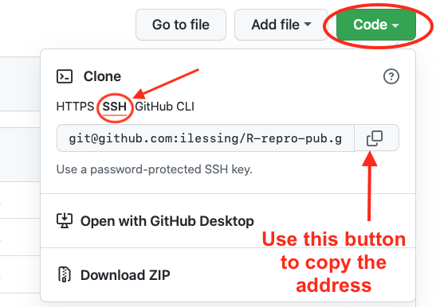
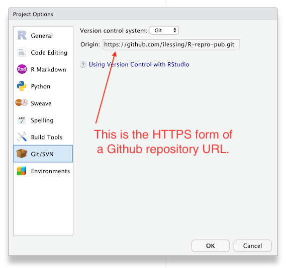
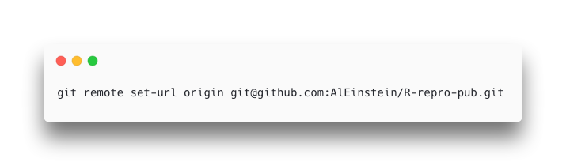
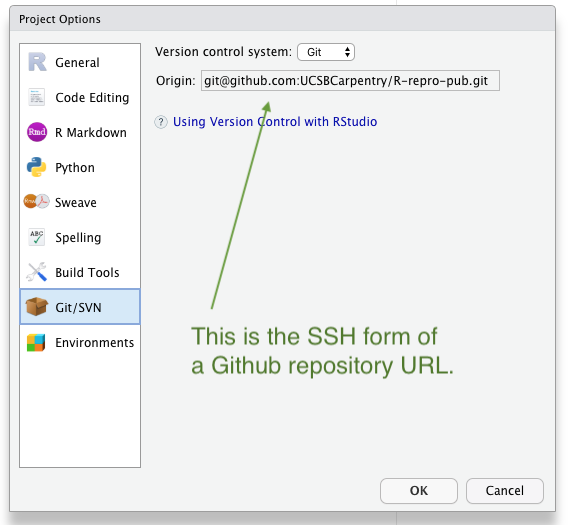

In [episode 5](../05-setup-versioning/) we learned about using version control as you write your publication.  In this part of the workshop we'll setup Rstudio to authenticate with Github which is necessary to _push_ your changes to Github.

Terminology:  Git _Push_ and _Pull_

Definition: The process of syncronizing your local git repository with your git repository on Github (or other Git server).

Github used to allow simple Username & Password authentication but now Github requires a more secure method of authentication.  For this workshop we'll be using the Personal Access Token method.  The Personal Access Token (PAT) must be created for your account on github.

1. Login to your Github account with your web browser. [https://github.com](https://github.com)
1. On Github.com go to your account setting -> Developer Settings -> Personal access tokens or this link: [https://github.com/settings/tokens](https://github.com/settings/tokens)
1. Any tokens you have created in the past will be listed there and you can click "Generate new token" button.  Set an expiration date for your new token and a scope.  For this workshop the "Repo" scope should be sufficient.  Then Generate your new Token with the button at the bottom of the page.


1. The next screen github shows you the new token.  **Be sure to copy it** as you only get one chance to see the token text.

[FIXME] If you cloned the repo from Github already in Episode 5 next step is not necessary.
## Getting your repository's URL from Github
You can get the address of your repository from Github by navigating to your repository on Github.com and clicking the green "Code" button.  Make sure to copy the SSH form of the URL.



With that address you can complete setting the origin URL in the next step. 

## Checking and Setting the "Origin" for the local copy of yoiur repository.

If you forked and cloned the demonstration publication for this workshop as covered in an earlier episode then your copy of the repository should already have the "origin" set.  Once the "origin" is set properly you should be able to push and pull your changes to and from Github.  When you clone a repository from Github your local copy of the repository should have Github set as the "origin".  When you're using SSH to authenticate with Github you'll need to use the SSH form of your repository's URL as your "Origin"

You can check this in Rstudio --> Tools --> Project Options --> Git/SVN

 

If the "Origin" field has the HTTPS form of your repository's URL then you'll need to update it from the terminal with command like:



```
git remote set-url origin <paste your repository address here>
```

Be sure to put **your** Github username in the URL.

After you've updated the Origin URL from the command line go back to R Studio --> Tools --> Project Options --> Git/SVN to verify you have the SSH form of the URL in your "Origin" field.  It should look something like this.

 


----

If the "Origin" field is blank then you'll need to add it from the terminal with a couple of terminal commands like this:
```
git remote add origin <paste your repository address here>
git fetch --set-upstream origin main
```

## Push your local changes up to your repository Github.
With authentication set up and your local copy of your repository pointing to Github as the "Origin" you should be able to make changes and _push_ them up to Github.  Let's try it and see if it works.

> ## Challenge: Push to Github
> 
> 1. Make a change to one of the files in your project or add a new file.
> 2. In R Studio's Git panel check the box to Stage the changed file.
> 3. Commit the change to your Git repository.
> 4. Click the green up arrow to _Push_ you repository changes up to Github.
> 5. Look on [Github.com](https://github.com) to verify your changes are there.
> 
{: .challenge}

With the ability to synchronize your changes between Github and your local the next step is explore options for publishing your research paper.



