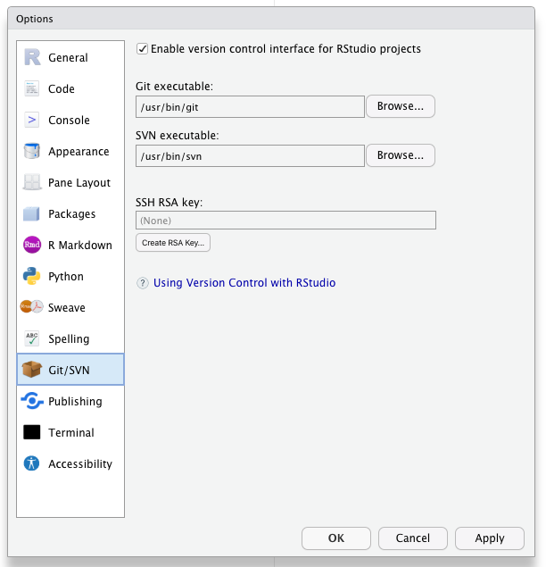
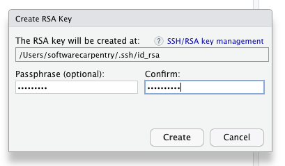
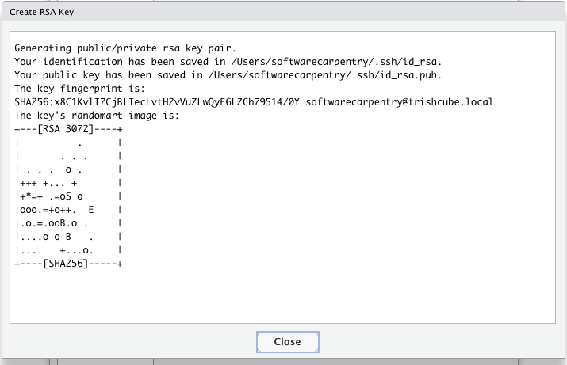
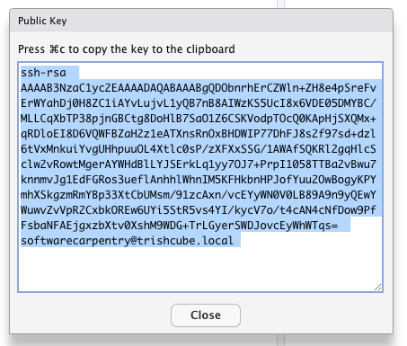
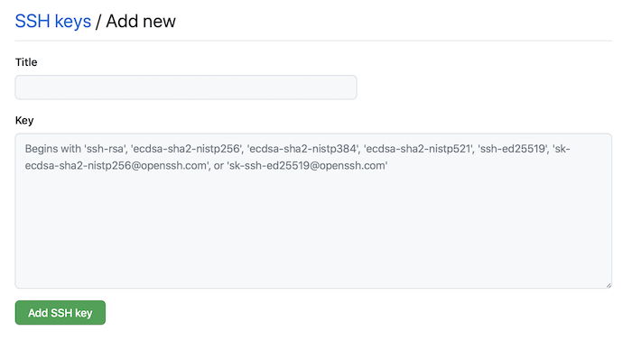

Continuing from [episode 4](../04-good-project/) ...

1. Check for your local SSH keys.  Tools --> Global Options --> Git/SVN.  
1. If your "SSH RSA key" field is blank  then you do not yet have SSH Keys and you should generate keys by clicking the "create RSA key" button.  
 

1. Login to your Github account with your web browser. [https://github.com](https://github.com)
1. If you have not yet added your Public SSH key to your Github account in "[Setting --> SSH and GPG keys](https://github.com/settings/keys)" do so.  <br><br>

Click "View Public Key" in RStudio --> Tools --> Global Options --> Git/SVN




Click the "New SSH Key" button in Github 

then paste it into the form.



1. Create a bare repository on Github (maybe not needed if you already have a local repo ??? TEST THIS)

1. Add the new repository's Github URL to your local Git repo as a "remote" 

```
git remote add origin git@github.com:<username>/<repositoryName>.git
```

1. push your local repository up to git.



